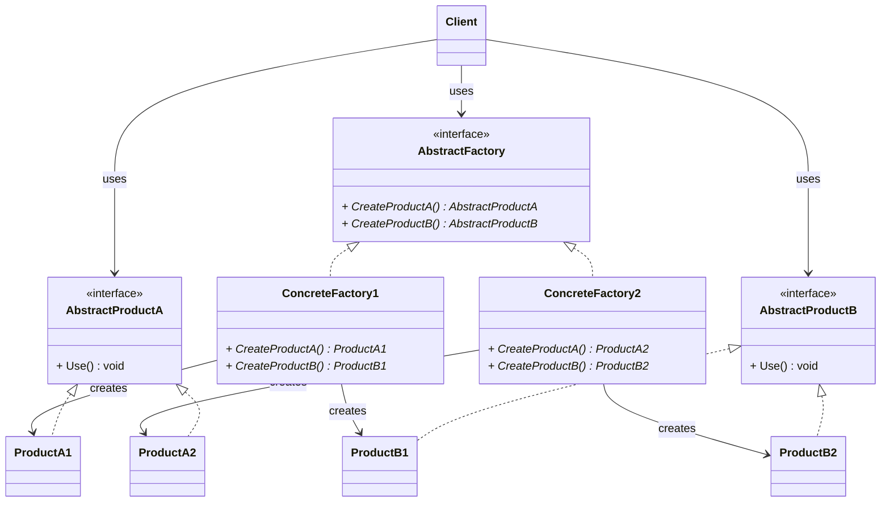
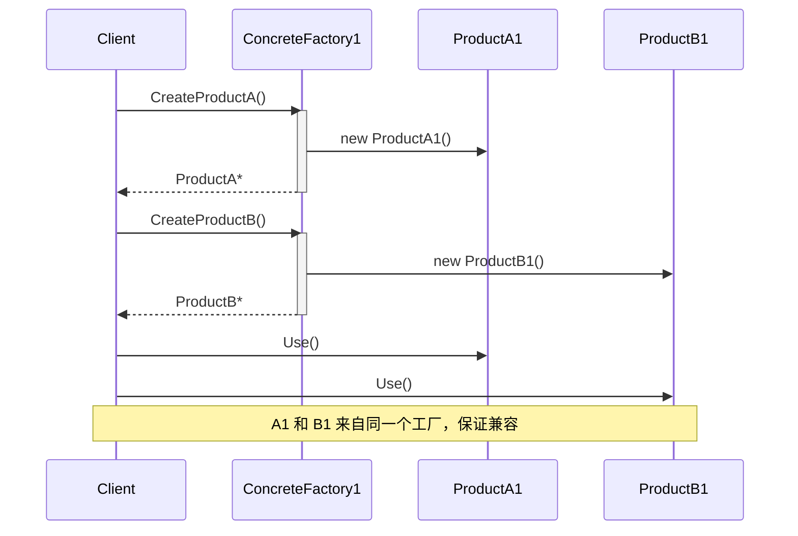

# 抽象工厂模式 (Abstract Factory Pattern)

## 概述

**抽象工厂模式**（Abstract Factory Pattern），又称 **Kit 模式**，属于 **创建型设计模式**。它提供一个接口，用于创建**一系列相关或相互依赖的对象**，而不需要指定它们具体的类。

> **定义**：提供一个创建一系列相关或相互依赖对象的接口，而无需指定它们具体的类。

### 从简单工厂到抽象工厂的演进

```
简单工厂：
  一个工厂 → 创建一种产品（要么 MySQL 连接，要么 PostgreSQL 连接）
  产品之间没有关联

工厂方法：
  一个工厂子类 → 创建一个产品
  产品之间仍然没有关联

抽象工厂：
  一个工厂 → 创建一族相关联的产品
  MySQL工厂 → MySQL连接 + MySQL命令 + MySQL事务
  PostgreSQL工厂 → PostgreSQL连接 + PostgreSQL命令 + PostgreSQL事务
  每个工厂创建的多个产品必须"搭配合用"——不能混搭
```

### 核心问题

**当你需要确保一族产品来自同一系列时。** 比如跨平台 UI——Windows 窗口 + Mac 按钮 = 风格冲突。抽象工厂保证了"要换就全换"。

---

## 核心设计思想

### 五个角色

| 角色 | 名称 | 职责 |
|---|---|---|
| **抽象工厂 (AbstractFactory)** | `AbstractFactory` | 声明创建**一族**抽象产品的接口（多个 CreateXxx 方法） |
| **具体工厂 (ConcreteFactory)** | `ConcreteFactory1/2` | 实现创建一族**具体**产品的操作 |
| **抽象产品 (AbstractProduct)** | `AbstractProductA/B` | 为一类产品声明接口 |
| **具体产品 (ConcreteProduct)** | `ConcreteProductA1/A2/B1/B2` | 实现抽象产品接口的具体类 |
| **客户端 (Client)** | `Client` | 只依赖抽象工厂和抽象产品，不知道具体工厂和具体产品的存在 |

### 产品族 vs 产品等级

这是理解抽象工厂最核心的概念：

```
                   产品等级                   产品等级
                  (产品A)                   (产品B)
                  ┌────┐                   ┌────┐
  产品族 1        │ A1 │ ←──── 配 ────→   │ B1 │    同一工厂创建
  (Windows)       └────┘                   └────┘
                   ▲                        ▲
                   │ 接口                    │ 接口
                   │                        │
  产品族 2        ┌────┐                   ┌────┐
  (macOS)         │ A2 │ ←──── 配 ────→   │ B2 │    同一工厂创建
                  └────┘                   └────┘

  纵向 = 产品等级（同类产品，如"按钮"）
  横向 = 产品族（同一工厂创建的一组产品，如"Windows 按钮 + Windows 对话框"）
```

| 维度 | 说明 | 例子 |
|---|---|---|
| **产品族**（横） | 来自同一个工厂的一系列产品，它们之间需要配合使用 | Windows按钮 + Windows对话框 |
| **产品等级**（纵） | 同一个抽象产品的不同实现 | 按钮可以是 Windows 按钮或 Mac 按钮 |

---

## UML 类图



### 时序图



---

## C++ 实现

### 完整示例：跨平台 UI 控件

```cpp
#include <iostream>
#include <memory>
#include <string>

// ============ 抽象产品 A：按钮 ============
class Button {
public:
    virtual ~Button() = default;
    virtual void Render() const = 0;
};

// ============ 抽象产品 B：对话框 ============
class Dialog {
public:
    virtual ~Dialog() = default;
    virtual void Show() const = 0;
};

// ============ 具体产品族 1：Windows 风格 ============
class WinButton : public Button {
public:
    void Render() const override {
        std::cout << "  [Windows 按钮] 绘制直角边框 + 灰色背景" << std::endl;
    }
};

class WinDialog : public Dialog {
public:
    void Show() const override {
        std::cout << "  [Windows 对话框] 显示模态窗口，带最小/最大/关闭按钮" << std::endl;
    }
};

// ============ 具体产品族 2：macOS 风格 ============
class MacButton : public Button {
public:
    void Render() const override {
        std::cout << "  [macOS 按钮] 绘制圆角 + 半透明玻璃质感" << std::endl;
    }
};

class MacDialog : public Dialog {
public:
    void Show() const override {
        std::cout << "  [macOS 对话框] 显示从标题栏滑出的对话框" << std::endl;
    }
};

// ============ 具体产品族 3：Linux 风格 ============
class LinuxButton : public Button {
public:
    void Render() const override {
        std::cout << "  [Linux 按钮] 绘制 GTK 风格按钮" << std::endl;
    }
};

class LinuxDialog : public Dialog {
public:
    void Show() const override {
        std::cout << "  [Linux 对话框] 显示 GTK 对话框" << std::endl;
    }
};

// ============ 抽象工厂 ============
class GUIFactory {
public:
    virtual ~GUIFactory() = default;
    virtual std::unique_ptr<Button> CreateButton() = 0;
    virtual std::unique_ptr<Dialog> CreateDialog() = 0;
};

// ============ 具体工厂 ============
class WinFactory : public GUIFactory {
public:
    std::unique_ptr<Button> CreateButton() override {
        return std::make_unique<WinButton>();
    }
    std::unique_ptr<Dialog> CreateDialog() override {
        return std::make_unique<WinDialog>();
    }
};

class MacFactory : public GUIFactory {
public:
    std::unique_ptr<Button> CreateButton() override {
        return std::make_unique<MacButton>();
    }
    std::unique_ptr<Dialog> CreateDialog() override {
        return std::make_unique<MacDialog>();
    }
};

class LinuxFactory : public GUIFactory {
public:
    std::unique_ptr<Button> CreateButton() override {
        return std::make_unique<LinuxButton>();
    }
    std::unique_ptr<Dialog> CreateDialog() override {
        return std::make_unique<LinuxDialog>();
    }
};

// ============ 客户端——完全不知道具体工厂和具体产品 ============
class Application {
    std::unique_ptr<GUIFactory> factory_;
    std::unique_ptr<Button> button_;
    std::unique_ptr<Dialog> dialog_;

public:
    explicit Application(std::unique_ptr<GUIFactory> factory)
        : factory_(std::move(factory)) {}

    void BuildUI() {
        // ★ 用同一个工厂创建按钮和对话框——保证风格一致
        button_ = factory_->CreateButton();
        dialog_ = factory_->CreateDialog();
    }

    void Run() {
        button_->Render();
        dialog_->Show();
    }
};

// ============ 入口：根据平台选择工厂 ============
int main() {
    std::cout << "===== Windows 平台 =====" << std::endl;
    Application winApp(std::make_unique<WinFactory>());
    winApp.BuildUI();
    winApp.Run();

    std::cout << "\n===== macOS 平台 =====" << std::endl;
    Application macApp(std::make_unique<MacFactory>());
    macApp.BuildUI();
    macApp.Run();

    std::cout << "\n===== Linux 平台 =====" << std::endl;
    Application linuxApp(std::make_unique<LinuxFactory>());
    linuxApp.BuildUI();
    linuxApp.Run();

    return 0;
}
```

### 输出

```
===== Windows 平台 =====
  [Windows 按钮] 绘制直角边框 + 灰色背景
  [Windows 对话框] 显示模态窗口，带最小/最大/关闭按钮

===== macOS 平台 =====
  [macOS 按钮] 绘制圆角 + 半透明玻璃质感
  [macOS 对话框] 显示从标题栏滑出的对话框

===== Linux 平台 =====
  [Linux 按钮] 绘制 GTK 风格按钮
  [Linux 对话框] 显示 GTK 对话框
```

### 关键解读

```cpp
// 工厂方法：一个 Create 方法 → 一个产品
class DBFactory {
    virtual unique_ptr<DBConnection> CreateConnection() = 0;
};

// 抽象工厂：多个 Create 方法 → 一族产品（它们必须配套）
class GUIFactory {
    virtual unique_ptr<Button> CreateButton() = 0;  // 产品 1
    virtual unique_ptr<Dialog> CreateDialog() = 0;  // 产品 2
    // 如果再加 CreateMenu()、CreateScrollBar()... 一系列
};

// 不能混搭：
// Windows按钮 + Windows对话框 ✅
// Mac按钮 + Mac对话框 ✅
// Windows按钮 + Mac对话框 ❌ —— 风格冲突！
```

---

## 抽象工厂 vs 工厂方法

| 维度 | 工厂方法 | 抽象工厂 |
|---|---|---|
| **创建对象数量** | 一个 | **一族**（多个相关对象） |
| **工厂的 Create 方法数** | 1 个 | 多个（每个产品一个） |
| **产品之间的关系** | 无 | **必须互相配套** |
| **类数量** | 产品 × 2（产品 + 工厂） | （产品数 × 族数）× 2 |
| **换一整套产品** | 换多次（每种产品换一个工厂） | **换一次**（换一个工厂，全部产品都换了） |

### 一句话区分

> **工厂方法造一个产品，抽象工厂造一整套餐具。**

---

## 实际应用场景

### 1. 数据库访问层

```cpp
class IDBFactory {
public:
    virtual unique_ptr<IConnection> CreateConnection() = 0;
    virtual unique_ptr<ICommand>    CreateCommand()    = 0;
    virtual unique_ptr<IDataReader> CreateReader()     = 0;
};

// MySQL 一族：连接 + 命令 + 读取器 全部配套
class MySQLFactory : public IDBFactory {
    unique_ptr<IConnection> CreateConnection() override
        { return make_unique<MySQLConnection>(); }
    unique_ptr<ICommand> CreateCommand() override
        { return make_unique<MySQLCommand>(); }
    unique_ptr<IDataReader> CreateReader() override
        { return make_unique<MySQLReader>(); }
};

// SQLite 一族
class SQLiteFactory : public IDBFactory { /* ... */ };

// 切换数据库 = 换一个工厂
void InitDB(std::unique_ptr<IDBFactory> factory) {
    auto conn = factory->CreateConnection();
    auto cmd  = factory->CreateCommand();
    auto reader = factory->CreateReader();
    // 三个产品自动配套——绝不会出现 MySQL 连接 + SQLite 命令的搭配
}
```

> **现实案例**：ADO.NET 的 `DbProviderFactory` —— `CreateConnection()` / `CreateCommand()` / `CreateDataAdapter()` 构成一族配套的数据库对象。

### 2. 主题 / 皮肤系统

```cpp
class ThemeFactory {
public:
    virtual unique_ptr<Button>   CreateButton() = 0;
    virtual unique_ptr<Checkbox> CreateCheckbox() = 0;
    virtual unique_ptr<Slider>   CreateSlider() = 0;
};

class DarkThemeFactory : public ThemeFactory { /* 暗色按钮、暗色滑块... */ };
class LightThemeFactory : public ThemeFactory { /* 亮色按钮、亮色滑块... */ };

// 客户端
App::SetTheme(std::make_unique<DarkThemeFactory>());
// 整套 UI 都是暗色风格，不会出现暗色按钮 + 亮色滑块的 bug
```

### 3. 游戏引擎渲染后端

```cpp
class RenderFactory {
public:
    virtual unique_ptr<Shader>    CreateShader() = 0;
    virtual unique_ptr<Texture>   CreateTexture() = 0;
    virtual unique_ptr<Mesh>      CreateMesh() = 0;
};

class OpenGLFactory : public RenderFactory { /* OpenGL Shader + Texture + Mesh */ };
class VulkanFactory : public RenderFactory { /* Vulkan Shader + Texture + Mesh */ };
class DirectXFactory : public RenderFactory { /* DirectX Shader + Texture + Mesh */ };

// 不可能 OpenGL 的 Shader 配 Vulkan 的 Texture——抽象工厂保证不混搭
```

### 4. 通信协议栈

```cpp
class ProtocolFactory {
public:
    virtual unique_ptr<Encoder> CreateEncoder() = 0;
    virtual unique_ptr<Decoder> CreateDecoder() = 0;
    virtual unique_ptr<KeyExchange> CreateKeyExchange() = 0;
};

class TLSFactory : public ProtocolFactory { /* TLS 编码器 + TLS 解码器 + ECDHE 密钥交换 */ };
class NoiseFactory : public ProtocolFactory { /* Noise 协议一族 */ };
```

---

## 抽象工厂的三种优化演进

经典抽象工厂有一个问题——客户端仍然需要 `new WinFactory()`，这意味着客户端的 `main()` 里有这样的代码：

```cpp
int main() {
    // ❌ 切换平台要改源码 + 重新编译
    Application app(std::make_unique<WinFactory>());  // 写死了 Windows
    // Application app(std::make_unique<MacFactory>());  // 手动改
}
```

每次换平台/主题/数据库都要改代码重编译。下面三种优化逐级解决这个问题。

---

### 优化一：简单工厂 + 抽象工厂

在抽象工厂前面加一层简单工厂——客户端传字符串，简单工厂负责选出具体工厂：

```cpp
// 简单工厂 —— 封装"选哪个具体工厂"的逻辑
class GUIFactoryCreator {
public:
    static std::unique_ptr<GUIFactory> Create(const std::string& os) {
        if (os == "Windows") return std::make_unique<WinFactory>();
        if (os == "macOS")   return std::make_unique<MacFactory>();
        if (os == "Linux")   return std::make_unique<LinuxFactory>();
        throw std::invalid_argument("Unknown OS: " + os);
    }
};

// 客户端：
int main() {
    auto factory = GUIFactoryCreator::Create("macOS");  // ← 只传字符串
    Application app(std::move(factory));
    app.BuildUI();
    app.Run();
}
```

**效果：** 客户端不再依赖 `WinFactory` 等具体类——只需要知道字符串 `"Windows"` / `"macOS"`。

**问题：** `Create()` 里还是 `if-else` 链——新增平台仍然要改这个函数。

---

### 优化二：工厂注册表（C++ 的"反射"替代方案）

Java/C# 有 `Class.forName("WinFactory")` 运行时反射，C++ 没有。但可以用 `std::map` 注册表模拟：

```cpp
#include <iostream>
#include <memory>
#include <string>
#include <unordered_map>
#include <functional>

// ============ 工厂注册表 ============
class FactoryRegistry {
public:
    using CreatorFunc = std::function<std::unique_ptr<GUIFactory>()>;

    // 注册：绑定一个字符串到工厂构造函数
    static void Register(const std::string& key, CreatorFunc creator) {
        Registry().emplace(key, std::move(creator));
    }

    // 创建：通过字符串找到对应的构造函数并调用
    static std::unique_ptr<GUIFactory> Create(const std::string& key) {
        auto& reg = Registry();
        auto it = reg.find(key);
        if (it == reg.end())
            throw std::runtime_error("Unknown factory: " + key);
        return it->second();
    }

private:
    // 全局唯一的注册表（单例模式的思想）
    static std::unordered_map<std::string, CreatorFunc>& Registry() {
        static std::unordered_map<std::string, CreatorFunc> instance;
        return instance;
    }
};

// ============ 手动注册：把工厂和名字绑在一起 ============
// 程序初始化时调用（在 main 之前或者 main 开头）
void InitFactoryRegistry() {
    FactoryRegistry::Register("Windows", [] {
        return std::make_unique<WinFactory>();
    });
    FactoryRegistry::Register("macOS", [] {
        return std::make_unique<MacFactory>();
    });
    FactoryRegistry::Register("Linux", [] {
        return std::make_unique<LinuxFactory>();
    });
}

// ============ 客户端 ============
int main() {
    InitFactoryRegistry();  // 只用一个地方注册

    auto factory = FactoryRegistry::Create("macOS");  // ← 字符串！
    Application app(std::move(factory));
    app.BuildUI();
    app.Run();

    // 想切换？改这个字符串就行——不需要改 InitFactoryRegistry
    // auto factory = FactoryRegistry::Create("Linux");
}
```

**效果：** 和 Java 反射几乎一样——通过字符串找到工厂并创建。新增平台只需加一行 `Register()`，不用修改 `if-else`。

---

### 优化三：自注册工厂（启动时自动完成注册）

优化二还需要手动调用 `InitFactoryRegistry()`。更高级的做法：**让每个具体工厂在程序启动时自动注册自己**，利用了全局静态变量在 `main()` 之前初始化的特性：

```cpp
// ============ 自注册工具类 ============
class AutoRegister {
public:
    AutoRegister(const std::string& key, FactoryRegistry::CreatorFunc creator) {
        FactoryRegistry::Register(key, std::move(creator));
        std::cout << "  [自注册] 工厂 \"" << key << "\" 已就绪" << std::endl;
    }
};

// ============ 每个具体工厂用一个全局变量自动注册自己 ============
// 这些代码分散在各个 .cpp 文件里，编译进去就自动注册

// 在 win_factory.cpp 中：
static AutoRegister g_winReg("Windows", [] {
    return std::make_unique<WinFactory>();
});

// 在 mac_factory.cpp 中：
static AutoRegister g_macReg("macOS", [] {
    return std::make_unique<MacFactory>();
});

// 在 linux_factory.cpp 中：
static AutoRegister g_linuxReg("Linux", [] {
    return std::make_unique<LinuxFactory>();
});

// ============ 客户端 ============
int main() {
    // ★ 不需要任何 Init 调用！全局变量在 main 之前已自动注册 ★
    auto factory = FactoryRegistry::Create("macOS");
    Application app(std::move(factory));
    app.BuildUI();
    app.Run();
}
```

**效果：** 新增一个平台只需要新建一对 `Product + Factory` 的 cpp 文件，文件中的全局变量自动注册。已有代码一行不动——真正符合开闭原则。

#### 自注册的原理

```
程序启动
  │
  ├── main() 之前，操作系统加载 .cpp 文件中的全局变量
  │   ├── g_winReg 构造 → AutoRegister("Windows", ...) → FactoryRegistry::Register(...)
  │   ├── g_macReg  构造 → AutoRegister("macOS", ...)  → FactoryRegistry::Register(...)
  │   └── g_linuxReg 构造 → AutoRegister("Linux", ...) → FactoryRegistry::Register(...)
  │
  └── main() 执行
      └── FactoryRegistry::Create("macOS")  → 查表 → macOS 工厂！
```

> ⚠️ **注意：** 自注册依赖全局静态变量的初始化顺序。在不同编译单元（.cpp 文件）之间，初始化顺序是**未定义的**。实际项目中建议用优化二（手动 Init），避免自注册带来的顺序依赖问题。

---

### 优化四：配置文件驱动

三种优化解决了"不写死具体类"，最后一步——**连字符串也不要写死在代码里**，读到配置文件里：

```ini
# config.ini
[gui]
platform = macOS
```

```cpp
#include <fstream>
#include <string>

// 读取配置
std::string ReadConfig(const std::string& file, const std::string& section,
                        const std::string& key) {
    // 简化版：实际可用 INI 解析库
    std::ifstream f(file);
    std::string line;
    while (std::getline(f, line)) {
        if (line.find(key + " = ") != std::string::npos) {
            auto pos = line.find(" = ");
            auto val = line.substr(pos + 3);
            // 去掉首尾空格
            val.erase(0, val.find_first_not_of(" \t\r\n"));
            val.erase(val.find_last_not_of(" \t\r\n") + 1);
            return val;
        }
    }
    return "Windows";  // 默认值
}

// ============ 客户端 ============
int main() {
    InitFactoryRegistry();  // 用优化二的手动注册

    // ★ 从配置文件读平台——改配置文件不需要重新编译 ★
    std::string platform = ReadConfig("config.ini", "gui", "platform");

    auto factory = FactoryRegistry::Create(platform);
    Application app(std::move(factory));
    app.BuildUI();
    app.Run();
}
```

**效果：** 换成 Linux 版？改 `config.ini` 一行 `platform = Linux`，重启程序就行，**不需要重新编译**。

---

### 三种语言对比

| | Java / C# | C++ |
|---|---|---|
| **反射** | `Class.forName("WinFactory")` — 语言内置 | ❌ 没有。用**注册表** `std::map<string, function>` 模拟 |
| **自注册** | 用注解 + 类加载器 | 全局静态变量在 `main()` 之前构造 |
| **配置文件** | 读 properties / XML → 反射创建 | 读文件 → 查注册表 → 创建 |

> C++ 虽然没有反射，但**工厂注册表 + 自注册 + 配置文件**这套组合拳能达到完全一样的效果：运行时根据配置动态创建对象，新增产品族不改已有代码。

---

### 优化总结：四步递进

```
优化 0：经典抽象工厂
  Application(new WinFactory())           ← 写死具体工厂类

优化 1：+ 简单工厂
  GUIFactoryCreator::Create("Windows")    ← 客户端不依赖具体类，但 Create 里有 if-else

优化 2：+ 注册表（C++ 的"反射"）
  FactoryRegistry::Create("Windows")      ← 干掉 if-else，用 map 查找

优化 3：+ 自注册
  全局变量自动 Register("Windows", ...)   ← 新增工厂零代码改动

优化 4：+ 配置文件
  ReadConfig("config.ini") → "Windows"    ← 换平台改配置文件，不重新编译
```

---

## 优缺点

### 优点

| # | 说明 |
|---|---|
| ✅ | **保证产品族的一致性** — 同一工厂创建的多个产品互相兼容，不可能混搭 |
| ✅ | **隔离了具体类的创建** — 客户端只依赖抽象工厂和抽象产品 |
| ✅ | **符合开闭原则** — 新增一个产品族（如 Linux 风格），只需新增一组工厂+产品，不改已有代码 |
| ✅ | **换整套产品只要换一个工厂** — 切换暗色主题只需一行代码 |

### 缺点

| # | 说明 |
|---|---|
| ❌ | **新增产品等级困难** — 要加一个新类型的抽象产品（如"滚动条"），所有工厂都要加新的 Create 方法 |
| ❌ | **类数量膨胀** — 3 个族 × 2 个产品等级 = 6 个具体产品 + 3 个具体工厂 |
| ❌ | **过度设计** — 如果产品之间没有"必须配套"的约束，用工厂方法就够了 |

---

## 适用场景

| 场景 | 说明 |
|---|---|
| **一族对象必须同时使用** | Windows 风格就不能混 macOS 风格 |
| **系统要独立于产品的创建和组合** | 客户端代码与具体平台/主题/数据库解耦 |
| **希望可以整体切换一组产品** | 暗色→亮色主题，只需换一个工厂对象 |
| **产品族数量稳定，产品等级相对固定** | 平台（Win/Mac/Linux）× 控件类型（Button/Dialog/Slider） |

---

## 总结

抽象工厂模式的核心用一句话概括：

> **一个工厂负责一族产品。换工厂 = 换全套。绝不混搭。**

```
工厂方法：
  Factory::Create() → 一个产品

抽象工厂：
  Factory::CreateA() → 产品A1
  Factory::CreateB() → 产品B1      ← 从同一个工厂出来，必然配套
  Factory::CreateC() → 产品C1
```

它解决的不是"怎么创建一个对象"（那是工厂方法的事），而是 **"怎么保证一群对象互相兼容"**。
