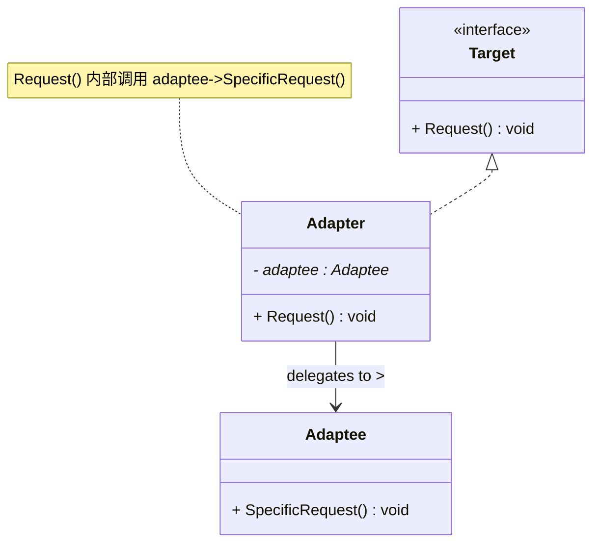
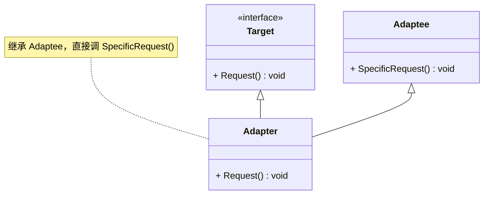
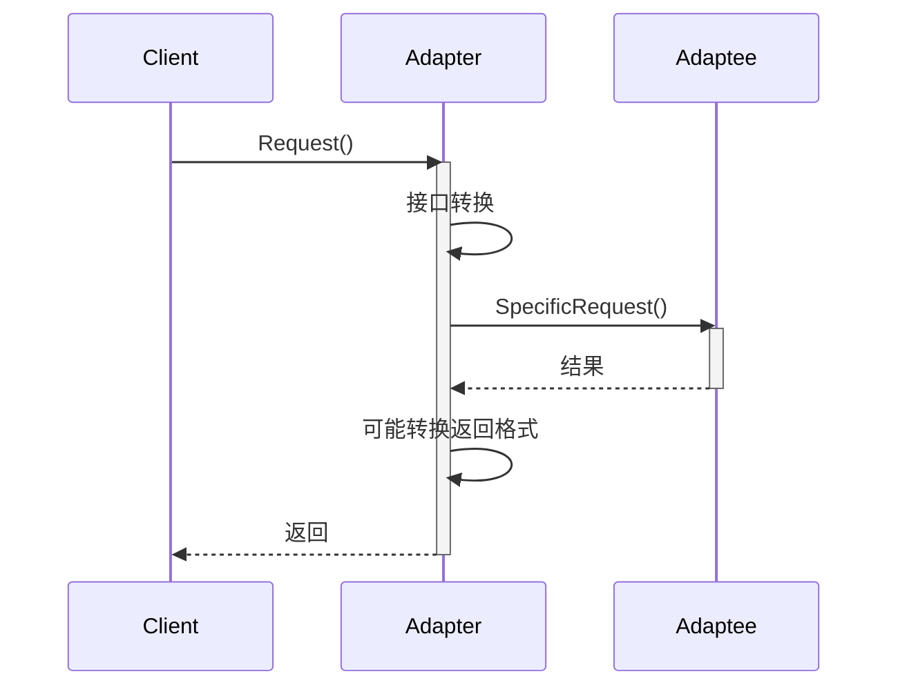

# 适配器模式 (Adapter Pattern)

## 概述

**适配器模式**（Adapter Pattern），又称 **包装器模式**（Wrapper Pattern），属于 **结构型设计模式**。它将一个类的接口转换成客户期望的另一个接口，使原本因接口不兼容而无法一起工作的类可以协同工作。

> **定义**：将一个类的接口转换成客户希望的另外一个接口。适配器模式使得原本由于接口不兼容而不能一起工作的那些类可以一起工作。

### 一个直觉感受

```
生活类比：电源适配器

  手机充电口（Type-C）      ←≠≠→      墙上插座（三孔）
  ┌──────────────┐                    ┌──────────────┐
  │  Type-C 接口  │     适配器转换      │  220V 三孔    │
  │              │◄═══════════════►  │              │
  └──────────────┘                    └──────────────┘

  手机不关心电是哪里来的，插座不关心谁在用，
  适配器负责把两者接起来。

代码类比：
  现有类（三孔插座）      ←≠≠→      客户端期望的接口（Type-C）
  比如：老旧的 XML 解析器          客户端只认 JSON 接口
  适配器把 XML 包装成 JSON 接口给客户端用
```

### 核心问题

**客户期望的接口和现有类提供的接口不一致。** 你不能改客户端（太多地方在用），也不想改现有类（第三方库、老代码），就加一层适配器。

---

## 核心设计思想

### 三个角色

| 角色 | 名称 | 职责 |
|---|---|---|
| **目标接口 (Target)** | `Target` | 客户端所期望的接口 |
| **被适配者 (Adaptee)** | `Adaptee` | 已经存在、接口不兼容的类 |
| **适配器 (Adapter)** | `Adapter` | 把 Adaptee 的接口转换成 Target 接口 |

### 两种实现方式

```
方式一：类适配器（继承）—— 需要多继承
  class Adapter : public Target, private Adaptee { ... }

方式二：对象适配器（组合）—— 推荐
  class Adapter : public Target {
      Adaptee* adaptee_;   // 持有被适配者
  };
```

> **推荐用对象适配器（组合）**——C++ 大多场景没有真正的多继承，而且组合比继承灵活。

---

## UML 类图

### 对象适配器



### 类适配器



### 时序图



---

## C++ 实现

### 场景：老式 XML 数据源 → 客户端只认 JSON

```cpp
#include <iostream>
#include <memory>
#include <string>

// ============ 目标接口：客户端期望的 JSON 接口 ============
class JsonDataProvider {
public:
    virtual ~JsonDataProvider() = default;
    virtual std::string GetJson() const = 0;
};

// ============ 被适配者：老式 XML 解析器（不能改！） ============
class XmlParser {
    std::string xmlData_;

public:
    explicit XmlParser(const std::string& xml) : xmlData_(xml) {}

    // 老接口：返回 XML 格式
    std::string GetXml() const {
        return xmlData_;
    }
};

// ============ 适配器：把 XML 包装成 JSON ============
class XmlToJsonAdapter : public JsonDataProvider {
    std::unique_ptr<XmlParser> xmlParser_;  // 组合：持有被适配者

public:
    explicit XmlToJsonAdapter(std::unique_ptr<XmlParser> parser)
        : xmlParser_(std::move(parser)) {}

    // ★ 核心：把不兼容的接口转换成客户端期望的接口
    std::string GetJson() const override {
        std::string xml = xmlParser_->GetXml();   // 拿到 XML

        // ===== 简单模拟 XML → JSON 转换 =====
        // 真实场景会用 XML 解析库，这里只演示接口适配
        std::string json;
        if (xml.find("<name>") != std::string::npos) {
            auto start = xml.find("<name>") + 6;
            auto end   = xml.find("</name>");
            std::string name = xml.substr(start, end - start);
            json = "{\"name\": \"" + name + "\"}";
        }
        return json;
    }
};

// ============ 客户端：只认 JSON 接口 ============
class DataConsumer {
public:
    // 客户端依赖抽象接口，不依赖任何具体实现
    void Display(JsonDataProvider& provider) {
        std::cout << "客户端收到 JSON: " << provider.GetJson() << std::endl;
    }
};

// ============ 客户端 ============
int main() {
    // 老系统遗留的 XML 数据
    auto xmlParser = std::make_unique<XmlParser>("<user><name>张三</name></user>");

    // 用适配器包装成客户端能用的接口
    XmlToJsonAdapter adapter(std::move(xmlParser));

    // 客户端开心地使用——它完全不知道 XML 的存在
    DataConsumer consumer;
    consumer.Display(adapter);

    return 0;
}
```

### 输出

```
客户端收到 JSON: {"name": "张三"}
```

### 关键解读

```
客户端只认识：
  JsonDataProvider::GetJson()

老系统提供：
  XmlParser::GetXml()

适配器做了什么：
  JsonDataProvider::GetJson() {
      → 调 XmlParser::GetXml()      （调用老接口）
      → 把 XML 转换成 JSON           （格式转换）
      → 返回 JSON                    （满足新接口）
  }
```

---

## 实际应用场景

### 1. 电源适配器 —— 电压转换

```cpp
// 220V 电源（被适配者）
class EuropeanSocket {
public:
    int Provide220V() const { return 220; }
};

// 目标：充电器只需要 5V
class ChargerTarget {
public:
    virtual int Provide5V() const = 0;
};

// 适配器：把 220V 降到 5V
class VoltageAdapter : public ChargerTarget {
    EuropeanSocket& socket_;
public:
    explicit VoltageAdapter(EuropeanSocket& s) : socket_(s) {}
    int Provide5V() const override {
        return socket_.Provide220V() / 44;  // 降压转换
    }
};
```

### 2. 旧代码接入新系统 —— 第三方支付

```cpp
// ===== 目标接口：新系统要求的支付接口 =====
class PaymentGateway {
public:
    virtual void Charge(double amount) = 0;
};

// ===== 被适配者：老支付 SDK（接口完全不同） =====
class LegacyPaymentSDK {
public:
    void ProcessPayment(int amountInCents, const char* merchantId) {
        std::cout << "老 SDK 支付 " << amountInCents << " 分" << std::endl;
    }
};

// ===== 适配器：把老 SDK 包装成新接口 =====
class PaymentAdapter : public PaymentGateway {
    LegacyPaymentSDK& sdk_;
public:
    explicit PaymentAdapter(LegacyPaymentSDK& sdk) : sdk_(sdk) {}

    void Charge(double amount) override {
        // 单位换算：元 → 分
        int cents = static_cast<int>(amount * 100);
        sdk_.ProcessPayment(cents, "MERCHANT_001");
    }
};

// 客户端：
LegacyPaymentSDK sdk;
PaymentAdapter adapter(sdk);   // 适配一次
adapter.Charge(99.9);          // 之后统一用新接口
```

> **现实案例**：很多老项目升级时，第三方 SDK 换了新接口，用适配器让旧代码无缝接入，不用大规模重写。

### 3. 标准库 IO 适配 —— 把字节流当文本流用

```cpp
// std::stringstream 其实就是一个适配器：
// 把 "任意数据" 适配成 "流的接口"

std::stringstream ss;
ss << 123 << "  hello";          // 数字、字符串都可以写入
std::string s = ss.str();        // 读出来是文本

// 它把不同数据类型的接口，统一适配成了 << 和 >> 操作符
```

### 4. 游戏引擎 —— 渲染 API 统一接口

```cpp
// 统一目标接口
class Renderer {
public:
    virtual void DrawTriangle(const Vertex& a, const Vertex& b, const Vertex& c) = 0;
};

// OpenGL 适配器：把统一接口翻译成 glBegin/glEnd 或 VBO 调用
class OpenGLAdapter : public Renderer {
    void DrawTriangle(const Vertex& a, const Vertex& b, const Vertex& c) override {
        glBegin(GL_TRIANGLES);
        glVertex3f(a.x, a.y, a.z);
        glVertex3f(b.x, b.y, b.z);
        glVertex3f(c.x, c.y, c.z);
        glEnd();
    }
};

// DirectX 适配器：翻译成 D3D 调用
class D3DAdapter : public Renderer {
    void DrawTriangle(const Vertex& a, const Vertex& b, const Vertex& c) override {
        d3dDevice_->DrawPrimitiveUP(D3DPT_TRIANGLELIST, 1, ...);
    }
};

// 游戏逻辑只依赖 Renderer 接口，换后端 = 换适配器
```

### 5. 数据库驱动 —— 统一 SQL 接口

```cpp
// 目标接口：统一数据库接口
class IDatabase {
public:
    virtual void Execute(const std::string& sql) = 0;
};

// 被适配者：各个数据库原生 API
class MySQLNative { public: void mysql_query(const char* q); };
class SQLiteNative { public: int sqlite3_exec(const char* q); };

// 适配器：把原生 API 包装成统一接口
class MySQLAdapter : public IDatabase {
    MySQLNative& db_;
    void Execute(const std::string& sql) override {
        db_.mysql_query(sql.c_str());
    }
};

class SQLiteAdapter : public IDatabase {
    SQLiteNative& db_;
    void Execute(const std::string& sql) override {
        db_.sqlite3_exec(sql.c_str());
    }
};
```

> **现实案例**：ODBC / JDBC 就是数据库适配器的集合——每个数据库厂商提供一个驱动（适配器），上层代码只认统一接口。

---

## 适配器 vs 外观 vs 代理 vs 装饰

这四个模式结构相似，都是"包装另一个对象"，但意图完全不同：

| 模式 | 包装的意图 | 接口变化吗 |
|---|---|---|
| **适配器 (Adapter)** | 把不兼容接口变成客户端要的 | ✅ **改变接口** |
| **外观 (Facade)** | 简化复杂子系统的调用 | ✅ 简化成高层接口 |
| **代理 (Proxy)** | 控制对原对象的访问 | ❌ 接口不变 |
| **装饰 (Decorator)** | 给原对象增加功能 | ❌ 接口不变 |

```
适配器：  客户端要 A 接口，现有的是 B 接口 → 转成 A（解决不兼容）
外观：    子系统太复杂 → 提供一个简单入口（解决复杂）
代理：    不能直接访问原对象 → 加控制层（解决访问控制）
装饰：    想给对象加功能 → 层层包装（解决功能扩展）
```

**一句话记忆：**

> **适配器为了"能用"，外观为了"好用"，代理为了"可控"，装饰为了"更强"。**

---

## 优缺点

### 优点

| # | 说明 |
|---|---|
| ✅ | **接口解耦** — 客户端只依赖目标接口，不依赖被适配者 |
| ✅ | **复用现有类** — 不改动老代码/第三方库就能接入新系统 |
| ✅ | **符合开闭原则** — 新增适配器不需要修改客户端和目标接口 |
| ✅ | **灵活** — 对象适配器可以适配任意实现（运行时可替换被适配者） |

### 缺点

| # | 说明 |
|---|---|
| ❌ | **增加复杂度** — 多一层间接调用，出错时调试变难 |
| ❌ | **类适配器需要多继承** — C++ 多继承本身有菱形问题等风险 |
| ❌ | **过度适配** — 如果适配器越来越多，说明系统架构本身该重构了 |

---

## 适用场景

| 场景 | 说明 |
|---|---|
| **使用第三方库但接口不兼容** | 库的接口和业务期望不一致，又不能改库 |
| **旧系统迁移** | 老模块的接口要接入新框架，大规模重写成本高 |
| **统一异构接口** | 多个类似但接口不同的类（不同数据库、不同渲染 API） |
| **期望类适配接口** | 想让一个类能插入另一个类期望的接口体系中 |

---

## 总结

适配器模式的核心思想：

> **不改变双方，在中间加一层"翻译官"。**

```
客户端（说中文）  ←—— 适配器（翻译） ——→  第三方库（说英文）
      │                                         │
      │ 只依赖 Target 接口                        │
      │                                          │
      双方都不知道对方存在，适配器是唯一的桥梁
```

它是系统集成、遗留系统改造、第三方接入中最常用到的模式——现实世界到处都是"接口不兼容"，适配器就是这个问题的标准答案。
