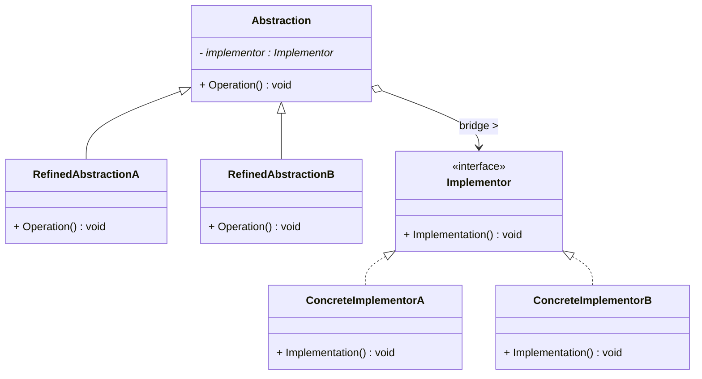
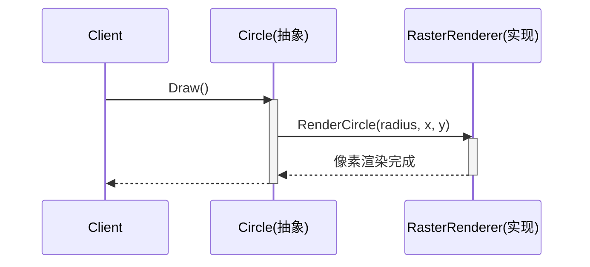

# 桥接模式 (Bridge Pattern)

## 概述

**桥接模式**（Bridge Pattern），属于 **结构型设计模式**。它将**抽象部分**与**实现部分**分离，使它们都可以独立地变化。

> **定义**：将抽象部分与它的实现部分分离，使它们都可以独立地变化。

### 一个直觉感受

```cpp
// 没有桥接：两个维度直接相乘，类爆炸！
// 形状（圆、方）× 渲染方式（矢量、像素）= 2×2 = 4 个类
// 再加三角形 → 2×3 = 6 个类
// 再加 3D 渲染 → 2×3×2 = 12 个类！

// 有桥接：两个维度各管各的
// 形状层次：Circle, Rectangle（只管"是什么形状"）
// 渲染层次：VectorRenderer, RasterRenderer（只管"怎么画"）
// 任意组合：Circle + VectorRenderer / Circle + RasterRenderer ...
```

### 核心问题

**一个类有两个独立变化的维度时，继承会爆炸。** 桥接模式把这两个维度拆成两条独立的继承链，中间用"组合"搭一座桥。

```
        形状维度（抽象）              渲染维度（实现）
   ┌──────────────────────┐    ┌─────────────────────────┐
   │  Shape (抽象)         │    │  Renderer (实现接口)     │
   │  - renderer_: Renderer│────│  + RenderCircle()       │
   └─────────┬────────────┘ 桥  └───────────┬─────────────┘
             │                              │
        ┌────┴────┐                   ┌─────┴──────┐
        │         │                   │            │
   ┌────┴───┐ ┌───┴─────┐        ┌────┴───┐   ┌────┴─────┐
   │ Circle │ │Rectangle │        │Vector  │   │ Raster   │
   │ 圆     │ │ 矩形     │        │Renderer│   │ Renderer │
   └────────┘ └──────────┘        │矢量渲染│   │ 像素渲染 │
                                  └────────┘   └──────────┘

   左边怎么变不影响右边，右边怎么变不影响左边
   组合方式：Circle+Vector、Circle+Raster、Rect+Vector、Rect+Raster
```

---

## 核心设计思想

### 四个角色

| 角色 | 名称 | 职责 |
|---|---|---|
| **抽象 (Abstraction)** | `Shape` | 定义抽象接口，持有 Implementor 的引用 |
| **扩展抽象 (RefinedAbstraction)** | `Circle` / `Rectangle` | 扩展 Abstraction，实现抽象部分的行为 |
| **实现 (Implementor)** | `Renderer` | 定义实现接口（供 Abstraction 调用） |
| **具体实现 (ConcreteImplementor)** | `VectorRenderer` / `RasterRenderer` | 实现 Implementor 的具体行为 |

### 桥接 vs 继承

```
继承方式（类爆炸）：
  CircleVector / CircleRaster / RectVector / RectRaster ...
  N 形状 × M 渲染 = N×M 个类

桥接方式（组合）：
  Shape 层次：N 个类
  Renderer 层次：M 个类
  总计 N+M 个类，任意 N×M 种组合
```

| | 继承 | 桥接 |
|---|---|---|
| 类数量 | N×M（相乘） | N+M（相加） |
| 耦合 | 编译期绑定，换不了 | 运行时可换 Implementor |
| 扩展形状 | 要加 M 个类（每种渲染一个） | 加 1 个类 |
| 扩展渲染 | 要加 N 个类（每个形状一个） | 加 1 个类 |

---

## UML 类图



### 时序图



---

## C++ 实现

### 经典示例：形状 × 渲染方式

> 每个类的注释标明了它对应的模式角色：`Shape` = 抽象（Abstraction），`Circle/Rectangle` = 扩展抽象（RefinedAbstraction），`Renderer` = 实现（Implementor），`VectorRenderer/RasterRenderer` = 具体实现（ConcreteImplementor）。

```cpp
#include <iostream>
#include <memory>

// ══════════════ 实现 (Implementor) ══════════════
// 模式角色：Implementor —— 定义渲染接口，不知道"形状"的存在
class Renderer {
public:
    virtual ~Renderer() = default;
    virtual void RenderCircle(float radius, float x, float y) = 0;
    virtual void RenderRectangle(float w, float h) = 0;
};

// ══════════════ 具体实现 A (ConcreteImplementor) ══════════════
// 模式角色：ConcreteImplementor —— 矢量渲染（SVG / OpenGL 线框）
class VectorRenderer : public Renderer {
public:
    void RenderCircle(float radius, float x, float y) override {
        std::cout << "  [矢量] 画圆: 半径 " << radius
                  << " @ (" << x << ", " << y << ")" << std::endl;
    }
    void RenderRectangle(float w, float h) override {
        std::cout << "  [矢量] 画矩形: " << w << " × " << h << std::endl;
    }
};

// ══════════════ 具体实现 B (ConcreteImplementor) ══════════════
// 模式角色：ConcreteImplementor —— 像素渲染（位图 / 光栅化）
class RasterRenderer : public Renderer {
public:
    void RenderCircle(float radius, float x, float y) override {
        std::cout << "  [像素] 画圆: 半径 " << radius
                  << " @ (" << x << ", " << y << ")  逐像素填充" << std::endl;
    }
    void RenderRectangle(float w, float h) override {
        std::cout << "  [像素] 画矩形: " << w << " × " << h
                  << "  逐像素填充" << std::endl;
    }
};

// ══════════════ 抽象 (Abstraction) ══════════════
// 模式角色：Abstraction —— 定义形状接口，持有 Implementor 引用（桥！）
class Shape {
protected:
    Renderer& renderer_;     // ← 桥：抽象持有实现的引用

public:
    explicit Shape(Renderer& r) : renderer_(r) {}
    virtual ~Shape() = default;
    virtual void Draw() const = 0;      // 抽象操作
    virtual void Scale(float factor) = 0;  // 形状自己的操作
};

// ══════════════ 扩展抽象 A (RefinedAbstraction) ══════════════
// 模式角色：RefinedAbstraction —— 圆形（只管形状数据，绘制交给桥）
class Circle : public Shape {
    float radius_, x_, y_;

public:
    Circle(Renderer& r, float radius, float x, float y)
        : Shape(r), radius_(radius), x_(x), y_(y) {}

    void Draw() const override {
        // ★ 形状不自己画，委托给桥另一端的 Renderer
        renderer_.RenderCircle(radius_, x_, y_);
    }

    void Scale(float factor) override {
        radius_ *= factor;
    }
};

// ══════════════ 扩展抽象 B (RefinedAbstraction) ══════════════
// 模式角色：RefinedAbstraction —— 矩形
class Rectangle : public Shape {
    float width_, height_;

public:
    Rectangle(Renderer& r, float w, float h)
        : Shape(r), width_(w), height_(h) {}

    void Draw() const override {
        renderer_.RenderRectangle(width_, height_);
    }

    void Scale(float factor) override {
        width_ *= factor;
        height_ *= factor;
    }
};

// ══════════════ 客户端 (Client) ══════════════
// 模式角色：Client —— 自由组合形状和渲染方式
int main() {
    // 创建两种渲染器（实现维度）
    VectorRenderer vector;
    RasterRenderer raster;

    // ★ 自由组合：同一个圆形，用不同的渲染器
    Circle vectorCircle(vector, 5, 0, 0);   // 矢量圆
    Circle rasterCircle(raster, 5, 0, 0);   // 像素圆

    std::cout << "=== 圆形 + 矢量渲染 ===" << std::endl;
    vectorCircle.Draw();
    std::cout << "=== 圆形 + 像素渲染 ===" << std::endl;
    rasterCircle.Draw();

    // 矩形也一样
    Rectangle rasterRect(raster, 3, 4);
    std::cout << "=== 矩形 + 像素渲染 ===" << std::endl;
    rasterRect.Draw();

    // 运行中还可以换桥（改渲染方式）
    std::cout << "\n=== 运行时切换渲染器 ===" << std::endl;
    Circle switchable(raster, 2, 1, 1);
    switchable.Draw();
    // 换个实现：
    // switchable 持有的是 Renderer& —— 构造时决定的引用，不能换
    // 想换可以用指针 + SetRenderer()，原理相同
    std::cout << "（构造时传入不同的 Renderer& 即为不同组合）" << std::endl;

    return 0;
}
```

### 输出

```
=== 圆形 + 矢量渲染 ===
  [矢量] 画圆: 半径 5 @ (0, 0)
=== 圆形 + 像素渲染 ===
  [像素] 画圆: 半径 5 @ (0, 0)  逐像素填充
=== 矩形 + 像素渲染 ===
  [像素] 画矩形: 3 × 4  逐像素填充

=== 运行时切换渲染器 ===
  [像素] 画圆: 半径 2 @ (1, 1)
```

### 关键解读

```cpp
// 形状和渲染两条链，只通过 renderer_ 一个引用相连
Shape ──renderer_──▶ Renderer
 │                     │
 ├─ Circle             ├─ VectorRenderer
 └─ Rectangle          └─ RasterRenderer

新增形状：加一个 Shape 子类（如 Triangle），渲染器一行不用改
新增渲染：加一个 Renderer 子类（如 OpenGLRenderer），形状一行不用改
两个维度完全独立 —— 这就是"桥接"
```

---

## 桥接 vs 适配器 vs 策略

| 模式 | 关注点 | 区别 |
|---|---|---|
| **桥接** | 让**抽象和实现独立变化** | 两个维度**从一开始**就分开设计 |
| **适配器** | 让**不兼容的现成接口**能合作 | 事后"翻译"，接口不匹配才用 |
| **策略** | 替换**算法** | 侧重行为替换，桥接侧重维度分离 |

```
桥接 vs 适配器的一句话区别：
  桥接 = "我设计时就想到可能要换实现，所以搭了桥"
  适配器 = "两个东西本来不搭，我事后硬接一根线"

桥接 vs 策略：
  策略 = 一个对象换算法（Context 持有 Strategy）
  桥接 = 两个维度各自演化（Abstraction 持有 Implementor）
  结构上几乎一样，桥接强调"双向独立扩展"
```

---

## 实际应用场景

### 1. 设备 × 遥控器

```cpp
// ══════════════ 实现 (Implementor) ══════════════
// 模式角色：Implementor —— 设备接口
class Device {
public:
    virtual void SetVolume(int) = 0;
    virtual int GetVolume() const = 0;
};

// ══════════════ 具体实现 (ConcreteImplementor) ══════════════
// 模式角色：ConcreteImplementor —— 电视机
class TV : public Device { int vol_ = 10; void SetVolume(int v) override { vol_ = v; } int GetVolume() const override { return vol_; } };
// 模式角色：ConcreteImplementor —— 收音机
class Radio : public Device { int vol_ = 5;  void SetVolume(int v) override { vol_ = v; } int GetVolume() const override { return vol_; } };

// ══════════════ 抽象 (Abstraction) ══════════════
// 模式角色：Abstraction —— 遥控器（持有设备引用）
class RemoteControl {
protected:
    Device& device_;
public:
    explicit RemoteControl(Device& d) : device_(d) {}
    virtual void VolumeUp() { device_.SetVolume(device_.GetVolume() + 1); }
};

// 扩展抽象：高级遥控器
class AdvancedRemote : public RemoteControl {
public:
    explicit AdvancedRemote(Device& d) : RemoteControl(d) {}
    void Mute() { device_.SetVolume(0); }
};

// 组合：TV + 普通遥控 / TV + 高级遥控 / Radio + 高级遥控...
```

### 2. 消息发送 × 消息类型

```cpp
// 实现维度：发送方式（怎么发）
class MessageSender {
public:
    virtual void Send(const std::string& msg, const std::string& to) = 0;
};
class EmailSender : public MessageSender { /* SMTP */ };
class SmsSender : public MessageSender { /* 短信网关 */ };
class WechatSender : public MessageSender { /* 微信推送 */ };

// 抽象维度：消息类型（发什么）
class Message {
protected:
    MessageSender& sender_;
public:
    explicit Message(MessageSender& s) : sender_(s) {}
    virtual void Send(const std::string& text) = 0;
};
class NormalMessage : public Message { /* 普通文本 */ };
class UrgentMessage : public Message { /* 加急：要回执 */ };

// 组合：Email+普通 / Email+加急 / SMS+加急 ... 新增消息类型或发送渠道互不影响
```

### 3. 数据库访问 × 平台

```cpp
// 实现维度：底层平台（Unix/Windows 文件访问差异）
class FileSystemImpl {
public:
    virtual void Open(const std::string& path) = 0;
};
class UnixFileSystem : public FileSystemImpl { /* open() syscall */ };
class WindowsFileSystem : public FileSystemImpl { /* CreateFile API */ };

// 抽象维度：上层业务（文件读取方式）
class FileReader {
protected:
    FileSystemImpl& fs_;
public:
    virtual std::string Read(const std::string& path) = 0;
};
class BufferedFileReader : public FileReader { /* 缓冲读 */ };
class MemoryMappedReader : public FileReader { /* mmap 读 */ };
```

> **现实案例**：JDBC 的 `Driver`（实现）与 `Connection`（抽象）、Qt 的 `QAbstractSocket` 与底层 socket 实现——都是桥接。

---

## 文件拆分建议（真正开发时 .hpp/.cpp 怎么分）

以下面形状×渲染示例为例，真实工程按**每个角色一个文件**拆分：

```
code/bridge/
├── renderer.hpp        ← Implementor 接口（只有虚函数声明，纯头文件）
├── renderer.cpp        ← ConcreteImplementor（VectorRenderer / RasterRenderer 的实现）
├── shape.hpp           ← Abstraction（Shape：持有 Renderer& 的抽象类）
├── shape.cpp           ← RefinedAbstraction（Circle / Rectangle 的实现）
├── main.cpp            ← Client（组装：创建渲染器 → 创建形状 → Draw）
└── main                ← 可执行文件
```

拆分依据：

| 文件 | 放什么 | 为什么 |
|---|---|---|
| `renderer.hpp` | `Renderer` 抽象类声明（纯虚函数 + 虚析构） | 只有声明，无实现 → 纯头文件 |
| `renderer.cpp` | `VectorRenderer`、`RasterRenderer` 的方法体 | 具体实现，编译成 `.o` |
| `shape.hpp` | `Shape` 声明 + `Circle`、`Rectangle` 的类声明 | 头文件只声明，不实现 |
| `shape.cpp` | `Circle`、`Rectangle` 的方法体（`Draw`/`Scale`） | 具体逻辑放实现文件 |
| `main.cpp` | `main()` + 对象组装 | 客户端入口 |

```bash
# 编译命令（列出所有 .cpp）：
g++ -std=c++14 main.cpp shape.cpp renderer.cpp -o main
```

> **拆分原则回顾**（和之前 observer 一样）：
> - 头文件只放**声明**（类、成员函数声明），不写函数体
> - 函数体（实现）放 `.cpp`
> - `virtual ~X() = default;` 放在头文件（它是默认实现）
> - 纯虚函数 `= 0` 只有声明，没有实现
> - 抽象类如果有析构，析构体放 `.cpp`（`~Shape() = default` 可放头文件，但复杂析构建议 `.cpp`）

---

## 优缺点

### 优点

| # | 说明 |
|---|---|
| ✅ | **抽象与实现解耦** — 两个维度独立扩展，互不影响 |
| ✅ | **消除类爆炸** — N×M 个组合只需 N+M 个类 |
| ✅ | **符合开闭原则** — 新增形状或新增渲染方式都只需加一个类 |
| ✅ | **运行时可切换** — 通过更换 Implementor 对象改变行为 |

### 缺点

| # | 说明 |
|---|---|
| ❌ | **增加系统复杂度** — 需要理解"两个维度"的设计，初学者容易过度设计 |
| ❌ | **接口设计难度高** — Abstraction 和 Implementor 的接口划分要准确，划错了桥就白搭 |
| ❌ | **不适合维度单一的场景** — 只有一个变化维度的类用桥接是多余 |

---

## 适用场景

| 场景 | 说明 |
|---|---|
| **一个类有两个独立变化维度** | 形状×渲染、设备×遥控、消息×发送渠道 |
| **继承会导致类爆炸** | N×M 组合，用桥接变成 N+M |
| **需要在运行时切换实现** | 运行时换渲染器、换发送渠道 |
| **希望两个维度分别扩展** | 新增形状不改渲染，新增渲染不改形状 |

---

## 总结

桥接模式的核心思想：

> **把"是什么"和"怎么做"拆成两条独立的继承链，中间用组合搭一座桥。**

```
不用桥接：
  形状×渲染 → 类爆炸（每加一个维度乘一倍）

用桥接：
  Shape 链（N 个类）  ◄─renderer_─►  Renderer 链（M 个类）
  总计 N+M 个类，任意组合

记忆口诀：
  桥接拆维度，相乘变相加
  抽象管是什么，实现管怎么做
```
