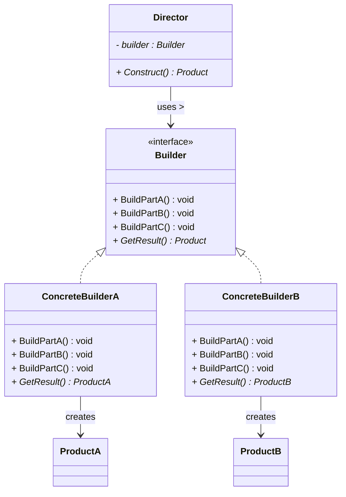
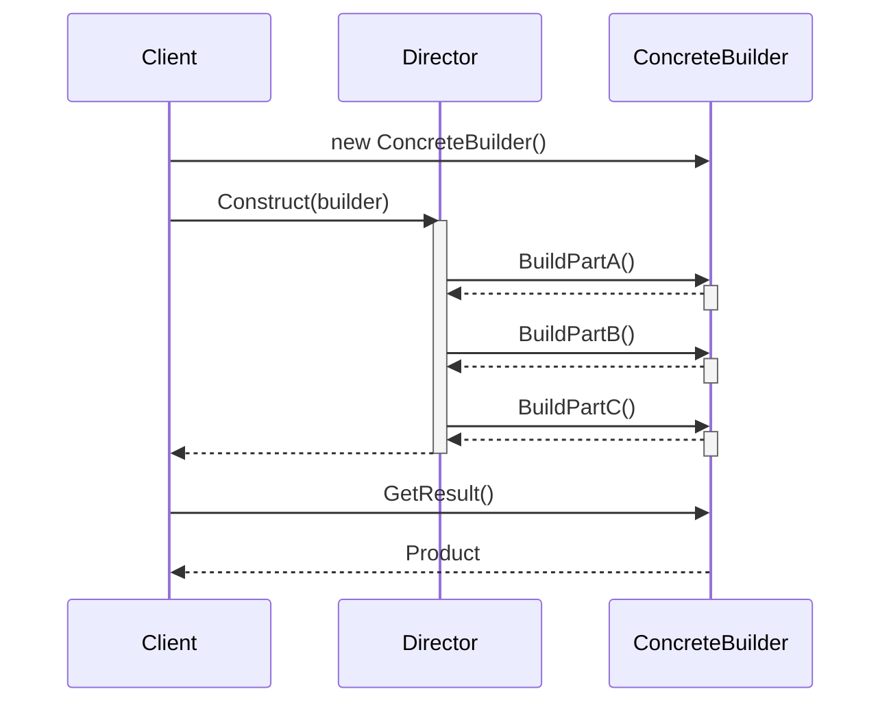

# 建造者模式 (Builder Pattern)

## 概述

**建造者模式**（Builder Pattern），又称 **生成器模式**，属于 **创建型设计模式**。它将一个复杂对象的**构建过程**与它的**表示**分离，使得同样的构建过程可以创建不同的表示。

> **定义**：将一个复杂对象的构建与它的表示分离，使得同样的构建过程可以创建不同的表示。

### 一个直觉感受

当构造函数参数太多时，代码会变得难以阅读和维护：

```cpp
// ❌ 构造函数参数爆炸——哪个是 5？哪个是 true？
House h(4, 3, 2, true, false, true, "red", "wood", "tile", 5);

// ✅ 建造者模式——每一步都有明确的名字
auto house = HouseBuilder()
    .SetFloors(4)
    .SetRooms(3)
    .SetGarages(2)
    .SetColor("red")
    .SetMaterial("wood")
    .Build();
```

建造者模式解决的核心问题是：**如何优雅地构造一个有很多可选参数和配置步骤的复杂对象。**

---

## 核心设计思想

### 四个角色

| 角色 | 名称 | 职责 |
|---|---|---|
| **产品 (Product)** | `Product` | 最终要创建的复杂对象 |
| **抽象建造者 (Builder)** | `Builder` | 定义构建产品的抽象步骤接口 |
| **具体建造者 (ConcreteBuilder)** | `ConcreteBuilder` | 实现 Builder 接口，具体的构建逻辑 |
| **指挥者 (Director)** | `Director` | 定义构建顺序，调用 Builder 的各个步骤来构造产品（**不负责产品是什么，只负责调用顺序**） |

### 导演的智慧

Director 知道"先建墙，再盖屋顶，最后装修"这个**顺序**，但不知道墙用什么材料、屋顶是什么形状——这些由 Builder 决定。

```
Director（指挥者）
  │
  │ "先建墙 → 再盖屋顶 → 最后装修"
  │
  ├── ConcreteBuilderA（木屋建造者）  → 木墙 + 木屋顶 + 简装
  └── ConcreteBuilderB（砖房建造者）  → 砖墙 + 瓦屋顶 + 精装
```

---

## UML 类图



### 时序图



---

## C++ 实现

### 经典实现：盖房子

```cpp
#include <iostream>
#include <memory>
#include <string>
#include <vector>

// ============ 产品 ============
class House {
public:
    struct Detail {
        std::string foundation;
        std::string walls;
        std::string roof;
        std::string interior;
    };

    void SetFoundation(const std::string& f) { detail_.foundation = f; }
    void SetWalls(const std::string& w)      { detail_.walls = w; }
    void SetRoof(const std::string& r)       { detail_.roof = r; }
    void SetInterior(const std::string& i)   { detail_.interior = i; }

    void Show() const {
        std::cout << "  地基: " << detail_.foundation << "\n"
                  << "  墙体: " << detail_.walls << "\n"
                  << "  屋顶: " << detail_.roof << "\n"
                  << "  装修: " << detail_.interior << std::endl;
    }

private:
    Detail detail_;
};

// ============ 抽象建造者 ============
class HouseBuilder {
public:
    virtual ~HouseBuilder() = default;
    virtual void BuildFoundation() = 0;
    virtual void BuildWalls() = 0;
    virtual void BuildRoof() = 0;
    virtual void BuildInterior() = 0;
    virtual std::unique_ptr<House> GetResult() = 0;
};

// ============ 具体建造者A：木屋 ============
class WoodenHouseBuilder : public HouseBuilder {
    std::unique_ptr<House> house_;

public:
    WoodenHouseBuilder() : house_(std::make_unique<House>()) {}

    void BuildFoundation() override { house_->SetFoundation("木桩地基"); }
    void BuildWalls()      override { house_->SetWalls("原木墙体"); }
    void BuildRoof()       override { house_->SetRoof("木瓦屋顶"); }
    void BuildInterior()   override { house_->SetInterior("简装修"); }

    std::unique_ptr<House> GetResult() override { return std::move(house_); }
};

// ============ 具体建造者B：砖房 ============
class BrickHouseBuilder : public HouseBuilder {
    std::unique_ptr<House> house_;

public:
    BrickHouseBuilder() : house_(std::make_unique<House>()) {}

    void BuildFoundation() override { house_->SetFoundation("钢筋混凝土地基"); }
    void BuildWalls()      override { house_->SetWalls("红砖墙体"); }
    void BuildRoof()       override { house_->SetRoof("琉璃瓦屋顶"); }
    void BuildInterior()   override { house_->SetInterior("精装修"); }

    std::unique_ptr<House> GetResult() override { return std::move(house_); }
};

// ============ 指挥者：定义建造顺序 ============
class Director {
public:
    // ★ 只负责顺序，不负责具体材料
    std::unique_ptr<House> Construct(HouseBuilder& builder) {
        builder.BuildFoundation();   // 步骤1：建地基（必须最先）
        builder.BuildWalls();        // 步骤2：建墙体
        builder.BuildRoof();         // 步骤3：盖屋顶
        builder.BuildInterior();     // 步骤4：装修
        return builder.GetResult();
    }
};

// ============ 客户端 ============
int main() {
    Director director;

    std::cout << "===== 建造木屋 =====" << std::endl;
    WoodenHouseBuilder woodBuilder;
    auto woodHouse = director.Construct(woodBuilder);
    woodHouse->Show();

    std::cout << "\n===== 建造砖房 =====" << std::endl;
    BrickHouseBuilder brickBuilder;
    auto brickHouse = director.Construct(brickBuilder);
    brickHouse->Show();

    return 0;
}
```

### 输出

```
===== 建造木屋 =====
  地基: 木桩地基
  墙体: 原木墙体
  屋顶: 木瓦屋顶
  装修: 简装修

===== 建造砖房 =====
  地基: 钢筋混凝土地基
  墙体: 红砖墙体
  屋顶: 琉璃瓦屋顶
  装修: 精装修
```

### Director 和 Builder 的分工

```
Director::Construct()          负责什么？

  builder.BuildFoundation();   → 顺序："必须先打地基"
  builder.BuildWalls();        → 顺序："再建墙"
  builder.BuildRoof();         → 顺序："然后盖屋顶"
  builder.BuildInterior();     → 顺序："最后装修"

  // Director 不知道是用木头还是砖头，它只知道顺序！

Builder 负责什么？

  WoodenHouseBuilder::BuildWalls() → "原木墙体"
  BrickHouseBuilder::BuildWalls()  → "红砖墙体"

  // Builder 不知道要按什么顺序建造，它只知道自己用什么材料！
```

---

### 流式建造者（现代 C++ 风格）

如果不需要 Director 来管理复杂顺序，可以简化为流式调用——每个 setter 返回 `*this`，链式拼接：

```cpp
class House {
public:
    struct Config {
        int floors = 1;
        int rooms = 3;
        int garages = 1;
        std::string color = "white";
        std::string material = "brick";
        bool hasGarden = false;
        bool hasPool = false;
    };

    void ShowConfig() const {
        std::cout << "  层数: " << config_.floors << "\n"
                  << "  房间: " << config_.rooms << "\n"
                  << "  车库: " << config_.garages << "\n"
                  << "  颜色: " << config_.color << "\n"
                  << "  材料: " << config_.material << "\n"
                  << "  花园: " << (config_.hasGarden ? "有" : "无") << "\n"
                  << "  泳池: " << (config_.hasPool ? "有" : "无") << std::endl;
    }

private:
    Config config_;
    friend class HouseConfigBuilder;
};

// ============ 流式建造者 ============
class HouseConfigBuilder {
    House::Config config_;

public:
    // ★ 每个 setter 返回 *this，实现链式调用
    HouseConfigBuilder& SetFloors(int n)    { config_.floors = n;    return *this; }
    HouseConfigBuilder& SetRooms(int n)     { config_.rooms = n;     return *this; }
    HouseConfigBuilder& SetGarages(int n)   { config_.garages = n;   return *this; }
    HouseConfigBuilder& SetColor(const std::string& c) { config_.color = c;    return *this; }
    HouseConfigBuilder& SetMaterial(const std::string& m) { config_.material = m; return *this; }
    HouseConfigBuilder& WithGarden()        { config_.hasGarden = true; return *this; }
    HouseConfigBuilder& WithPool()          { config_.hasPool = true;   return *this; }

    House Build() {
        House h;
        h.config_ = config_;
        return h;
    }
};

// ============ 客户端 ============
int main() {
    auto house = HouseConfigBuilder()
        .SetFloors(2)
        .SetRooms(5)
        .WithGarden()
        .WithPool()
        .SetColor("白色")
        .Build();

    house.ShowConfig();
    return 0;
}
```

### 输出

```
  层数: 2
  房间: 5
  车库: 1
  颜色: 白色
  材料: brick
  花园: 有
  泳池: 有
```

---

## 构造函数"望远镜"问题

建造者模式最直接的敌人是参数膨胀：

```cpp
// ❌ 参数地狱——没有名字，顺序必须记牢，第 7 个参数是啥？
House(int floors, int rooms, int garages,
      std::string color, std::string material,
      bool garden, bool pool, int year);

House h(2, 5, 1, "white", "brick", true, true, 2020);
//          ^                        ^    ^
//        第 4 个到底该填啥？    garden 在 pool 前面？
```

| 问题 | 建造者如何解决 |
|---|---|
| 参数没有名字 | 每个 `SetXxx()` 方法名就是语义 |
| 必须按顺序填 | 不关心调用顺序，只关心调了哪些 |
| 可选的参数太多 | 只调需要的 setter，其他保持默认值 |
| 参数组合爆炸 | 像菜单一样点选，任意组合 |

---

## 实际应用场景

### 1. 数据库查询构建器

```cpp
class QueryBuilder {
    std::string table_;
    std::vector<std::string> columns_;
    std::vector<std::string> conditions_;
    int limit_ = -1;

public:
    QueryBuilder& Table(const std::string& t) { table_ = t; return *this; }
    QueryBuilder& Select(const std::string& col) { columns_.push_back(col); return *this; }
    QueryBuilder& Where(const std::string& cond) { conditions_.push_back(cond); return *this; }
    QueryBuilder& Limit(int n) { limit_ = n; return *this; }

    std::string Build() {
        std::ostringstream sql;
        sql << "SELECT " << Join(columns_) << " FROM " << table_;
        if (!conditions_.empty())
            sql << " WHERE " << Join(conditions_, " AND ");
        if (limit_ > 0)
            sql << " LIMIT " << limit_;
        return sql.str();
    }
};

// 客户端：
auto sql = QueryBuilder()
    .Table("users")
    .Select("id")
    .Select("name")
    .Where("age > 18")
    .Where("active = 1")
    .Limit(10)
    .Build();
// → SELECT id, name FROM users WHERE age > 18 AND active = 1 LIMIT 10
```

> **现实案例**：SQLAlchemy、jOOQ、Django ORM 的 QuerySet——全是建造者模式的变体。

### 2. HTTP 请求构建

```cpp
auto req = HttpRequestBuilder()
    .Method("POST")
    .Url("https://api.example.com/users")
    .Header("Content-Type", "application/json")
    .Header("Authorization", "Bearer xxxx")
    .Body(R"({"name":"张三","age":28})")
    .Timeout(5000)
    .Build();
```

> **现实案例**：`cpr::Get()` —— C++ 的 cpr 库使用 Builder 风格构造 HTTP 请求。

### 3. 游戏角色创建

```cpp
auto warrior = CharacterBuilder()
    .Name("亚瑟")
    .Class("战士")
    .Strength(90)
    .Stamina(80)
    .Weapon("霜之哀伤")
    .Armor("重甲")
    .Build();
```

### 4. 配置文件生成

```cpp
auto config = ServerConfigBuilder()
    .Host("0.0.0.0")
    .Port(8080)
    .Workers(4)
    .EnableSSL(true, "/etc/cert.pem", "/etc/key.pem")
    .EnableCompression()
    .LogDir("/var/log/myapp")
    .Build();
```

> **现实案例**：Google Protobuf 的 `CreateMessage()` + setter 链；nginx 配置生成器。

---

## 与工厂模式的对比

| 维度 | 简单工厂 / 工厂方法 | 建造者模式 |
|---|---|---|
| **创建对象** | 一个步骤完成（`Factory.Create(type)`） | 分多个步骤逐步构建 |
| **参数数量** | 少（通常 1-2 个标识参数） | 多（很多可选的配置项） |
| **构建过程** | 对客户端隐藏 | 对客户端可见（或通过 Director 控制） |
| **产品复杂度** | 低 | 高 |
| **典型例子** | `DBFactory::Create("mysql")` | `HouseBuilder.SetFloors(2).SetColor("red").Build()` |

> **工厂管"造哪种"，建造者管"怎么造"。**

---

## 优缺点

### 优点

| # | 说明 |
|---|---|
| ✅ | **参数清晰** — 每个步骤有明确的方法名，不会出现"第 7 个参数是什么意思" |
| ✅ | **构建过程可控** — Director 可以复用同一个构建流程，搭配不同的 Builder 得到不同产品 |
| ✅ | **可选参数优雅处理** — 流式建造者中，只调需要的 setter，其余用默认值 |
| ✅ | **创建和使用分离** — Builder 只管构建，客户端拿到最终产品后只管使用 |
| ✅ | **可以分步构建** — 逐步累积数据，最后 `Build()` 一次性产出，中间可以验证 |

### 缺点

| # | 说明 |
|---|---|
| ❌ | **代码量增加** — 每个产品配一个 Builder，增加类数量 |
| ❌ | **Director 不够灵活** — 如果构建顺序需要动态变化，Director 的固定流程反而成为限制 |
| ❌ | **流式 Builder 可能调一半漏掉 Build()** — 编译器不会提醒你忘了调 `Build()` |
| ❌ | **过度设计风险** — 对象只有 3 个参数用 Builder 是杀鸡用牛刀 |

---

## 适用场景

| 场景 | 说明 |
|---|---|
| **构造函数参数太多** | 超过 4-5 个参数，或大量可选参数——用 Builder |
| **同一套构建流程产出不同表示** | Director + 多个 Builder——同样的步骤，木头 vs 砖头 |
| **对象需要分步初始化** | 构建中间可能需要验证、预处理 |
| **不可变对象** | 先配置再一次性构造，构造后不可修改 |

---

## 总结

建造者模式的核心思想可以拆成两句：

> **1. 把"构造对象的代码"从"构造函数"或"一堆 setter"中抽出来，放到一个专门的 Builder 类里。**
>
> **2. 如果构建流程固定，再加一层 Director 来控制步骤顺序。**

```
没有 Builder：
  House h(2, 5, 1, "白色", "砖", true, true, 2020);  // 哪个是哪个？

有 Builder：
  auto h = HouseConfigBuilder()
      .SetFloors(2).SetColor("白色").WithGarden().Build();
      //         ↑ 一眼看懂，没有歧义
```

建造者模式本质上是把"参数列表"变成了"步骤菜单"——按需点菜，顺序无所谓，最后统一上桌。
