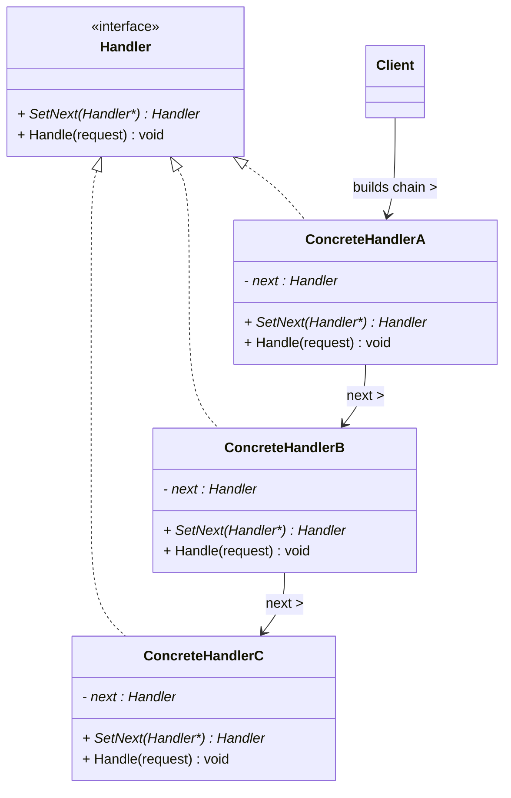
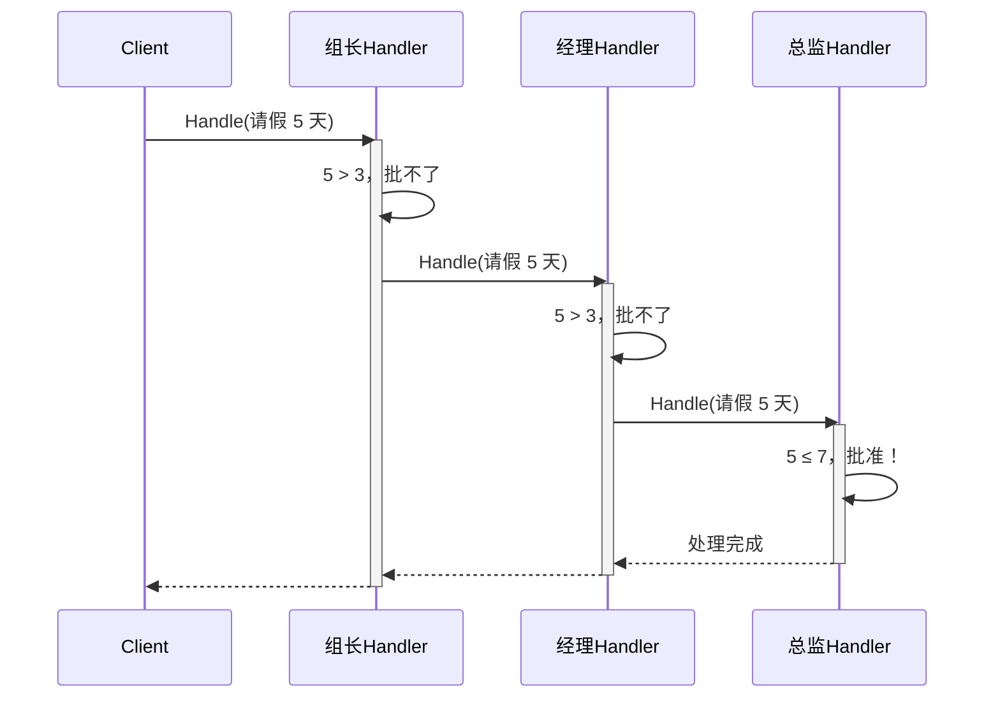

# 职责链模式 (Chain of Responsibility Pattern)

## 概述

**职责链模式**（Chain of Responsibility Pattern），又称 **责任链模式**，属于 **行为型设计模式**。它将请求的发送者和接收者解耦，让**多个对象都有机会处理请求**——将这些对象连成一条链，请求沿链传递，直到有对象处理它为止。

> **定义**：使多个对象都有机会处理请求，从而避免请求的发送者和接收者之间的耦合关系。将这些对象连成一条链，并沿着这条链传递该请求，直到有一个对象处理它为止。

### 一个直觉感受

```cpp
// 请假审批流程：
//   请假 1 天  → 组长批
//   请假 3 天  → 经理批
//   请假 7 天  → 总监批
//   请假 >7 天 → 老板批

// 不用职责链：一堆 if-else
if (days <= 1)       leader.Approve();
else if (days <= 3)  manager.Approve();
else if (days <= 7)  director.Approve();
else                 boss.Approve();
// 每次改审批规则，都要改这段 if-else！

// 用职责链：一条链，谁接得住谁处理
leader.SetNext(manager).SetNext(director).SetNext(boss);
request.Handle(days);
// 从组长开始：组长批不了 → 传给经理 → 经理批不了 → 传给总监...
```

### 核心思想

```
客户端 ──请求──▶ [处理者A] ──处理不了──▶ [处理者B] ──处理不了──▶ [处理者C]
                  │                                            │
                  └─ 能处理？→ 处理，结束                           └─ 能处理？→ 处理，结束

请求在链上"顺藤摸瓜"，谁能力够谁接手
```

---

## 核心设计思想

### 三个角色

| 角色 | 名称 | 职责 |
|---|---|---|
| **处理者 (Handler)** | `Handler` | 定义处理请求的接口 + 指向下一个处理者的引用（`SetNext`） |
| **具体处理者 (ConcreteHandler)** | `ConcreteHandlerA/B/C` | 判断自己能处理就处理，不能就传给下一个 |
| **客户端 (Client)** | `Client` | 组装职责链，发起请求 |

### 职责链 vs 装饰器（容易混淆！）

| | 职责链 | 装饰器 |
|---|---|---|
| **传递方式** | 可以**中途停止**（处理完就断） | **必须**继续传递（每一层都执行） |
| **处理者关系** | 只有一个处理者真正干活 | 每一层都叠加功能 |
| **典型结构** | 链：A → B → C | 链：Whip → Milk → Sugar |
| **结束条件** | 谁处理了谁就停 | 层层包装层层执行 |

```
职责链：请求流 ──▶ A(批不了) ──▶ B(批了！) ✋ 结束
装饰器：操作流 ──▶ Whip(加奶油) ──▶ Milk(加奶) ──▶ Espresso(核心) 全部执行
```

---

## UML 类图



### 时序图



---

## C++ 实现

### 经典示例：请假审批链

> 每个类的注释标明了它对应的模式角色：`Handler` = 处理者接口，`TeamLeader/Manager/Director` = 具体处理者，`main` = 客户端。

```cpp
#include <iostream>
#include <memory>

// ══════════════ 处理者 (Handler) ══════════════
// 模式角色：Handler —— 抽象处理者：定义接口 + 持有下一个处理者的引用
class Approver {
protected:
    std::shared_ptr<Approver> next_;   // 下一个处理者（链的节点）

public:
    virtual ~Approver() = default;

    // 设置下一个处理者，返回它以便链式调用
    std::shared_ptr<Approver> SetNext(std::shared_ptr<Approver> next) {
        next_ = std::move(next);
        return next_;
    }

    // 处理请求（子类实现判断逻辑）
    virtual void HandleRequest(int days) = 0;
};

// ══════════════ 具体处理者 A (ConcreteHandler) ══════════════
// 模式角色：ConcreteHandler —— 组长：能批 1 天内
class TeamLeader : public Approver {
public:
    void HandleRequest(int days) override {
        if (days <= 1) {
            std::cout << "  [组长] 批准 " << days << " 天假" << std::endl;
        } else if (next_) {
            std::cout << "  [组长] " << days << " 天超出权限，上报经理" << std::endl;
            next_->HandleRequest(days);      // ★ 传给下一个
        } else {
            std::cout << "  [组长] 无人处理" << std::endl;
        }
    }
};

// ══════════════ 具体处理者 B (ConcreteHandler) ══════════════
// 模式角色：ConcreteHandler —— 经理：能批 3 天内
class Manager : public Approver {
public:
    void HandleRequest(int days) override {
        if (days <= 3) {
            std::cout << "  [经理] 批准 " << days << " 天假" << std::endl;
        } else if (next_) {
            std::cout << "  [经理] " << days << " 天超出权限，上报总监" << std::endl;
            next_->HandleRequest(days);
        } else {
            std::cout << "  [经理] 无人处理" << std::endl;
        }
    }
};

// ══════════════ 具体处理者 C (ConcreteHandler) ══════════════
// 模式角色：ConcreteHandler —— 总监：能批 7 天内
class Director : public Approver {
public:
    void HandleRequest(int days) override {
        if (days <= 7) {
            std::cout << "  [总监] 批准 " << days << " 天假" << std::endl;
        } else if (next_) {
            std::cout << "  [总监] " << days << " 天超出权限，上报老板" << std::endl;
            next_->HandleRequest(days);
        } else {
            std::cout << "  [总监] 无人处理" << std::endl;
        }
    }
};

// ══════════════ 具体处理者 D (ConcreteHandler) ══════════════
// 模式角色：ConcreteHandler —— 老板：任何假期都能批（链的终点）
class Boss : public Approver {
public:
    void HandleRequest(int days) override {
        std::cout << "  [老板] 批准 " << days << " 天假" << std::endl;
        // 老板是链尾，没有 next_，处理完就结束
    }
};

// ══════════════ 客户端 (Client) ══════════════
// 模式角色：Client —— 组装链 + 发起请求
int main() {
    // 组装职责链：组长 → 经理 → 总监 → 老板
    auto leader   = std::make_shared<TeamLeader>();
    auto manager  = std::make_shared<Manager>();
    auto director = std::make_shared<Director>();
    auto boss     = std::make_shared<Boss>();

    leader->SetNext(manager)->SetNext(director)->SetNext(boss);

    // 发起不同请求，链自动找到合适的处理者
    std::cout << "=== 请 0.5 天假 ===" << std::endl;
    leader->HandleRequest(0.5);

    std::cout << "\n=== 请 3 天假 ===" << std::endl;
    leader->HandleRequest(3);

    std::cout << "\n=== 请 6 天假 ===" << std::endl;
    leader->HandleRequest(6);

    std::cout << "\n=== 请 30 天假 ===" << std::endl;
    leader->HandleRequest(30);

    return 0;
}
```

### 输出

```
=== 请 0.5 天假 ===
  [组长] 批准 0.5 天假

=== 请 3 天假 ===
  [组长] 3 天超出权限，上报经理
  [经理] 批准 3 天假

=== 请 6 天假 ===
  [组长] 6 天超出权限，上报经理
  [经理] 6 天超出权限，上报总监
  [总监] 批准 6 天假

=== 请 30 天假 ===
  [组长] 30 天超出权限，上报经理
  [经理] 30 天超出权限，上报总监
  [总监] 30 天超出权限，上报老板
  [老板] 批准 30 天假
```

### 关键解读

```cpp
// 链的组装（只做一次）：
leader->SetNext(manager)->SetNext(director)->SetNext(boss);

// 请求发起（每次只调链头）：
leader->HandleRequest(6);

// 内部流转：
//   TeamLeader::HandleRequest(6)   → 6>1 传经理
//   Manager::HandleRequest(6)      → 6>3 传总监
//   Director::HandleRequest(6)     → 6≤7 批准！✋ 链在此结束

// 加一个新的审批人？→ 在链中间插一个节点，其他代码不动！
auto vp = std::make_shared<VP>();
manager->SetNext(vp);        // 经理后面插入 VP
vp->SetNext(director);       // VP 后面接回总监
// 客户端发起请求的代码一行都不用改！
```

---

## 扩展：日志级别链

```cpp
// ══════════════ 处理者 (Handler) ══════════════
// 模式角色：Handler —— 日志处理器
class Logger {
protected:
    std::shared_ptr<Logger> next_;
    std::string level_;

public:
    Logger(std::string level) : level_(std::move(level)) {}

    std::shared_ptr<Logger> SetNext(std::shared_ptr<Logger> next) {
        next_ = std::move(next);
        return next_;
    }

    void Log(const std::string& level, const std::string& msg) {
        if (CanHandle(level)) {
            Write(msg);
        }
        if (next_) {
            next_->Log(level, msg);   // ★ 日志链不拦截，继续传递
        }
    }

protected:
    virtual bool CanHandle(const std::string& level) const {
        return level == level_;
    }
    virtual void Write(const std::string& msg) const = 0;
};

// ══════════════ 具体处理者 (ConcreteHandler) ══════════════
// 模式角色：ConcreteHandler —— 把日志写到各自目的地
class ConsoleLogger : public Logger {
public:
    ConsoleLogger() : Logger("DEBUG") {}
protected:
    void Write(const std::string& msg) const override {
        std::cout << "  [控制台] " << msg << std::endl;
    }
};

class FileLogger : public Logger {
public:
    FileLogger() : Logger("INFO") {}
protected:
    void Write(const std::string& msg) const override {
        std::cout << "  [文件] " << msg << std::endl;
    }
};

class ErrorLogger : public Logger {
public:
    ErrorLogger() : Logger("ERROR") {}
protected:
    void Write(const std::string& msg) const override {
        std::cout << "  [错误文件] " << msg << std::endl;
    }
};

// 客户端组装链：
auto console = std::make_shared<ConsoleLogger>();
auto file    = std::make_shared<FileLogger>();
auto err     = std::make_shared<ErrorLogger>();
console->SetNext(file)->SetNext(err);

console->Log("ERROR", "数据库连接失败");
// 输出：
//   [控制台] 数据库连接失败
//   [文件] 数据库连接失败
//   [错误文件] 数据库连接失败
// ★ 注意：这里所有节点都处理（日志要到处记），
//   而审批链是"谁处理谁停" —— 链的两种用法
```

> **两种链的终止方式**：审批链是**一个处理者处理完就停**（break 型）；日志链是**每个能处理的都处理**（pass-through 型）。职责链模式两者都支持，取决于业务。

---

## 实际应用场景

### 1. HTTP 中间件管道

```cpp
// ══════════════ 处理者 (Handler) ══════════════
// 模式角色：Handler —— 中间件基类
class Middleware {
protected:
    std::shared_ptr<Middleware> next_;

public:
    std::shared_ptr<Middleware> SetNext(std::shared_ptr<Middleware> n) {
        next_ = std::move(n);
        return next_;
    }
    virtual void Handle(Request& req, Response& res) = 0;
};

// ══════════════ 具体处理者 (ConcreteHandler) ══════════════
// 模式角色：ConcreteHandler —— 鉴权中间件（处理不了就拦截，不再传递！）
class AuthMiddleware : public Middleware {
    void Handle(Request& req, Response& res) override {
        if (!req.HasToken()) {
            res.SetStatus(401);   // ✋ 拦截：请求到此为止
            std::cout << "[鉴权] 未登录，拒绝访问" << std::endl;
            return;               // ← 不再调用 next_！链断了
        }
        std::cout << "[鉴权] 通过" << std::endl;
        if (next_) next_->Handle(req, res);   // 通过才继续
    }
};

// 模式角色：ConcreteHandler —— 限流中间件
class RateLimitMiddleware : public Middleware {
    void Handle(Request& req, Response& res) override {
        if (req.Count() > 100) {
            res.SetStatus(429);   // ✋ 拦截
            std::cout << "[限流] 请求超频" << std::endl;
            return;
        }
        if (next_) next_->Handle(req, res);
    }
};

// 模式角色：ConcreteHandler —— 业务处理（链尾）
class BusinessHandler : public Middleware {
    void Handle(Request& req, Response& res) override {
        std::cout << "[业务] 处理请求，返回 200" << std::endl;
    }
};

// 组装管道：
auto auth = std::make_shared<AuthMiddleware>();
auto limit = std::make_shared<RateLimitMiddleware>();
auto biz = std::make_shared<BusinessHandler>();
auth->SetNext(limit)->SetNext(biz);
auth->Handle(req, res);   // 鉴权 → 限流 → 业务
```

> **现实案例**：Express.js / Koa 中间件、ASP.NET Core 管道、Spring Security FilterChain——职责链模式最著名的应用。

### 2. 游戏伤害计算链

```cpp
// 伤害计算要经过多道修正：护甲减免 → 抗性减免 → 暴击判定 → 最终伤害
class DamageModifier {
protected:
    std::shared_ptr<DamageModifier> next_;
public:
    virtual int Modify(int damage) {
        return next_ ? next_->Modify(damage) : damage;
    }
    void SetNext(...) { ... }
};

class ArmorModifier : public DamageModifier {
    int Modify(int damage) override {
        int reduced = damage - 10;          // 护甲减 10
        return next_ ? next_->Modify(reduced) : reduced;
    }
};

class CritModifier : public DamageModifier {
    int Modify(int damage) override {
        if (rand() % 100 < 20) damage *= 2; // 20% 暴击
        return next_ ? next_->Modify(damage) : damage;
    }
};
```

### 3. 异常处理器链

```cpp
// 异常从内向外传播：函数内 → 模块内 → 全局处理器
class ExceptionHandler {
protected:
    std::shared_ptr<ExceptionHandler> next_;
public:
    virtual bool Handle(const std::exception& e) = 0;
};

class NetworkExceptionHandler : public ExceptionHandler {
    bool Handle(const std::exception& e) override {
        if (dynamic_cast<const NetworkException*>(&e)) {
            std::cout << "重试网络请求" << std::endl;
            return true;   // 处理了，链停止
        }
        return next_ ? next_->Handle(e) : false;
    }
};
```

---

## 职责链 vs 装饰器 vs 命令

| 模式 | 传递规则 | 谁执行 | 典型场景 |
|---|---|---|---|
| **职责链** | 可以停（谁处理谁停） | 一个处理者 | 审批流、中间件 |
| **装饰器** | 必须全走完 | 每一层都执行 | 咖啡加料、流包装 |
| **命令** | 命令指向接收者 | 命令调接收者 | 撤销、宏、队列 |

```
职责链的请求是"漂移"的：不知道谁最终会接住
装饰器的操作是"固定"的：每一层都确定执行
命令的请求是"点名"的：命令自己知道调谁
```

---

## 文件拆分建议

```
code/chain_of_responsibility/
├── approver.hpp       ← Handler 抽象类（声明）
├── approver.cpp       ← 具体处理者（TeamLeader/Manager/Director/Boss 实现）
├── main.cpp           ← Client：组装链 + 发起请求
└── main               ← 可执行文件
```

编译：`g++ -std=c++14 main.cpp approver.cpp -o main`

> 如果具体处理者很多，可以拆成多个文件：`team_leader.cpp`、`manager.cpp`... 每个文件放一个处理者的实现，头文件里统一声明。

---

## 优缺点

### 优点

| # | 说明 |
|---|---|
| ✅ | **发送者和接收者解耦** — 客户端不知道谁最终处理，只需把请求丢进链 |
| ✅ | **符合开闭原则** — 新增处理者只需在链中插入节点，不改已有代码 |
| ✅ | **职责单一** — 每个处理者只关心自己该处理的请求 |
| ✅ | **链可以动态组合** — 运行时增减节点（跳过某层审批） |

### 缺点

| # | 说明 |
|---|---|
| ❌ | **请求可能无人处理** — 链尾没有兜底时，请求会静默丢失 |
| ❌ | **性能损耗** — 每次请求都要遍历链，长链开销大 |
| ❌ | **调试困难** — 请求在链上流转，出问题要追踪整条链 |
| ❌ | **可能循环** — 链组装出错（成环）会死循环 |

---

## 适用场景

| 场景 | 说明 |
|---|---|
| **多个对象可能处理同一请求** | 审批流、异常处理、帮助系统 |
| **不想让客户端知道谁处理** | 请求发起方和接收方解耦 |
| **处理顺序重要且可变** | 中间件管道、过滤链 |
| **可以动态组合处理链** | 按配置组装处理节点 |

---

## 总结

职责链模式的核心思想：

> **请求沿链传递，谁有能力谁处理——发起者不需要知道最终是谁干的。**

```
不用职责链：
  if (days <= 1) leader.Approve();
  else if (days <= 3) manager.Approve();   // 规则写死在调用方
  else ...

用职责链：
  leader->SetNext(manager)->SetNext(director);  // 链上的人自己判断
  leader->HandleRequest(days);                  // 调用方只丢请求

记忆口诀：
  链上逐个传，能者接得住
  传到底无人，请求就丢路
```
