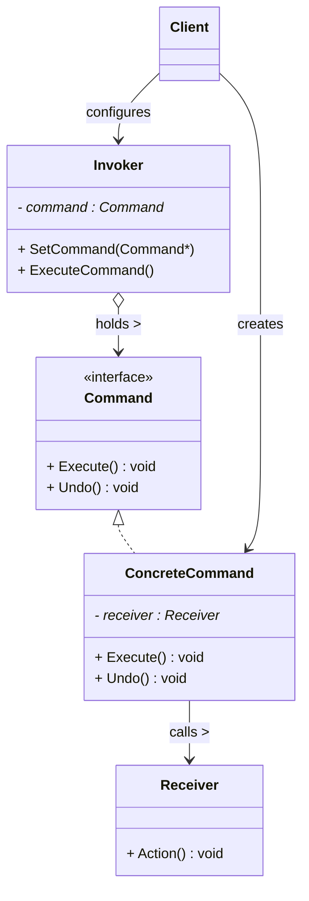
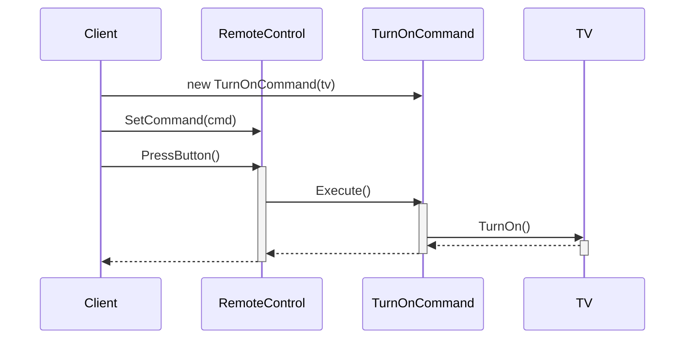

# 命令模式 (Command Pattern)

## 概述

**命令模式**（Command Pattern），属于 **行为型设计模式**。它将一个**请求封装成一个对象**，从而可以用不同的请求对客户进行参数化，支持请求的**排队、记录日志**，以及**撤销操作**。

> **定义**：将一个请求封装为一个对象，从而使你可用不同的请求对客户进行参数化；对请求排队或记录请求日志，以及支持可撤销的操作。

### 一个直觉感受

```cpp
// 遥控器上有 10 个按钮。按下一个按钮 → 电视机做一件事。
// 按钮不知道电视机怎么换台，电视机不知道按钮什么时候被按。

// 不用命令模式：
// 按钮和电视机直接耦合 —— 每个按钮都要写死"调电视的哪个方法"
// 加一个按钮就要改遥控器类

// 用命令模式：
// "按按钮" 变成一个对象（命令），遥控器只负责"触发命令"，
// 命令自己知道"该调电视的哪个方法"
```

### 核心思想

**把"操作"变成"对象"。** 就像你把"今天要买牛奶"写在一张便利贴上——你不再直接去商店，而是把这张便利贴（命令对象）交给任何人，谁都可以帮你执行。

```
客户端 ──创建──▶ 命令对象 ──执行──▶ 接收者
                   ▲
                   │
             调用者（Invoker）只管触发命令
```

---

## 核心设计思想

### 五个角色

| 角色 | 名称 | 职责 |
|---|---|---|
| **命令 (Command)** | `Command` | 抽象命令接口，声明 `Execute()`（和 `Undo()`） |
| **具体命令 (ConcreteCommand)** | `TurnOnCommand` | 实现命令，持有接收者的引用，Execute 时调用接收者的方法 |
| **接收者 (Receiver)** | `TV` | 真正执行操作的对象 |
| **调用者 (Invoker)** | `RemoteControl` | 持有命令对象，调用命令的 `Execute()`（不知道命令内部做了什么） |
| **客户端 (Client)** | `Client` | 创建具体命令并绑定接收者，设置到调用者 |

### 命令模式的三个"额外能力"

| 能力 | 说明 | 应用 |
|---|---|---|
| **排队** | 命令是对象，可以放进队列依次执行 | 任务队列、线程池 |
| **撤销** | 命令可以记录"反操作" | Ctrl+Z、事务回滚 |
| **宏命令** | 命令可以包含多个子命令 | 一键启动、批处理 |

---

## UML 类图



### 时序图



---

## C++ 实现

### 经典示例：电视遥控器

> 每个类的注释标明了它对应的模式角色：`Command` = 命令接口，`TurnOnCommand/TurnOffCommand/VolumeUpCommand` = 具体命令，`TV` = 接收者，`RemoteControl` = 调用者，`main` = 客户端。

```cpp
#include <iostream>
#include <memory>
#include <vector>

// ══════════════ 命令 (Command) ══════════════
// 模式角色：Command —— 抽象命令接口
class Command {
public:
    virtual ~Command() = default;
    virtual void Execute() = 0;
    virtual void Undo() = 0;
};

// ══════════════ 接收者 (Receiver) ══════════════
// 模式角色：Receiver —— 真正干活的对象，不知道自己被"命令"包装了
class TV {
    int volume_ = 10;

public:
    void TurnOn() {
        std::cout << "  [TV] 开机" << std::endl;
    }
    void TurnOff() {
        std::cout << "  [TV] 关机" << std::endl;
    }
    void VolumeUp() {
        std::cout << "  [TV] 音量 +1 → " << ++volume_ << std::endl;
    }
    void VolumeDown() {
        std::cout << "  [TV] 音量 -1 → " << --volume_ << std::endl;
    }
};

// ══════════════ 具体命令 (ConcreteCommand) ══════════════
// 模式角色：ConcreteCommand —— 开机命令：持有接收者，Execute 时调它
class TurnOnCommand : public Command {
    TV& tv_;

public:
    explicit TurnOnCommand(TV& tv) : tv_(tv) {}

    void Execute() override { tv_.TurnOn(); }

    void Undo() override {
        // 开机的反操作是关机
        tv_.TurnOff();
    }
};

// ══════════════ 具体命令 (ConcreteCommand) ══════════════
// 模式角色：ConcreteCommand —— 关机命令
class TurnOffCommand : public Command {
    TV& tv_;

public:
    explicit TurnOffCommand(TV& tv) : tv_(tv) {}

    void Execute() override { tv_.TurnOff(); }

    void Undo() override { tv_.TurnOn(); }
};

// ══════════════ 具体命令 (ConcreteCommand) ══════════════
// 模式角色：ConcreteCommand —— 音量+命令（带撤销）
class VolumeUpCommand : public Command {
    TV& tv_;

public:
    explicit VolumeUpCommand(TV& tv) : tv_(tv) {}

    void Execute() override { tv_.VolumeUp(); }

    void Undo() override { tv_.VolumeDown(); }  // 音量+的反操作是音量-
};

// ══════════════ 调用者 (Invoker) ══════════════
// 模式角色：Invoker —— 遥控器：只管触发命令，不知道命令内部是啥
class RemoteControl {
    std::vector<std::unique_ptr<Command>> history_;  // 命令历史（用于撤销）

public:
    // 按下按钮 → 执行命令 + 记录历史
    void PressButton(std::unique_ptr<Command> cmd) {
        cmd->Execute();
        history_.push_back(std::move(cmd));   // ★ 命令是对象，可以存起来！
    }

    // 撤销：从历史里取出最后一个命令，调它的 Undo
    void PressUndo() {
        if (history_.empty()) {
            std::cout << "  [遥控器] 没有可撤销的操作" << std::endl;
            return;
        }
        auto& last = history_.back();
        last->Undo();
        history_.pop_back();   // 撤销后从历史移除
    }
};

// ══════════════ 客户端 (Client) ══════════════
// 模式角色：Client —— 创建命令、绑定接收者、设置给调用者
int main() {
    TV tv;                                   // 接收者
    RemoteControl remote;                    // 调用者

    // ★ 客户端把命令和接收者绑定好，塞给遥控器
    std::cout << "=== 按按钮 ===" << std::endl;
    remote.PressButton(std::make_unique<TurnOnCommand>(tv));
    remote.PressButton(std::make_unique<VolumeUpCommand>(tv));
    remote.PressButton(std::make_unique<VolumeUpCommand>(tv));

    std::cout << "\n=== 撤销（倒着恢复） ===" << std::endl;
    remote.PressUndo();   // 撤销音量+ → 音量-
    remote.PressUndo();   // 撤销音量+ → 音量-
    remote.PressUndo();   // 撤销开机 → 关机

    return 0;
}
```

### 输出

```
=== 按按钮 ===
  [TV] 开机
  [TV] 音量 +1 → 11
  [TV] 音量 +1 → 12

=== 撤销（倒着恢复） ===
  [TV] 音量 -1 → 11
  [TV] 音量 -1 → 10
  [TV] 关机
```

### 关键解读

```cpp
// 命令模式的精髓：按钮 → 命令 → 接收者 三层解耦
RemoteControl（不知道）──▶ Command（知道）──▶ TV（干活）

// 遥控器根本不知道按的是什么命令：
//   按下 → cmd->Execute() —— 是开是关还是调音量？遥控器不关心
//   撤销 → cmd->Undo()    —— 命令自己知道怎么反悔

// 因为命令是对象，所以可以：
//   ✓ 存进历史栈（撤销）
//   ✓ 放进队列（排队执行）
//   ✓ 组合多个命令（宏命令）
```

---

## 扩展一：宏命令（组合命令）

```cpp
// ══════════════ 具体命令 (ConcreteCommand) ══════════════
// 模式角色：ConcreteCommand —— 宏命令：包含多个子命令
class MacroCommand : public Command {
    std::vector<std::unique_ptr<Command>> commands_;

public:
    void Add(std::unique_ptr<Command> cmd) {
        commands_.push_back(std::move(cmd));
    }

    void Execute() override {
        for (auto& cmd : commands_)
            cmd->Execute();        // 依次执行所有子命令
    }

    void Undo() override {
        // 倒序撤销（后执行的先撤销）
        for (auto it = commands_.rbegin(); it != commands_.rend(); ++it)
            (*it)->Undo();
    }
};

// 客户端：一键"观影模式"
TV tv;
MacroCommand watchMovie;
watchMovie.Add(std::make_unique<TurnOnCommand>(tv));
watchMovie.Add(std::make_unique<VolumeUpCommand>(tv));
watchMovie.Add(std::make_unique<VolumeUpCommand>(tv));

remote.PressButton(std::move(watchMovie));   // 一键执行全部
remote.PressUndo();                          // 一键撤销全部
```

---

## 扩展二：命令队列（任务系统）

```cpp
// ══════════════ 调用者 (Invoker) ══════════════
// 模式角色：Invoker —— 命令队列：先来的先执行（FIFO）
class CommandQueue {
    std::deque<std::unique_ptr<Command>> queue_;

public:
    void Add(std::unique_ptr<Command> cmd) { queue_.push_back(std::move(cmd)); }

    // 依次执行所有排队的命令
    void RunAll() {
        while (!queue_.empty()) {
            auto cmd = std::move(queue_.front());
            queue_.pop_front();
            cmd->Execute();
        }
    }
};

// 应用：异步任务的"待办清单"
CommandQueue tasks;
tasks.Add(std::make_unique<TurnOnCommand>(tv));
tasks.Add(std::make_unique<VolumeUpCommand>(tv));
tasks.RunAll();   // 按顺序执行
```

> **现实案例**：游戏中的技能释放队列、数据库的事务提交、键盘输入缓冲——都是命令对象排队。

---

## 实际应用场景

### 1. 编辑器撤销/重做（命令 + 备忘录）

```
编辑器里每次操作都包成命令：
  TypeCommand  → 输入文字
  DeleteCommand → 删除文字
  BoldCommand  → 加粗

撤销栈：vector<Command> undoStack;
  Ctrl+Z → undoStack.back()->Undo(); undoStack.pop_back();

重做栈：vector<Command> redoStack;
  Ctrl+Y → redoStack.back()->Execute(); ...
```

> **现实案例**：VS Code、Photoshop、Word 的撤销/重做——命令模式 + 备忘录模式的组合（在 `base_memento.md` 中提到过）。

### 2. 菜单栏/工具栏

```cpp
// GUI 中每个菜单项就是一个命令对象
MenuItem("打开文件", OpenFileCommand());
MenuItem("保存", SaveCommand());
MenuItem("另存为", SaveAsCommand());

// 菜单、快捷键、工具栏按钮可以共享同一个命令对象！
// 菜单点"打开" 和 按 Ctrl+O 执行的是同一个命令
```

> **现实案例**：Qt 的 `QAction` —— 一个动作（命令）可以同时绑定到菜单、工具栏、快捷键。

### 3. 网络请求封装

```cpp
// 每个 API 调用封装成命令，方便重试、排队、记录日志
class ApiCommand : public Command {
    HttpRequest request_;
    ResponseCallback cb_;
public:
    void Execute() override {
        auto resp = http_client_.Send(request_);
        if (resp.IsRetryable()) { retries_++; queue_.Add(this->Clone()); }
        else cb_(resp);
    }
    void Undo() override { /* API 撤销 = 回滚操作 */ }
};
```

### 4. 智能家居场景

```cpp
// 早上 7 点"起床模式"宏命令：开灯 + 煮咖啡 + 播放音乐
MacroCommand morningRoutine;
morningRoutine.Add(make_unique<LightOnCommand>(light));
morningRoutine.Add(make_unique<CoffeeOnCommand>(coffee));
morningRoutine.Add(make_unique<MusicOnCommand>(music));

// 触发方式可以多种多样：定时器、语音、手机 App —— 都是同一个命令
```

---

## 命令模式 vs 策略模式

两者结构相似（都持有另一个对象），但意图不同：

| 维度 | 命令模式 | 策略模式 |
|---|---|---|
| **意图** | 把"请求/操作"封装成对象 | 把"算法"封装成对象 |
| **关注** | 做什么 + 支持撤销/排队 | 怎么做（算法可替换） |
| **接收者** | 有（命令调接收者的方法） | 无（策略自己就是算法） |
| **经典场景** | 撤销、宏命令、任务队列 | 排序、压缩、加密 |

```
命令模式：命令对象 → 调接收者的方法（命令是"中间人"）
策略模式：Context 持有策略，策略自己执行算法（策略是"执行者"）
```

---

## 文件拆分建议

以电视遥控器示例为例，真实工程的文件划分：

```
code/command/
├── command.hpp        ← Command 接口（纯虚 Execute/Undo，纯头文件）
├── command.cpp        ← 所有具体命令（TurnOn/TurnOff/VolumeUp/Macro）
├── receiver.hpp       ← TV 接收者（声明）
├── receiver.cpp       ← TV 实现
├── invoker.hpp        ← RemoteControl 调用者（声明）
├── invoker.cpp        ← RemoteControl 实现
├── main.cpp           ← Client 组装
└── main               ← 可执行文件
```

编译：`g++ -std=c++14 main.cpp command.cpp receiver.cpp invoker.cpp -o main`

> 拆分原则和桥接模式一致：**每个角色一个文件，头文件只放声明，实现放 `.cpp`**。具体命令类很多时，也可以按"一类命令一个文件"（`turn_on_command.cpp`、`volume_command.cpp`）。

---

## 优缺点

### 优点

| # | 说明 |
|---|---|
| ✅ | **彻底解耦调用者和执行者** — 遥控器不知道电视机存在 |
| ✅ | **请求变成对象** — 可以排队、记录、序列化、延迟执行 |
| ✅ | **支持撤销/重做** — 命令记录反操作即可 |
| ✅ | **支持宏命令** — 多个命令组合成一个大命令 |
| ✅ | **符合开闭原则** — 新增命令只需加一个类，不改已有代码 |

### 缺点

| # | 说明 |
|---|---|
| ❌ | **类数量膨胀** — 每个操作一个命令类，简单操作也逃不掉 |
| ❌ | **间接调用** — 客户端→命令→接收者，多一层跳转 |
| ❌ | **命令可能携带大量参数** — 复杂命令要封装很多上下文 |

---

## 适用场景

| 场景 | 说明 |
|---|---|
| **需要撤销/重做** | 编辑器、绘图工具 |
| **请求需要排队/记录** | 任务队列、日志系统、异步操作 |
| **需要宏命令/批处理** | 一键执行多个操作 |
| **需要把操作参数化** | 菜单项、按钮、快捷键共享同一操作 |
| **需要延迟执行** | 命令对象存起来，稍后或远程执行 |

---

## 总结

命令模式的核心思想：

> **把"动作"变成"对象"，从此动作可以存储、排队、撤销、组合。**

```
不用命令模式：
  按钮类直接调电视类的方法（硬编码，耦合）

用命令模式：
  Client：new TurnOnCommand(tv)     ← 绑定命令和接收者
  Invoker：Execute()                ← 只管触发
  Command：tv_.TurnOn()             ← 命令自己知道怎么做
  Undo：tv_.TurnOff()               ← 命令自己知道怎么反悔

记忆口诀：
  命令成对象，请求可存储
  队列宏撤销，全靠 Execute
```
