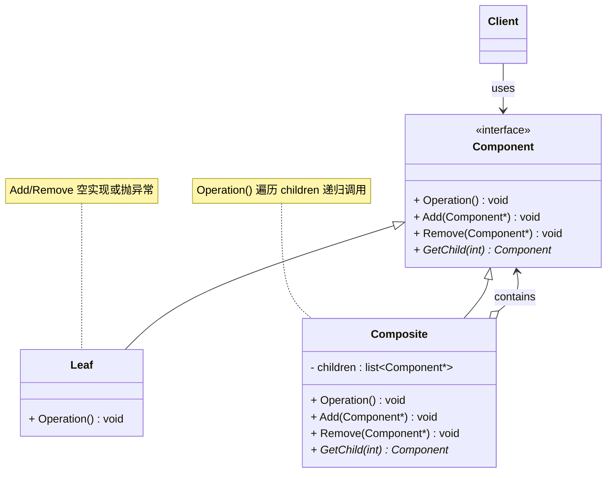
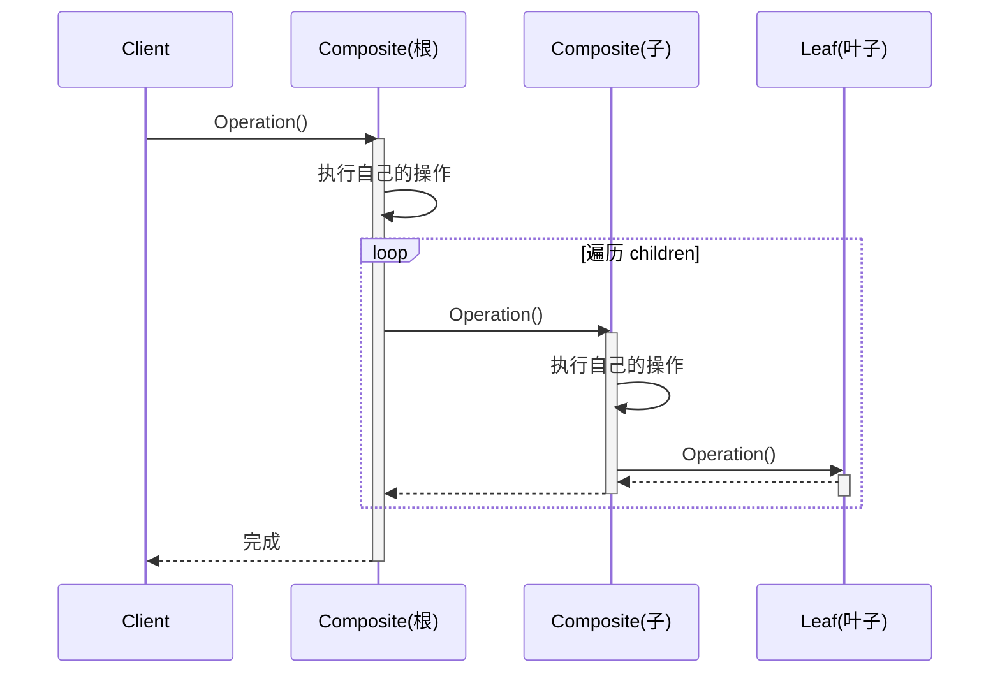

# 组合模式 (Composite Pattern)

## 概述

**组合模式**（Composite Pattern），又称 **部分-整体模式**（Part-Whole Pattern），属于 **结构型设计模式**。它将对象组合成**树形结构**来表示"部分-整体"的层次关系，使得客户端对**单个对象**和**组合对象**的使用具有一致性。

> **定义**：将对象组合成树形结构以表示"部分-整体"的层次结构。组合模式使得用户对单个对象和组合对象的使用具有一致性。

### 一个直觉感受

```cpp
// 文件系统：
//   目录（Composite）包含文件（Leaf）和其他目录（Composite）
//   删除一个文件 → 删除单个对象
//   删除一个目录 → 递归删除里面所有东西
//   但客户端不关心是文件还是目录 —— 都调 Delete()

// ❌ 不用组合模式：客户端要区分"文件"和"文件夹"
if (node.IsDirectory())
    DeleteDirectory(node);   // 递归
else
    DeleteFile(node);        // 单个

// ✅ 组合模式：文件和文件夹实现同一个接口，客户端不用区分
node->Delete();   // 文件删自己，目录递归删子树
```

### 核心思想

> **让"一个东西"和"一堆东西"用同一个接口。**

```
┌───────────────┐
│   Component   │  ← 抽象组件（接口统一）
│  + Operation  │
└──────┬────────┘
       │
   ┌───┴───┐
   │       │
┌──┴──┐ ┌──┴─────────┐
│Leaf │ │ Composite  │  ← 容器：能装子节点
│叶子 │ │ + children │
└─────┘ └────────────┘
```

客户端眼中没有"文件"和"文件夹"的区别，只有 `Component`。

---

## 核心设计思想

### 三个角色

| 角色 | 名称 | 职责 |
|---|---|---|
| **抽象组件 (Component)** | `Component` | 定义叶子节点和容器节点的公共接口（操作 + 可选的管理子节点方法） |
| **叶子 (Leaf)** | `Leaf` | 树结构中的末端节点，没有子节点 |
| **组合 (Composite)** | `Composite` | 树结构中的容器节点，包含子节点（可以是 Leaf 或 Composite） |

### 透明的组合模式 vs 安全的组合模式

**在"容器特有方法放哪"上，有两种取舍：**

```
透明方式（Component 里声明 Add/Remove）：
  Component 接口里有 Add/Remove，Leaf 也要实现（通常抛异常或空实现）
  ✅ 客户端可以完全统一处理，不用判断类型
  ❌ Leaf 被迫实现无意义的方法

安全方式（Add/Remove 只在 Composite 里）：
  Component 接口干净，只有通用操作
  ✅ 语义准确，Leaf 不需要假实现
  ❌ 客户端要判断类型（dynamic_cast）才能 Add
```

| | 透明方式 | 安全方式 |
|---|---|---|
| Add/Remove 在哪 | Component（叶子空实现） | Composite（叶子没有） |
| 客户端统一性 | ✅ 完全统一 | ❌ 需要判断 |
| 安全性 | 叶子调用 Add 会出错 | ✅ 编译期保证 |
| 推荐度 | 教学常用 | 工程常用 |

---

## UML 类图



### 时序图



---

## C++ 实现

### 经典实现：文件系统

> 每个类的注释标明了它对应的模式角色：`File` = Leaf，`Directory` = Composite，`FileSystemNode` = Component。

```cpp
#include <iostream>
#include <memory>
#include <string>
#include <vector>

// ══════════════ 抽象组件 (Component) ══════════════
// 模式角色：Component —— 定义叶子(File)和容器(Directory)的公共接口
class FileSystemNode {
public:
    virtual ~FileSystemNode() = default;

    // 通用操作：返回自己的大小（叶子返回自身值，容器递归求和）
    virtual long GetSize() const = 0;

    // 容器管理方法（透明方式）：只对 Composite 有意义，
    // Leaf 不实现 → 调用时抛异常
    virtual void Add(std::unique_ptr<FileSystemNode> child) {
        throw std::runtime_error("叶子节点不支持 Add");
    }

    virtual std::string GetName() const = 0;
};

// ══════════════ 叶子 (Leaf) ══════════════
// 模式角色：Leaf —— 树末端节点，没有子节点，不能 Add
class File : public FileSystemNode {
    std::string name_;
    long size_;

public:
    File(const std::string& name, long size) : name_(name), size_(size) {}

    // Leaf 的 GetSize()：直接返回自己的大小，不递归
    long GetSize() const override {
        std::cout << "    [文件] " << name_ << " = " << size_ << "B" << std::endl;
        return size_;
    }

    std::string GetName() const override { return name_; }
    // 注意：File 没有重写 Add() → 继承基类的抛异常版本
};

// ══════════════ 组合 (Composite) ══════════════
// 模式角色：Composite —— 容器节点，持有子节点列表，递归处理
class Directory : public FileSystemNode {
    std::string name_;
    std::vector<std::unique_ptr<FileSystemNode>> children_;  // ← 子节点：可以是 Leaf 或 Composite

public:
    explicit Directory(const std::string& name) : name_(name) {}

    // Composite 的 GetSize()：递归 = 遍历所有子节点，求和
    long GetSize() const override {
        long total = 0;
        std::cout << "  [目录] " << name_ << "/ {" << std::endl;
        for (const auto& child : children_)
            total += child->GetSize();   // ← 递归调用（子节点可能是 File 也可能是 Directory）
        std::cout << "  } = " << total << "B" << std::endl;
        return total;
    }

    // Composite 才有意义的 Add()：添加子节点
    void Add(std::unique_ptr<FileSystemNode> child) override {
        children_.push_back(std::move(child));
    }

    std::string GetName() const override { return name_; }
};

// ══════════════ 客户端 (Client) ══════════════
// 模式角色：Client —— 只面对 Component 接口，
// 不区分 Leaf(File) 和 Composite(Directory)，全部当 FileSystemNode 用
int main() {
    // 构建目录树（用 Component 指针统一持有）
    auto root = std::make_unique<Directory>("root");           // Composite

    root->Add(std::make_unique<File>("readme.txt", 100));      // Leaf

    auto src = std::make_unique<Directory>("src");             // Composite
    src->Add(std::make_unique<File>("main.cpp", 2000));        // Leaf
    src->Add(std::make_unique<File>("utils.h", 500));          // Leaf

    auto images = std::make_unique<Directory>("images");       // Composite
    images->Add(std::make_unique<File>("logo.png", 8000));     // Leaf
    images->Add(std::make_unique<File>("bg.jpg", 15000));      // Leaf

    src->Add(std::move(images));   // Composite 套 Composite（目录套目录）
    root->Add(std::move(src));

    // ★ 客户端只调用 Component 接口（GetSize），从不判断对象是 Leaf 还是 Composite！
    std::cout << "=== 计算 root 目录总大小 ===" << std::endl;
    long total = root->GetSize();  // 对 Composite 调用 → 递归展开
    std::cout << "\n总大小: " << total << "B" << std::endl;

    return 0;
}
```

### 输出

```
=== 计算 root 目录总大小 ===
  [目录] root/ {
    [文件] readme.txt = 100B
    [目录] src/ {
      [文件] main.cpp = 2000B
      [文件] utils.h = 500B
      [目录] images/ {
        [文件] logo.png = 8000B
        [文件] bg.jpg = 15000B
      } = 23000B
    } = 25500B
  } = 25600B

总大小: 25600B
```

### 关键解读

```
客户端调用：
  root->GetSize()

递归展开：
  Directory::GetSize() → 遍历 children_ → child->GetSize()
      ├── File::GetSize()       → 返回自己的大小
      └── Directory::GetSize()  → 再次遍历自己的 children_（递归）

客户端视角：
  root、src、images、readme.txt... 全是 FileSystemNode
  没有任何一个地方判断 "if (isDirectory)" —— 这就是组合模式的价值
```

---

## 实际应用场景

### 1. 图形绘制：图形 + 图形组

```cpp
class Graphic {
public:
    virtual ~Graphic() = default;
    virtual void Draw() const = 0;
};

// 叶子：基本图形
class Circle : public Graphic {
    void Draw() const override { std::cout << "  画圆形" << std::endl; }
};
class Square : public Graphic {
    void Draw() const override { std::cout << "  画方形" << std::endl; }
};

// 组合：图形组（一组图形一起移动/绘制/缩放）
class GraphicGroup : public Graphic {
    std::vector<std::unique_ptr<Graphic>> children_;
public:
    void Add(std::unique_ptr<Graphic> g) { children_.push_back(std::move(g)); }
    void Draw() const override {
        std::cout << "[组]" << std::endl;
        for (auto& c : children_) c->Draw();
    }
};

// 客户端：选中"一组图形"和选中"一个图形"操作完全一样
GraphicGroup group;
group.Add(std::make_unique<Circle>());
group.Add(std::make_unique<Square>());
group.Draw();  // 画整个组（递归画每个成员）
```

> **现实案例**：PowerPoint 中的"组合"、AI 矢量图层的编组、Photoshop 图层组——选中后拖拽/缩放/删除都当成一个整体。

### 2. UI 控件树

```cpp
class UIComponent {
public:
    virtual void Render() const = 0;
    virtual void Add(std::unique_ptr<UIComponent> c) {
        throw std::runtime_error("不是容器");
    }
};

// 叶子控件：按钮、文本框、标签
class Button : public UIComponent {
    void Render() const override { std::cout << "  渲染按钮" << std::endl; }
};
class Label : public UIComponent {
    void Render() const override { std::cout << "  渲染标签" << std::endl; }
};

// 容器控件：面板、窗口
class Panel : public UIComponent {
    std::vector<std::unique_ptr<UIComponent>> children_;
public:
    void Add(std::unique_ptr<UIComponent> c) override {
        children_.push_back(std::move(c));
    }
    void Render() const override {
        std::cout << "[面板]" << std::endl;
        for (auto& c : children_) c->Render();  // 递归渲染
    }
};

// 整棵 UI 树递归渲染：
Panel window;
window.Add(std::make_unique<Button>());
window.Add(std::make_unique<Label>());

Panel toolbar;
toolbar.Add(std::make_unique<Button>());
window.Add(std::move(toolbar));  // 面板嵌套面板

window.Render();
```

> **现实案例**：Qt 的 `QWidget` 树、Java Swing 的 `Container`——父容器和子控件都继承自同一个基类。

### 3. 公司组织架构

```cpp
class Employee {
public:
    virtual void Show(int indent) const = 0;
};

// 叶子：普通员工
class Worker : public Employee {
    std::string name_;
public:
    explicit Worker(const std::string& n) : name_(n) {}
    void Show(int indent) const override {
        std::cout << std::string(indent, ' ') << "员工: " << name_ << std::endl;
    }
};

// 组合：管理者（有下属）
class Manager : public Employee {
    std::string name_;
    std::vector<std::unique_ptr<Employee>> subordinates_;
public:
    explicit Manager(const std::string& n) : name_(n) {}
    void Add(std::unique_ptr<Employee> e) { subordinates_.push_back(std::move(e)); }

    void Show(int indent) const override {
        std::cout << std::string(indent, ' ') << "经理: " << name_ << std::endl;
        for (auto& s : subordinates_)
            s->Show(indent + 2);
    }
};

// 打印整个公司架构（递归）
Manager company("CEO");
Manager tech("技术总监");
tech.Add(std::make_unique<Worker>("程序员A"));
tech.Add(std::make_unique<Worker>("程序员B"));
Manager ops("运营总监");
ops.Add(std::make_unique<Worker>("运营C"));
company.Add(std::move(tech));
company.Add(std::move(ops));
company.Show(0);
```

### 4. XML / JSON 文档树

```cpp
// DOM 树的节点：元素节点（Composite）和文本节点（Leaf）
// 遍历 DOM 时，对元素节点递归进入子节点，对文本节点直接读取——
// 客户端通过 Node 接口统一处理，不区分元素还是文本
```

> **现实案例**：任何 DOM 解析器（libxml2、tinyxml2、RapidJSON）的内部结构都是组合模式——`Node` 是 Component，`Element` 是 Composite，`Text` 是 Leaf。

---

## 组合模式 vs 装饰模式

两者结构非常相似（都持有子节点/被包装对象），但意图不同：

| 维度 | 组合模式 | 装饰模式 |
|---|---|---|
| **核心意图** | 表示**部分-整体**的树形层次 | 给对象**动态叠加功能** |
| **结构** | 树（一个父多个子） | 链（一层套一层） |
| **方法名** | Add / Remove / GetChild | 通常透明包装（接口相同） |
| **递归** | 是（遍历子树） | 是（逐层委托） |
| **典型例子** | 文件系统、UI 树 | 咖啡加料、流包装 |

```
组合模式树：
        root
       /    \
     src    images
     /  \
 main.cpp utils.h

装饰模式链：
  Whip → Milk → Sugar → Espresso
  (一层只有一个"子对象")
```

---

## 优缺点

### 优点

| # | 说明 |
|---|---|
| ✅ | **客户端统一处理** — 单个对象和组合对象无需区分，代码简洁 |
| ✅ | **天然支持递归** — 树形结构天然适合递归操作（遍历、求和、渲染） |
| ✅ | **符合开闭原则** — 新增叶子或组合类型，不影响已有代码 |
| ✅ | **层次清晰** — 部分-整体关系通过树结构表达得很自然 |

### 缺点

| # | 说明 |
|---|---|
| ❌ | **设计过度抽象** — 透明方式下，Leaf 被迫实现无意义的 Add/Remove |
| ❌ | **类型安全问题** — 透明方式中客户端可能在 Leaf 上误调 Add，运行期才报错 |
| ❌ | **递归可能很深** — 树很深时递归调用栈有压力 |
| ❌ | **接口膨胀** — Component 同时承担"操作"和"容器管理"两类接口 |

---

## 适用场景

| 场景 | 说明 |
|---|---|
| **树形层次结构** | 文件系统、组织架构、DOM 树、菜单系统 |
| **部分-整体关系** | 图形编组、UI 容器嵌套、订单条目汇总 |
| **需要递归操作** | 汇总大小、整组绘制、递归删除 |
| **希望客户端不区分叶子/组合** | 统一接口处理，简化客户端逻辑 |

---

## 总结

组合模式的核心思想：

> **让"单个"和"整体"使用同一个接口——客户端永远只面对一个统一的 Component。**

```
不用组合模式：
  if (node.IsDirectory()) DeleteDir(node);   // 每处都要判断类型
  else                    DeleteFile(node);

用组合模式：
  node->Delete();   // 文件删自己，目录递归删子树
```

它和递归是天生的一对——树形结构的递归操作（求和、遍历、渲染）在组合模式下代码极其简洁。当你看到"目录套目录"、"面板套面板"、"组里套组"这类结构时，就是组合模式的用武之地。
