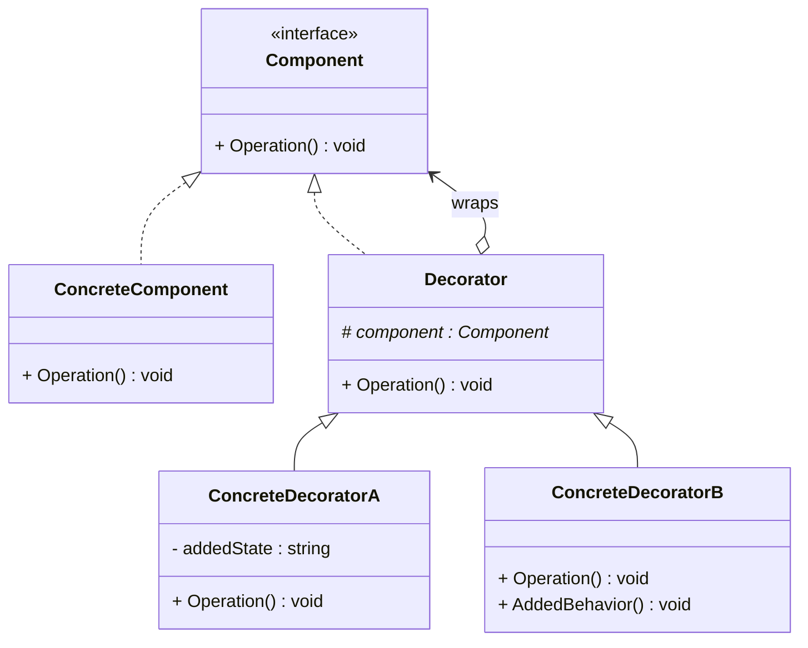
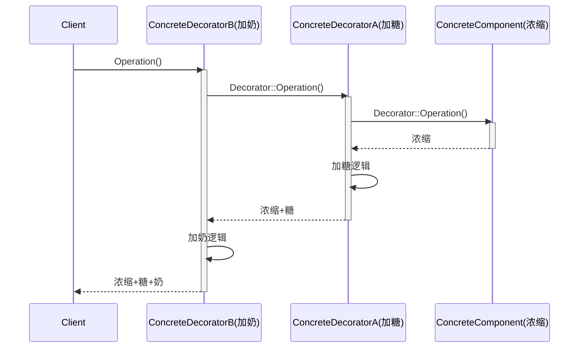

# 装饰模式 (Decorator Pattern)

## 概述

**装饰模式**（Decorator Pattern），又称 **包装器模式**（Wrapper Pattern），属于 **结构型设计模式**。它通过一种对客户端透明的方式，**动态地**给一个对象附加额外的职责。相比通过继承来扩展功能，装饰模式提供了一种更灵活的替代方案。

> **定义**：动态地给一个对象添加一些额外的职责。就增加功能而言，装饰模式比生成子类更为灵活。

### 一个直觉感受

```cpp
// 不用装饰模式：
// 要加 2 种糖 × 3 种牛奶 × 2 种温度 = 12 个类！
class Coffee { /* ... */ };
class CoffeeWithSugar { /* ... */ };
class CoffeeWithMilk { /* ... */ };
class CoffeeWithSugarAndMilk { /* ... */ };
class CoffeeWithSoyMilk { /* ... */ };
// ... 指数爆炸

// 用装饰模式：
// 1 个基础咖啡 + 独立装饰器，任意组合
auto drink = MakeCoffee("浓缩");
drink = AddMilk(drink);     // 加奶
drink = AddSugar(drink);    // 加糖
drink = AddWhip(drink);     // 加奶油
// 3 种装饰器 → 任意组合，不需要 12 个类
```

---

## 核心设计思想

### 四个角色

| 角色 | 名称 | 职责 |
|---|---|---|
| **抽象组件 (Component)** | `Component` | 定义对象的抽象接口，可以给这些对象动态添加职责 |
| **具体组件 (ConcreteComponent)** | `ConcreteComponent` | 定义了一个具体的对象，可以给这个对象添加一些职责（被装饰的原始对象） |
| **抽象装饰 (Decorator)** | `Decorator` | 持有一个 Component 对象的引用，并定义一个与 Component 接口一致的抽象类 |
| **具体装饰 (ConcreteDecorator)** | `ConcreteDecoratorA/B` | 负责给 Component 对象添加额外的职责 |

### 核心机制

```
                    Component（接口）
                   /                \
                  /                  \
    ConcreteComponent              Decorator（持有 Component 引用）
    （原始对象）                  /                \
                               /                  \
                   ConcreteDecoratorA       ConcreteDecoratorB
                   （加糖）                    （加奶）
```

**关键：Decorator 既是一个 Component（对外暴露相同接口），又持有 Component（内部包裹另一个对象）。**

这意味着：

```
最终对象：
  ┌─────────────────────────┐
  │  ConcreteDecoratorB     │ ← 最外层：加奶
  │   ┌─────────────────┐   │
  │   │ConcreteDecoratorA│   │ ← 中间层：加糖
  │   │   ┌───────────┐  │   │
  │   │   │Concrete   │  │   │ ← 最内层：浓缩咖啡
  │   │   │Component  │  │   │
  │   │   └───────────┘  │   │
  │   └─────────────────┘   │
  └─────────────────────────┘
```

调用过程从外到内逐层包装，执行过程从内到外逐层调用——类似俄罗斯套娃。

---

## UML 类图



### 时序图



---

## C++ 实现

### 经典实现：咖啡加料系统

```cpp
#include <iostream>
#include <memory>
#include <string>

// ============ 抽象组件 ============
class Beverage {
public:
    virtual ~Beverage() = default;
    virtual std::string GetDescription() const = 0;
    virtual double Cost() const = 0;
};

// ============ 具体组件：浓缩咖啡 ============
class Espresso : public Beverage {
public:
    std::string GetDescription() const override { return "浓缩咖啡"; }
    double Cost() const override { return 5.0; }
};

// ============ 具体组件：美式咖啡 ============
class Americano : public Beverage {
public:
    std::string GetDescription() const override { return "美式咖啡"; }
    double Cost() const override { return 4.0; }
};

// ============ 抽象装饰 ============
class CondimentDecorator : public Beverage {
protected:
    std::unique_ptr<Beverage> beverage_;  // 持有被装饰对象的引用

public:
    explicit CondimentDecorator(std::unique_ptr<Beverage> bev)
        : beverage_(std::move(bev)) {}
};

// ============ 具体装饰：加糖 ============
class Sugar : public CondimentDecorator {
public:
    using CondimentDecorator::CondimentDecorator;  // 继承构造函数

    std::string GetDescription() const override {
        return beverage_->GetDescription() + " + 糖";
    }

    double Cost() const override {
        return beverage_->Cost() + 0.5;  // 加糖 +0.5 元
    }
};

// ============ 具体装饰：加奶 ============
class Milk : public CondimentDecorator {
public:
    using CondimentDecorator::CondimentDecorator;

    std::string GetDescription() const override {
        return beverage_->GetDescription() + " + 奶";
    }

    double Cost() const override {
        return beverage_->Cost() + 1.5;  // 加奶 +1.5 元
    }
};

// ============ 具体装饰：加奶油 ============
class Whip : public CondimentDecorator {
public:
    using CondimentDecorator::CondimentDecorator;

    std::string GetDescription() const override {
        return beverage_->GetDescription() + " + 奶油";
    }

    double Cost() const override {
        return beverage_->Cost() + 1.0;
    }
};

// ============ 具体装饰：双倍糖 ============
class DoubleSugar : public CondimentDecorator {
public:
    using CondimentDecorator::CondimentDecorator;

    std::string GetDescription() const override {
        return beverage_->GetDescription() + " + 双倍糖";
    }

    double Cost() const override {
        return beverage_->Cost() + 1.0;  // 双倍糖 1.0 元
    }
};

// ============ 客户端 ============
int main() {
    // 一杯浓缩咖啡
    auto beverage1 = std::make_unique<Espresso>();
    std::cout << beverage1->GetDescription()
              << "  ￥" << beverage1->Cost() << std::endl;

    // 浓缩 + 奶
    auto beverage2 = std::make_unique<Milk>(std::make_unique<Espresso>());
    std::cout << beverage2->GetDescription()
              << "  ￥" << beverage2->Cost() << std::endl;

    // 浓缩 + 双倍糖 + 奶 + 奶油
    auto beverage3 = std::make_unique<Whip>(
        std::make_unique<Milk>(
            std::make_unique<DoubleSugar>(
                std::make_unique<Espresso>()
            )
        )
    );
    std::cout << beverage3->GetDescription()
              << "  ￥" << beverage3->Cost() << std::endl;

    // 美式 + 糖 + 奶
    auto beverage4 = std::make_unique<Milk>(
        std::make_unique<Sugar>(
            std::make_unique<Americano>()
        )
    );
    std::cout << beverage4->GetDescription()
              << "  ￥" << beverage4->Cost() << std::endl;

    return 0;
}
```

### 输出

```
浓缩咖啡  ￥5
浓缩咖啡 + 奶  ￥6.5
浓缩咖啡 + 双倍糖 + 奶 + 奶油  ￥8.5
美式咖啡 + 糖 + 奶  ￥6
```

### 逐层拆解执行过程

以 `beverage3`（浓缩 + 双倍糖 + 奶 + 奶油）为例，`Cost()` 的调用链：

```
Whip::Cost()
  └── Milk::Cost()
        └── DoubleSugar::Cost()
              └── Espresso::Cost()       → 5.0
              └── DoubleSugar::Cost()+   → +1.0 → 6.0
        └── Milk::Cost()+                → +1.5 → 7.5
  └── Whip::Cost()+                      → +1.0 → 8.5
```

每一层装饰都在内层计算结果上加上自己的部分，**从内到外**逐层累加。

---

## 装饰模式 vs 继承

| 维度 | 继承扩展 | 装饰模式 |
|---|---|---|
| **扩展方式** | 编译期静态决定 | 运行时动态组合 |
| **组合爆炸** | N 种特性 → 2ⁿ 个子类 | N 种装饰器线性增长 |
| **职责叠加** | 一次性全部拥有 | 按需逐层包裹 |
| **对象数量** | 每个组合一个类 | 一个原始对象 + N 个装饰器 |
| **对客户端透明** | ❌ 需要知道具体子类 | ✅ 接口始终不变 |
| **OCP 符合度** | 修改父类影响所有子类 | 新增装饰器不影响已有代码 |

### 组合爆炸对比

```
3 种咖啡 × 4 种调料（糖/奶/奶油/双倍糖）

继承方式：3 × 2^4 = 48 个类
装饰方式：3 个具体组件 + 4 个装饰器 = 7 个类
```

---

## 实际应用场景

### 1. 流处理——C++ iostream

C++ 标准库的 IO 流是装饰模式最经典的底层应用：

```cpp
// 基础组件：文件流
std::ifstream file("data.txt");           // 原始数据源

// 逐层装饰：
std::ifstream file("data.txt");
std::istream& decorated = file;           // 基础：按字节读

// 如果我要按行读？加缓冲
std::ifstream file("data.txt");
// 实际 iostream 内部通过 streambuf 链式装饰：
// file → filebuf（原始）→ 可被其他装饰器包裹
```

`std::streambuf` 的装饰链：

```
cout（用户）
  │
  └── ostream（格式层：operator<<）
        │
        └── streambuf（缓冲层）
              │
              └── filebuf（原始 IO）
```

```cpp
// 更直观的例子：用 boost::iostreams 的装饰器
#include <boost/iostreams/filtering_stream.hpp>
#include <boost/iostreams/filter/gzip.hpp>
#include <boost/iostreams/filter/bzip2.hpp>

namespace bio = boost::iostreams;

{
    bio::filtering_istream in;
    in.push(bio::gzip_decompressor());   // 装饰器1：解压
    in.push(bio::base64_decoder());       // 装饰器2：base64 解码
    in.push(std::ifstream("data.bin"));   // 原始组件：文件

    std::string line;
    std::getline(in, line);  // 透明读取
}
```

> **现实案例**：C++ 的 `std::cout << "hello"` 实际上经历了 `ostream → streambuf → filebuf` 的装饰链推送数据到 stdout。

### 2. Java I/O 体系

Java 的 I/O 类库是装饰模式的教科书级应用：

```java
// 从文件读取压缩加密数据
InputStream in = new BufferedInputStream(           // 装饰器3：缓冲
                     new GZIPInputStream(            // 装饰器2：解压
                         new FileInputStream(         // 原始组件：文件
                             "data.gz")));
```

| 组件/装饰器 | 角色 | 职责 |
|---|---|---|
| `InputStream` | 抽象组件 | 字节输入接口 |
| `FileInputStream` | 具体组件 | 从文件读字节 |
| `BufferedInputStream` | 具体装饰 | 增加缓冲功能 |
| `GZIPInputStream` | 具体装饰 | 增加解压功能 |
| `DataInputStream` | 具体装饰 | 增加基本类型读取能力 |

### 3. 中间件管道

```cpp
// 模拟 HTTP 请求处理管道
class HttpHandler {
public:
    virtual ~HttpHandler() = default;
    virtual void Handle(Request& req, Response& res) = 0;
};

class BasicHandler : public HttpHandler {
public:
    void Handle(Request& req, Response& res) override {
        res.SetBody("OK");
    }
};

// 装饰器：日志
class LoggingDecorator : public HttpHandler {
    std::unique_ptr<HttpHandler> next_;
public:
    void Handle(Request& req, Response& res) override {
        std::cout << "→ " << req.Method() << " " << req.Path() << std::endl;
        next_->Handle(req, res);
        std::cout << "← " << res.StatusCode() << std::endl;
    }
};

// 装饰器：鉴权
class AuthDecorator : public HttpHandler {
    // ...
    void Handle(Request& req, Response& res) override {
        if (!req.HasToken()) { res.SetStatus(401); return; }
        next_->Handle(req, res);
    }
};

// 装饰器：限流
class RateLimitDecorator : public HttpHandler { /* ... */ };

// 组装管道
auto handler = std::make_unique<LoggingDecorator>(
    std::make_unique<AuthDecorator>(
        std::make_unique<RateLimitDecorator>(
            std::make_unique<BasicHandler>()
        )
    )
);
```

> **现实案例**：Express.js / Koa 的中间件（middleware）机制、ASP.NET Core 的请求管道、Go 的 HTTP handler 装饰——都是装饰模式。

### 4. UI 控件装饰

```cpp
class UIComponent {
public:
    virtual void Draw() = 0;
    virtual ~UIComponent() = default;
};

class TextView : public UIComponent {
public:
    void Draw() override { /* 绘制文本 */ }
};

// 装饰器：加滚动条
class ScrollDecorator : public UIComponent {
    std::unique_ptr<UIComponent> component_;
public:
    void Draw() override {
        component_->Draw();
        DrawScrollBar();     // 额外功能
    }
};

// 装饰器：加边框
class BorderDecorator : public UIComponent {
    std::unique_ptr<UIComponent> component_;
public:
    void Draw() override {
        component_->Draw();
        DrawBorder();        // 额外功能
    }
};

// 使用：文本视图 + 滚动条 + 边框
auto widget = std::make_unique<BorderDecorator>(
    std::make_unique<ScrollDecorator>(
        std::make_unique<TextView>()
    )
);
widget->Draw();
```

> **现实案例**：Java Swing 的 `JScrollPane`、`JBorder` 等组件装饰。

### 5. 缓存装饰器

```cpp
// 数据库查询接口
class UserRepository {
public:
    virtual ~UserRepository() = default;
    virtual User FindById(int id) = 0;
};

// 原始实现：直接查数据库
class DBUserRepository : public UserRepository {
public:
    User FindById(int id) override {
        // SELECT * FROM users WHERE id = ?
        return db_.Query("users", id);
    }
};

// 装饰器：加缓存
class CachedUserRepository : public UserRepository {
    std::unique_ptr<UserRepository> next_;
    std::unordered_map<int, User> cache_;
public:
    explicit CachedUserRepository(std::unique_ptr<UserRepository> repo)
        : next_(std::move(repo)) {}

    User FindById(int id) override {
        auto it = cache_.find(id);
        if (it != cache_.end()) {
            std::cout << "[Cache] hit id=" << id << std::endl;
            return it->second;
        }
        User user = next_->FindById(id);   // 委托给内层
        cache_[id] = user;
        return user;
    }
};

// 使用
auto repo = std::make_unique<CachedUserRepository>(
    std::make_unique<DBUserRepository>(db)
);
User u = repo->FindById(42);  // 第一次查 DB，之后走缓存
```

---

## 优缺点

### 优点

| # | 说明 |
|---|---|
| ✅ | **比继承更灵活** — 运行时组合，不需要预判所有扩展可能性 |
| ✅ | **避免类爆炸** — N 个特性只需要 N 个装饰器类，而不是 2ⁿ 个子类 |
| ✅ | **符合开闭原则** — 新增装饰器无需修改已有代码 |
| ✅ | **可以叠加任意组合** — 多个装饰器按任意顺序包裹 |
| ✅ | **对客户端透明** — 装饰前后接口不变 |

### 缺点

| # | 说明 |
|---|---|
| ❌ | **容易产生小对象** — 多层嵌套导致大量小对象，对内存敏感系统不友好 |
| ❌ | **调试困难** — 调用链层层嵌套，堆栈跟踪较深，出错时难定位是哪一层 |
| ❌ | **增加系统复杂度** — 初学者难以理解"既是接口又持有接口"的双重身份 |
| ❌ | **嵌套顺序可能产生意料之外的结果** — 加糖再加热水 vs 加热水再加糖结果可能不同 |

---

## 适用场景

### 通用原则

- 需要**动态、透明地**给单个对象添加职责
- 需要**可撤销的**功能扩展（不用时可以拆掉装饰器）
- 希望通过**组合而非继承**来扩展功能，避免子类数量爆炸
- 一种功能的扩展有多种排列组合

### 不适合的场景

- 对象本身就很简单，加装饰器反而过度设计
- 系统的性能极度敏感（每个装饰器增加一次虚函数调用）
- 需要保证装饰器的嵌套顺序严格受控

---

## 相关模式对比

| 模式 | 关系 | 区别 |
|---|---|---|
| **适配器模式** | 兄弟姐妹 | 适配器**改变接口**，装饰器**保持接口** |
| **代理模式** | 容易混淆 | 代理**控制访问**，装饰器**增加功能** |
| **责任链模式** | 结构相似 | 责任链的每个节点可以**终止传递**；装饰器必须**继续传递** |
| **组合模式** | 结构相似 | 组合模式侧重**整体与部分**的层次；装饰模式侧重**功能叠加** |

---

## 总结

装饰模式通过"俄罗斯套娃"的方式实现了功能的灵活叠加。它的核心在于：

```
1. 相同的接口                → 对客户端透明
2. 持有接口引用               → 可以嵌套包裹
3. 委托给内层 + 自己做额外工作 → 功能叠加

每一层装饰：DoMyJob() + Delegate()
```

装饰模式告诉我们要**优先使用组合而非继承**来扩展功能——这正是面向对象设计原则中"组合优于继承"精神的最佳实践之一。
