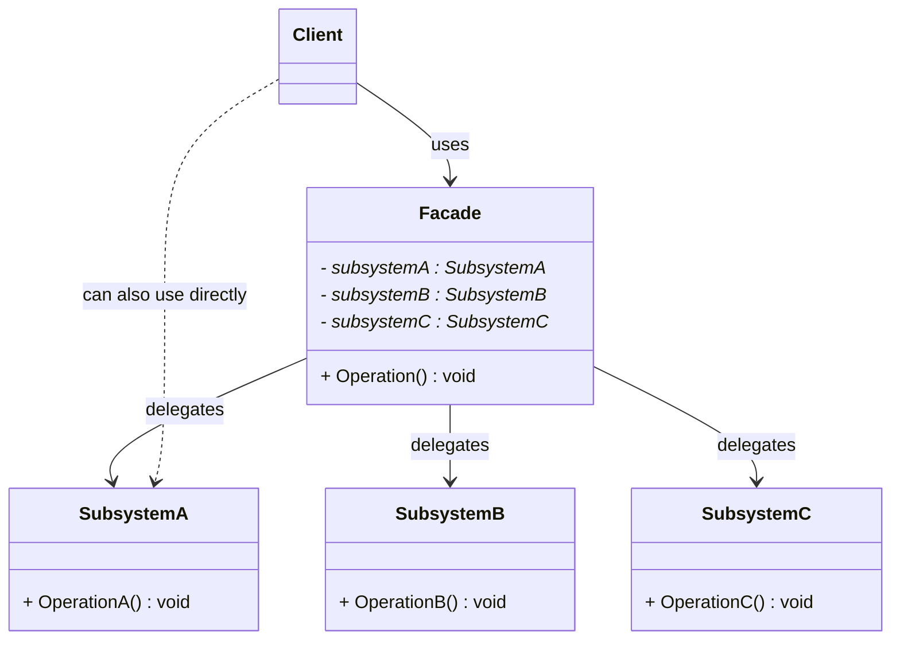
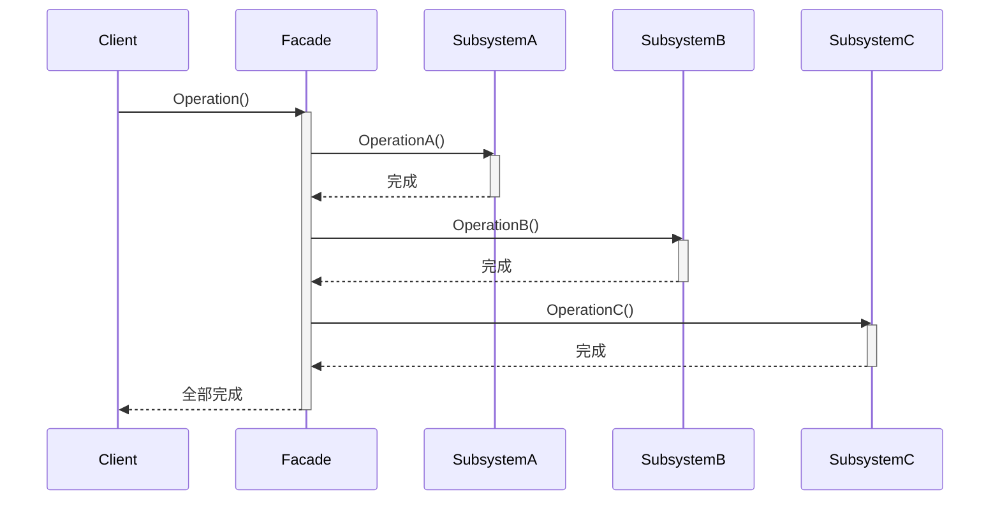

# 外观模式 (Facade Pattern)

## 概述

**外观模式**（Facade Pattern），又称 **门面模式**，属于 **结构型设计模式**。它为子系统中的一组接口提供一个**统一的高层接口**，使得子系统更容易使用。

> **定义**：为子系统中的一组接口提供一个一致的界面。外观模式定义了一个高层接口，这个接口使得这一子系统更加容易使用。

### 一个直觉感受

```cpp
// 不用外观模式：家庭影院启动要操作 6 个对象
DVDPlayer dvd;
Projector projector;
Amplifier amp;
Screen screen;
Lights lights;
Popcorn popper;

dvd.TurnOn();
dvd.SetInput(DVD);
projector.TurnOn();
projector.SetWideScreen();
amp.TurnOn();
amp.SetVolume(20);
amp.SetInput(DVD);
screen.Down();
lights.Dim(10);
popper.TurnOn();

// 用外观模式：一个对象，一个方法
HomeTheaterFacade theater(dvd, projector, amp, screen, lights, popper);
theater.WatchMovie();  // ← 一行搞定上面 10 行
```

### 核心思想

```
客户端 → 外观 → 子系统A、子系统B、子系统C...
                  ↑
            内部复杂互相调用
```

外观不是阻止客户端访问子系统（客户端仍然可以直接用子系统），而是提供一个**更方便的入口**。

---

## 核心设计思想

### 两个角色

| 角色 | 名称 | 职责 |
|---|---|---|
| **外观 (Facade)** | `Facade` | 知道哪些子系统类负责处理请求，将客户端请求代理给适当的子系统对象 |
| **子系统类 (Subsystem)** | `SubsystemA/B/C` | 实现具体的子系统功能，处理 Facade 指派的任务。它们不知道 Facade 的存在 |

### 三层依赖关系

```
┌───────────────────────────────────────────────────┐
│                    客户端                          │
│                                                    │
│   既可以走外观（推荐） →                            │
│   也可以直接调子系统（不阻止，只是不推荐）           │
└────────┬────────────────────────────┬──────────────┘
         │                            │
         ▼                            │
   ┌──────────┐                       │
   │  Facade  │                       │
   │(外观层)  │                       │
   └────┬─────┘                       │
        │ 内部协调多个子系统           │
        ▼                             ▼
 ┌──────────────┐              ┌──────────────┐
 │ SubsystemA   │◄─────────────│ SubsystemB   │
 │              │  子系统之间   │              │
 └──────────────┘  也互相依赖  └──────────────┘
```

### 需要注意的一点

> **外观模式不是"封装"——客户端可以绕过外观直接访问子系统。**
>
> 它不像代理模式那样控制访问，也不像适配器那样改变接口。外观只是提供了一条**捷径**。

---

## UML 类图



### 时序图



---

## C++ 实现

### 场景：家庭影院一键观影

```cpp
#include <iostream>
#include <memory>
#include <string>

// ============ 子系统类 ============
class DVDPlayer {
public:
    void TurnOn()   { std::cout << "  [DVD] 启动" << std::endl; }
    void TurnOff()  { std::cout << "  [DVD] 关闭" << std::endl; }
    void Play(const std::string& movie) {
        std::cout << "  [DVD] 播放 \"" << movie << "\"" << std::endl;
    }
};

class Projector {
public:
    void TurnOn()       { std::cout << "  [投影仪] 启动" << std::endl; }
    void TurnOff()      { std::cout << "  [投影仪] 关闭" << std::endl; }
    void SetWideScreen(){ std::cout << "  [投影仪] 切换宽屏模式" << std::endl; }
};

class Amplifier {
public:
    void TurnOn()   { std::cout << "  [功放] 启动" << std::endl; }
    void TurnOff()  { std::cout << "  [功放] 关闭" << std::endl; }
    void SetVolume(int level) {
        std::cout << "  [功放] 音量设置为 " << level << std::endl;
    }
};

class Screen {
public:
    void Down()  { std::cout << "  [屏幕] 放下" << std::endl; }
    void Up()    { std::cout << "  [屏幕] 收起" << std::endl; }
};

class Lights {
public:
    void Dim(int percent) {
        std::cout << "  [灯光] 调暗至 " << percent << "%" << std::endl;
    }
    void Restore() {
        std::cout << "  [灯光] 恢复亮度" << std::endl;
    }
};

class PopcornPopper {
public:
    void TurnOn()  { std::cout << "  [爆米花机] 开始爆米花" << std::endl; }
    void TurnOff() { std::cout << "  [爆米花机] 关闭" << std::endl; }
};

// ============ 外观类 ============
class HomeTheaterFacade {
private:
    DVDPlayer& dvd_;
    Projector& projector_;
    Amplifier& amp_;
    Screen& screen_;
    Lights& lights_;
    PopcornPopper& popper_;

public:
    HomeTheaterFacade(DVDPlayer& dvd, Projector& proj, Amplifier& amp,
                      Screen& scr, Lights& light, PopcornPopper& pop)
        : dvd_(dvd), projector_(proj), amp_(amp)
        , screen_(scr), lights_(light), popper_(pop) {}

    // ★★★ 一键观影：外观把 10 步串成 1 步 ★★★
    void WatchMovie(const std::string& movie) {
        std::cout << "===== 准备观影 =====" << std::endl;
        popper_.TurnOn();
        lights_.Dim(10);
        screen_.Down();
        projector_.TurnOn();
        projector_.SetWideScreen();
        amp_.TurnOn();
        amp_.SetVolume(20);
        dvd_.TurnOn();
        dvd_.Play(movie);
        std::cout << "===== 开始观影！=====" << std::endl << std::endl;
    }

    // ★★★ 一键结束：反向操作全部收尾 ★★★
    void EndMovie() {
        std::cout << "===== 观影结束 =====" << std::endl;
        popper_.TurnOff();
        lights_.Restore();
        screen_.Up();
        projector_.TurnOff();
        amp_.TurnOff();
        dvd_.TurnOff();
        std::cout << "===== 已全部关闭 =====" << std::endl;
    }
};

// ============ 客户端 ============
int main() {
    // 创建所有子系统（通常来自依赖注入或工厂）
    DVDPlayer dvd;
    Projector projector;
    Amplifier amp;
    Screen screen;
    Lights lights;
    PopcornPopper popper;

    // 用外观简化调用
    HomeTheaterFacade theater(dvd, projector, amp, screen, lights, popper);

    // 一键观影——客户端只需要知道这两行
    theater.WatchMovie("《肖申克的救赎》");
    theater.EndMovie();

    return 0;
}
```

### 输出

```
===== 准备观影 =====
  [爆米花机] 开始爆米花
  [灯光] 调暗至 10%
  [屏幕] 放下
  [投影仪] 启动
  [投影仪] 切换宽屏模式
  [功放] 启动
  [功放] 音量设置为 20
  [DVD] 启动
  [DVD] 播放 "《肖申克的救赎》"
===== 开始观影！=====

===== 观影结束 =====
  [爆米花机] 关闭
  [灯光] 恢复亮度
  [屏幕] 收起
  [投影仪] 关闭
  [功放] 关闭
  [DVD] 关闭
===== 已全部关闭 =====
```

### 关键点

外观类 `HomeTheaterFacade`：

- **不创造子系统**——子系统从外部注入（构造函数接收引用）
- **只负责编排**——把复杂调用序列组织为两个语义清晰的方法
- **不做功能实现**——每一行都在调用子系统的已有方法
- **门槛开放**——如果高级用户想自己控制功放音量，完全可以直接调用 `amp.SetVolume(50)`

---

## 实际应用场景

### 1. 编译器前端

```cpp
// 编译器调用：源码 → 词法分析 → 语法分析 → 语义分析 → 中间代码生成
class Compiler {
public:
    void Compile(const std::string& sourceFile) {
        auto source = io_.ReadFile(sourceFile);
        auto tokens = lexer_.Tokenize(source);
        auto ast    = parser_.Parse(tokens);
        sem_.Analyze(ast);
        auto ir   = generator_.Generate(ast);
        ir_.Optimize(ir);
        io_.WriteOutput(ir);
    }

private:
    FileIO io_;
    Lexer lexer_;
    Parser parser_;
    SemanticAnalyzer sem_;
    CodeGenerator generator_;
    Optimizer ir_;
};

// 客户端一行搞定：
Compiler gcc;
gcc.Compile("main.cpp");  // ← 外观
```

> **现实案例**：`gcc main.cpp` 一行命令背后经历了预处理器、编译器、汇编器、链接器——GCC 驱动只是个外观。

### 2. 网络请求库

```cpp
class HttpClient {
    DNSResolver dns_;
    SSLSession ssl_;
    ConnectionPool pool_;
    RetryPolicy retry_;
    HeaderBuilder headers_;

public:
    Response Get(const std::string& url) {
        auto ip   = dns_.Resolve(url);
        auto conn = pool_.Acquire(ip);
        ssl_.Handshake(conn);
        auto resp = conn->Send("GET " + url + " HTTP/1.1\r\n" + headers_.Build());
        if (resp.IsRetryable())
            return retry_.Retry([&]{ return Get(url); });
        return resp;
    }
};

// 客户端：
HttpClient client;
auto resp = client.Get("https://api.github.com/users/torvalds");
// DNS → 连接池 → SSL握手 → HTTP请求 → 重试策略，全在外观内处理
```

### 3. 数据库连接门面

```cpp
class DB {
    ConnectionPool pool_;
    QueryParser parser_;
    QueryOptimizer optimizer_;
    TransactionManager txn_;

public:
    ResultSet Execute(const std::string& sql) {
        auto conn = pool_.Acquire();
        auto ast  = parser_.Parse(sql);
        optimizer_.Optimize(ast);
        auto result = conn->Execute(ast);
        pool_.Release(conn);
        return result;
    }
};
```

> **现实案例**：Python 的 `sqlite3` 模块——`cursor.execute("SELECT ...")` 一行代码背后是连接管理、SQL 解析、优化、执行、结果封装。

### 4. 游戏引擎启动

```cpp
class GameEngine {
    GraphicsSystem graphics_;
    AudioSystem audio_;
    PhysicsSystem physics_;
    ScriptEngine script_;
    UISystem ui_;

public:
    void Initialize() {
        graphics_.Init(1920, 1080);
        audio_.Init();
        physics_.Init();
        script_.Load("main.lua");
        ui_.Setup();
    }
};

// 游戏开发者只需：
GameEngine engine;
engine.Initialize();
engine.Run();
```

> **现实案例**：Unity 的 `SceneManager.LoadScene()`——加载场景时自动处理资源加载、物理初始化、光照烘焙、脚本唤醒，开发者只需一行调用。

### 5. 订单处理系统

```cpp
class OrderFacade {
    InventoryService inventory_;
    PaymentService payment_;
    ShippingService shipping_;
    NotificationService notify_;

public:
    bool PlaceOrder(const Order& order) {
        if (!inventory_.Reserve(order.items)) {
            std::cout << "[失败] 库存不足" << std::endl;
            return false;
        }

        if (!payment_.Charge(order.total)) {
            inventory_.Release(order.items);   // 回滚库存
            std::cout << "[失败] 支付失败" << std::endl;
            return false;
        }

        auto trackingId = shipping_.CreateShipment(order);
        notify_.SendEmail(order.email, "您的订单已发货: " + trackingId);

        std::cout << "[成功] 订单处理完成" << std::endl;
        return true;
    }
};

// 客户端：
OrderFacade orderService(inventory, payment, shipping, notify);
orderService.PlaceOrder(userOrder);
// 库存 → 支付 → 发货 → 通知，外观内部处理事务和回滚
```

---

## 外观模式 vs 其他模式

| 模式 | 相似点 | 区别 |
|---|---|---|
| **适配器模式** | 都提供简化接口 | 适配器**改变接口**（方孔→圆孔）；外观**简化接口**（不改变，只是聚合） |
| **代理模式** | 都作为中间层 | 代理**控制访问**；外观只负责**简化调用** |
| **中介者模式** | 都协调多个对象 | 中介者让同事之间**不直接通信**；外观只是给客户端一个入口，子系统之间仍然可以互调 |
| **抽象工厂** | 都创建一组相关对象 | 抽象工厂负责**创建**；外观负责**协调使用**已创建的对象 |

---

## 最少知识原则（迪米特法则）

外观模式是践行**最少知识原则**（LoD）的经典方式：

```cpp
// ❌ 违反最少知识：客户端知道 6 个子系统
class Client {
    void WatchMovie() {
        dvd_.TurnOn();       // 知道 DVD
        projector_.TurnOn(); // 知道投影仪
        amp_.SetVolume(20);  // 知道功放
        screen_.Down();      // 知道屏幕
        lights_.Dim(10);     // 知道灯光
        popper_.TurnOn();    // 知道爆米花机
    }
    // 客户端耦合了 6 个类！
};

// ✅ 符合最少知识：客户端只知道 1 个外观
class Client {
    HomeTheaterFacade theater_;
    void WatchMovie() {
        theater_.WatchMovie("...");  // 只知道外观
    }
    // 客户端耦合了 1 个类
};
```

> 外观模式让客户端的朋友从 N 个变成 1 个。

---

## 优缺点

### 优点

| # | 说明 |
|---|---|
| ✅ | **简化调用** — 客户端从操作 N 个对象变成操作 1 个对象 |
| ✅ | **降低耦合** — 客户端和子系统解耦，子系统内部变化不影响客户端 |
| ✅ | **符合最少知识原则** — 客户端不需要了解子系统的内部结构 |
| ✅ | **层次化设计** — 外观可以作为系统的分层入口，每层提供自己的外观 |
| ✅ | **子系统仍然可用** — 高级用户可以直接使用子系统，外观不阻止 |

### 缺点

| # | 说明 |
|---|---|
| ❌ | **外观可能变成"上帝对象"** — 如果不加控制，外观会依赖太多子系统，变得臃肿 |
| ❌ | **增加了间接层** — 多一层调用，对于简单系统可能是过度设计 |
| ❌ | **遮蔽了子系统的灵活性** — 如果外观只暴露了部分功能，客户端可能无法使用子系统的高级特性 |

---

## 适用场景

| 场景 | 说明 |
|---|---|
| **为复杂系统提供简单入口** | 子系统很多、调用顺序复杂——外观把它变成几个语义明确的方法 |
| **解耦——子系统实现换了客户端不受影响** | 比如换一个支付服务商，外观不变，客户端代码不动 |
| **构建分层架构** | 每层定义一个外观，上层通过外观与下层通信，层与层之间通过 Facade 隔离 |
| **遗留代码改造** | 用外观包装旧系统的复杂 API，对外提供更友好的接口 |

---

## 总结

外观模式可能是设计模式中**最简单也最实用**的一个。它的核心思想可以用一句话总结：

> **把"我知道怎么做"留给外观，把"我要做什么"留给客户端。**

```
客户端想的是"我要看电影"，外观知道看电影需要 10 步操作。

外观不增加新功能，
外观不改变子系统接口，
外观只是把一堆复杂的调用，
包装成一个一眼看懂的方法。

这就是外观的全部价值。
```
