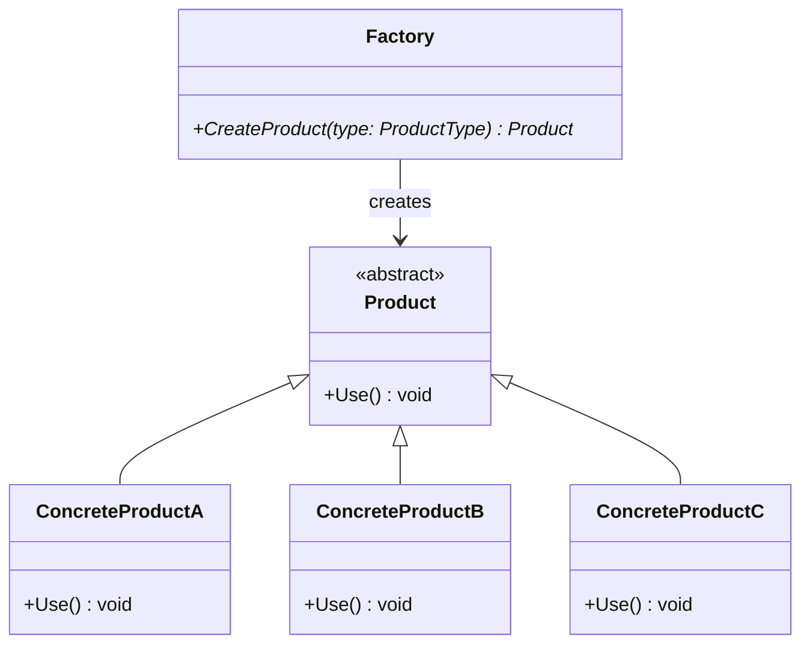
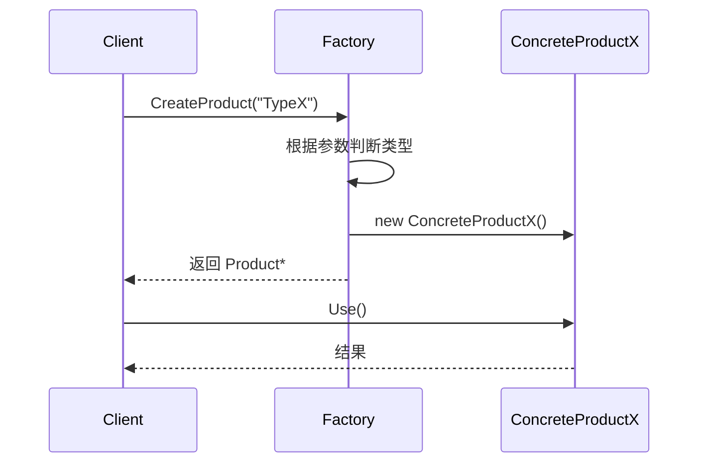

# 简单工厂模式 (Simple Factory Pattern)

## 概述

**简单工厂模式**（Simple Factory Pattern），又称 **静态工厂方法模式**（Static Factory Method Pattern），属于 **创建型设计模式**。它通过一个专门的工厂类来封装对象的创建逻辑，客户端只需向工厂传入参数，无需关心具体类的实例化细节。

> **定义**：定义一个工厂类，根据传入的参数动态决定创建哪一种产品类的实例。

---

## 核心设计思想

### 核心三要素

| 角色 | 名称 | 职责 |
|---|---|---|
| **工厂 (Factory)** | `Factory` | 核心类，包含静态创建方法，根据参数返回对应的产品实例 |
| **抽象产品 (Product)** | `Product` | 产品基类/接口，定义产品的公共行为 |
| **具体产品 (ConcreteProduct)** | `ConcreteProductA/B/C` | 实现抽象产品的具体类，工厂创建的实际对象 |

### 工作流程

```
客户端 ──传参──→ 工厂类 ──判断参数──→ 实例化具体产品 ──返回──→ 客户端
```

1. 客户端向工厂类发起请求，附带一个标识参数（字符串、枚举等）
2. 工厂类根据参数进行逻辑判断，决定实例化哪个具体产品
3. 工厂将创建好的实例返回给客户端
4. 客户端通过基类接口使用产品，无需知道具体类名

---

## UML 类图



### 时序图



---

## 如何阅读 UML 图

本文档使用了两类 UML 图：**类图** 和 **时序图**。下面拆解每个符号的含义。

### 类图符号速查

```
+---------------------------+
|         Product           |    ← 类名（斜体 = 抽象类）
|<<abstract>>               |    ← 构造型，标注其特殊角色
+---------------------------+
| +Use() void               |    ← + 表示 public 方法
+---------------------------+         下划线表示静态方法
             ▲
             | 继承（空心三角 + 实线）
             |
+---------------------------+
|    ConcreteProductA       |
+---------------------------+
| +Use() void               |
+---------------------------+

Factory ──→ Product : creates
    ↑                ↑
  依赖/创建关系      关系名（标签说明）
  （虚线箭头）
```

| 符号 | 含义 | 对应代码 |
|---|---|---|
| `类名` | 普通类 | `class Product { ... }` |
| `<<abstract>>` | 抽象类 / 接口 | 类中含有纯虚函数 `virtual void Use() = 0` |
| **斜体类名** | 同上，抽象类 | — |
| `+ Use() void` | **public** 方法 | `public: void Use();` |
| `- num : int` | **private** 属性 | `private: int num;` |
| `# num : int` | **protected** 属性 | `protected: int num;` |
| `: type` | 返回值类型 | `+get_res() double` |
| `<\|--` 实线空心三角 | **继承**（泛化） | `class ConcreteProductA : public Product` |
| `-->` 虚线箭头 | **依赖**（A 用到 B） | `Factory::CreateProduct()` 内部 `new` 了具体产品 |
| `-->` 标签 `: creates` | 依赖关系的语义说明 | 工厂"创建"产品 |

#### 图中对照

```
Product <|-- ConcreteProductA   →  ConcreteProductA 继承自 Product
Product <|-- ConcreteProductB   →  ConcreteProductB 继承自 Product
Product <|-- ConcreteProductC   →  ConcreteProductC 继承自 Product

Factory --> Product : creates   →  Factory 依赖 Product，负责创建它的子类实例
```

### 时序图符号速查

```
Client         Factory         ConcreteProductX
  │               │                  │
  │──Create──▶    │                  │    实线箭头 → 同步调用
  │               │──new──▶          │
  │               │◄──────           │    虚线箭头 → 返回值
  │◄───────       │                  │
  │──Use────▶     │                  │
  │◄───────       │                  │
```

| 符号 | 含义 | 对应代码 |
|---|---|---|
| **矩形竖线** | 参与者的**生命线**（lifeline） | 程序执行过程中的某个角色 |
| **窄竖条**（激活条） | 该对象正在执行（activation bar） | 函数调用到返回之间 |
| `─▶` 实线箭头 | **同步消息**（函数调用） | `client → factory: CreateProduct("A")` |
| `▶` 实线箭头 + 实线 | 同步调用 | `factory → product: new ConcreteProductA()` |
| `--▶` 虚线箭头 | **返回消息** | 函数 return |
| 自身箭头 `─▶(自身)` | **自调用** | `Factory` 内部的 `if/switch` 判断逻辑 |

#### 阅读时序图的三步法

1. **看顶栏** — 有哪些参与者（Client、Factory、ConcreteProduct）
2. **看箭头方向** — 谁调用谁，按从上到下的时间顺序读
3. **看虚实线** — 实线是主动调用，虚线是返回结果

---

## C++ 实现

### 完整代码示例

```cpp
#include <iostream>
#include <memory>
#include <string>

// ============ 抽象产品 ============
class Product {
public:
    virtual ~Product() = default;
    virtual void Use() const = 0;
};

// ============ 具体产品 ============
class ConcreteProductA : public Product {
public:
    void Use() const override {
        std::cout << "[ConcreteProductA] 使用产品 A" << std::endl;
    }
};

class ConcreteProductB : public Product {
public:
    void Use() const override {
        std::cout << "[ConcreteProductB] 使用产品 B" << std::endl;
    }
};

class ConcreteProductC : public Product {
public:
    void Use() const override {
        std::cout << "[ConcreteProductC] 使用产品 C" << std::endl;
    }
};

// ============ 工厂类 ============
enum class ProductType { A, B, C };

class Factory {
public:
    static std::unique_ptr<Product> CreateProduct(ProductType type) {
        switch (type) {
            case ProductType::A:
                return std::make_unique<ConcreteProductA>();
            case ProductType::B:
                return std::make_unique<ConcreteProductB>();
            case ProductType::C:
                return std::make_unique<ConcreteProductC>();
            default:
                return nullptr;
        }
    }
};

// ============ 客户端 ============
int main() {
    auto productA = Factory::CreateProduct(ProductType::A);
    productA->Use();

    auto productB = Factory::CreateProduct(ProductType::B);
    productB->Use();

    auto productC = Factory::CreateProduct(ProductType::C);
    productC->Use();

    return 0;
}
```

### 输出

```
[ConcreteProductA] 使用产品 A
[ConcreteProductB] 使用产品 B
[ConcreteProductC] 使用产品 C
```

### 指针说明

现代 C++ 推荐使用 `std::unique_ptr` 管理工厂返回的对象，避免手动 `delete` 导致的内存泄漏。`std::make_unique` 需要 C++14 标准；C++11 可自行实现或改用 `std::shared_ptr`。

---

## 优缺点

### 优点

| # | 说明 |
|---|---|
| ✅ | **封装创建逻辑** — 客户端无需知道具体类名，降低耦合 |
| ✅ | **集中管理** — 所有对象的创建集中在一个工厂，方便统一维护和修改 |
| ✅ | **简化客户端** — 客户端代码只依赖抽象产品接口和工厂类，无需 `#include` 每个具体产品头文件 |

### 缺点

| # | 说明 |
|---|---|
| ❌ | **违反开闭原则** — 每增加一个具体产品，工厂的 `switch` / `if-else` 都需要修改 |
| ❌ | **职责过重** — 所有产品的创建逻辑集中在一个类，产品种类增多时工厂变得臃肿 |
| ❌ | **扩展性差** — 不适合产品种类频繁变化的场景 |

---

## 适用场景

### 通用原则

- 工厂类负责创建的对象 **比较少**且**相对稳定**，不会频繁增减
- 客户端只需要知道传入的参数（枚举/字符串），**不关心**对象的创建细节
- 所有具体产品都**继承自同一个基类**，对外暴露一致的接口
- 对象的创建逻辑有复用价值，不希望分散在多个客户端代码中

### 典型场景案例

#### 1. 数据库驱动创建

```cpp
class DBConnection {
public:
    virtual ~DBConnection() = default;
    virtual void Connect(const std::string& dsn) = 0;
    virtual void Query(const std::string& sql) = 0;
};

class MySQLConnection : public DBConnection { /* ... */ };
class PostgreSQLConnection : public DBConnection { /* ... */ };

class DBFactory {
public:
    static std::unique_ptr<DBConnection> Create(const std::string& type) {
        if (type == "mysql") return std::make_unique<MySQLConnection>();
        if (type == "postgres") return std::make_unique<PostgreSQLConnection>();
        throw std::invalid_argument("Unknown DB type");
    }
};

// 客户端只需切换 type 字符串即可更换数据库
auto db = DBFactory::Create("mysql");
db->Connect("host=127.0.0.1 dbname=test");
```

> **现实案例**：ODBC / JDBC 驱动管理器根据连接字符串中的协议部分（`jdbc:mysql://`、`jdbc:postgresql://`）选择对应的驱动实现——典型简单工厂。

#### 2. 日志输出器

```cpp
class Logger {
public:
    virtual ~Logger() = default;
    virtual void Log(const std::string& msg) = 0;
};

class FileLogger : public Logger { /* 写入文件 */ };
class ConsoleLogger : public Logger { /* 输出到终端 */ };
class RemoteLogger : public Logger { /* 发送到远程 */ };

class LoggerFactory {
public:
    static std::unique_ptr<Logger> CreateLogger(const std::string& type) {
        if (type == "file")    return std::make_unique<FileLogger>();
        if (type == "console") return std::make_unique<ConsoleLogger>();
        if (type == "remote")  return std::make_unique<RemoteLogger>();
        return std::make_unique<ConsoleLogger>();  // 默认
    }
};

// 通过配置文件一行 text 控制日志输出方式
auto logger = LoggerFactory::CreateLogger(config.log_type);
```

> **现实案例**：Python 的 `logging` 模块——`logging.getLogger()` 传入 logger 名称，内部工厂按名称创建或复用对应的 Handler 链。

#### 3. 跨平台 GUI 控件

```cpp
class Button {
public:
    virtual void Render() = 0;
};
class WinButton : public Button { /* Windows 风格绘制 */ };
class MacButton : public Button { /* macOS 风格绘制 */ };

class GUIFactory {
public:
    static std::unique_ptr<Button> CreateButton() {
#ifdef _WIN32
        return std::make_unique<WinButton>();
#elif defined(__APPLE__)
        return std::make_unique<MacButton>();
#endif
    }
};
```

> **现实案例**：Qt / FLTK 等跨平台 GUI 库——在构造函数内部根据 `Q_OS_WIN` / `Q_OS_MAC` 宏选择底层渲染后端，对客户端完全透明。

#### 4. 文档格式解析器

| 输入参数 | 返回产品 | 说明 |
|---|---|---|
| `"json"` | `JsonParser` | 解析 `.json` 文件 |
| `"xml"` | `XmlParser` | 解析 `.xml` 文件 |
| `"yaml"` | `YamlParser` | 解析 `.yaml` 文件 |
| `"csv"` | `CsvParser` | 解析 `.csv` 文件 |

```cpp
auto parser = ParserFactory::Create("json");
auto doc = parser->Parse(raw_data);
```

#### 5. 图像解码器

```cpp
class ImageDecoder {
public:
    virtual std::unique_ptr<Bitmap> Decode(const uint8_t* data, size_t len) = 0;
};
class JPEGDecoder : public ImageDecoder { /* libjpeg */ };
class PNGDecoder  : public ImageDecoder { /* libpng */ };
class WEBPDecoder : public ImageDecoder { /* libwebp */ };

class ImageDecoderFactory {
public:
    static std::unique_ptr<ImageDecoder> Create(const std::string& ext) {
        if (ext == "jpg" || ext == "jpeg") return std::make_unique<JPEGDecoder>();
        if (ext == "png") return std::make_unique<PNGDecoder>();
        if (ext == "webp") return std::make_unique<WEBPDecoder>();
        throw std::runtime_error("Unsupported format: " + ext);
    }
};
```

> **现实案例**：浏览器内核（Chromium/WebKit）的 `ImageDecoder` 根据图片头部的 magic number 选择对应的解码器——这正是一个简单工厂，只是判断依据是字节流前几位而非文件扩展名。

---

## 与其他工厂模式对比

| 特性 | 简单工厂 | 工厂方法 | 抽象工厂 |
|---|---|---|---|
| **创建方式** | 一个工厂类静态方法 | 每个产品对应一个工厂子类 | 一个工厂接口创建一族产品 |
| **扩展性** | 低（修改工厂类） | 高（新增工厂子类） | 高（新增工厂子类） |
| **产品类型** | 单一等级结构 | 单一等级结构 | 多个产品族 |
| **开闭原则** | ❌ 违反 | ✅ 符合 | ✅ 符合 |
| **复杂度** | 低 | 中 | 高 |

---

## 总结

简单工厂模式是工厂模式家族中最基础的形式，适合产品种类较少且稳定的场景。它将"对象创建"与"对象使用"分离，大大降低了客户端与具体产品的耦合度。但当产品种类频繁变化时，应当考虑使用更灵活的 **工厂方法模式** 或 **抽象工厂模式**。
