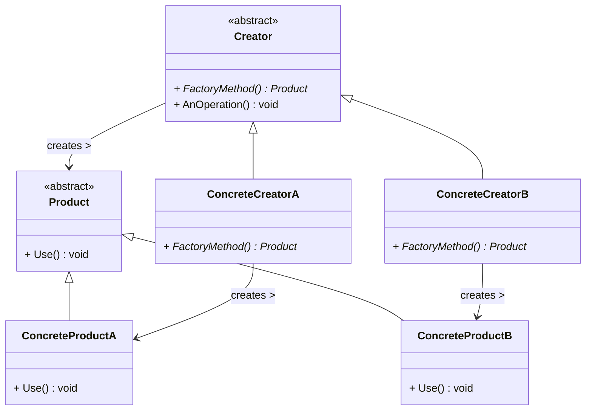
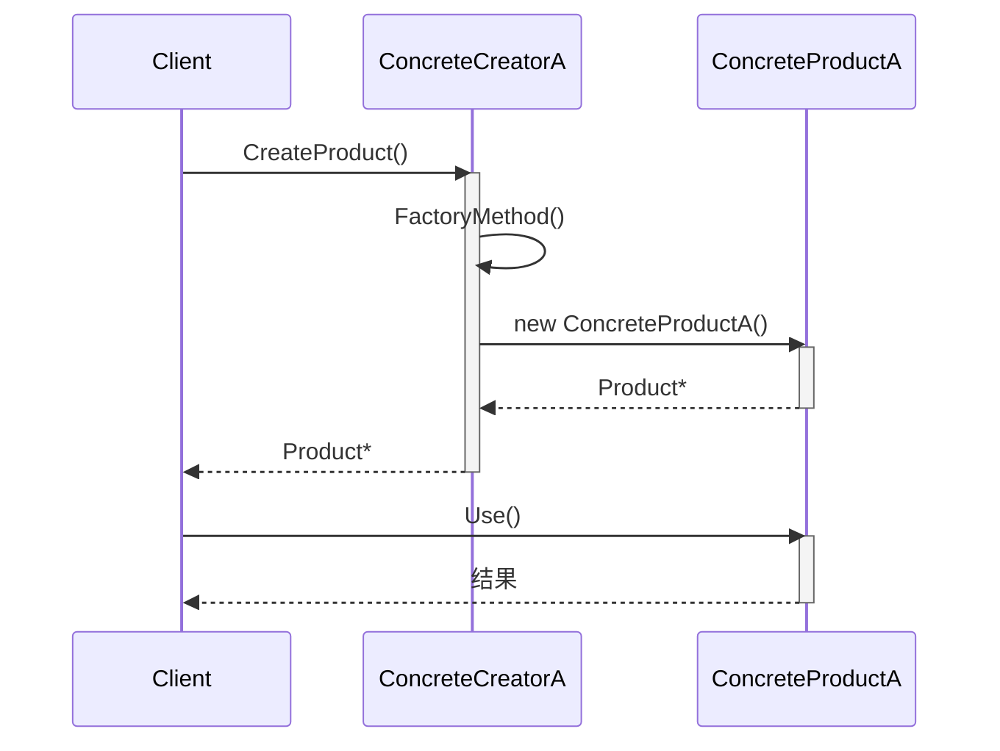

# 工厂方法模式 (Factory Method Pattern)

## 概述

**工厂方法模式**（Factory Method Pattern），又称 **虚拟构造器模式**（Virtual Constructor Pattern），属于 **创建型设计模式**。它定义了一个用于创建对象的接口，但**让子类决定实例化哪一个类**。工厂方法使得一个类的实例化延迟到了子类。

> **定义**：定义一个用于创建对象的接口，让子类决定实例化哪一个类。工厂方法使一个类的实例化延迟到其子类。

### 为什么要学工厂方法？

上一节 [简单工厂模式](base_factory.md) 有一个致命缺陷：

```
每新增一个产品 → 修改工厂类的 switch/if-else → 违反开闭原则
```

工厂方法模式就是为了解决这个问题：

```
每新增一个产品 → 新增一个工厂子类 → 原有代码完全不动 → 符合开闭原则
```

---

## 核心设计思想

### 四个角色

| 角色 | 名称 | 职责 |
|---|---|---|
| **抽象产品 (Product)** | `Product` | 定义所有产品共有的接口 |
| **具体产品 (ConcreteProduct)** | `ConcreteProductA/B` | 实现抽象产品接口的具体类 |
| **抽象工厂 (Creator)** | `Creator` | 声明工厂方法（返回 Product*），其核心业务逻辑依赖工厂方法创建对象 |
| **具体工厂 (ConcreteCreator)** | `ConcreteCreatorA/B` | 重写工厂方法，返回一个具体产品实例 |

### 与简单工厂的本质区别

```
简单工厂：一个工厂类 + switch 判断所有产品
          Factory ──→ ProductA / ProductB / ProductC
          (每次扩张都要改 Factory)

工厂方法：每个产品对应一个工厂
          CreatorA ──→ ProductA
          CreatorB ──→ ProductB
          CreatorC ──→ ProductC
          (新增产品 = 新增一对 Creator + Product，不碰已有代码)
```

### 一句话核心

> **"把创建对象的代码，从基类的 if/switch 中移走，放到子类自己的工厂方法里。"**

---

## UML 类图



### 时序图



---

## C++ 实现

### 经典实现：数据库连接器

```cpp
#include <iostream>
#include <memory>
#include <string>

// ============ 抽象产品 ============
class DBConnection {
public:
    virtual ~DBConnection() = default;
    virtual void Connect(const std::string& dsn) = 0;
    virtual void Query(const std::string& sql) = 0;
};

// ============ 具体产品 ============
class MySQLConnection : public DBConnection {
public:
    void Connect(const std::string& dsn) override {
        std::cout << "[MySQL] 已连接到 " << dsn << std::endl;
    }

    void Query(const std::string& sql) override {
        std::cout << "[MySQL] 执行: " << sql << std::endl;
        // MySQL 的具体执行逻辑
    }
};

class PostgreSQLConnection : public DBConnection {
public:
    void Connect(const std::string& dsn) override {
        std::cout << "[PostgreSQL] 已连接到 " << dsn << std::endl;
    }

    void Query(const std::string& sql) override {
        std::cout << "[PostgreSQL] 执行: " << sql << std::endl;
        // PostgreSQL 的具体执行逻辑（语法与 MySQL 略有不同）
    }
};

// ============ 抽象工厂 ============
class DBFactory {
public:
    virtual ~DBFactory() = default;

    // ★★★ 核心：工厂方法 —— 子类决定创建什么 ★★★
    virtual std::unique_ptr<DBConnection> CreateConnection() = 0;

    // 模板方法：使用工厂方法创建对象，然后执行后续操作
    void RunQuery(const std::string& dsn, const std::string& sql) {
        auto conn = CreateConnection();  // 让子类决定创建哪种连接
        conn->Connect(dsn);
        conn->Query(sql);
        // 这里还可以加更多公共逻辑：日志、统计、异常处理...
    }
};

// ============ 具体工厂 ============
class MySQLFactory : public DBFactory {
public:
    std::unique_ptr<DBConnection> CreateConnection() override {
        std::cout << "[MySQL工厂] 创建 MySQL 连接器" << std::endl;
        return std::make_unique<MySQLConnection>();
    }
};

class PostgreSQLFactory : public DBFactory {
public:
    std::unique_ptr<DBConnection> CreateConnection() override {
        std::cout << "[PostgreSQL工厂] 创建 PostgreSQL 连接器" << std::endl;
        return std::make_unique<PostgreSQLConnection>();
    }
};

// ============ 客户端 ============
int main() {
    // 用 MySQL
    MySQLFactory mysqlFactory;
    mysqlFactory.RunQuery("host=127.0.0.1 db=mydb", "SELECT * FROM users");

    std::cout << "\n";

    // 用 PostgreSQL —— RunQuery() 代码完全不变，只换工厂子类
    PostgreSQLFactory pgFactory;
    pgFactory.RunQuery("host=127.0.0.1 db=mydb", "SELECT * FROM users");

    return 0;
}
```

### 输出

```
[MySQL工厂] 创建 MySQL 连接器
[MySQL] 已连接到 host=127.0.0.1 db=mydb
[MySQL] 执行: SELECT * FROM users

[PostgreSQL工厂] 创建 PostgreSQL 连接器
[PostgreSQL] 已连接到 host=127.0.0.1 db=mydb
[PostgreSQL] 执行: SELECT * FROM users
```

### 关键解读：`RunQuery()` 为什么不用改？

```cpp
// 基类的 RunQuery() 只依赖抽象：
//   ① CreateConnection() → 抽象工厂方法（由子类实现）
//   ② DBConnection        → 抽象产品接口（由具体产品实现）
//
// 它完全不知道 MySQLFactory / MySQLConnection 的存在。

void DBFactory::RunQuery(const std::string& dsn, const std::string& sql) {
    auto conn = CreateConnection();  // 多态：实际调用哪个子类的 CreateConnection()？
    //    ↑
    //    如果 this 指向 MySQLFactory       → 返回 MySQLConnection
    //    如果 this 指向 PostgreSQLFactory  → 返回 PostgreSQLConnection
    //    RunQuery() 本身不动！
    conn->Connect(dsn);
    conn->Query(sql);
}
```

---

## 工厂方法模板 —— 拆开看结构

```cpp
// ===== 产品层次 =====
class Product {              // 抽象产品
public:
    virtual void Use() = 0;
};

class ProductA : public Product { /* ... */ };   // 具体产品 A
class ProductB : public Product { /* ... */ };   // 具体产品 B

// ===== 工厂层次 =====
class Creator {              // 抽象工厂
public:
    virtual unique_ptr<Product> FactoryMethod() = 0;  // ← 工厂方法
    void AnOperation() {
        auto product = FactoryMethod();  // 用工厂方法创建产品
        product->Use();                  // 用产品
    }
};

class CreatorA : public Creator {
    unique_ptr<Product> FactoryMethod() override {
        return make_unique<ProductA>();  // ← 子类决定创建 ProductA
    }
};

class CreatorB : public Creator {
    unique_ptr<Product> FactoryMethod() override {
        return make_unique<ProductB>();  // ← 子类决定创建 ProductB
    }
};
```

| 代码节点 | 谁定义 | 谁实现 | 特点 |
|---|---|---|---|
| `FactoryMethod()` | 抽象工厂 `Creator` | 具体工厂 `CreatorA/B` | 子类决定返回哪种 Product |
| `AnOperation()` | 抽象工厂 `Creator` | 抽象工厂 `Creator`（一次写完） | 不依赖具体产品 |
| `Product::Use()` | 抽象产品 `Product` | 具体产品 `ProductA/B` | 接口统一，实现不同 |

---

## 与简单工厂的全面对比

### 代码对比

```cpp
// ===== 简单工厂 =====
class SimpleFactory {
public:
    static unique_ptr<Product> Create(string type) {
        if (type == "A")      return make_unique<ProductA>();   // ← 每次加产品
        else if (type == "B") return make_unique<ProductB>();   //   都要改这里！
        else throw ...;
    }
};
// 调用：
auto p = SimpleFactory::Create("A");

// ===== 工厂方法 =====
class CreatorA : public Creator {
    unique_ptr<Product> FactoryMethod() override {
        return make_unique<ProductA>();   // ← 新类，不碰已有代码！
    }
};
class CreatorB : public Creator {
    unique_ptr<Product> FactoryMethod() override {
        return make_unique<ProductB>();
    }
};
// 调用：
CreatorA creator;
auto p = creator.FactoryMethod();
```

### 对比表

| 维度 | 简单工厂 | 工厂方法 |
|---|---|---|
| **创建方式** | 一个工厂类的静态方法，内部 if/switch | 每个产品一个工厂子类 |
| **新增产品** | 修改工厂类（改已有代码） | 新增一对 Product + Creator（加新代码） |
| **开闭原则** | ❌ 违反 | ✅ 符合 |
| **类数量** | 少（一个工厂 + 多个产品） | 多（每个产品增加一个工厂） |
| **客户端耦合** | 需要知道产品标识（"A"/"B"） | 客户端耦合到具体工厂类 |
| **产品种类** | 适合 < 5 个产品 | 适合频繁增减或产品种类多 |
| **复杂度** | 低 | 中 |

---

## 适用场景案例

### 1. 日志系统：不同输出方式

```cpp
// 抽象产品
class Logger {
public:
    virtual void Log(const std::string& msg) = 0;
};

class FileLogger : public Logger { /* 写入文件 */ };
class ConsoleLogger : public Logger { /* 输出终端 */ };
class RemoteLogger : public Logger { /* 发送到远程 */ };

// 抽象工厂
class LoggerFactory {
public:
    virtual unique_ptr<Logger> CreateLogger() = 0;

    void WriteLog(const std::string& msg) {
        auto logger = CreateLogger();
        logger->Log(msg);
    }
};

class FileLoggerFactory : public LoggerFactory {
    unique_ptr<Logger> CreateLogger() override {
        return make_unique<FileLogger>();
    }
};

class ConsoleLoggerFactory : public LoggerFactory {
    unique_ptr<Logger> CreateLogger() override {
        return make_unique<ConsoleLogger>();
    }
};

// 通过配置文件选择
unique_ptr<LoggerFactory> factory;
if (config.log_target == "file")
    factory = make_unique<FileLoggerFactory>();
else
    factory = make_unique<ConsoleLoggerFactory>();

factory->WriteLog("系统启动");
```

> 如果需要加一个"写入数据库"的日志方式，新增 `DBLogger : Logger` + `DBLoggerFactory : LoggerFactory`，不碰 `FileLoggerFactory` 和 `ConsoleLoggerFactory`。

### 2. 文档编辑器：不同格式

```cpp
// 抽象产品
class Document {
public:
    virtual void Save(const string& path) = 0;
};

class TextDocument : public Document { /* 纯文本 */ };
class RichTextDocument : public Document { /* 富文本 */ };
class PDFDocument : public Document { /* PDF */ };

// 抽象工厂
class Application {
public:
    virtual unique_ptr<Document> NewDocument() = 0;

    void CreateAndSave(const string& path) {
        auto doc = NewDocument();
        doc->Save(path);
    }
};

// 每种编辑器各自实现工厂方法
class TextEditor : public Application {
    unique_ptr<Document> NewDocument() override {
        return make_unique<TextDocument>();
    }
};

class RichTextEditor : public Application {
    unique_ptr<Document> NewDocument() override {
        return make_unique<RichTextDocument>();
    }
};
```

### 3. 跨平台 UI 控件

```cpp
// 抽象产品
class Button {
public:
    virtual void Render() = 0;
};
class WinButton : public Button { /* Windows 绘制 */ };
class MacButton : public Button { /* macOS 绘制 */ };

// 抽象工厂
class Dialog {
public:
    virtual unique_ptr<Button> CreateButton() = 0;

    void Build() {
        auto ok = CreateButton();
        ok->Render();   // 同一个 Build()，Windows 和 macOS 画出来不一样
    }
};

class WinDialog : public Dialog {
    unique_ptr<Button> CreateButton() override {
        return make_unique<WinButton>();
    }
};

class MacDialog : public Dialog {
    unique_ptr<Button> CreateButton() override {
        return make_unique<MacButton>();
    }
};
```

> **现实案例**：Qt 的 `QWidget` 在不同平台下使用不同的底层实现（Windows API vs Cocoa），应用层代码不变——这正是工厂方法的思想。

### 4. 加密通信框架

```cpp
class Cipher {
public:
    virtual string Encrypt(const string& plain) = 0;
};
class AESCipher : public Cipher { /* AES 加密 */ };
class DESCipher : public Cipher { /* DES 加密 */ };
class RSA3DESCipher : public Cipher { /* 3DES 加密 */ };

class SecureProtocol {
public:
    virtual unique_ptr<Cipher> GetCipher() = 0;   // ← 工厂方法

    string Send(const string& msg) {
        auto cipher = GetCipher();                 // 子类决定用哪种加密
        return cipher->Encrypt(msg);
    }
};

class AESProtocol : public SecureProtocol {
    unique_ptr<Cipher> GetCipher() override { return make_unique<AESCipher>(); }
};
class DESProtocol : public SecureProtocol {
    unique_ptr<Cipher> GetCipher() override { return make_unique<DESCipher>(); }
};
```

---

## 深层理解：工厂方法的两种写法

### 写法一：纯创建（常用）

工厂方法**只负责创建**，基类不包含业务逻辑：

```cpp
class Creator {
public:
    virtual unique_ptr<Product> FactoryMethod() = 0;  // 就是 new 的封装
};

// 客户端代码：
auto obj = factory->FactoryMethod();
obj->Use();
```

### 写法二：模板方法 + 工厂方法（更强大）

工厂方法嵌在基类的模板方法中，让基类提供**完整的业务流程**：

```cpp
class Creator {
public:
    virtual unique_ptr<Product> FactoryMethod() = 0;

    void AnOperation() {             // ← 模板方法：完整的业务流程
        auto p = FactoryMethod();    // ↑ 子类只决定创建哪个产品
        p->Step1();
        p->Step2();
        p->Step3();
        LogResult(p);                // 公共的统计逻辑
    }
};
```

| 写法 | 客户端代码量 | 适用场景 |
|---|---|---|
| 写法一 | 多（客户端要自己写调用流程） | 产品创建逻辑独立，流程由客户端控制 |
| 写法二 | 少（基类已经写好流程） | 整个业务过程固定，只有"创建哪个具体对象"变化 |

前面数据库连接器的示例就是**写法二**——`RunQuery()` 就是一个模板方法。

---

## 优缺点

### 优点

| # | 说明 |
|---|---|
| ✅ | **符合开闭原则** — 新增产品不需要改已有工厂类，只需新增一对 Product + Creator |
| ✅ | **符合单一职责** — 每个具体工厂只负责创建一种产品，职责集中 |
| ✅ | **消除条件分支** — 工厂方法完全替代了简单工厂中判断产品类型的 if/else |
| ✅ | **代码复用** — 抽象工厂中的模板方法（如 `RunQuery()`）在所有子工厂中复用 |
| ✅ | **延迟实例化** — 创建对象的决策延迟到子类实现，客户端可以绑定到抽象工厂 |

### 缺点

| # | 说明 |
|---|---|
| ❌ | **类数量增加** — 每增加一种产品，要增加一对类（Product + Creator），类爆炸 |
| ❌ | **系统复杂度上升** — 相比简单工厂，多了一层工厂继承体系 |
| ❌ | **客户端需要指定具体工厂** — 客户端必须知道用 `MySQLFactory` 还是 `PostgreSQLFactory` |

---

## 相关模式

| 模式 | 关系 |
|---|---|
| **简单工厂** | 工厂方法的简化和退化——用一个类集中所有创建逻辑 |
| **抽象工厂** | 工厂方法的升级——一组相关的工厂方法构成一个产品族 |
| **模板方法** | 工厂方法经常配合模板方法一起使用（`RunQuery()` 就是模板方法） |
| **策略模式** | 都通过子类化改变行为；工厂方法改变"创建什么"，策略模式改变"怎么做" |

---

## 总结

工厂方法模式的核心思想可以浓缩为一句话：

> **基类定义"要创建"（工厂方法接口），子类决定"创建哪一个"（具体实现）。**

```
简单工厂：一个工厂，一个 switch，管所有产品        → 违反 OCP
工厂方法：一个工厂 = 一个产品，新增 = 新增一对      → 符合 OCP
抽象工厂：一个工厂 = 一族产品，用于创建多层级对象族  → 工厂方法的升级版
```

如果你发现简单工厂的 `switch` 一直在膨胀，就是该升级到工厂方法的时候了。
