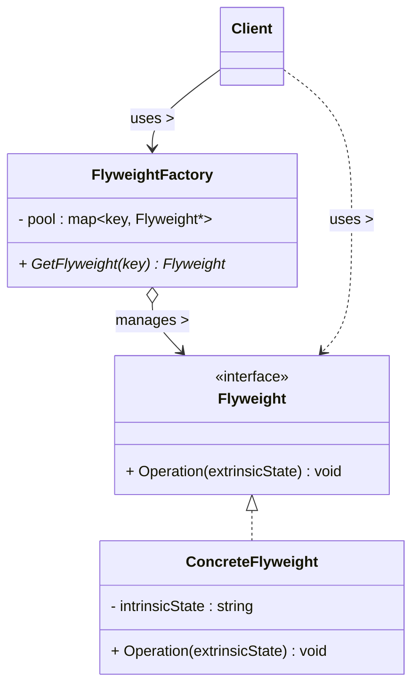
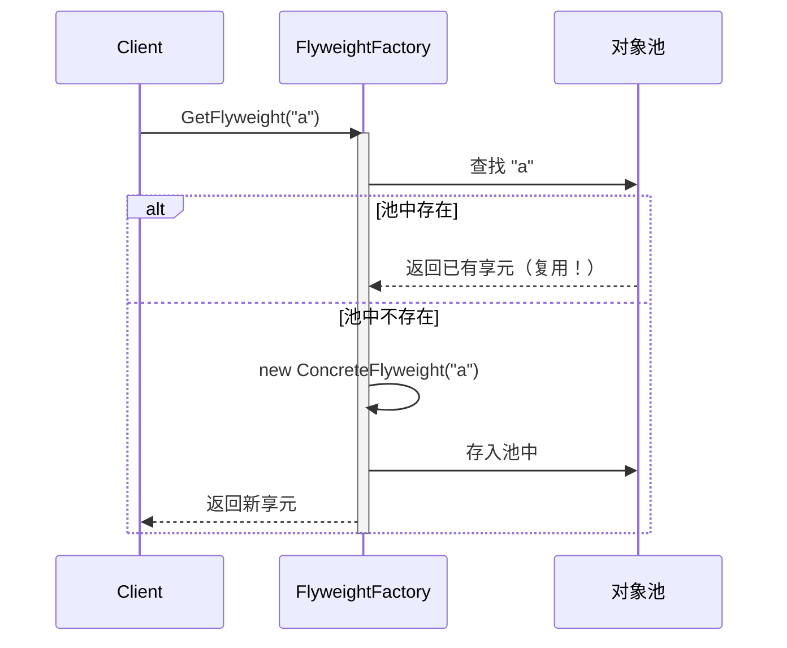

# 享元模式 (Flyweight Pattern)

## 概述

**享元模式**（Flyweight Pattern），属于 **结构型设计模式**。它运用**共享技术**有效地支持大量细粒度对象的**复用**，从而节省内存。

> **定义**：运用共享技术有效地支持大量细粒度对象的复用。

### 一个直觉感受

```cpp
// 一个文字编辑器渲染 "Hello" 5 个字符 —— 正常
// 但如果有 10 万字的文档，每个字符一个对象 → 10 万个对象！

// 关键洞察：10 万个字符里，'e' 和 'e' 除了位置不同，长的一模一样！
// 为什么不只创建 26 个字母对象，然后复用？

// 享元模式：
//   共享：每个字母只创建一次（26 个对象）
//   不共享：字母的位置、大小、颜色（每个字符不同）
//   10 万字符 → 只需要 26 个共享对象 + 位置信息
```

### 核心概念：内部状态 vs 外部状态

| 状态 | 含义 | 能否共享 |
|---|---|---|
| **内部状态 (Intrinsic)** | 对象固有的、不随环境变化的属性 | ✅ 存进享元对象，共享 |
| **外部状态 (Extrinsic)** | 随使用场景变化的属性 | ❌ 由客户端持有，用时传入 |

```
享元对象内部只存"内部状态"：
  CharFlyweight{ char ch_; }          ← 共享，26 个就够

客户端持有"外部状态"：
  RenderContext{ int x_, y_, size_; } ← 每个字符不同，不共享

渲染时：flyweight->Render(ch, x, y, size)  ← 内部+外部合体
```

---

## 核心设计思想

### 四个角色

| 角色 | 名称 | 职责 |
|---|---|---|
| **抽象享元 (Flyweight)** | `Flyweight` | 定义接口：接收外部状态并执行操作 |
| **具体享元 (ConcreteFlyweight)** | `ConcreteFlyweight` | 实现享元接口，**存储内部状态**（可共享） |
| **非共享具体享元 (UnsharedConcreteFlyweight)** | `UnsharedFlyweight` | 不共享的享元（某些对象确实不能共享） |
| **享元工厂 (FlyweightFactory)** | `FlyweightFactory` | 管理享元对象池：**有就复用，没有才创建** |

### 享元工厂的职责

```
客户端要字符 'a' ──▶ 工厂
                      ├─ 池里有 'a'？→ 直接返回已有的（复用）
                      └─ 池里没有？→ new 一个 'a' 存进池里（创建）
```

### 内存对比

```
不共享：N 个字符 = N 个完整对象（每个都带字体/大小/位置...）
享元：  26 个共享对象 + N 份轻量外部状态

文档 100 万字：
  不共享：100 万 × (字符+样式+位置) ≈ 100MB
  享元：  26 × (字符) + 100 万 × (位置索引) ≈ 十几 MB
```

---

## UML 类图



### 时序图



---

## C++ 实现

### 经典示例：字符渲染器

> 每个类的注释标明了它对应的模式角色：`Character` = 抽象享元，`CharFlyweight` = 具体享元，`CharFactory` = 享元工厂，`main` = 客户端。

```cpp
#include <iostream>
#include <memory>
#include <string>
#include <unordered_map>

// ══════════════ 抽象享元 (Flyweight) ══════════════
// 模式角色：Flyweight —— 定义接口：接收外部状态并执行操作
class Character {
public:
    virtual ~Character() = default;

    // 外部状态（x, y 位置 / size 字号）由客户端传入
    virtual void Render(int x, int y, int fontSize) const = 0;

    virtual char GetChar() const = 0;
};

// ══════════════ 具体享元 (ConcreteFlyweight) ══════════════
// 模式角色：ConcreteFlyweight —— 共享的字符对象
// 内部状态：ch_（字符本身，共享不变）
class CharFlyweight : public Character {
    char ch_;   // ← 内部状态：不随场景变化，可以共享

public:
    explicit CharFlyweight(char ch) : ch_(ch) {}

    // 渲染时把内部状态 + 外部状态合体
    void Render(int x, int y, int fontSize) const override {
        std::cout << "  渲染字符 '" << ch_ << "' @(" << x << "," << y
                  << ") 字号 " << fontSize
                  << " [对象地址: " << this << "]" << std::endl;
    }

    char GetChar() const override { return ch_; }
};

// ══════════════ 享元工厂 (FlyweightFactory) ══════════════
// 模式角色：FlyweightFactory —— 对象池：有就复用，没有才创建
class CharFactory {
    std::unordered_map<char, std::unique_ptr<Character>> pool_;

public:
    // ★ 核心：先查池，池里有直接复用
    Character* GetFlyweight(char ch) {
        auto it = pool_.find(ch);
        if (it != pool_.end()) {
            std::cout << "  [工厂] 复用已有字符 '" << ch << "'" << std::endl;
            return it->second.get();     // 复用
        }
        std::cout << "  [工厂] 新建字符 '" << ch << "'" << std::endl;
        auto fly = std::make_unique<CharFlyweight>(ch);
        Character* raw = fly.get();
        pool_[ch] = std::move(fly);      // 存入池中
        return raw;                      // 创建
    }

    size_t PoolSize() const { return pool_.size(); }
};

// ══════════════ 客户端 (Client) ══════════════
// 模式角色：Client —— 持有外部状态（位置、字号），向工厂要共享对象
int main() {
    CharFactory factory;
    std::string text = "hello hello hello";   // 15 个字符

    std::cout << "=== 渲染 15 个字符 ===" << std::endl;
    int x = 0;
    for (char ch : text) {
        if (ch == ' ') continue;              // 跳过空格

        Character* c = factory.GetFlyweight(ch);   // ★ 从池中拿（共享）
        c->Render(x, 0, 12);                 // 外部状态由客户端提供
        x += 10;
    }

    std::cout << "\n对象池大小: " << factory.PoolSize() << " 个"
              << "（'h','e','l','o' 共 4 个字符被反复复用！）"
              << std::endl;

    return 0;
}
```

### 输出

```
=== 渲染 15 个字符 ===
  [工厂] 新建字符 'h'
  渲染字符 'h' @(0,0) 字号 12 [对象地址: 0x...]
  [工厂] 新建字符 'e'
  渲染字符 'e' @(10,0) 字号 12 [对象地址: 0x...]
  [工厂] 新建字符 'l'
  渲染字符 'l' @(20,0) 字号 12 [对象地址: 0x...]
  [工厂] 新建字符 'l'
  渲染字符 'l' @(30,0) 字号 12 [对象地址: 0x...]   ← 又是 'l'，但这次是复用的
  [工厂] 新建字符 'o'
  渲染字符 'o' @(40,0) 字号 12 [对象地址: 0x...]
  [工厂] 复用已有字符 'h'   ← 复用！
  [工厂] 复用已有字符 'e'   ← 复用！
  [工厂] 复用已有字符 'l'   ← 复用！
  ...
对象池大小: 4 个（'h','e','l','o' 共 4 个字符被反复复用！）
```

### 关键解读

```cpp
// 15 个字符，只创建了 4 个对象！
// 'l' 第一次创建，之后全部复用同一个对象（地址相同）

// 为什么能共享？
//   字符本身（'h'）不会变 → 内部状态 → 存享元里共享
//   位置 (x,y) 和字号会变 → 外部状态 → 客户端每次传入

// 这就是享元模式的灵魂：
//   对象 = 内部状态（共享）+ 外部状态（传参）
```

---

## 实际应用场景

### 1. 游戏场景：森林里的树

```cpp
// ══════════════ 抽象享元 (Flyweight) ══════════════
// 模式角色：Flyweight —— 树
class Tree {
public:
    virtual ~Tree() = default;
    // 外部状态：x, y（每棵树位置不同）
    virtual void Draw(int x, int y) const = 0;
};

// ══════════════ 具体享元 (ConcreteFlyweight) ══════════════
// 模式角色：ConcreteFlyweight —— 共享的树类型
// 内部状态：颜色/纹理/模型（同种树都一样 → 共享）
class TreeType : public Tree {
    std::string color_;       // 内部状态
    std::string texture_;     // 内部状态（纹理 ID）

public:
    TreeType(std::string color, std::string texture)
        : color_(std::move(color)), texture_(std::move(texture)) {}

    void Draw(int x, int y) const override {
        std::cout << "  绘制" << color_ << "树 @" << x << "," << y
                  << " (纹理: " << texture_ << ")" << std::endl;
    }
};

// ══════════════ 享元工厂 (FlyweightFactory) ══════════════
// 模式角色：FlyweightFactory —— 树类型工厂
class TreeFactory {
    std::unordered_map<std::string, std::shared_ptr<TreeType>> types_;

public:
    // 按 "颜色_纹理" 分组：同种树只创建一次
    std::shared_ptr<TreeType> GetTreeType(const std::string& color,
                                           const std::string& texture) {
        std::string key = color + "_" + texture;
        auto it = types_.find(key);
        if (it != types_.end()) return it->second;
        auto type = std::make_shared<TreeType>(color, texture);
        types_[key] = type;
        return type;
    }
};

// 场景中的"树实例"——轻量，只存位置 + 共享类型
struct TreeInstance {
    int x, y;
    std::shared_ptr<TreeType> type;   // ← 指向共享的类型对象
};

// 游戏世界生成 10000 棵树：
TreeFactory factory;
std::vector<TreeInstance> forest;
for (int i = 0; i < 10000; i++) {
    forest.push_back({ i % 100, i / 100,
        factory.GetTreeType(i % 3 == 0 ? "绿色" : "深绿", "oak.png") });
}

std::cout << "10000 棵树, 但只有 "
          << factory.types_.size() << " 个共享类型对象" << std::endl;
```

> **现实案例**：游戏引擎渲染大量同类物体（树、子弹、粒子）——类型/纹理共享，实例只存位置。Unity 的 Prefab 实例化 + 材质共享就是享元思想。

### 2. 字符串驻留（String Interning）

```cpp
// C++ 编译器/运行时的字符串驻留：
// 相同的字符串字面量共享同一份内存
const char* a = "hello";
const char* b = "hello";
// a == b 往往为 true（共享同一块字面量内存）

// Python 的小整数驻留：
// a = 256; b = 256; a is b → True（小整数缓存复用）
```

> **现实案例**：Java 的字符串常量池、Python 的小整数缓存、C++ 编译器对字符串字面量的合并——都是享元模式。

### 3. 文档编辑器（字体样式）

```cpp
// 文字处理器：10000 个字符，几百种样式组合
// 享元化：每个"字符+样式"组合只建一个对象，文档只存字符索引

class GlyphStyle {           // 共享：字体/大小/粗斜体
    std::string font_;
    int size_;
    bool bold_, italic_;
};

class GlyphFactory {
    std::map<std::string, std::shared_ptr<GlyphStyle>> styles_;
public:
    std::shared_ptr<GlyphStyle> GetStyle(const std::string& font, int size,
                                          bool bold, bool italic) {
        std::string key = font + std::to_string(size) + (bold?"B":"") + (italic?"I":"");
        if (!styles_.count(key))
            styles_[key] = std::make_shared<GlyphStyle>(font, size, bold, italic);
        return styles_[key];    // 同款样式复用
    }
};
```

> **现实案例**：Word / PDF 渲染器——字符位图（glyph）按字体大小缓存复用，10 万字文档只缓存几百个字形。

### 4. 网络连接池 / 线程池

```cpp
// 连接池是享元思想：连接对象复用，避免频繁创建销毁
class ConnectionPool {
    std::vector<std::shared_ptr<Connection>> idle_;
public:
    std::shared_ptr<Connection> Acquire() {
        if (idle_.empty())
            return std::make_shared<Connection>();   // 池空才创建
        auto conn = idle_.back();
        idle_.pop_back();
        return conn;                                  // 否则复用
    }
    void Release(std::shared_ptr<Connection> conn) {
        idle_.push_back(conn);                        // 归还池中
    }
};
```

---

## 享元模式 vs 单例 vs 原型

| 模式 | 共享方式 | 区别 |
|---|---|---|
| **享元** | 同类对象**池化复用**，可以有很多个不同享元 | 按 key 区分（'a'/'b'/'c' 各一个） |
| **单例** | 全局**唯一**实例 | 只有一个，不区分 |
| **原型** | 每次**复制**新对象 | 不共享，Clone 出独立副本 |

```
享元工厂 = 单例池的集合：
  FlyweightFactory { 'a'享元, 'b'享元, 'c'享元 }  ← 每种一个，类似"多个单例"
  GetFlyweight(key) = 按 key 找单例
```

---

## 文件拆分建议

```
code/flyweight/
├── flyweight.hpp       ← Character 抽象享元接口（纯头文件）
├── factory.hpp         ← CharFactory 享元工厂声明
├── factory.cpp         ← CharFactory 实现（对象池逻辑）
├── main.cpp            ← Client：渲染文本（持有外部状态）
└── main                ← 可执行文件
```

编译：`g++ -std=c++14 main.cpp factory.cpp -o main`

---

## 优缺点

### 优点

| # | 说明 |
|---|---|
| ✅ | **大幅节省内存** — 大量重复对象共享，内存开销 O(唯一对象) 而非 O(实例数) |
| ✅ | **提高性能** — 减少对象创建/销毁次数，降低 GC/析构压力 |
| ✅ | **适合大量相似对象** — 文档字符、游戏物体、粒子系统 |

### 缺点

| # | 说明 |
|---|---|
| ❌ | **代码复杂度增加** — 必须区分内部/外部状态，调用方要维护外部状态 |
| ❌ | **引入额外间接层** — 需要通过工厂拿对象，多一层查找 |
| ❌ | **共享对象有并发风险** — 享元若有可变内部状态，多线程要同步 |
| ❌ | **外部状态管理成本** — 状态被拆到客户端，客户端代码变复杂 |

---

## 适用场景

| 场景 | 说明 |
|---|---|
| **大量相似对象** | 文本字符、游戏物体、粒子、树/石头 |
| **内存紧张** | 对象数量远大于可区分的类型数量 |
| **对象状态可分** | 内部状态（共享）和外部状态（独立）能清晰分离 |
| **对象创建成本高** | 加载纹理、字形、网络连接——复用省开销 |

---

## 总结

享元模式的核心思想：

> **把对象拆成"共享的芯"和"独立的壳"——芯（内部状态）池化复用，壳（外部状态）随用随传。**

```
记忆口诀：
  内部状态存享元，外部状态传参数
  工厂池里有就取，没有才创建

一句话判断：当你发现程序里创建了成千上万个"长得一样"的对象时，
            就是享元模式的用武之地。
```
