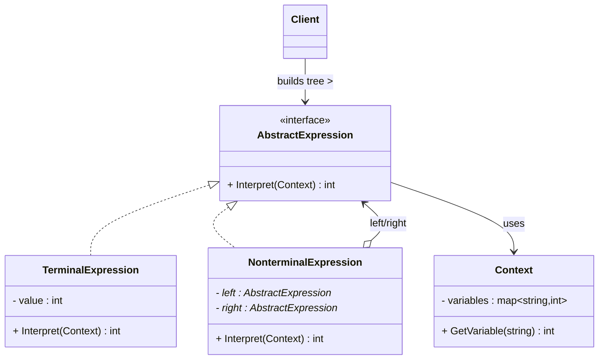

# 解释器模式 (Interpreter Pattern)

## 概述

**解释器模式**（Interpreter Pattern），属于 **行为型设计模式**。给定一门语言，定义它的文法的一种表示，并定义一个解释器，使用该表示来解释语言中的句子。

> **定义**：给定一个语言，定义它的文法的一种表示，并定义一个解释器，这个解释器使用该表示来解释语言中的句子。

### 一个直觉感受

```cpp
// 你写了一个表达式计算器，支持 "1 + 2"、"3 * (4 + 5)"
// 程序怎么"理解"这些字符串？

// 1. 先把字符串解析成表达式树（抽象语法树 AST）：
//        "+"
//       /   \
//      "1"  "2"

// 2. 然后从根开始递归求值：
//    Evaluate("+") = Evaluate("1") + Evaluate("2") = 1 + 2 = 3

// 解释器模式就是：用对象表示这个"树"，让每个节点知道自己怎么求值
```

### 核心思想

**把"一句话"变成"一棵树"，每个树节点是一个对象，对象自己知道怎么解释自己。**

```
"3 * (4 + 5)" 解析成树：

        *            ← 非终结符表达式（Nonterminal）
       / \
      3   +          ← 非终结符表达式
         / \
        4   5        ← 终结符表达式（Terminal，叶子）

求值 = 从根递归：
  *节点：左(3) × 右(+节点) = 3 × 9 = 27
  +节点：左(4) + 右(5) = 9
```

---

## 核心设计思想

### 四个角色

| 角色 | 名称 | 职责 |
|---|---|---|
| **抽象表达式 (AbstractExpression)** | `Expression` | 声明解释操作的抽象接口 `Interpret(Context)` |
| **终结符表达式 (TerminalExpression)** | `NumberExpression` | 文法中的终结符（叶子节点），自己就能求值 |
| **非终结符表达式 (NonterminalExpression)** | `AddExpression` / `MultiplyExpression` | 文法中的规则（内部节点），递归解释子表达式 |
| **上下文 (Context)** | `Context` | 解释过程中的环境信息（变量表、当前结果等） |

### 递归结构

```
非终结符（运算符）
  ├─ 左子表达式（可能是终结符或非终结符）
  └─ 右子表达式（同上）

解释过程 = 树的自顶向下递归：
  每个节点调自己的 Interpret() → 子节点返回结果 → 组合成自己的结果
```

### 什么时候用？

```
✅ 用解释器：
  - 语言很简单，规则固定（表达式计算、简单的脚本、格式校验）
  - 语法树不会频繁改变
  - 表达式数量多但类别少

❌ 别用：
  - 真正的编程语言（C++、Python）——语法太复杂
  - 需要高性能解析——解释器比专用解析器慢
  - 语法频繁变化——改文法 = 改一堆类

现实情况：真正的解析器（正则引擎、JSON 解析）通常用更高效的算法，
        解释器模式多用于"教学演示"或"小规模 DSL"。
```

---

## UML 类图



### 时序图（求值过程）

```mermaid
sequenceDiagram
    participant Client
    participant Root as Multiply节点
    participant Left as 数字3
    participant Right as Add节点
    participant N4 as 数字4
    participant N5 as 数字5

    Client->>Root: Interpret(context)

    activate Root
    Root->>Left: Interpret(context)
    Left-->>Root: 3
    deactivate Left

    Root->>Right: Interpret(context)
    activate Right
    Right->>N4: Interpret(context)
    N4-->>Right: 4
    Right->>N5: Interpret(context)
    N5-->>Right: 5
    Right-->>Root: 4 + 5 = 9
    deactivate Right

    Root-->>Client: 3 * 9 = 27
    deactivate Root
```

---

## C++ 实现

### 经典示例：算术表达式求值器

> 每个类的注释标明了它对应的模式角色：`Expression` = 抽象表达式，`NumberExpression` = 终结符表达式，`AddExpression/MultiplyExpression` = 非终结符表达式，`main` = 客户端。

```cpp
#include <iostream>
#include <memory>
#include <map>

// ══════════════ 上下文 (Context) ══════════════
// 模式角色：Context —— 解释环境（本示例：变量表）
class Context {
    std::map<std::string, int> variables_;

public:
    void SetVariable(const std::string& name, int value) {
        variables_[name] = value;
    }

    int GetVariable(const std::string& name) const {
        auto it = variables_.find(name);
        return it != variables_.end() ? it->second : 0;
    }
};

// ══════════════ 抽象表达式 (AbstractExpression) ══════════════
// 模式角色：AbstractExpression —— 定义 Interpret 接口
class Expression {
public:
    virtual ~Expression() = default;
    virtual int Interpret(const Context& context) const = 0;
};

// ══════════════ 终结符表达式 (TerminalExpression) ══════════════
// 模式角色：TerminalExpression —— 数字/变量（叶子节点，直接返回自己的值）
class NumberExpression : public Expression {
    int value_;

public:
    explicit NumberExpression(int value) : value_(value) {}

    // 终结符：不需要递归，直接返回
    int Interpret(const Context& context) const override {
        return value_;
    }
};

// 模式角色：TerminalExpression —— 变量（叶子节点，从上下文查值）
class VariableExpression : public Expression {
    std::string name_;

public:
    explicit VariableExpression(std::string name) : name_(std::move(name)) {}

    int Interpret(const Context& context) const override {
        return context.GetVariable(name_);   // 从上下文查变量值
    }
};

// ══════════════ 非终结符表达式 (NonterminalExpression) ══════════════
// 模式角色：NonterminalExpression —— 加法（内部节点：递归解释左右子树）
class AddExpression : public Expression {
    std::unique_ptr<Expression> left_;
    std::unique_ptr<Expression> right_;

public:
    AddExpression(std::unique_ptr<Expression> left,
                  std::unique_ptr<Expression> right)
        : left_(std::move(left)), right_(std::move(right)) {}

    // ★ 非终结符的核心：递归调用子表达式的 Interpret
    int Interpret(const Context& context) const override {
        return left_->Interpret(context) + right_->Interpret(context);
    }
};

// 模式角色：NonterminalExpression —— 乘法
class MultiplyExpression : public Expression {
    std::unique_ptr<Expression> left_;
    std::unique_ptr<Expression> right_;

public:
    MultiplyExpression(std::unique_ptr<Expression> left,
                       std::unique_ptr<Expression> right)
        : left_(std::move(left)), right_(std::move(right)) {}

    int Interpret(const Context& context) const override {
        return left_->Interpret(context) * right_->Interpret(context);
    }
};

// ══════════════ 客户端 (Client) ══════════════
// 模式角色：Client —— 构建表达式树（AST），然后解释
int main() {
    Context context;
    context.SetVariable("x", 3);   // 变量 x = 3

    // ===== 构建表达式树: x * (4 + 5) = 3 * 9 = 27 =====
    //
    //        *
    //       / \
    //      x   +
    //         / \
    //        4   5
    //
    auto tree = std::make_unique<MultiplyExpression>(
        std::make_unique<VariableExpression>("x"),           // 左: x
        std::make_unique<AddExpression>(                     // 右: 4+5
            std::make_unique<NumberExpression>(4),
            std::make_unique<NumberExpression>(5)));

    // 解释（求值）：从根开始递归
    int result = tree->Interpret(context);
    std::cout << "x * (4 + 5) = " << result << "  (x = 3)" << std::endl;

    // 换一个上下文，同样的树得到不同的结果
    Context context2;
    context2.SetVariable("x", 10);
    std::cout << "换 x = 10 再解释: " << tree->Interpret(context2) << std::endl;

    return 0;
}
```

### 输出

```
x * (4 + 5) = 27  (x = 3)
换 x = 10 再解释: 90
```

### 关键解读

```cpp
// 树结构 = 代码结构（组合模式的味道）：
//   MultiplyExpression
//     ├─ VariableExpression("x")      ← 终结符
//     └─ AddExpression
//           ├─ NumberExpression(4)    ← 终结符
//           └─ NumberExpression(5)    ← 终结符

// 解释过程 = 递归：
//   Multiply::Interpret()
//     = left(Variable x=3) * right(Add)
//     = 3 * (4 + 5)
//     = 27

// 同一个树 + 不同 Context = 不同结果 → 上下文和环境解耦
```

---

## 完整版：字符串表达式解析器

上面的示例假设树已经构建好。实际中字符串 `"x*(4+5)"` 需要先**解析**成树：

```cpp
#include <iostream>
#include <memory>
#include <sstream>
#include <cctype>

// 表达式接口（同上）
class Expression {
public:
    virtual ~Expression() = default;
    virtual int Interpret(const Context& context) const = 0;
};

// 数字 / 变量 / 加法 / 乘法 类（同上，略）

// ══════════════ 解析器：把字符串解析成表达式树 ══════════════
class Parser {
    std::istringstream input_;

public:
    explicit Parser(const std::string& expr) : input_(expr) {}

    // 解析入口：grammar: expr := term (('+'|'-') term)*
    std::unique_ptr<Expression> Parse() {
        return ParseExpr();
    }

private:
    char Peek() {
        char c;
        while (input_.peek() == ' ') input_.get();   // 跳过空格
        return input_.peek();
    }

    // expr := term (('+'|'-') term)*
    std::unique_ptr<Expression> ParseExpr() {
        auto left = ParseTerm();
        while (true) {
            char op = Peek();
            if (op == '+') { input_.get(); left = std::make_unique<AddExpression>(std::move(left), ParseTerm()); }
            else break;
        }
        return left;
    }

    // term := factor ('*' factor)*
    std::unique_ptr<Expression> ParseTerm() {
        auto left = ParseFactor();
        while (true) {
            char op = Peek();
            if (op == '*') { input_.get(); left = std::make_unique<MultiplyExpression>(std::move(left), ParseFactor()); }
            else break;
        }
        return left;
    }

    // factor := number | '(' expr ')'
    std::unique_ptr<Expression> ParseFactor() {
        char c = Peek();
        if (c == '(') {
            input_.get();
            auto expr = ParseExpr();
            input_.get();   // 吃掉 ')'
            return expr;
        }
        int num = 0;
        while (std::isdigit(input_.peek())) {
            num = num * 10 + (input_.get() - '0');
        }
        return std::make_unique<NumberExpression>(num);
    }
};

// 客户端：
int main() {
    Parser parser("3 * (4 + 5)");
    auto tree = parser.Parse();           // 字符串 → 树
    int result = tree->Interpret(Context());  // 树 → 求值
    std::cout << "3 * (4 + 5) = " << result << std::endl;   // 27
}
```

> **语法（Grammar）定义**：
> ```
> expr   := term (('+'|'-') term)*
> term   := factor (('*'|'/') factor)*
> factor := number | '(' expr ')'
> ```
> 每个语法规则对应一个解析函数（`ParseExpr` / `ParseTerm` / `ParseFactor`）——这就是"递归下降解析"，解释器模式的实战版。

---

## 实际应用场景

### 1. 配置表达式 / 布尔规则引擎

```cpp
// 权限表达式: "admin OR (vip AND age > 18)"
// 每个子条件 = 终结符，AND/OR = 非终结符

class AndExpression : public Expression {
    // left 和 right 都必须为 true
    bool Interpret(const Context& ctx) const override {
        return left_->Interpret(ctx) && right_->Interpret(ctx);
    }
};
class OrExpression : public Expression {
    bool Interpret(const Context& ctx) const override {
        return left_->Interpret(ctx) || right_->Interpret(ctx);
    }
};
```

### 2. SQL WHERE 子句解析

```cpp
// "WHERE age > 18 AND city = '北京'"
// 比较表达式（age > 18）= 终结符，AND/OR = 非终结符
// 数据库查询优化器内部就是这样解析 WHERE 条件的
```

> **现实案例**：SQL 解析器（SQLite、MySQL 的 WHERE 子句）、正则表达式引擎、模板引擎——都基于"语法 → AST → 解释"的模式。

### 3. 机器人指令 / 脚本 DSL

```cpp
// 扫地机器人指令语言：
// "FORWARD 10", "TURN LEFT", "REPEAT 3 (FORWARD 5 TURN RIGHT)"
// 每条指令 = 一个表达式对象，执行 = 解释
class ForwardCommand : public Expression {
    int steps_;
    void Interpret(Context& ctx) const override { robot_.MoveForward(steps_); }
};
class RepeatCommand : public Expression {
    int times_;
    std::unique_ptr<Expression> body_;
    void Interpret(Context& ctx) const override {
        for (int i = 0; i < times_; i++) body_->Interpret(ctx);  // 循环解释
    }
};
```

### 4. 格式校验 / 解析表达式

```cpp
// 日期格式 "YYYY-MM-DD" 校验：年(4位)-月(2位)-日(2位)
// 每个格式单元 = 终结符，组合规则 = 非终结符
```

---

## 解释器 vs 组合模式

解释器模式和组合模式结构**几乎一样**（都是树形递归），区别在于意图：

| 维度 | 解释器 | 组合 |
|---|---|---|
| **树的含义** | 语法树（表达"一句话的结构"） | 部分-整体（表达"包含关系"） |
| **递归操作** | Interpret（解释/求值） | Operation（操作/遍历） |
| **叶子含义** | 终结符（数字、变量） | 叶子对象（文件、按钮） |
| **典型产物** | 表达式求值、DSL 执行 | 文件系统、UI 树 |

> **理解**：解释器模式 = 组合模式 + 递归求值。组合模式教你怎么组织树，解释器模式教你这棵树怎么"干活"。

---

## 文件拆分建议

```
code/interpreter/
├── expression.hpp       ← Expression 抽象接口（纯头文件）
├── expression.cpp       ← 终结符 + 非终结符实现（Number/Add/Multiply）
├── context.hpp          ← Context 声明
├── context.cpp          ← Context 实现
├── main.cpp             ← Client：构建 AST + 解释
└── main                 ← 可执行文件
```

编译：`g++ -std=c++14 main.cpp expression.cpp context.cpp -o main`

---

## 优缺点

### 优点

| # | 说明 |
|---|---|
| ✅ | **文法易于扩展** — 新增语法规则 = 新增一个表达式类 |
| ✅ | **文法易于实现** — 每条语法规则对应一个类，一一对应，可读性好 |
| ✅ | **易于改变文法行为** — 通过继承表达式类修改解释逻辑 |
| ✅ | **树结构天然递归** — 表达式的组合、求值代码简洁 |

### 缺点

| # | 说明 |
|---|---|
| ❌ | **类数量爆炸** — 每条语法规则一个类，规则多时类很多 |
| ❌ | **效率低** — 递归解释比专用解析器慢得多 |
| ❌ | **复杂文法不可维护** — 上百条规则时解释器模式崩溃 |
| ❌ | **实际使用频率最低** — GoF 23 个模式中实践最少的一个 |

---

## 适用场景

| 场景 | 说明 |
|---|---|
| **简单的语言/表达式** | 四则运算、布尔表达式、简单 DSL |
| **语法规则稳定** | 规则不会频繁变化 |
| **语法树节点类型少** | 种类少但重复多（数字+运算符） |
| **教学/框架演示** | 理解"语言如何被程序理解" |

---

## 总结

解释器模式的核心思想：

> **把"一句话"解析成"一棵对象树"，让树自己会算。**

```
文法规则  ↔  类   ↔  树节点
数字     ↔  NumberExpression    ↔ 叶子
加法     ↔  AddExpression       ↔ 内部节点
乘法     ↔  MultiplyExpression  ↔ 内部节点

求值 = 递归：叶子返回自己，内部节点组合子树结果

记忆口诀：
  一句话变一棵树，每个节点会求值
  终结叶子自返回，非终结递归组合

现实提醒：
  真正的语言解析器（编译器、正则引擎）很少用解释器模式
  —— 它们用更高效的算法。解释器模式的价值在于"理解语言的结构"，
  以及构建小型 DSL 时结构清晰。
```
