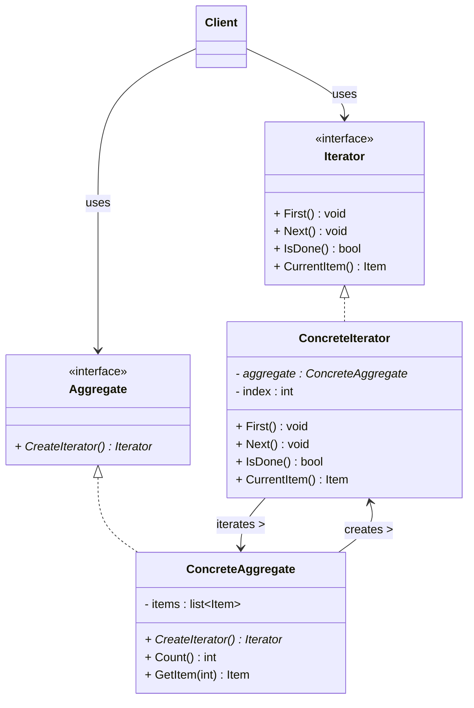
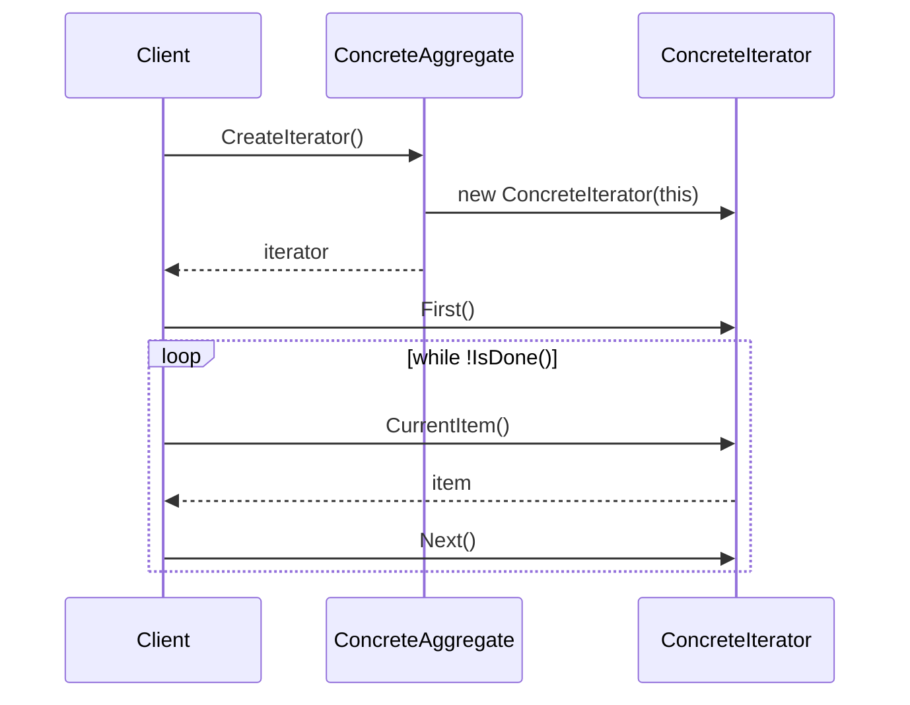

# 迭代器模式 (Iterator Pattern)

## 概述

**迭代器模式**（Iterator Pattern），属于 **行为型设计模式**。它提供一种方法顺序访问一个聚合对象（容器）中的各个元素，而**不暴露该对象的内部表示**。

> **定义**：提供一种方法顺序访问一个聚合对象中的各个元素，而又不需要暴露该对象的内部表示。

### 一个直觉感受

```cpp
// 不用迭代器：遍历数组、链表、树、哈希表，每种容器的遍历方式都不同
//  数组：  for (int i = 0; i < n; i++) arr[i]
//  链表：  for (Node* p = head; p; p = p->next)
//  树：    递归...
// 每换一种容器，遍历代码全要重写！

// 用迭代器：统一遍历方式
// 数组、链表、树、哈希表都提供同一个迭代器接口
for (auto it = collection.begin(); it != collection.end(); ++it) {
    std::cout << *it;  // 不管底层是啥，遍历代码一模一样
}
```

**你其实每天都在用迭代器模式**——C++ STL 的所有容器（`vector`、`list`、`map`...）都实现了迭代器。

---

## 核心设计思想

### 四个角色

| 角色 | 名称 | 职责 |
|---|---|---|
| **抽象迭代器 (Iterator)** | `Iterator` | 定义访问、遍历元素的接口（`First` / `Next` / `IsDone` / `CurrentItem`） |
| **具体迭代器 (ConcreteIterator)** | `ConcreteIterator` | 实现迭代器接口，持有指向聚合对象的引用，维护"当前游标位置" |
| **抽象聚合 (Aggregate)** | `Aggregate` | 定义创建迭代器的接口（`CreateIterator`） |
| **具体聚合 (ConcreteAggregate)** | `ConcreteAggregate` | 实现创建迭代器，返回一个具体迭代器实例 |

### 迭代器拆解

一个迭代器内部就三样东西：

```
┌─────────────────────────────┐
│     ConcreteIterator        │
│  ┌───────────────────────┐  │
│  │ 游标 index_（当前位置）│  │  ← 记住"遍历到哪了"
│  │ 容器引用 aggregate_    │  │  ← 知道"遍历的是什么"
│  │ First() 回到开头       │  │
│  │ Next()  前进一格       │  │
│  │ IsDone() 到末尾了吗？  │  │
│  │ CurrentItem() 取当前值 │  │
│  └───────────────────────┘  │
└─────────────────────────────┘
```

### 为什么需要迭代器？

| 问题 | 迭代器的解决方案 |
|---|---|
| 遍历方式随容器变化 | 所有容器提供统一的 `Iterator` 接口 |
| 暴露内部结构 | 客户端只接触 `Iterator`，看不到容器内部是数组还是链表 |
| 一个容器多种遍历 | 可以同时存在多个迭代器，各自独立遍历（互不干扰） |

---

## UML 类图



### 时序图



---

## C++ 实现

### 经典实现：自定义链表

> 每个类的注释标明了它对应的模式角色：`Iterator` = 抽象迭代器，`MyListIterator` = 具体迭代器，`MyList` = 具体聚合。

```cpp
#include <iostream>
#include <memory>
#include <stdexcept>

// ══════════════ 抽象迭代器 (Iterator) ══════════════
// 模式角色：Iterator —— 定义遍历接口
template <typename T>
class Iterator {
public:
    virtual ~Iterator() = default;
    virtual void First() = 0;                 // 游标回到开头
    virtual void Next() = 0;                  // 游标前进一格
    virtual bool IsDone() const = 0;          // 是否已到末尾
    virtual T CurrentItem() const = 0;        // 获取当前元素
};

// 前向声明（具体聚合需要在迭代器之前）
template <typename T>
class MyList;

// ══════════════ 具体迭代器 (ConcreteIterator) ══════════════
// 模式角色：ConcreteIterator —— 持有聚合引用 + 游标，实现遍历
template <typename T>
class MyListIterator : public Iterator<T> {
    const MyList<T>& list_;    // 被遍历的聚合对象（只知道接口，不碰内部结构）
    int index_ = 0;            // 游标：当前位置

public:
    explicit MyListIterator(const MyList<T>& list) : list_(list) {}

    // 游标回到开头
    void First() override { index_ = 0; }

    // 游标前进一格
    void Next() override { ++index_; }

    // 是否已遍历完
    bool IsDone() const override {
        return index_ >= list_.Count();
    }

    // 取当前元素（委托给聚合的 GetItem）
    T CurrentItem() const override {
        return list_.GetItem(index_);
    }
};

// ══════════════ 具体聚合 (ConcreteAggregate) ══════════════
// 模式角色：ConcreteAggregate —— 持有数据，负责创建迭代器
template <typename T>
class MyList {
    T* data_ = nullptr;
    int size_ = 0;
    int capacity_ = 0;

public:
    MyList() = default;
    ~MyList() { delete[] data_; }

    // 添加元素（聚合自己的业务逻辑）
    void PushBack(const T& value) {
        if (size_ >= capacity_) {
            capacity_ = capacity_ == 0 ? 4 : capacity_ * 2;
            T* newData = new T[capacity_];
            for (int i = 0; i < size_; ++i) newData[i] = data_[i];
            delete[] data_;
            data_ = newData;
        }
        data_[size_++] = value;
    }

    // ★ 创建迭代器（聚合的核心职责）
    std::unique_ptr<Iterator<T>> CreateIterator() const {
        return std::make_unique<MyListIterator<T>>(*this);
    }

    // 给迭代器用的内部接口（迭代器只知道这两个方法）
    int Count() const { return size_; }
    T GetItem(int index) const { return data_[index]; }
};

// ══════════════ 客户端 (Client) ══════════════
// 模式角色：Client —— 只依赖 Iterator 接口，不知道 MyList 内部是数组
int main() {
    MyList<int> numbers;                       // 具体聚合
    numbers.PushBack(10);
    numbers.PushBack(20);
    numbers.PushBack(30);

    // 通过迭代器遍历 —— 客户端完全不知道底层是数组！
    // First() 定位到开头 → IsDone() 判断结束 → CurrentItem() 取元素 → Next() 前进
    auto it = numbers.CreateIterator();        // 具体迭代器
    for (it->First(); !it->IsDone(); it->Next()) {
        std::cout << it->CurrentItem() << " ";
    }
    std::cout << std::endl;

    return 0;
}
```

### 输出

```
10 20 30
10 20 30
```

---

### C++ 标准库版：STL 迭代器

上面的经典实现是 GoF 教科书写法。C++ 的 STL 迭代器是同一思想的**现代高效版**：

```cpp
#include <iostream>
#include <vector>
#include <list>
#include <map>

// ══════════════ 客户端 (Client) ══════════════
// 模式角色：Client —— 用统一迭代器接口遍历不同的容器
int main() {
    std::vector<int> vec = {1, 2, 3, 4, 5};   // 数组容器
    std::list<int>   lst = {6, 7, 8};          // 链表容器

    // ★ 完全相同的遍历代码！不管底层是 vector 还是 list
    for (auto it = vec.begin(); it != vec.end(); ++it)
        std::cout << *it << " ";
    std::cout << std::endl;

    for (auto it = lst.begin(); it != lst.end(); ++it)
        std::cout << *it << " ";
    std::cout << std::endl;

    // 更现代的写法：范围 for（底层还是迭代器）
    for (int x : vec) std::cout << x << " ";
    std::cout << std::endl;

    return 0;
}
```

### 输出

```
1 2 3 4 5
6 7 8
1 2 3 4 5
```

### STL 迭代器角色对应

| STL 术语 | 模式角色 | 说明 |
|---|---|---|
| `std::iterator_traits` / 迭代器概念 | **Iterator**（抽象） | 定义迭代器接口（概念） |
| `vector<int>::iterator` | **ConcreteIterator** | 具体迭代器（底层是裸指针） |
| `list<int>::iterator` | **ConcreteIterator** | 具体迭代器（底层是指针包装） |
| `std::vector<int>` | **ConcreteAggregate** | 具体聚合（持有数据） |
| `vector::begin()` / `end()` | **CreateIterator()** | 创建迭代器 |

**C++ 迭代器和 GoF 迭代器的区别：**

| 维度 | GoF 经典迭代器 | C++ STL 迭代器 |
|---|---|---|
| 判断结束 | `IsDone()` 方法 | `it != end()` 比较（哨兵 end） |
| 获取元素 | `CurrentItem()` 方法 | `*it` 运算符重载 |
| 前进 | `Next()` 方法 | `++it` 运算符重载 |
| 接口形态 | 虚函数 + 继承 | 运算符重载 + 模板（零虚函数开销） |

> STL 用运算符重载把迭代器做的和指针一样顺手，同时保持 GoF 同样的精神——**遍历逻辑和容器解耦**。

---

## 实际应用场景

### 1. 数据库游标（Cursor）

```cpp
// ══════════════ 抽象迭代器 (Iterator) ══════════════
// 模式角色：Iterator —— 定义记录遍历接口
class ResultSetIterator {
public:
    virtual ~ResultSetIterator() = default;
    virtual bool HasNext() const = 0;     // 是否还有下一条
    virtual Record Next() = 0;            // 取当前并前进
};

// ══════════════ 具体聚合 (ConcreteAggregate) ══════════════
// 模式角色：ConcreteAggregate —— 数据库查询结果集
class ResultSet {
    std::vector<Record> rows_;
    int pos_ = 0;
public:
    void Add(const Record& r) { rows_.push_back(r); }
    std::unique_ptr<ResultSetIterator> GetIterator() const;
};

// ══════════════ 具体迭代器 (ConcreteIterator) ══════════════
// 模式角色：ConcreteIterator —— 游标
class ResultSetCursor : public ResultSetIterator {
    const ResultSet& rs_;
    mutable int pos_ = 0;
public:
    explicit ResultSetCursor(const ResultSet& rs) : rs_(rs) {}
    bool HasNext() const override { return pos_ < rs_.Count(); }
    Record Next() override { return rs_.GetRow(pos_++); }
};

// 客户端遍历查询结果：
ResultSet rs = db.Query("SELECT * FROM users");
auto cursor = rs.GetIterator();
while (cursor->HasNext()) {
    Record user = cursor->Next();
    std::cout << user["name"] << std::endl;
}
```

> **现实案例**：JDBC 的 `ResultSet`、Python 的数据库游标、SQLite 的 `sqlite3_step()` —— 都是"一次取一条记录"的迭代器。

### 2. 树/图的深度优先遍历

```cpp
// 同一个树，可以提供不同的迭代器：DFS、BFS、中序、前序...
class Tree {
    // 中序遍历迭代器
    std::unique_ptr<Iterator<Node>> GetInorderIterator() const;
    // 层序遍历迭代器
    std::unique_ptr<Iterator<Node>> GetLevelOrderIterator() const;
};

// 客户端根据需要选择遍历方式，代码不变
auto it = tree.GetInorderIterator();
for (it->First(); !it->IsDone(); it->Next()) {
    process(it->CurrentItem());
}
```

### 3. 文件读取行迭代器

```cpp
// ══════════════ 具体迭代器 (ConcreteIterator) ══════════════
// 模式角色：ConcreteIterator —— 逐行读取文件
class FileLineIterator {
    std::ifstream file_;
    std::string currentLine_;
public:
    explicit FileLineIterator(const std::string& path) : file_(path) {
        Advance();
    }
    bool HasNext() const { return !file_.eof(); }
    std::string Next() { return currentLine_; }
private:
    void Advance() { std::getline(file_, currentLine_); }
};
```

### 4. 游戏对象遍历

```cpp
// 场景中有几千个游戏对象，遍历它们调用 Update()
class GameObjectIterator : public Iterator<GameObject*> {
    const Scene& scene_;
    int index_;
public:
    void First() override { index_ = 0; }
    void Next() override { ++index_; }
    bool IsDone() const override { return index_ >= scene_.GetObjectCount(); }
    GameObject* CurrentItem() const override {
        return scene_.GetObjectAt(index_);
    }
};
```

---

## 迭代器的扩展：懒加载遍历

经典迭代器一次性遍历完。**生成器/惰性迭代器**则"用一条算一条"，不预先生成全部：

```cpp
// ══════════════ 具体迭代器 (ConcreteIterator) ══════════════
// 模式角色：ConcreteIterator —— 斐波那契数列迭代器（无限序列！）
// 不预先生成所有元素，Next() 时才计算下一个 —— 懒加载
class FibonacciIterator {
    long a_ = 0, b_ = 1;
public:
    long Next() {
        long current = a_;
        long next = a_ + b_;
        a_ = b_;
        b_ = next;
        return current;
    }
    bool HasNext() const { return true; }  // 无限序列
};

// 用多少算多少，不会撑爆内存
FibonacciIterator fib;
for (int i = 0; i < 10; i++) std::cout << fib.Next() << " ";
// 0 1 1 2 3 5 8 13 21 34
```

---

## 优缺点

### 优点

| # | 说明 |
|---|---|
| ✅ | **遍历与容器解耦** — 客户端只用迭代器接口，换容器不改遍历代码 |
| ✅ | **符合单一职责** — 遍历逻辑从聚合对象中分离出来，聚合只管存储 |
| ✅ | **支持多种遍历** — 同一容器可有多个迭代器并发遍历（互不干扰） |
| ✅ | **隐藏内部结构** — 客户端不知道容器是数组、链表还是树 |
| ✅ | **符合开闭原则** — 新增容器只需新增对应的迭代器 |

### 缺点

| # | 说明 |
|---|---|
| ❌ | **增加类数量** — 每种容器要配套一个迭代器类 |
| ❌ | **迭代器失效问题** — 遍历过程中修改容器（增删元素）可能导致迭代器失效 |
| ❌ | **性能开销** — 相比裸指针遍历，多一层间接调用（现代 C++ 用模板+内联已基本消除） |

---

## 迭代器失效（C++ 经典坑）

```cpp
std::vector<int> v = {1, 2, 3, 4, 5};

// ❌ 遍历时删除元素 → 迭代器失效！
for (auto it = v.begin(); it != v.end(); ++it) {
    if (*it == 3) v.erase(it);   // erase 后 it 失效，++it 是未定义行为！
}

// ✅ 正确做法：利用 erase 的返回值
for (auto it = v.begin(); it != v.end(); ) {
    if (*it == 3) it = v.erase(it);   // erase 返回下一个有效迭代器
    else ++it;
}

// ✅ 更现代：erase-remove 惯用法
v.erase(std::remove(v.begin(), v.end(), 3), v.end());
```

> **记忆**：`vector` 的 `insert`/`erase` 会使**之后所有迭代器失效**；`list` 只使**被删元素的迭代器**失效；`map`/`set` 删除只影响被删节点。

---

## 适用场景

| 场景 | 说明 |
|---|---|
| **需要统一遍历多种容器** | 数组、链表、树、哈希表用同一套遍历代码 |
| **不想暴露容器内部结构** | 客户端只接触迭代器接口 |
| **需要多种遍历方式** | 树的先序/中序/后序、图的 DFS/BFS |
| **遍历过程中需要多个独立游标** | 两个迭代器同时遍历同一个容器（如双指针算法） |

---

## 总结

迭代器模式的核心思想：

> **把"怎么走"（遍历方式）从"装什么"（容器）里抽出来。**

```
不用迭代器：
  每种容器一套遍历代码，客户端和具体容器耦合

用迭代器：
  容器提供 CreateIterator() → 客户端拿到 Iterator 接口
  → 遍历代码对所有容器统一
  → 换容器不用改客户端
```

**在 C++ 里，你几乎不需要自己实现迭代器模式——STL 已经替你做好了**。`for (auto it = v.begin(); it != v.end(); ++it)` 就是迭代器模式的标准实践。理解这个模式的意义在于：当你要给**自定义容器**（二叉树、图、文件流）提供遍历能力时，就知道该实现一个什么样的迭代器接口了。
