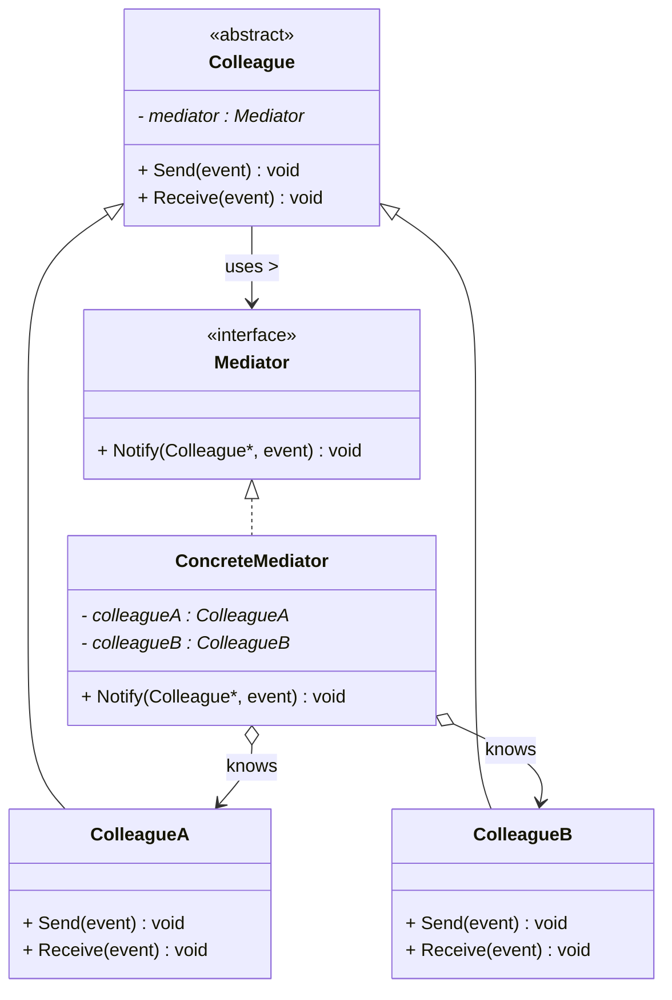
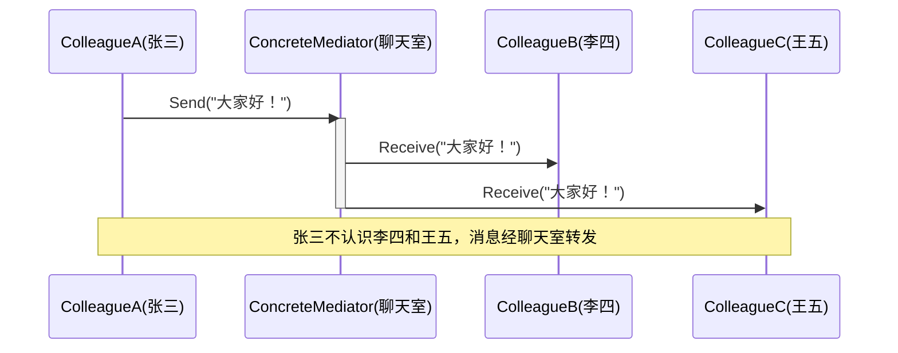

# 中介者模式 (Mediator Pattern)

## 概述

**中介者模式**（Mediator Pattern），属于 **行为型设计模式**。它用一个**中介对象**来封装一组对象的交互，使这些对象**不必互相直接引用**，从而降低耦合。

> **定义**：用一个中介对象来封装一系列的对象交互。中介者使各对象不需要显式地相互引用，从而使其耦合松散，而且可以独立地改变它们之间的交互。

### 一个直觉感受

```cpp
// 聊天室里 5 个人：张三、李四、王五...
// 张三想发消息给所有人 → 张三认识李四？王五？赵六？全部都要知道！

// 不用中介者：对象之间直接连线
//   张三 ←→ 李四
//   张三 ←→ 王五
//   张三 ←→ 赵六     ← 每次加人，所有人都要认识新人
//   李四 ←→ 王五     ← N 个对象 N×(N-1) 条线，爆炸！

// 用中介者：所有人只认识聊天室
//   张三 → 聊天室 → 李四、王五、赵六
//   新增一个人：只和聊天室连线，其他人不用改
```

### 核心思想

```
不用中介者（网状耦合）：           用中介者（星形解耦）：
       A                          A   B   C
      /|\                          \  |  /
     / | \                          \ | /
    B  C  D                          聊天室
     \ | /                            /|\
      \|/                           D  E  F
       E
  N 个对象 N×(N-1) 条线          每个对象只有 1 条线（到中介者）
  改一个对象影响所有                改一个对象只影响中介者
```

---

## 核心设计思想

### 四个角色

| 角色 | 名称 | 职责 |
|---|---|---|
| **中介者 (Mediator)** | `Mediator` | 抽象中介者接口：声明同事对象之间通信的方法 |
| **具体中介者 (ConcreteMediator)** | `ConcreteMediator` | 实现协调逻辑，**知道所有同事对象**，负责转发消息 |
| **同事 (Colleague)** | `Colleague` | 抽象同事类：持有中介者引用，通过中介者通信 |
| **具体同事 (ConcreteColleague)** | `ConcreteColleagueA/B` | 实现自己的业务，需要跟别人说话时**通过中介者转发** |

### 中介者模式 vs 外观模式（容易混淆）

| | 中介者 | 外观 |
|---|---|---|
| **通信方向** | **双向**（同事之间互相通信，都经过中介） | **单向**（客户端 → 子系统） |
| **参与方关系** | 同事**不知道彼此**，只认识中介者 | 子系统**不知道外观存在** |
| **谁认识谁** | 中介者认识所有同事 | 外观认识所有子系统 |
| **功能** | 协调对象间的交互 | 简化复杂子系统的调用 |
| **类比** | 交通指挥中心、聊天室 | 前台接待、家庭影院一键启动 |

> **一句话区分**：外观是"你（客户端）通过我访问他们"；中介是"你们（同事）通过我互相交流"。

---

## UML 类图



### 时序图



---

## C++ 实现

### 经典示例：聊天室

> 每个类的注释标明了它对应的模式角色：`Mediator` = 中介者接口，`ChatRoom` = 具体中介者，`Colleague` = 抽象同事，`User` = 具体同事。

```cpp
#include <iostream>
#include <memory>
#include <string>
#include <vector>

// 前向声明（同事需要引用中介者）
class Colleague;

// ══════════════ 中介者 (Mediator) ══════════════
// 模式角色：Mediator —— 抽象中介者：定义通信接口
class Mediator {
public:
    virtual ~Mediator() = default;
    virtual void SendMessage(const Colleague* sender,
                             const std::string& msg) = 0;
    virtual void AddColleague(std::shared_ptr<Colleague> c) = 0;
};

// ══════════════ 同事 (Colleague) ══════════════
// 模式角色：Colleague —— 抽象同事：持有中介者引用，通过中介者通信
class Colleague {
protected:
    std::string name_;
    Mediator* mediator_;      // ← 只认识中介者，不认识其他同事

public:
    Colleague(const std::string& name, Mediator* m)
        : name_(name), mediator_(m) {}

    virtual ~Colleague() = default;

    virtual void Send(const std::string& msg) = 0;   // 发消息（经中介者）
    virtual void Receive(const std::string& from,    // 收消息（被中介者调）
                         const std::string& msg) = 0;

    const std::string& GetName() const { return name_; }
};

// ══════════════ 具体中介者 (ConcreteMediator) ══════════════
// 模式角色：ConcreteMediator —— 聊天室：认识所有用户，负责转发
class ChatRoom : public Mediator {
    std::vector<std::shared_ptr<Colleague>> members_;

public:
    void AddColleague(std::shared_ptr<Colleague> c) override {
        members_.push_back(std::move(c));
    }

    // ★ 转发逻辑集中在这里
    void SendMessage(const Colleague* sender, const std::string& msg) override {
        std::cout << "  [聊天室] " << sender->GetName()
                  << " 说: \"" << msg << "\" → 转发给所有人" << std::endl;
        for (const auto& member : members_) {
            if (member.get() != sender) {          // 不给发送者自己
                member->Receive(sender->GetName(), msg);
            }
        }
    }
};

// ══════════════ 具体同事 (ConcreteColleague) ══════════════
// 模式角色：ConcreteColleague —— 聊天室用户
class User : public Colleague {
public:
    User(const std::string& name, Mediator* m) : Colleague(name, m) {}

    // 发消息：不直接找别人，而是交给中介者
    void Send(const std::string& msg) override {
        std::cout << "[" << name_ << "] 发送: " << msg << std::endl;
        mediator_->SendMessage(this, msg);   // ★ 只跟中介者打交道
    }

    // 收消息：被中介者调用
    void Receive(const std::string& from, const std::string& msg) override {
        std::cout << "  [" << name_ << "] 收到 " << from
                  << ": " << msg << std::endl;
    }
};

// ══════════════ 客户端 (Client) ══════════════
// 模式角色：Client —— 创建中介者和同事，完成组装
int main() {
    // 创建聊天室（中介者）
    auto chatRoom = std::make_shared<ChatRoom>();

    // 创建用户（同事），都只认识聊天室
    auto zhang = std::make_shared<User>("张三", chatRoom.get());
    auto li    = std::make_shared<User>("李四", chatRoom.get());
    auto wang  = std::make_shared<User>("王五", chatRoom.get());

    // 把用户注册进聊天室
    chatRoom->AddColleague(zhang);
    chatRoom->AddColleague(li);
    chatRoom->AddColleague(wang);

    // 张三发消息 → 聊天室转发给李四、王五
    std::cout << "=== 张三发言 ===" << std::endl;
    zhang->Send("大家好！");

    std::cout << "\n=== 李四发言 ===" << std::endl;
    li->Send("你好，张三！");

    return 0;
}
```

### 输出

```
=== 张三发言 ===
[张三] 发送: 大家好！
  [聊天室] 张三 说: "大家好！" → 转发给所有人
  [李四] 收到 张三: 大家好！
  [王五] 收到 张三: 大家好！

=== 李四发言 ===
[李四] 发送: 你好，张三！
  [聊天室] 李四 说: "你好，张三！" → 转发给所有人
  [张三] 收到 李四: 你好，张三！
  [王五] 收到 李四: 你好，张三！
```

### 关键解读

```cpp
// 关键：张三根本不认识李四、王五
User::Send() {
    mediator_->SendMessage(this, msg);   // 唯一的通信出口 = 中介者
}

// 新增一个用户：
auto zhao = std::make_shared<User>("赵六", chatRoom.get());
chatRoom->AddColleague(zhao);            // 只改这一处！
// 张三、李四、王五的代码一行不动 —— 他们本来就不认识彼此
```

---

## 扩展：GUI 组件协调（对话框中介）

```cpp
// ══════════════ 同事 (Colleague) ══════════════
// 模式角色：Colleague —— GUI 控件基类
class Widget {
protected:
    Mediator* mediator_;

public:
    explicit Widget(Mediator* m) : mediator_(m) {}
    virtual void Changed() = 0;      // 自己状态变了 → 通知中介者
};

// ══════════════ 具体同事 (ConcreteColleague) ══════════════
// 模式角色：ConcreteColleague —— 文本框
class TextBox : public Widget {
    std::string text_;
public:
    explicit TextBox(Mediator* m) : Widget(m) {}

    void SetText(const std::string& t) {
        text_ = t;
        Changed();                    // 文本框变了，通知中介者
    }
    std::string GetText() const { return text_; }
    void Changed() override { mediator_->Notify(this, "textChanged"); }
};

// 模式角色：ConcreteColleague —— 确定按钮（初始禁用，有文字才启用）
class OKButton : public Widget {
    bool enabled_ = false;
public:
    explicit OKButton(Mediator* m) : Widget(m) {}
    void SetEnabled(bool e) { enabled_ = e; std::cout << "  [按钮] " << (e ? "启用" : "禁用") << std::endl; }
    bool IsEnabled() const { return enabled_; }
    void Click() { if (enabled_) std::cout << "  [按钮] 点击确定" << std::endl; }
    void Changed() override { }
};

// ══════════════ 具体中介者 (ConcreteMediator) ══════════════
// 模式角色：ConcreteMediator —— 对话框：协调文本框和按钮
class Dialog : public Mediator {
    TextBox* textBox_ = nullptr;
    OKButton* okButton_ = nullptr;

public:
    void SetTextBox(TextBox* t) { textBox_ = t; }
    void SetOKButton(OKButton* b) { okButton_ = b; }

    void Notify(Widget* sender, const std::string& event) override {
        if (sender == textBox_ && event == "textChanged") {
            // ★ 协调逻辑集中在中介者：有文字才启用按钮
            okButton_->SetEnabled(!textBox_->GetText().empty());
        }
    }
};

// 客户端：
Dialog dialog;
TextBox input(&dialog);
OKButton okBtn(&dialog);
dialog.SetTextBox(&input);
dialog.SetOKButton(&okBtn);

input.SetText("");          // 空 → 按钮禁用
input.SetText("hello");     // 有字 → 按钮自动启用
okBtn.Click();
```

> **现实案例**：Qt 的信号槽、MFC 对话框（`CDialog` 协调所有控件）、表单校验——控件之间不互相引用，全部通过对话框中介协调。

---

## 实际应用场景

### 1. 航班调度（空中交通管制）

```cpp
// 每架飞机是一个同事，塔台是中介者
// 飞机 A 要降落 → 告诉塔台 → 塔台安排其他飞机等待
// 飞机之间不直接通信，避免混乱

class Aircraft : public Colleague {
    void RequestLanding() {
        mediator_->Notify(this, "landing");   // 只跟塔台说
    }
};

class ControlTower : public ConcreteMediator {
    std::vector<Aircraft*> runway_;           // 跑道占用情况
    void Notify(Colleague* sender, std::string event) override {
        // 协调：检查跑道是否空闲，安排顺序
    }
};
```

### 2. 复杂 UI 仪表盘

```cpp
// 温度过高 → 风扇转速、报警灯、日志记录三个组件要联动
// 不用中介者：温度传感器要知道风扇、报警灯、日志——耦合爆炸
// 用中介者：温度传感器只通知监控中心，监控中心调度其他组件
```

### 3. MVC 架构（Controller 就是中介者）

```
Model（模型）◄──────► Controller（中介者）◄──────► View（视图）

  Model 数据变了 → 通知 Controller → Controller 更新 View
  View 用户操作 → 通知 Controller → Controller 修改 Model

  Model 和 View 互不认识，全靠 Controller 协调 —— 标准中介者！
```

### 4. 多人游戏房间

```cpp
// 房间（中介者）协调所有玩家
class GameRoom : public Mediator {
    void PlayerMove(Player* sender, Vector2 pos) override {
        // 把玩家位置广播给房间内其他人（同步显示）
        for (auto& p : players_)
            if (p != sender) p->ReceivePosition(sender->GetId(), pos);
    }
};
```

---

## 中介者 vs 观察者 vs 外观

| 模式 | 通信方向 | 关系结构 | 典型场景 |
|---|---|---|---|
| **中介者** | 同事之间**双向**，全部经中介 | 星形 | 聊天室、对话框、MVC |
| **观察者** | Subject → Observer **单向** | 一对多 | 气象站、事件系统 |
| **外观** | 客户端 → 子系统**单向** | 门面 | 家庭影院、编译 |

```
中介者 ≈ 星形拓扑：所有节点 → 中心 → 转发
观察者 ≈ 广播拓扑：一个源 → 多个听众
外观  ≈ 门面拓扑：你 → 门面 → 内部

补充：中介者内部常用观察者实现（中介者观察所有同事的变化）
```

---

## 文件拆分建议

```
code/mediator/
├── mediator.hpp      ← Mediator 抽象接口（纯头文件）
├── colleague.hpp     ← Colleague 抽象同事（纯头文件）
├── chat_room.cpp     ← ChatRoom 具体中介者实现
├── user.cpp          ← User 具体同事实现
├── main.cpp          ← Client 组装
└── main              ← 可执行文件
```

编译：`g++ -std=c++14 main.cpp chat_room.cpp user.cpp -o main`

---

## 优缺点

### 优点

| # | 说明 |
|---|---|
| ✅ | **对象间解耦** — 同事之间互不认识，只依赖中介者接口 |
| ✅ | **交互逻辑集中** — 所有协调规则在一个地方，容易维护和修改 |
| ✅ | **符合开闭原则** — 新增同事只需继承 Colleague + 注册进中介者 |
| ✅ | **符合最少知识原则** — 每个对象只和直接朋友（中介者）通信 |

### 缺点

| # | 说明 |
|---|---|
| ❌ | **中介者可能变成"上帝对象"** — 所有逻辑集中一处，中介者越来越臃肿 |
| ❌ | **中介者单点故障** — 中介者出问题，整个系统瘫痪 |
| ❌ | **通信效率下降** — 多一次转发间接层 |
| ❌ | **同事越多，中介者越难维护** |

---

## 适用场景

| 场景 | 说明 |
|---|---|
| **多个对象相互交互且关系复杂** | 网状耦合 → 用中介者变星形 |
| **交互逻辑需要集中管理** | 审批规则、协调规则集中一处，方便改 |
| **对象数量动态变化** | 聊天室加人、航班加入调度，只改中介者 |
| **解耦对象间的相互依赖** | MVC 的 Controller、GUI 对话框 |

---

## 总结

中介者模式的核心思想：

> **你们别互相认识了，都通过我说话——我管转发，你们只管自己的事。**

```
不用中介者：A 认识 B、C、D...（网状，改一个全动）
用中介者：  A 只认识中介者（星形，改一个只动中介者）

记忆口诀：
  同事不相认，通信过中介
  协调集中管，网状变星形

要警惕：中介者别变成"上帝对象"——
  它只是"交通指挥中心"，不该把业务逻辑全揽自己身上。
```
