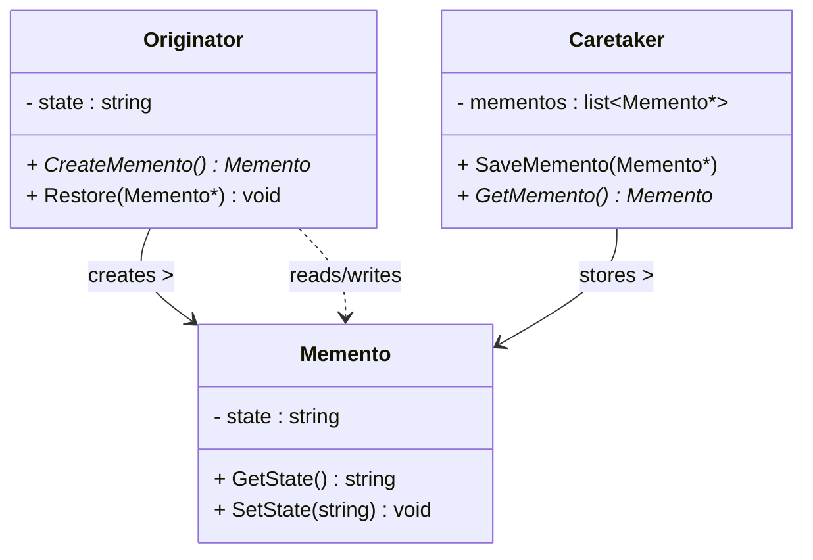
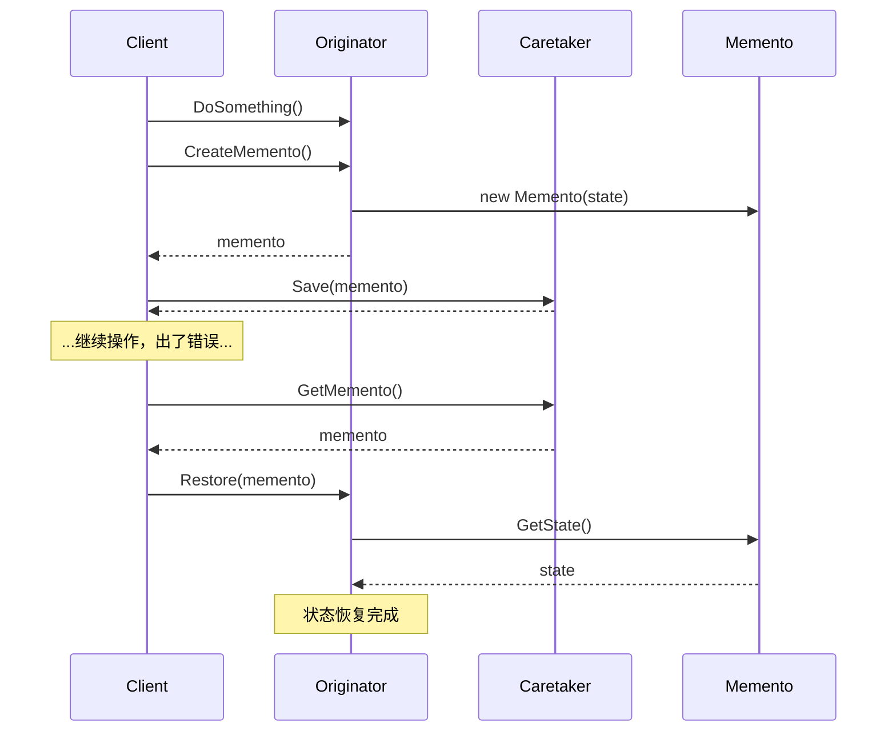

# 备忘录模式 (Memento Pattern)

## 概述

**备忘录模式**（Memento Pattern），又称 **快照模式**，属于 **行为型设计模式**。它负责捕获一个对象的内部状态，并在该对象之外保存这个状态，以便在需要时将对象恢复到之前的状态。

> **定义**：在不破坏封装的前提下，捕获一个对象的内部状态，并在该对象之外保存这个状态，这样以后就可将该对象恢复到原先保存的状态。

### 一个直觉感受

```cpp
// 没有备忘录：Ctrl+Z 撤销功能怎么实现？
// 每次编辑前把整个对象复制一份？但对象可能很大，而且复制要懂内部结构。

// 有备忘录：
Editor editor;
editor.Type("Hello");       // 编辑器状态：光标位置、文本、撤销栈...
editor.Type(" World");
editor.Save();              // ★ 拍个快照（备忘录）
editor.Type("!!!");         // 继续编辑
editor.Undo();              // ★ 恢复到快照时的状态
// 文本回到 "Hello World"，光标位置也回到保存时的位置
```

### 核心问题

**如何保存和恢复对象状态，同时又**不破坏封装**？**

- 对象内部有很多私有成员——外部无法直接读取
- 如果为了保存状态把私有成员全部暴露，就破坏了封装
- 备忘录模式让 Originator **自己**生成快照、**自己**从快照恢复——外部（Caretaker）只是"保管"快照，看不懂也碰不到内部细节

---

## 核心设计思想

### 三个角色

| 角色 | 名称 | 职责 |
|---|---|---|
| **发起人 (Originator)** | `Originator` | 需要保存/恢复状态的对象。生成备忘录、从备忘录恢复状态 |
| **备忘录 (Memento)** | `Memento` | 存储 Originator 内部状态的对象。**只有 Originator 能读写它的内容** |
| **管理者 (Caretaker)** | `Caretaker` | 负责保存和管理备忘录，但不能修改备忘录内容 |

### 职责边界

```
┌──────────────┐     创建/恢复      ┌──────────────┐
│  Originator  │◄═════════════════►│   Memento    │
│ (编辑器)     │   读写内部状态      │  (快照)      │
└──────────────┘                   └──────┬───────┘
                                          │ 只保存，不修改
                                          ▼
                                  ┌──────────────┐
                                  │  Caretaker   │
                                  │ (撤销管理器)  │
                                  └──────────────┘
```

| 角色 | 能读 Memento 内容吗 | 能写 Memento 内容吗 |
|---|---|---|
| **Originator** | ✅ 能（保存时写入，恢复时读取） | ✅ 能 |
| **Caretaker** | ❌ 不能（只是一个不透明的快照） | ❌ 不能 |
| **其他类** | ❌ 不能 | ❌ 不能 |

> **这就是"不破坏封装"的含义**：快照对象对外完全是不透明的，只有 Originator 知道里面是什么。

---

## UML 类图



### 时序图



---

## C++ 实现

### 经典实现：文本编辑器撤销

```cpp
#include <iostream>
#include <memory>
#include <string>
#include <vector>

// ============ 备忘录 ============
// 存储发起人状态的快照，对外不透明
class EditorMemento {
    // 只有 Editor 能访问私有状态（友元声明）
    friend class Editor;

    std::string text_;
    int cursorPos_;

    // 私有构造函数：只有 Editor 能创建
    explicit EditorMemento(const std::string& text, int pos)
        : text_(text), cursorPos_(pos) {}

    std::string GetText() const { return text_; }
    int GetCursorPos() const { return cursorPos_; }
};

// ============ 发起人 ============
class Editor {
    std::string text_;
    int cursorPos_ = 0;

public:
    void Type(const std::string& input) {
        text_.insert(cursorPos_, input);
        cursorPos_ += input.size();
    }

    void MoveCursor(int pos) {
        if (pos >= 0 && pos <= (int)text_.size())
            cursorPos_ = pos;
    }

    // ★ 生成快照
    std::unique_ptr<EditorMemento> CreateMemento() const {
        // 注意：不能用 std::make_unique！它内部的 new 在 std 头文件里，
        // 友元访问在这里不生效。直接用 new（在 Editor 作用域内，friend 有效）
        return std::unique_ptr<EditorMemento>(
            new EditorMemento(text_, cursorPos_));
    }

    // ★ 从快照恢复
    void Restore(const EditorMemento& memento) {
        text_ = memento.GetText();       // 通过 friend 访问私有成员
        cursorPos_ = memento.GetCursorPos();
    }

    void Show() const {
        std::cout << "  文本: \"" << text_ << "\""
                  << "  光标: " << cursorPos_ << std::endl;
    }
};

// ============ 管理者：保存快照历史（撤销栈） ============
class History {
    std::vector<std::unique_ptr<EditorMemento>> snapshots_;  // 快照栈

public:
    void Push(std::unique_ptr<EditorMemento> snap) {
        snapshots_.push_back(std::move(snap));
    }

    // 弹出最近一个快照
    std::unique_ptr<EditorMemento> Pop() {
        if (snapshots_.empty())
            return nullptr;
        auto snap = std::move(snapshots_.back());
        snapshots_.pop_back();
        return snap;
    }

    bool Empty() const { return snapshots_.empty(); }
};

// ============ 客户端 ============
int main() {
    Editor editor;
    History history;

    std::cout << "=== 编辑操作 ===\n";
    editor.Type("Hello");
    editor.Show();

    editor.Type(" World");
    editor.Show();

    // ★ 保存一个快照（"Hello World" 状态）
    std::cout << "\n=== 保存快照 ===\n";
    history.Push(editor.CreateMemento());

    editor.Type("!!!");
    editor.MoveCursor(0);
    editor.Show();

    // ★ 出错了，撤销！
    std::cout << "\n=== 撤销 ===\n";
    auto snapshot = history.Pop();
    if (snapshot) {
        editor.Restore(*snapshot);
    }
    editor.Show();

    return 0;
}
```

### 输出

```
=== 编辑操作 ===
  文本: "Hello"  光标: 5
  文本: "Hello World"  光标: 11

=== 保存快照 ===
  文本: "Hello World!!!"  光标: 0

=== 撤销 ===
  文本: "Hello World"  光标: 11
```

### 关键解读

```cpp
// 1. 保存：Editor 自己把状态装进快照
history.Push(editor.CreateMemento());
//          ↑ Originator 创建 Memento，内部状态被完整捕获

// 2. History 只是保管，看都不看内容
//    snapshots_ 里的 EditorMemento 对它来说是个黑盒

// 3. 恢复：Editor 自己把状态取回来
editor.Restore(*snapshot);
// ↑ 通过 friend 访问 Memento 的私有成员
```

**封装性的体现**：`EditorMemento` 的构造函数和 `GetText()` / `GetCursorPos()` 都是**私有**的，`History` 类无法读取快照内容——它只能存和取。只有 `friend class Editor` 能读写。

---

## C++ 中 Memento 的三种封装方式

| 方式 | 实现 | 优点 | 缺点 |
|---|---|---|---|
| **方式一：friend 类** | `friend class Editor;` 声明在 Memento 里 | 简单直观 | 增加类间耦合 |
| **方式二：嵌套类 + 私有** | Memento 作为 Editor 的**私有嵌套类**，成员全私有 | 天然封装，不需要 friend | 代码组织上 Memento 归 Editor 管 |
| **方式三：Pimpl 模式** | Memento 只暴露无内容接口，内部用 `unique_ptr<Impl>` 存状态 | 对外完全隐藏 | 代码更复杂 |

### 方式二：嵌套类（更简洁的封装）

```cpp
class Editor {
public:
    // Memento 作为 Editor 的嵌套类
    class Memento {
        friend class Editor;   // Editor 才能访问
        std::string text_;
        int pos_;
        Memento(const std::string& t, int p) : text_(t), pos_(p) {}
    public:
        // 对外只暴露空接口（避免 Caretaker 误用）
        std::string GetTextForDebug() const { return text_; }  // 可选
    };

    std::unique_ptr<Memento> CreateMemento() const {
        return std::make_unique<Memento>(text_, pos_);
    }
    void Restore(const Memento& m) {
        text_ = m.text_;
        pos_ = m.pos_;
    }
};
```

---

## 实际应用场景

### 1. 游戏存档

```cpp
class GameState {
    friend class Game;
    int level_, hp_, score_;
    std::string position_;
    // ...
};

class Game {
public:
    std::unique_ptr<GameState> Save() const { /* 捕获当前关卡/血量/位置 */ }
    void Load(const GameState& s) { /* 恢复 */ }
};

// 客户端：
Game game;
game.Play();                       // 打到第 5 关
auto save = game.Save();           // 存档
game.Play();                       // 死了...
game.Load(*save);                  // 读档回到第 5 关
```

> **现实案例**：所有游戏的存档/读档系统都是备忘录模式。

### 2. 事务回滚（数据库）

```cpp
class Transaction {
    // 事务开始前的快照
    std::unique_ptr<DBState> begin_;

public:
    void Begin() { begin_ = db_->CreateState(); }

    void Commit() { begin_ = nullptr; }   // 放弃快照

    void Rollback() {
        if (begin_) db_->Restore(*begin_);  // 恢复到事务开始前
    }
};

// 使用：
tx.Begin();
db->Insert("user", ...);   // 操作 1
db->Update("order", ...);  // 操作 2
if (error) {
    tx.Rollback();         // ★ 全部回滚！
} else {
    tx.Commit();
}
```

### 3. 表单自动保存 / 草稿箱

```cpp
class FormEditor {
public:
    // 用户编辑到一半，自动生成草稿
    std::unique_ptr<FormMemento> Snapshot() const { /* 捕获所有字段 */ }
    void Restore(const FormMemento& m) { /* 恢复所有字段 */ }
};

// 每 30 秒自动保存一次
Timer::Every(30s, [&] {
    drafts.push_back(formEditor.Snapshot());  // 自动存草稿
});

// 页面崩溃后恢复：
if (drafts.size()) formEditor.Restore(*drafts.back());
```

### 4. 命令模式配合撤销

```cpp
// 命令模式：每个操作是一个命令对象
// 备忘录模式：每个命令执行前拍快照
// 两者结合 = 完整的撤销/重做系统

class Command {
    virtual void Execute() = 0;
    virtual void Undo() = 0;
};

class TypeCommand : public Command {
    Editor& editor_;
    std::unique_ptr<EditorMemento> before_;  // 执行前快照
    std::string input_;
public:
    void Execute() override {
        before_ = editor_.CreateMemento();   // 先拍快照
        editor_.Type(input_);
    }
    void Undo() override {
        editor_.Restore(*before_);           // 用快照撤销
    }
};
```

> **现实案例**：Photoshop / VS Code 的撤销栈 = 命令模式 + 备忘录模式。

---

## 备忘录模式 vs 其他模式

| 模式 | 关系 |
|---|---|
| **命令模式** | 命令模式保存"做了什么"；备忘录保存"改前什么样"。二者常配合实现撤销 |
| **原型模式** | 原型是复制整个对象；备忘录只保存需要恢复的状态子集 |

```
命令模式：记录操作日志（"我执行了 Type(Hello)"）
备忘录模式：记录状态快照（"当时文本是 X"）

撤销的实现方式：
  A. 反做操作（命令模式）：Type 的逆操作是 Delete —— 但复杂操作很难逆
  B. 恢复到快照（备忘录）：直接把状态换回之前的 —— 简单粗暴，通用
```

---

## 优缺点

### 优点

| # | 说明 |
|---|---|
| ✅ | **不破坏封装** — 快照内部状态对外不透明，只有 Originator 能读写 |
| ✅ | **状态恢复简单可靠** — 直接换回快照，不需要逆向推导操作 |
| ✅ | **职责分离** — Originator 管状态，Caretaker 管保存，各司其职 |
| ✅ | **实现复杂撤销逻辑的基础** — 配合命令模式可以实现无限级撤销/重做 |

### 缺点

| # | 说明 |
|---|---|
| ❌ | **内存开销大** — 每拍一个快照就复制一份完整状态，状态大时很耗内存 |
| ❌ | **快照可能过期** — 对象结构变更后，旧快照可能无法恢复（版本兼容问题） |
| ❌ | **Caretaker 责任重** — 管理者要管理快照生命周期，删除策略要自己定 |
| ❌ | **频繁快照性能差** — 每步操作都拍快照，大对象会卡 |

---

## 适用场景

| 场景 | 说明 |
|---|---|
| **需要撤销/重做功能** | 文本编辑器、绘图软件、IDE |
| **需要保存点/检查点** | 游戏存档、长任务中断恢复 |
| **需要事务回滚** | 数据库操作、配置变更 |
| **需要临时备份** | 表单草稿、自动保存 |

---

## 总结

备忘录模式的核心思想：

> **让对象自己给自己拍照（保存状态），照片交给别人保管（不透明），想恢复时再自己取回来。**

```
一句话记忆：
  Originator = 拍照的人（自己懂照片内容）
  Memento    = 照片（只有拍照的人能看懂）
  Caretaker  = 相册管理员（只管存，看不懂照片）
```

它的精髓是**封装**——状态保存/恢复的逻辑完全在 Originator 内部，外部世界只看到一个不透明的快照对象。这是"封装变化"原则在状态管理上的体现。
