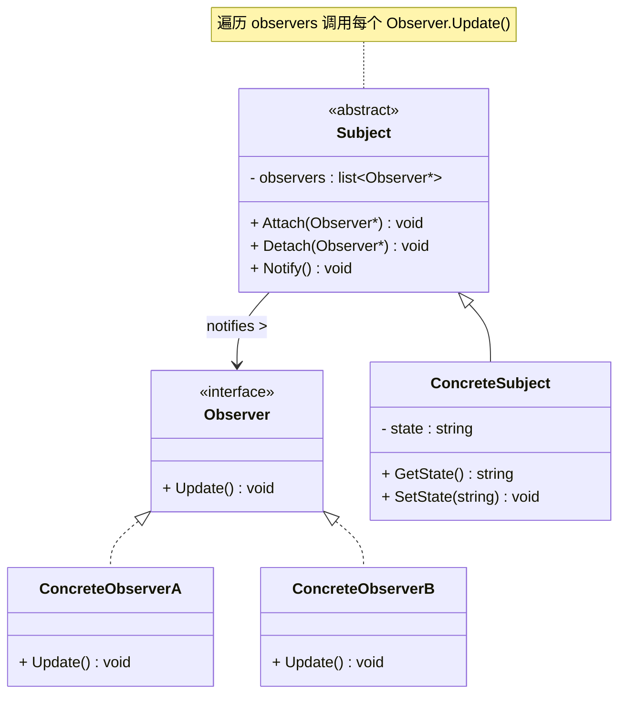
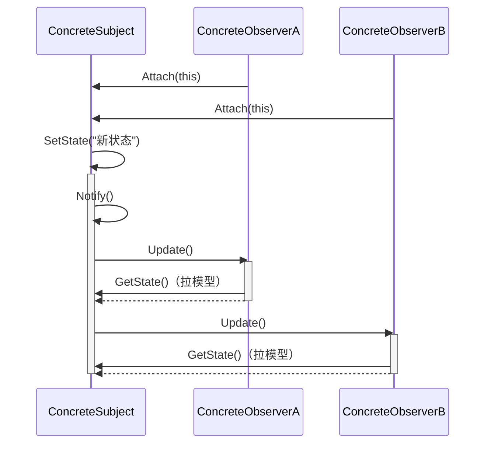

# 观察者模式 (Observer Pattern)

## 概述

**观察者模式**（Observer Pattern），又称 **发布-订阅模式**（Publish-Subscribe Pattern），属于 **行为型设计模式**。它定义了一种一对多的依赖关系，当一个对象的状态发生改变时，所有依赖于它的对象都会得到通知并自动更新。

> **定义**：定义对象间的一种一对多的依赖关系，使得每当一个对象改变状态，所有依赖于它的对象都会得到通知并被自动更新。

### 一个直觉感受

```cpp
// 你关注了一个微信公众号。
// 公众号（被观察者）发了文章 → 你（观察者）立刻收到推送。
// 你取关 → 从此不再收到推送。

// 不用观察者模式：你每隔 5 分钟打开微信，手动刷新检查有没有新文章
// 用观察者模式：公众号发文章时主动推送给你
```

### 核心机制

```
┌──────────────┐       注册           ┌──────────────┐
│   Subject    │◄────────────────────│   Observer   │
│  (被观察者)  │      push通知        │  (观察者)     │
│              │─────────────────────▶│              │
│  - observers│                      │  + Update()  │
│  + Attach() │                      │              │
│  + Detach() │                      └──────────────┘
│  + Notify() │
└──────────────┘
```

---

## 核心设计思想

### 两个角色

| 角色 | 名称 | 职责 |
|---|---|---|
| **被观察者 (Subject)** | `Subject` | 维护观察者列表，提供注册/移除方法，状态改变时遍历列表通知所有观察者 |
| **观察者 (Observer)** | `Observer` | 定义一个 `Update()` 接口，当 Subject 通知时调用此方法做出响应 |

### 推模型 vs 拉模型（解耦程度完全不同！）

观察者模式有两种数据传递方式，**它们的解耦程度天差地别**：

#### 拉模型（不够解耦 ⚠️）

```
Subject.Notify() → 只通知"变了"
Observer.Update() → 主动调用 Subject.GetData() 拉数据
```

拉模型的问题：**Observer 必须持有具体 Subject 的引用**，相当于硬绑定。

```cpp
// ❌ PhoneDisplay 绑定死了 WeatherStation
class PhoneDisplay : public Observer {
    WeatherStation& station_;    // ← 只能是气象站！换不了！
    void Update() override {
        station_.GetTemperature();  // ← 只有 WeatherStation 有这个方法
        station_.GetHumidity();
    }
};

// 如果数据来自 SatelliteStation（有 GetWindSpeed / GetPressure），
// PhoneDisplay 完全没法复用。
```

#### 推模型（彻底解耦 ✅）

```
Subject.Notify() → 把数据作为参数 push 给 Observer.Update(data)
Observer.Update() → 直接从参数里用数据，不需要知道 Subject 是谁
```

```cpp
// ✅ 推模型：Observer 不知道 Subject 是谁
class PhoneDisplay : public Observer {
    void Update(double temp, double hum) override {
        std::cout << temp << "°C, " << hum << "%" << std::endl;
        // 不需要知道数据从哪来！
    }
};

// PhoneDisplay 可以订阅 WeatherStation、SatelliteStation、任何数据源——
// 只要数据格式匹配 (double, double)，完全不需要改动。
```

#### 对比

| | 推模型 (Push) | 拉模型 (Pull) |
|---|---|---|
| **Observer 依赖 Subject 吗** | ❌ 不依赖，只接收数据 | ✅ 持有具体 Subject 引用 |
| **Observer 可复用吗** | ✅ 可订阅任意同格式的数据源 | ❌ 换数据源要改代码 |
| **传递什么** | 数据作为参数 | 只通知"变了"，数据自己取 |
| **解耦程度** | **高** | **低** |
| **缺点** | 可能推了 Observer 不需要的数据 | Observer 耦合到具体 Subject |

> **建议**：如果能用推模型就用推模型。如果 Observer 们需要的数据各不相同（不同 Observer 关心的字段不一样），才考虑拉模型——但拉模型建议拉的是 **Subject 基类的通用接口**，而非具体子类的接口。

---

## UML 类图



### 时序图



---

## C++ 实现

### 经典实现：气象站

```cpp
#include <iostream>
#include <vector>
#include <string>
#include <algorithm>

// ============ 前向声明 ============
class Observer;

// ============ 抽象被观察者 ============
class Subject {
    std::vector<Observer*> observers_;

public:
    void Attach(Observer* obs) {
        observers_.push_back(obs);
        std::cout << "  [Subject] 新增一个观察者 (当前 " << observers_.size() << " 个)"
                  << std::endl;
    }

    void Detach(Observer* obs) {
        auto it = std::remove(observers_.begin(), observers_.end(), obs);
        observers_.erase(it, observers_.end());
        std::cout << "  [Subject] 移除一个观察者 (当前 " << observers_.size() << " 个)"
                  << std::endl;
    }

protected:
    void Notify();
};

// ============ 抽象观察者 ============
class Observer {
public:
    virtual ~Observer() = default;
    virtual void Update() = 0;
};

// Notify 必须在 Observer 完整定义之后才能写函数体，原因见下方说明
void Subject::Notify() {
    for (auto* obs : observers_)
        obs->Update();
}

// ---------- 为什么不能写在 Subject 类里面？ ----------
// Subject 的代码在 Observer 之前。此时编译器只看到：
//   class Observer;   ← 前向声明，只知道"Observer 是个类"
//
// 如果在 Subject 类内部写 obs->Update()，编译器会报错：
//   "不知道 Observer 有没有 Update() 这个方法！"
//
// C++ 规则：声明指针只需前向声明（Observer* 大小固定），
//          但调用方法需要完整定义（得知道有什么成员函数）。
//
// 所以做法：
//   ① 在 Subject 内声明 Notify()（不写函数体）
//   ② 等 Observer 完整定义之后再补函数体
// ----------

// ============ 具体被观察者：气象站 ============
class WeatherStation : public Subject {
    double temperature_ = 0;
    double humidity_ = 0;

public:
    void SetMeasurements(double temp, double hum) {
        temperature_ = temp;
        humidity_ = hum;
        std::cout << "\n[气象站] 新数据: "
                  << temperature_ << "°C, " << humidity_ << "%"
                  << std::endl;

        Notify();  // ★ 状态一变，通知所有观察者
    }

    double GetTemperature() const { return temperature_; }
    double GetHumidity()    const { return humidity_; }
};

// ============ 具体观察者：手机端显示 ============
class PhoneDisplay : public Observer {
    std::string name_;
    WeatherStation& station_;

public:
    PhoneDisplay(const std::string& name, WeatherStation& station)
        : name_(name), station_(station) {}

    void Update() override {
        // 拉模型：主动从 Subject 取需要的数据
        std::cout << "  [" << name_ << " 手机] 收到推送: "
                  << station_.GetTemperature() << "°C, "
                  << station_.GetHumidity() << "%"
                  << std::endl;
    }
};

// ============ 具体观察者：Web 端显示 ============
class WebDisplay : public Observer {
    WeatherStation& station_;

public:
    explicit WebDisplay(WeatherStation& station) : station_(station) {}

    void Update() override {
        std::cout << "  [网页后台] 更新仪表盘: "
                  << station_.GetTemperature() << "°C"
                  << std::endl;
    }
};

// ============ 客户端 ============
int main() {
    WeatherStation station;

    PhoneDisplay phone("张三", station);
    WebDisplay web(station);

    // 注册观察者
    station.Attach(&phone);
    station.Attach(&web);

    // 气象站更新数据 → 观察者自动收到通知
    station.SetMeasurements(25.5, 65.0);
    station.SetMeasurements(26.1, 60.3);

    // 取消关注
    station.Detach(&web);

    station.SetMeasurements(27.0, 55.0);

    return 0;
}
```

### 输出

```
  [Subject] 新增一个观察者 (当前 1 个)
  [Subject] 新增一个观察者 (当前 2 个)

[气象站] 新数据: 25.5°C, 65%
  [张三 手机] 收到推送: 25.5°C, 65%
  [网页后台] 更新仪表盘: 25.5°C

[气象站] 新数据: 26.1°C, 60.3%
  [张三 手机] 收到推送: 26.1°C, 60.3%
  [网页后台] 更新仪表盘: 26.1°C

  [Subject] 移除一个观察者 (当前 1 个)

[气象站] 新数据: 27°C, 55%
  [张三 手机] 收到推送: 27°C, 55%
```

### 关键解读

```
station.SetMeasurements(25.5, 65)          
    │
    ├── 1. 保存数据
    ├── 2. 调用 Notify()
    │       │
    │       ├── 遍历 observers_
    │       ├── phone.Update()  → 拉数据 + 渲染手机 UI
    │       └── web.Update()    → 拉数据 + 更新网页仪表盘
    │
    └── 完毕——气象站不知道有多少人关注，也不关心他们拿数据去干啥
```

> **这个示例解耦够好吗？——不够。**
>
> 注意 `PhoneDisplay` 持有 `WeatherStation&`——这意味着如果数据源换成 `SatelliteStation`，`PhoneDisplay` 就废了。
>
> 推模型可以解决这个问题：让 Subject 在 `Notify()` 时直接把数据 push 过来，Observer 完全不知道自己观察的是谁。但经典 `Update()` 无参接口天生倾向拉模型。**下一个 `std::function` 版本展示了纯粹的推模型——Observer 不依赖 Subject，彻底解耦。**

---

### C++11 现代实现：std::function + lambda

不用完整的类层次结构，用 `std::function` 可以让观察者更灵活：

```cpp
#include <iostream>
#include <vector>
#include <functional>
#include <string>

class EventEmitter {
public:
    // 注册回调 —— 比面向对象版本简单得多
    void OnUpdate(std::function<void(double, double)> callback) {
        callbacks_.push_back(std::move(callback));
    }

    // 触发通知
    void Notify(double temp, double hum) {
        for (auto& cb : callbacks_)
            cb(temp, hum);                    // ← 推模型：直接传数据
    }

private:
    std::vector<std::function<void(double, double)>> callbacks_;
};

int main() {
    EventEmitter station;

    // 注册观察者 —— lambda，不需要继承任何类！
    station.OnUpdate([](double temp, double hum) {
        std::cout << "[手机] " << temp << "°C, " << hum << "%" << std::endl;
    });

    station.OnUpdate([](double temp, double hum) {
        std::cout << "[Web] " << temp << "°C" << std::endl;
    });

    station.Notify(25.5, 65.0);
    station.Notify(26.1, 60.3);

    return 0;
}
```

### 输出

```
[手机] 25.5°C, 65%
[Web] 25.5°C
[手机] 26.1°C, 60.3%
[Web] 26.1°C
```

---

## 实际应用场景

### 1. GUI 事件系统

```cpp
// 按钮点击 → 通知所有绑定的回调
class Button : public Subject {
public:
    void Click() {
        std::cout << "[按钮] 被点击" << std::endl;
        Notify();
    }
};

class SaveHandler : public Observer {
    void Update() override { std::cout << "  → 保存文件" << std::endl; }
};

class CloseHandler : public Observer {
    void Update() override { std::cout << "  → 关闭窗口" << std::endl; }
};

Button btn;
btn.Attach(new SaveHandler());
btn.Attach(new CloseHandler());
btn.Click();
// 输出：
// [按钮] 被点击
//   → 保存文件
//   → 关闭窗口
```

> **现实案例**：Qt 的信号槽、HTML DOM 的 `addEventListener`、Android 的 `setOnClickListener`——都是观察者模式。

### 2. 消息队列 / 事件总线

```cpp
class EventBus {
    std::map<std::string, std::vector<std::function<void(const Event&)>>> handlers_;

public:
    void Subscribe(const std::string& event, std::function<void(const Event&)> h) {
        handlers_[event].push_back(std::move(h));
    }

    void Publish(const std::string& event, const Event& data) {
        for (auto& h : handlers_[event])
            h(data);
    }
};

// 使用：
EventBus bus;

bus.Subscribe("user.login", [](const Event& e) {
    std::cout << "用户 " << e.data["name"] << " 登录了" << std::endl;
});

bus.Subscribe("user.login", [](const Event& e) {
    LogService::Record("登录", e.data["name"]);  // 记录日志
});

bus.Publish("user.login", Event{{"name", "张三"}});
// 所有订阅 "user.login" 的处理函数依次执行
```

### 3. MVC 架构的数据绑定

```
Model（被观察者）
  │
  ├──▶ View（观察者）——数据变了，界面自动刷新
  └──▶ Controller（观察者）——数据变了，执行业务逻辑
```

```cpp
class UserModel : public Subject {
    string name_;
    int age_;

public:
    void SetName(const string& n) { name_ = n; Notify(); }
    void SetAge(int a) { age_ = a; Notify(); }
};

class ProfileView : public Observer {
    UserModel& model_;
    void Update() override {
        // 数据变了 → 刷新 UI
        refreshUI(model_.GetName(), model_.GetAge());
    }
};
```

### 4. 游戏成就系统

```cpp
// 玩家做了某件事 → 成就系统、UI、音效分别响应
Player player;

player.OnScoreChange([](int newScore) {
    if (newScore >= 1000) AchievementUnlock("千分达人");
});

player.OnScoreChange([](int newScore) {
    HUD::UpdateScore(newScore);           // 更新界面
});

player.OnScoreChange([](int newScore) {
    if (newScore % 100 == 0) Audio::Play("combo");  // 音效
});

player.AddScore(50);
player.AddScore(1000);
```
> **现实案例**：Unity 的 `UnityEvent`、Unreal 的 `Delegate` ——都是基于观察者模式的事件系统。

### 5. 事件委托（Event Delegation）

#### 解决了什么

在复杂的 UI 系统中，可能有成百上千的同类控件（按钮、列表项、格子）。如果每个控件都单独注册一个监听器：

```
❌ 1000 个按钮 × 1 个监听器 = 1000 个 Observer 对象
   → 内存开销：1000 份虚表指针 + 成员变量
   → 注册开销：1000 次 Attach() 调用
   → 动态增删：每新增一个按钮都要 Attach，每删除一个都要 Detach
```

事件委托把"N 个目标各自对应 N 个 Observer"压缩为 **"1 个父容器对应 1 个 Observer"**：

```
✅ 1 个父容器 × 1 个监听器 = 1 个处理函数
   → 内存开销：1 份
   → 注册开销：1 次 Attach()
   → 动态增删：加按钮不加监听器，删按钮不移除监听器
```

#### 两个必要条件

事件委托要能工作，依赖于两个机制：

| 条件 | 说明 | 类比 |
|---|---|---|
| **事件冒泡（Bubbling）** | 子元素触发的事件会沿 DOM / 控件树**向上传播**到祖先 | 水底的泡泡向上浮 |
| **目标识别（Target）** | 接收事件时能分辨出**最初是哪个子元素触发的** | 信封上写明了寄件人 |

```cpp
// 模拟 UI 控件树
class UIElement {
    UIElement* parent_;
    std::vector<UIElement*> children_;
    std::function<void(UIElement* target)> onClick_;  // ← 只有一个回调！

public:
    UIElement(UIElement* p = nullptr) : parent_(p) {}

    // ★ 事件委托的核心：注册时提供回调 + 子元素匹配规则
    void DelegateClick(std::function<void(UIElement*)> handler) {
        onClick_ = handler;
    }

    // 模拟点击——事件从被点击的子元素一路上冒
    void DispatchClick(UIElement* target, UIElement* current) {
        if (current == this) {
            // 到达注册了委托的元素 → 调用回调，传入原始 target
            if (onClick_) onClick_(target);
            return;
        }
        // 继续向父级冒泡
        if (parent_) parent_->DispatchClick(target, parent_);
    }
};
```

#### 完整示例：列表项点击委托

```cpp
#include <iostream>
#include <vector>
#include <string>
#include <functional>

// ============ 模拟 UI 元素 ============
class UIElement {
public:
    UIElement(const std::string& id) : id_(id) {}
    const std::string& GetId() const { return id_; }
    std::string GetType() const { return type_; }

protected:
    std::string id_;
    std::string type_ = "element";
};

class ListItem : public UIElement {
public:
    ListItem(const std::string& id, const std::string& data)
        : UIElement(id), data_(data) { type_ = "item"; }
    const std::string& Data() const { return data_; }
private:
    std::string data_;
};

// ============ 父容器——使用事件委托 ============
class ListView {
    std::vector<ListItem> items_;
    std::function<void(int, const ListItem&)> onItemClick_;  // ← 只注册一个！

public:
    ListView& AddItem(const std::string& id, const std::string& data) {
        items_.emplace_back(id, data);
        return *this;
    }

    // ★ 只注册一个委托回调
    void OnItemClick(std::function<void(int, const ListItem&)> handler) {
        onItemClick_ = handler;
    }

    // 模拟点击某个 item
    void SimulateClick(int index) {
        if (index < 0 || index >= (int)items_.size()) return;
        const auto& item = items_[index];
        std::cout << "[ListView] 子元素 #" << index
                  << " (" << item.GetId() << ") 被点击, 冒泡到父容器"
                  << std::endl;
        // 委托回调：传入 index + 被点击的 item
        if (onItemClick_) onItemClick_(index, item);
    }
};

// ============ 客户端 ============
int main() {
    ListView list;
    list.AddItem("A001", "张三")
        .AddItem("A002", "李四")
        .AddItem("A003", "王五")
        .AddItem("A004", "赵六");

    // ★★★ 只有一个回调！不需要 4 个，不需要 100 个 ★★★
    list.OnItemClick([](int index, const ListItem& item) {
        std::cout << "  → 处理: " << item.GetId()
                  << " (" << item.Data() << ") @ index " << index
                  << std::endl;
    });

    // 模拟点击
    list.SimulateClick(0);
    list.SimulateClick(2);
    list.SimulateClick(3);

    return 0;
}
```

#### 输出

```
[ListView] 子元素 #0 (A001) 被点击, 冒泡到父容器
  → 处理: A001 (张三) @ index 0
[ListView] 子元素 #2 (A003) 被点击, 冒泡到父容器
  → 处理: A003 (王五) @ index 2
[ListView] 子元素 #3 (A004) 被点击, 冒泡到父容器
  → 处理: A004 (赵六) @ index 3
```

#### 数据对比：内存节省了多少

```
100 个列表项：

不用委托：
  100 个 Observer × (1 虚表指针 + 1 this指针 + 其他成员) ≈ 100 × 24B = 2.4KB
  100 次 Attach 调用

用委托：
  1 个回调函数
  不需要 Observer 对象（lambda / std::function 直接存）
  0 次 Attach（回调在 ListView 初始化时一次性设置）
```

| 指标 | 每个元素注册 | 事件委托 |
|---|---|---|
| **Observer 对象数** | N 个 | 0 个（直接用回调） |
| **注册操作** | N 次 `Attach()` | 0 次（一次性设置） |
| **动态增删代价** | 每个元素都要 Attach / Detach | 零代价 |
| **内存** | O(N) | O(1) |

#### 与观察者模式的关系

事件委托**没有改变观察者模式的结构**——它只是改变了"谁是被观察者"：

```
普通观察者：
  每个按钮 = Subject（被点）
  每个处理函数 = Observer（监听）

事件委托：
  父容器 = Subject（被点，子元素的点击冒泡上来）
  一个处理函数 = Observer（监听父容器的点击事件）
```

> 父容器在"代理"所有子元素的事件——这和代理模式（Proxy）也有相似之处。实际上事件委托就是观察者模式 + 事件冒泡机制 + 代理思想的三合一。

> **现实案例**：
> - JavaScript 中 `ul` 上绑 `click` 事件处理所有 `li`——最经典的事件委托
> - Qt 的 `QWidget::event()` 可以做类似委托，靠 `eventFilter` 拦截子控件事件
> - Android 的 `ListView.setOnItemClickListener` —— 一整列只注册一个监听器

---

### 6. std::condition_variable —— 内核级的观察者模式

`std::condition_variable` 是 C++ 标准库提供的线程同步原语，它的 `wait()` / `notify_one()` / `notify_all()` 就是观察者模式在操作系统层面的实现：

```cpp
#include <iostream>
#include <thread>
#include <mutex>
#include <condition_variable>
#include <queue>

// ============ 被观察者：任务队列 ============
std::queue<int> taskQueue;
std::mutex mtx;
std::condition_variable cv;    // ← 这就是一个"通知中心"！
bool done = false;

// ============ 观察者：工作线程（消费者） ============
void Worker(int id) {
    while (true) {
        std::unique_lock<std::mutex> lock(mtx);

        // wait() = Attach + 阻塞等待通知
        // 等价于：while (!pred) { wait... } ← 自动释放锁、阻塞、被 notify 唤醒后重新拿锁
        cv.wait(lock, [] { return !taskQueue.empty() || done; });

        if (done && taskQueue.empty()) break;

        int task = taskQueue.front();
        taskQueue.pop();
        lock.unlock();

        std::cout << "  [Worker " << id << "] 处理任务 " << task << std::endl;
        std::this_thread::sleep_for(std::chrono::milliseconds(200));
    }
}

// ============ 生产者：发布通知 ============
int main() {
    std::thread workers[3];
    for (int i = 0; i < 3; i++)
        workers[i] = std::thread(Worker, i + 1);

    // 生产者不断发布任务
    for (int i = 1; i <= 6; i++) {
        {
            std::lock_guard<std::mutex> lock(mtx);
            taskQueue.push(i);
            std::cout << "[生产者] 发布任务 " << i << std::endl;
        }

        // notify_one() = Notify(某个观察者)
        // 唤醒一个等待的线程（相当于"推送给某一个订阅者"）
        cv.notify_one();

        // notify_all() = Notify(所有观察者)
        // 唤醒所有等待的线程（相当于"广播给所有订阅者"）
        // cv.notify_all();

        std::this_thread::sleep_for(std::chrono::milliseconds(100));
    }

    {
        std::lock_guard<std::mutex> lock(mtx);
        done = true;
    }
    cv.notify_all();  // ← 广播：全部退出

    for (auto& w : workers) w.join();
    return 0;
}
```

### 输出

```
[生产者] 发布任务 1
  [Worker 1] 处理任务 1
[生产者] 发布任务 2
  [Worker 2] 处理任务 2
[生产者] 发布任务 3
  [Worker 3] 处理任务 3
  ...
```

### 对照表：观察者模式 ↔ condition_variable

| 观察者模式 | `std::condition_variable` | 说明 |
|---|---|---|
| `Subject::Attach(obs)` | `cv.wait(lock)` | 线程"订阅"这个条件变量，进入等待 |
| `Subject::Detach(obs)` | 线程退出或 `wait` 超时 | 不再等待这个条件 |
| `Subject::Notify()` | `cv.notify_one()` | 唤醒**一个**等待的线程 |
| `Subject::NotifyAll()` | `cv.notify_all()` | 唤醒**所有**等待的线程（广播） |
| 观察者列表 `observers_` | OS 内核维护的等待队列 | 由操作系统管理，不需要自己写 vector |
| `Observer::Update()` | 线程从 `wait()` 返回后执行的代码 | "收到通知后做什么" |

### 为什么会阻塞等待？

```cpp
// 线程视角：
cv.wait(lock);                    // ← 线程停在这里不动，释放锁
//  ...
// （线程被调度出去了，不消耗 CPU）
//  ...
//                               ← cv.notify_one() 唤醒了它！
// 线程继续执行，重新获取锁，检查条件
```

这就是观察者模式中"观察者没事干时完全不用轮询、不用消耗 CPU、等着被叫醒就行"在内核级的实现。

---

## 注意事项

### 1. 观察者不要在 Update() 中修改观察者列表

```cpp
// ❌ 危险！观察者在 Update() 中 Detach 自己
void Update() override {
    if (ShouldStop()) {
        subject_->Detach(this);   // Notify 正在遍历 observers_！
    }                            // 迭代器失效 → 崩溃
}
```

**解决方法：** Subject 在 `Notify()` 之前复制一份观察者列表。

### 2. 注册了别忘了取消

```cpp
// ❌ Subject 持有了 Observer 的裸指针 → Observer 析构后变成野指针
Observer* obs = new Observer();
subject->Attach(obs);
delete obs;                     // Subject 还持有这个野指针！
subject->Notify();              // 崩！
```

### 3. 不要通知太频繁

```cpp
// ❌ 每次微小的变化都通知
for (int i = 0; i < 10000; i++) {
    station.SetMeasurements(i * 0.01, 50);  // 通知 10000 次！
}

// ✅ 批量更新，或者合并通知
station.SetMeasurementsBatch(data);
station.Notify();  // 只通知一次
```

---

## 优缺点

### 优点

| # | 说明 |
|---|---|
| ✅ | **松耦合** — Subject 不知道具体有哪些 Observer，只依赖抽象 Observer 接口 |
| ✅ | **一对多通知** — 一个状态变化，自动同步更新所有观察者 |
| ✅ | **符合开闭原则** — 新增观察者无需修改 Subject |
| ✅ | **动态订阅/取消** — 运行时随时 Attach / Detach |
| ✅ | **触发联动** — 一个事件可以触发多个不同的响应 |

### 缺点

| # | 说明 |
|---|---|
| ❌ | **通知顺序不确定** — 多个观察者的调用顺序可能影响结果 |
| ❌ | **性能问题** — 观察者太多时，Notify 遍历开销大 |
| ❌ | **调试困难** — 出问题时，不知道是哪个观察者的 Update 造成的 |
| ❌ | **内存泄漏风险** — 忘记 Detach 导致 Observer 无法释放 |

---

## 适用场景

| 场景 | 说明 |
|---|---|
| **一对多依赖** | 一个对象的状态变化需要通知多个对象 |
| **事件驱动系统** | GUI 按钮点击、键盘事件、网络消息 |
| **数据绑定** | Model 变化 → View 自动刷新 |
| **广播通知** | 游戏成就、系统告警、消息推送 |

---

## 总结

观察者模式的核心是一个**订阅-通知-响应**的循环：

```
1. Observer 说 "我关注你"     → Attach
2. Subject 状态改变            → SetState
3. Subject 说 "我变了！"      → Notify
4. Observer 说 "收到，我更新"  → Update
5. Observer 说 "我不关注你了"  → Detach
```

它解决了所有"一个源头，多个下游"的场景。当你在用信号槽、事件监听器、消息队列时，你就已经在用观察者模式了——只是换了个名字而已。
