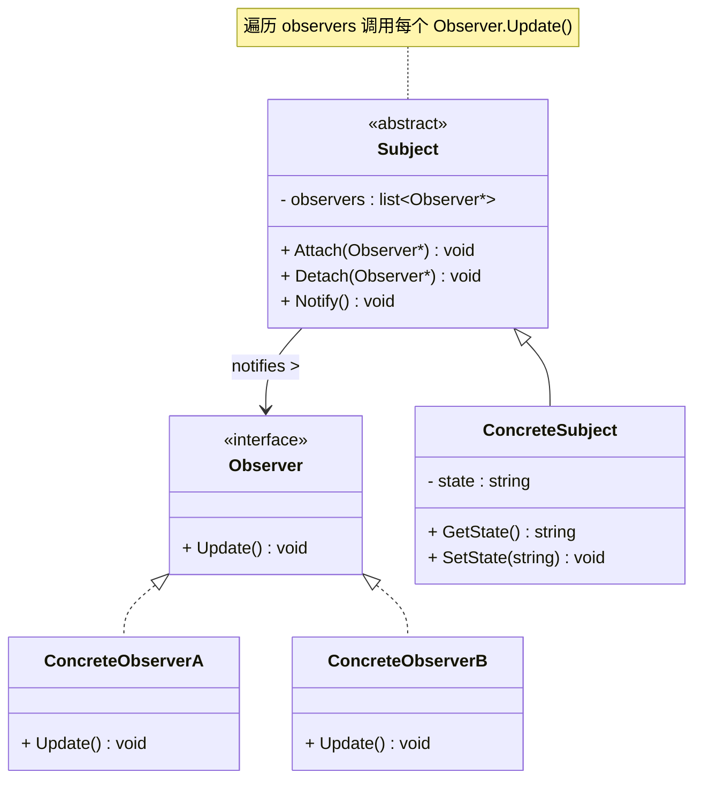
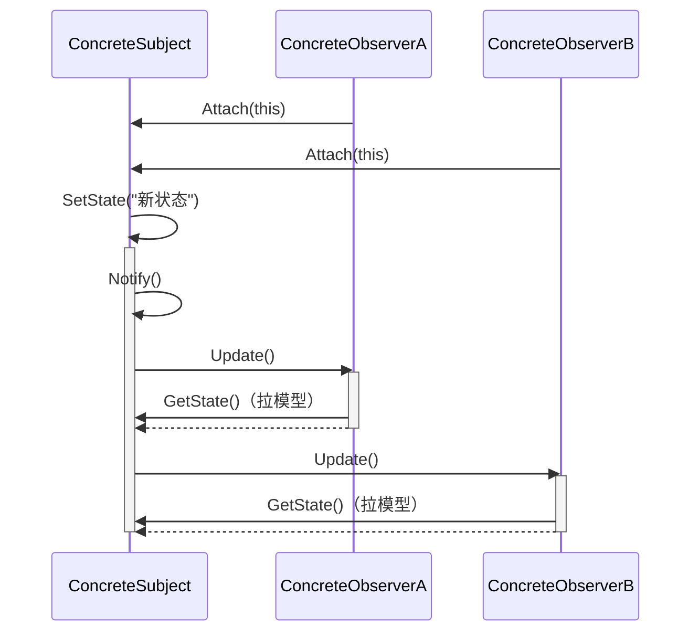

# 观察者模式 (Observer Pattern)

## 概述

**观察者模式**（Observer Pattern），又称 **发布-订阅模式**（Publish-Subscribe Pattern），属于 **行为型设计模式**。它定义了一种一对多的依赖关系，当一个对象的状态发生改变时，所有依赖于它的对象都会得到通知并自动更新。

> **定义**：定义对象间的一种一对多的依赖关系，使得每当一个对象改变状态，所有依赖于它的对象都会得到通知并被自动更新。

### 一个直觉感受

```cpp
// 你关注了一个微信公众号。
// 公众号（被观察者）发了文章 → 你（观察者）立刻收到推送。
// 你取关 → 从此不再收到推送。

// 不用观察者模式：你每隔 5 分钟打开微信，手动刷新检查有没有新文章
// 用观察者模式：公众号发文章时主动推送给你
```

### 核心机制

```
┌──────────────┐       注册           ┌──────────────┐
│   Subject    │◄────────────────────│   Observer   │
│  (被观察者)  │      push通知        │  (观察者)     │
│              │─────────────────────▶│              │
│  - observers│                      │  + Update()  │
│  + Attach() │                      │              │
│  + Detach() │                      └──────────────┘
│  + Notify() │
└──────────────┘
```

---

## 核心设计思想

### 两个角色

| 角色 | 名称 | 职责 |
|---|---|---|
| **被观察者 (Subject)** | `Subject` | 维护观察者列表，提供注册/移除方法，状态改变时遍历列表通知所有观察者 |
| **观察者 (Observer)** | `Observer` | 定义一个 `Update()` 接口，当 Subject 通知时调用此方法做出响应 |

### 推模型 vs 拉模型

观察者模式有两种数据传递方式：

```
推模型（Push）：
  Subject.Notify() → 把数据作为参数 push 给 Observer.Update(data)
  优点：观察者立刻拿到数据
  缺点：可能推了观察者不需要的数据

拉模型（Pull）：
  Subject.Notify() → 只通知"变了"
  Observer.Update() → 主动调用 Subject.GetData() 拉取需要的数据
  优点：观察者按需取数据
  缺点：观察者需要知道 Subject 的接口
```

---

## UML 类图



### 时序图



---

## C++ 实现

### 经典实现：气象站

```cpp
#include <iostream>
#include <vector>
#include <string>
#include <algorithm>

// ============ 前向声明 ============
class Observer;

// ============ 抽象被观察者 ============
class Subject {
    std::vector<Observer*> observers_;

public:
    void Attach(Observer* obs) {
        observers_.push_back(obs);
        std::cout << "  [Subject] 新增一个观察者 (当前 " << observers_.size() << " 个)"
                  << std::endl;
    }

    void Detach(Observer* obs) {
        auto it = std::remove(observers_.begin(), observers_.end(), obs);
        observers_.erase(it, observers_.end());
        std::cout << "  [Subject] 移除一个观察者 (当前 " << observers_.size() << " 个)"
                  << std::endl;
    }

protected:
    void Notify();
};

// ============ 抽象观察者 ============
class Observer {
public:
    virtual ~Observer() = default;
    virtual void Update() = 0;
};

// Notify 必须放在 Observer 声明之后定义
void Subject::Notify() {
    for (auto* obs : observers_)
        obs->Update();
}

// ============ 具体被观察者：气象站 ============
class WeatherStation : public Subject {
    double temperature_ = 0;
    double humidity_ = 0;

public:
    void SetMeasurements(double temp, double hum) {
        temperature_ = temp;
        humidity_ = hum;
        std::cout << "\n[气象站] 新数据: "
                  << temperature_ << "°C, " << humidity_ << "%"
                  << std::endl;

        Notify();  // ★ 状态一变，通知所有观察者
    }

    double GetTemperature() const { return temperature_; }
    double GetHumidity()    const { return humidity_; }
};

// ============ 具体观察者：手机端显示 ============
class PhoneDisplay : public Observer {
    std::string name_;
    WeatherStation& station_;

public:
    PhoneDisplay(const std::string& name, WeatherStation& station)
        : name_(name), station_(station) {}

    void Update() override {
        // 拉模型：主动从 Subject 取需要的数据
        std::cout << "  [" << name_ << " 手机] 收到推送: "
                  << station_.GetTemperature() << "°C, "
                  << station_.GetHumidity() << "%"
                  << std::endl;
    }
};

// ============ 具体观察者：Web 端显示 ============
class WebDisplay : public Observer {
    WeatherStation& station_;

public:
    explicit WebDisplay(WeatherStation& station) : station_(station) {}

    void Update() override {
        std::cout << "  [网页后台] 更新仪表盘: "
                  << station_.GetTemperature() << "°C"
                  << std::endl;
    }
};

// ============ 客户端 ============
int main() {
    WeatherStation station;

    PhoneDisplay phone("张三", station);
    WebDisplay web(station);

    // 注册观察者
    station.Attach(&phone);
    station.Attach(&web);

    // 气象站更新数据 → 观察者自动收到通知
    station.SetMeasurements(25.5, 65.0);
    station.SetMeasurements(26.1, 60.3);

    // 取消关注
    station.Detach(&web);

    station.SetMeasurements(27.0, 55.0);

    return 0;
}
```

### 输出

```
  [Subject] 新增一个观察者 (当前 1 个)
  [Subject] 新增一个观察者 (当前 2 个)

[气象站] 新数据: 25.5°C, 65%
  [张三 手机] 收到推送: 25.5°C, 65%
  [网页后台] 更新仪表盘: 25.5°C

[气象站] 新数据: 26.1°C, 60.3%
  [张三 手机] 收到推送: 26.1°C, 60.3%
  [网页后台] 更新仪表盘: 26.1°C

  [Subject] 移除一个观察者 (当前 1 个)

[气象站] 新数据: 27°C, 55%
  [张三 手机] 收到推送: 27°C, 55%
```

### 关键解读

```
station.SetMeasurements(25.5, 65)          
    │
    ├── 1. 保存数据
    ├── 2. 调用 Notify()
    │       │
    │       ├── 遍历 observers_
    │       ├── phone.Update()  → 拉数据 + 渲染手机 UI
    │       └── web.Update()    → 拉数据 + 更新网页仪表盘
    │
    └── 完毕——气象站不知道有多少人关注，也不关心他们拿数据去干啥
```

---

### C++11 现代实现：std::function + lambda

不用完整的类层次结构，用 `std::function` 可以让观察者更灵活：

```cpp
#include <iostream>
#include <vector>
#include <functional>
#include <string>

class EventEmitter {
public:
    // 注册回调 —— 比面向对象版本简单得多
    void OnUpdate(std::function<void(double, double)> callback) {
        callbacks_.push_back(std::move(callback));
    }

    // 触发通知
    void Notify(double temp, double hum) {
        for (auto& cb : callbacks_)
            cb(temp, hum);                    // ← 推模型：直接传数据
    }

private:
    std::vector<std::function<void(double, double)>> callbacks_;
};

int main() {
    EventEmitter station;

    // 注册观察者 —— lambda，不需要继承任何类！
    station.OnUpdate([](double temp, double hum) {
        std::cout << "[手机] " << temp << "°C, " << hum << "%" << std::endl;
    });

    station.OnUpdate([](double temp, double hum) {
        std::cout << "[Web] " << temp << "°C" << std::endl;
    });

    station.Notify(25.5, 65.0);
    station.Notify(26.1, 60.3);

    return 0;
}
```

### 输出

```
[手机] 25.5°C, 65%
[Web] 25.5°C
[手机] 26.1°C, 60.3%
[Web] 26.1°C
```

---

## 实际应用场景

### 1. GUI 事件系统

```cpp
// 按钮点击 → 通知所有绑定的回调
class Button : public Subject {
public:
    void Click() {
        std::cout << "[按钮] 被点击" << std::endl;
        Notify();
    }
};

class SaveHandler : public Observer {
    void Update() override { std::cout << "  → 保存文件" << std::endl; }
};

class CloseHandler : public Observer {
    void Update() override { std::cout << "  → 关闭窗口" << std::endl; }
};

Button btn;
btn.Attach(new SaveHandler());
btn.Attach(new CloseHandler());
btn.Click();
// 输出：
// [按钮] 被点击
//   → 保存文件
//   → 关闭窗口
```

> **现实案例**：Qt 的信号槽、HTML DOM 的 `addEventListener`、Android 的 `setOnClickListener`——都是观察者模式。

### 2. 消息队列 / 事件总线

```cpp
class EventBus {
    std::map<std::string, std::vector<std::function<void(const Event&)>>> handlers_;

public:
    void Subscribe(const std::string& event, std::function<void(const Event&)> h) {
        handlers_[event].push_back(std::move(h));
    }

    void Publish(const std::string& event, const Event& data) {
        for (auto& h : handlers_[event])
            h(data);
    }
};

// 使用：
EventBus bus;

bus.Subscribe("user.login", [](const Event& e) {
    std::cout << "用户 " << e.data["name"] << " 登录了" << std::endl;
});

bus.Subscribe("user.login", [](const Event& e) {
    LogService::Record("登录", e.data["name"]);  // 记录日志
});

bus.Publish("user.login", Event{{"name", "张三"}});
// 所有订阅 "user.login" 的处理函数依次执行
```

### 3. MVC 架构的数据绑定

```
Model（被观察者）
  │
  ├──▶ View（观察者）——数据变了，界面自动刷新
  └──▶ Controller（观察者）——数据变了，执行业务逻辑
```

```cpp
class UserModel : public Subject {
    string name_;
    int age_;

public:
    void SetName(const string& n) { name_ = n; Notify(); }
    void SetAge(int a) { age_ = a; Notify(); }
};

class ProfileView : public Observer {
    UserModel& model_;
    void Update() override {
        // 数据变了 → 刷新 UI
        refreshUI(model_.GetName(), model_.GetAge());
    }
};
```

### 4. 游戏成就系统

```cpp
// 玩家做了某件事 → 成就系统、UI、音效分别响应
Player player;

player.OnScoreChange([](int newScore) {
    if (newScore >= 1000) AchievementUnlock("千分达人");
});

player.OnScoreChange([](int newScore) {
    HUD::UpdateScore(newScore);           // 更新界面
});

player.OnScoreChange([](int newScore) {
    if (newScore % 100 == 0) Audio::Play("combo");  // 音效
});

player.AddScore(50);
player.AddScore(1000);
```
> **现实案例**：Unity 的 `UnityEvent`、Unreal 的 `Delegate` ——都是基于观察者模式的事件系统。

---

## 注意事项

### 1. 观察者不要在 Update() 中修改观察者列表

```cpp
// ❌ 危险！观察者在 Update() 中 Detach 自己
void Update() override {
    if (ShouldStop()) {
        subject_->Detach(this);   // Notify 正在遍历 observers_！
    }                            // 迭代器失效 → 崩溃
}
```

**解决方法：** Subject 在 `Notify()` 之前复制一份观察者列表。

### 2. 注册了别忘了取消

```cpp
// ❌ Subject 持有了 Observer 的裸指针 → Observer 析构后变成野指针
Observer* obs = new Observer();
subject->Attach(obs);
delete obs;                     // Subject 还持有这个野指针！
subject->Notify();              // 崩！
```

### 3. 不要通知太频繁

```cpp
// ❌ 每次微小的变化都通知
for (int i = 0; i < 10000; i++) {
    station.SetMeasurements(i * 0.01, 50);  // 通知 10000 次！
}

// ✅ 批量更新，或者合并通知
station.SetMeasurementsBatch(data);
station.Notify();  // 只通知一次
```

---

## 优缺点

### 优点

| # | 说明 |
|---|---|
| ✅ | **松耦合** — Subject 不知道具体有哪些 Observer，只依赖抽象 Observer 接口 |
| ✅ | **一对多通知** — 一个状态变化，自动同步更新所有观察者 |
| ✅ | **符合开闭原则** — 新增观察者无需修改 Subject |
| ✅ | **动态订阅/取消** — 运行时随时 Attach / Detach |
| ✅ | **触发联动** — 一个事件可以触发多个不同的响应 |

### 缺点

| # | 说明 |
|---|---|
| ❌ | **通知顺序不确定** — 多个观察者的调用顺序可能影响结果 |
| ❌ | **性能问题** — 观察者太多时，Notify 遍历开销大 |
| ❌ | **调试困难** — 出问题时，不知道是哪个观察者的 Update 造成的 |
| ❌ | **内存泄漏风险** — 忘记 Detach 导致 Observer 无法释放 |

---

## 适用场景

| 场景 | 说明 |
|---|---|
| **一对多依赖** | 一个对象的状态变化需要通知多个对象 |
| **事件驱动系统** | GUI 按钮点击、键盘事件、网络消息 |
| **数据绑定** | Model 变化 → View 自动刷新 |
| **广播通知** | 游戏成就、系统告警、消息推送 |

---

## 总结

观察者模式的核心是一个**订阅-通知-响应**的循环：

```
1. Observer 说 "我关注你"     → Attach
2. Subject 状态改变            → SetState
3. Subject 说 "我变了！"      → Notify
4. Observer 说 "收到，我更新"  → Update
5. Observer 说 "我不关注你了"  → Detach
```

它解决了所有"一个源头，多个下游"的场景。当你在用信号槽、事件监听器、消息队列时，你就已经在用观察者模式了——只是换了个名字而已。
