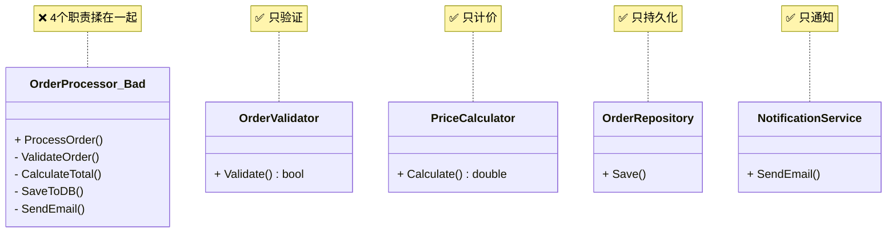
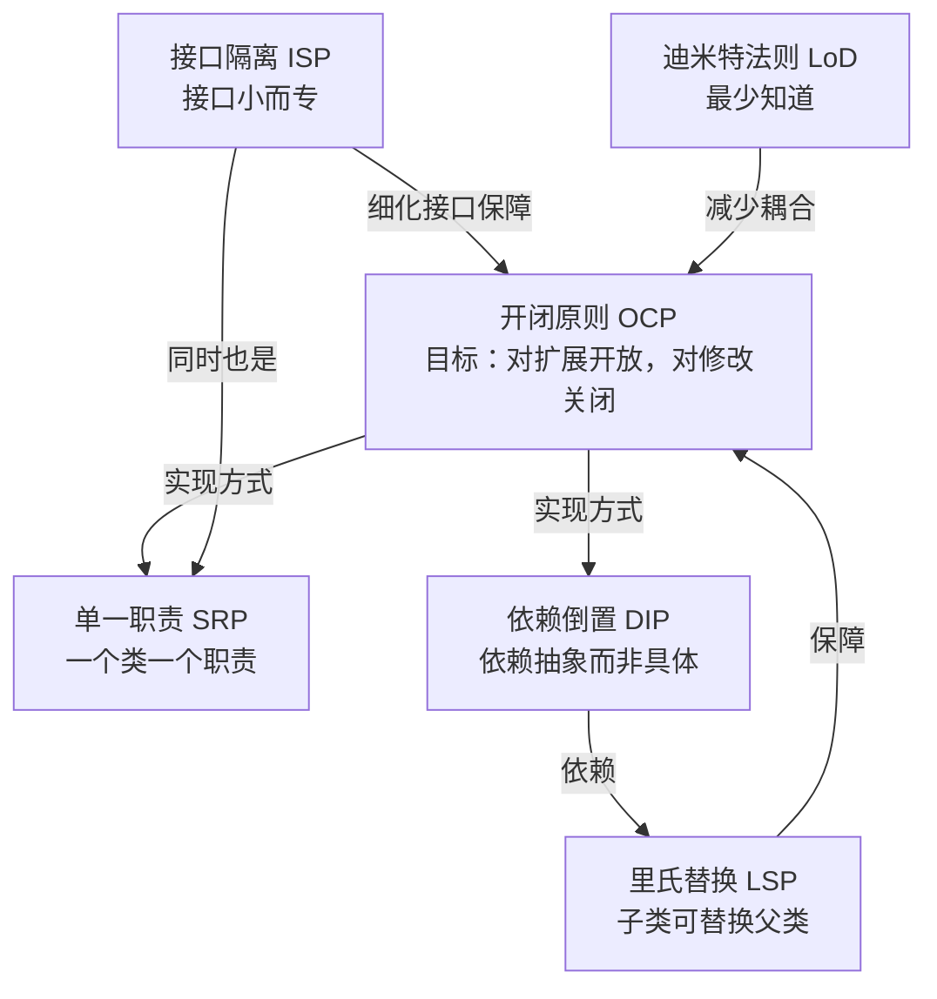

# 面向对象六大设计原则 (SOLID + LoD)

## 概述

面向对象六大设计原则是设计模式的基础和指导思想。**每一个设计模式都是对其中一个或多个原则的具体实践**。理解这些原则，比记住二十多个模式本身更为重要。

> **原则是"为什么"，模式是"怎么做"。**

| # | 原则 | 英文 | 简称 |
|---|---|---|---|
| 1 | **单一职责原则** | Single Responsibility Principle | **SRP** |
| 2 | **开闭原则** | Open-Closed Principle | **OCP** |
| 3 | **里氏替换原则** | Liskov Substitution Principle | **LSP** |
| 4 | **接口隔离原则** | Interface Segregation Principle | **ISP** |
| 5 | **依赖倒置原则** | Dependency Inversion Principle | **DIP** |
| 6 | **迪米特法则** | Law of Demeter / Least Knowledge Principle | **LoD** |

前 5 个合称 **SOLID**，加迪米特法则即为通常所说的"六大原则"。

---

## 1. 单一职责原则 (SRP)

### 定义

> **一个类只应该有一个引起它变化的原因。**  
> *A class should have only one reason to change.*

换句话说，一个类只负责**一件事**，并且把这件事做好。

### 反面例子：违反 SRP

```cpp
class OrderProcessor {
public:
    void ProcessOrder(const Order& order) {
        // 职责 1：验证订单
        if (!ValidateOrder(order))
            throw std::runtime_error("Invalid order");

        // 职责 2：计算价格
        double total = CalculateTotal(order);

        // 职责 3：保存到数据库
        SaveToDB(order, total);

        // 职责 4：发送邮件通知
        SendEmail(order.CustomerEmail(), "您的订单已处理");
    }

private:
    bool ValidateOrder(const Order& o) { /* ... */ }
    double CalculateTotal(const Order& o) { /* ... */ }
    void SaveToDB(const Order& o, double total) { /* ... */ }
    void SendEmail(const string& addr, const string& msg) { /* ... */ }
};
```

**问题**：验证、计算、持久化、通知 —— 四个职责塞在一个类里。数据库从 MySQL 切到 Redis 要改这个类，邮件服务商变了也要改这个类。

### 正确做法：拆分

```cpp
// 职责 1：验证
class OrderValidator {
public:
    bool Validate(const Order& order);
};

// 职责 2：计价
class PriceCalculator {
public:
    double Calculate(const Order& order);
};

// 职责 3：持久化
class OrderRepository {
public:
    void Save(const Order& order, double total);
};

// 职责 4：通知
class NotificationService {
public:
    void SendEmail(const string& to, const string& msg);
};

// 协调者（职责单一：编排流程）
class OrderProcessor {
    OrderValidator validator_;
    PriceCalculator calculator_;
    OrderRepository repository_;
    NotificationService notifier_;
public:
    void ProcessOrder(const Order& order) {
        if (!validator_.Validate(order)) throw ...;
        double total = calculator_.Calculate(order);
        repository_.Save(order, total);
        notifier_.SendEmail(order.CustomerEmail(), "处理完成");
    }
};
```

### 判断是否违反 SRP 的方法

> **用一句话描述这个类在做什么。如果句子中出现"和"、"并"、"同时"，通常就违反了 SRP。**

```
❌ "OrderProcessor 负责验证订单 **并** 计算价格 **并** 保存到数据库 **并** 发送通知"
✅ "OrderValidator 负责验证订单"
```

### UML 对比



---

## 2. 开闭原则 (OCP)

### 定义

> **对扩展开放，对修改关闭。**  
> *Open for extension, closed for modification.*

核心意思是：**增加新功能时，尽量通过增加新代码来实现，而不是修改已有的代码。**

### 反面例子：违反 OCP

```cpp
class AreaCalculator {
public:
    double CalculateArea(const std::vector<Shape*>& shapes) {
        double total = 0;
        for (auto* s : shapes) {
            if (s->Type() == "circle") {         // ← 判断类型
                auto* c = dynamic_cast<Circle*>(s);
                total += 3.14 * c->Radius() * c->Radius();
            } else if (s->Type() == "rect") {    // ← 再加类型就要改这里
                auto* r = dynamic_cast<Rect*>(s);
                total += r->Width() * r->Height();
            }
            // 加三角形？加椭圆？→ 改这个函数！
        }
        return total;
    }
};
```

**问题**：每次新增一种形状，都要打开 `CalculateArea` 加一个 `else if`。

### 正确做法：多态

```cpp
class Shape {
public:
    virtual ~Shape() = default;
    virtual double Area() const = 0;   // 每个形状自己算面积
};

class Circle : public Shape {
    double radius_;
public:
    explicit Circle(double r) : radius_(r) {}
    double Area() const override { return 3.14159 * radius_ * radius_; }
};

class Rect : public Shape {
    double w_, h_;
public:
    Rect(double w, double h) : w_(w), h_(h) {}
    double Area() const override { return w_ * h_; }
};

// 新增三角形——加一个新类就行，不用改任何已有代码！
class Triangle : public Shape {
    double base_, height_;
public:
    Triangle(double b, double h) : base_(b), height_(h) {}
    double Area() const override { return 0.5 * base_ * height_; }
};

class AreaCalculator {
public:
    double CalculateArea(const std::vector<Shape*>& shapes) {
        double total = 0;
        for (auto* s : shapes)
            total += s->Area();   // ← 永不修改！
        return total;
    }
};
```

### 如何理解"关闭修改"

> 不是"永远不改"——当需求本身发生变化时肯定要改。OCP 指的是**已有的、稳定的功能不因新增功能而改动**。

### 设计模式中的 OCP 体现

| 模式 | 如何实现 OCP |
|---|---|
| **策略模式** | 新增策略 = 新建一个类，Context 不用改 |
| **简单工厂** | ❌ 违反 OCP —— 新增产品要改工厂的 switch |
| **工厂方法** | 新增产品 = 新增一个工厂子类，原有工厂不修改 |

---

## 3. 里氏替换原则 (LSP)

### 定义

> **所有使用基类的地方，必须能够透明地替换为子类对象而不影响程序正确性。**  
> *Objects of a superclass shall be replaceable with objects of its subclasses without breaking the system.*

### 反面例子：经典"矩形-正方形"问题

```cpp
class Rect {
protected:
    int w_, h_;
public:
    virtual void SetWidth(int w) { w_ = w; }
    virtual void SetHeight(int h) { h_ = h; }
    int Area() const { return w_ * h_; }
};

// 正方形"是一个"矩形？从数学上是，从设计上不是！
class Square : public Rect {
public:
    void SetWidth(int w) override {
        Rect::SetWidth(w);
        Rect::SetHeight(w);   // 保持正方形约束
    }
    void SetHeight(int h) override {
        Rect::SetWidth(h);
        Rect::SetHeight(h);
    }
};

// 客户端代码 —— 对基类编程
void Resize(Rect& r) {
    r.SetWidth(5);
    r.SetHeight(10);
    assert(r.Area() == 50);   // ← 传入 Square 时会断言失败！
}
```

**问题**：`Square` 重写了 `SetWidth` / `SetHeight` 的语义，破坏了基类"宽高独立"的约定。

### 正确的做法

要么 `Rect` 和 `Square` 没有继承关系：

```cpp
class Shape {
public:
    virtual int Area() const = 0;
};

class Rect : public Shape {
    int w_, h_;
public:
    void SetSize(int w, int h) { w_ = w; h_ = h; }
    int Area() const override { return w_ * h_; }
};

class Square : public Shape {
    int side_;
public:
    void SetSide(int s) { side_ = s; }
    int Area() const override { return side_ * side_; }
};
```

### LSP 的约束条件

| 约束 | 说明 | 反例 |
|---|---|---|
| **前置条件不能增强** | 子类方法不能比基类要求更多 | 基类接受 `int`，子类要求 `> 0` |
| **后置条件不能减弱** | 子类方法不能比基类保证更少 | 基类保证返回非空，子类可能返回 `nullptr` |
| **不变量必须保持** | 基类的不变量子类也不能破坏 | 正方形破坏了"宽高独立"的不变量 |

### 一条简单判断

> 如果子类重写一个方法后方法体是**空的**或者**抛异常**，几乎一定违反了 LSP。

```cpp
class Bird {
public:
    virtual void Fly() { /* 飞 */ }
};
class Penguin : public Bird {
public:
    void Fly() override { throw std::runtime_error("企鹅不会飞"); }  // ❌ LSP
};
```

---

## 4. 接口隔离原则 (ISP)

### 定义

> **不应该强迫客户端依赖它不需要的接口。**  
> *Clients should not be forced to depend on interfaces they do not use.*

核心思想：**大接口拆成小接口**，每个接口服务于一个特定的客户端。

### 反面例子：胖接口

```cpp
// "万能"接口 —— 什么都有
class Worker {
public:
    virtual ~Worker() = default;
    virtual void Work() = 0;
    virtual void Eat() = 0;
    virtual void Sleep() = 0;
    virtual void Code() = 0;
    virtual void Design() = 0;
};

class HumanEngineer : public Worker {
public:
    void Work() override { /* 工作 */ }
    void Eat() override { /* 吃饭 */ }
    void Sleep() override { /* 睡觉 */ }
    void Code() override { /* 写代码 */ }
    void Design() override { /* 设计架构 */ }
};

class Robot : public Worker {
public:
    void Work() override { /* 干活 */ }
    void Eat() override { throw ...; }    // ❌ 机器人不用吃
    void Sleep() override { throw ...; }  // ❌ 机器人不用睡
    void Code() override { /* 能写代码 */ }
    void Design() override { throw ...; } // ❌ 机器人不会设计
};
```

**问题**：`Robot` 被强迫实现了三个不需要的方法，违反了 LSP 也违反了 ISP。

### 正确做法：拆分接口

```cpp
// 按职责拆成多个小接口
class Workable {
public:
    virtual ~Workable() = default;
    virtual void Work() = 0;
};

class Eatable {
public:
    virtual ~Eatable() = default;
    virtual void Eat() = 0;
};

class Sleepable {
public:
    virtual ~Sleepable() = default;
    virtual void Sleep() = 0;
};

class Coder {
public:
    virtual ~Coder() = default;
    virtual void Code() = 0;
};

class Designer {
public:
    virtual ~Designer() = default;
    virtual void Design() = 0;
};

// 人类工程师：实现全部
class HumanEngineer : public Workable, public Eatable,
                      public Sleepable, public Coder, public Designer {
public:
    void Work() override { /* ... */ }
    void Eat() override { /* ... */ }
    void Sleep() override { /* ... */ }
    void Code() override { /* ... */ }
    void Design() override { /* ... */ }
};

// 机器人：只实现需要的
class Robot : public Workable, public Coder {
public:
    void Work() override { /* ... */ }
    void Code() override { /* ... */ }
};
```

### ISP 的判断标准

> 如果一个接口的某个方法在实现类中是 **空方法** 或 **抛异常**，就该考虑拆分接口了。

---

## 5. 依赖倒置原则 (DIP)

### 定义

> **高层模块不应该依赖低层模块，二者都应该依赖抽象。  
> 抽象不应该依赖细节，细节应该依赖抽象。**  
> *Depend upon abstractions, not upon concretions.*

### 反面例子：高层直接依赖低层

```cpp
// ===== 低层模块 =====
class MySQLDatabase {
public:
    void Insert(const string& sql) { /* MySQL 特定实现 */ }
};

// ===== 高层模块 =====
class UserService {
private:
    MySQLDatabase db_;   // ← 直接依赖具体实现！
public:
    void CreateUser(const User& u) {
        db_.Insert("INSERT INTO users ...");
    }
};
```

**问题**：想换 PostgreSQL、SQLite 或者 Redis，必须修改 `UserService`。

### 正确做法：依赖抽象

```cpp
// ===== 抽象 =====
class Database {
public:
    virtual ~Database() = default;
    virtual void Insert(const string& sql) = 0;
    virtual void Query(const string& sql) = 0;
};

// ===== 低层模块（依赖抽象） =====
class MySQLDatabase : public Database {
public:
    void Insert(const string& sql) override { /* MySQL */ }
    void Query(const string& sql) override { /* MySQL */ }
};

class PostgreSQLDatabase : public Database {
public:
    void Insert(const string& sql) override { /* PostgreSQL */ }
    void Query(const string& sql) override { /* PostgreSQL */ }
};

// ===== 高层模块（依赖抽象） =====
class UserService {
private:
    Database& db_;   // ← 依赖抽象，不依赖具体
public:
    explicit UserService(Database& db) : db_(db) {}
    void CreateUser(const User& u) {
        db_.Insert("INSERT INTO users ...");
    }
};

// ===== 客户端负责装配 =====
int main() {
    MySQLDatabase mysql_db;
    UserService service(mysql_db);   // 注入具体实现
    service.CreateUser(user);
    // 换数据库只需改这一行
    // PostgreSQLDatabase pg_db;
    // UserService service(pg_db);
}
```

### DIP 和依赖注入

依赖倒置原则通常通过**依赖注入**（Dependency Injection）来实现：

```
UserService ──依赖──→ Database(抽象) ←──实现── MySQLDatabase
     ↑                                    ↑
     │                                    │
     └──── 构造函数注入 ──────────────────┘
```

| 注入方式 | 说明 |
|---|---|
| **构造函数注入** | 通过构造函数传入依赖（最常用） |
| **Setter 注入** | 通过 `SetDatabase()` 方法设置 |
| **接口注入** | 实现一个注入接口 |

### 设计模式中的 DIP 体现

| 模式 | 体现 |
|---|---|
| **策略模式** | Context 依赖 Strategy 抽象，不依赖具体策略 |
| **工厂方法** | 创建者依赖抽象产品，不依赖具体产品 |
| **抽象工厂** | 客户端依赖抽象工厂接口 |

---

## 6. 迪米特法则 (LoD)

### 定义

> **一个对象应该对其他对象保持最少的了解。**  
> **只与你的直接朋友通信，不跟"陌生人"说话。**  
> *Each unit should have only limited knowledge about other units.*

### 反面例子：链条调用

```cpp
class Engine {
public:
    void Start() { /* ... */ }
};

class Car {
public:
    Engine* GetEngine() { return &engine_; }
private:
    Engine engine_;
};

class Driver {
public:
    void Drive(Car& car) {
        // ❌ Driver 直接操作了 Engine（陌生对象）
        car.GetEngine()->Start();
    }
};
```

**问题**：`Driver` 知道了 `Car` 的内部组成（有 `Engine`），并且直接操作它。如果未来 `Engine` 改名或接口变化，`Driver` 也要改。

### 正确做法：封装

```cpp
class Car {
private:
    Engine engine_;
public:
    void Start() { engine_.Start(); }   // 封装内部细节
};

class Driver {
public:
    void Drive(Car& car) {
        car.Start();   // ✅ 只和自己的直接朋友 Car 通信
    }
};
```

### 什么是"直接朋友"？

一个对象的"朋友"包括：

1. **自身**（`this`）
2. **成员变量中的对象**
3. **方法参数中的对象**
4. **方法内创建的对象**

不是朋友的对象：

5. **方法返回值中的对象的成员**（❌ `car.GetEngine()->Start()`）
6. **全局变量中的对象**

### 违反 LoD 的常见代码气味

```cpp
// ❌ 链式调用过深（超过 2 层点号）
user.GetProfile().GetAddress().GetCity();

// ❌ 跳过中间人直接操作内部
store.GetInventory().GetItem(0).GetPrice();

// ❌ 返回内部数据结构
class School {
public:
    vector<Student*>& GetStudents() { return students_; }  // ← 暴露内部
private:
    vector<Student*> students_;
};

// 客户端直接修改内部数据
school.GetStudents().push_back(new Student());
```

### 正确做法

```cpp
// ✅ 封装，提供有意义的接口
class School {
public:
    void AddStudent(Student* s) { students_.push_back(s); }
    bool Enroll(const string& name, int age) {
        auto* s = new Student(name, age);
        students_.push_back(s);
        return RegisterCourse(s);
    }
private:
    vector<Student*> students_;
    bool RegisterCourse(Student* s);
};
```

---

## 六大原则相互关系



| 原则 | 关注点 | 一句话 |
|---|---|---|
| **SRP** | 类的粒度 | 一个类只做一件事 |
| **OCP** | 扩展性 | 加功能不加修改 |
| **LSP** | 继承关系 | 别把子类当"二等公民" |
| **ISP** | 接口粒度 | 接口不是越大越好 |
| **DIP** | 依赖方向 | 面向接口编程 |
| **LoD** | 耦合度 | 别管别人的内部事 |

---

## 总结

六大原则不是互相独立的，它们从不同角度回答了同一个问题：**如何设计出高内聚、低耦合、易维护的代码？**

```
高内聚 ─→ SRP（一个类职责集中）
低耦合 ─→ LoD（少知道别人）、DIP（依赖抽象而非具体）
易扩展 ─→ OCP（不改已有代码）
可替换 ─→ LSP（子类可替代基类）
精准接口 ─→ ISP（客户端只看到需要的）
```

> **当你犹豫要不要用某个设计模式时，回头看看这些原则——它们才是最终的判断依据。**
