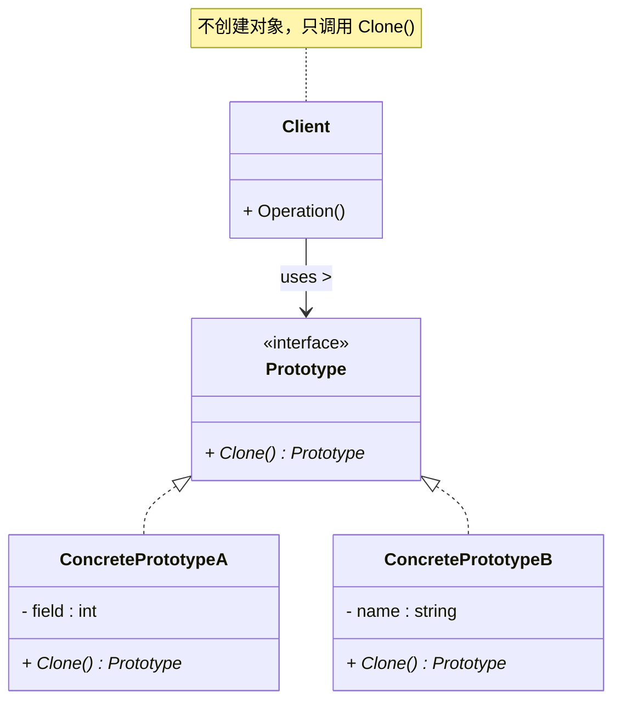
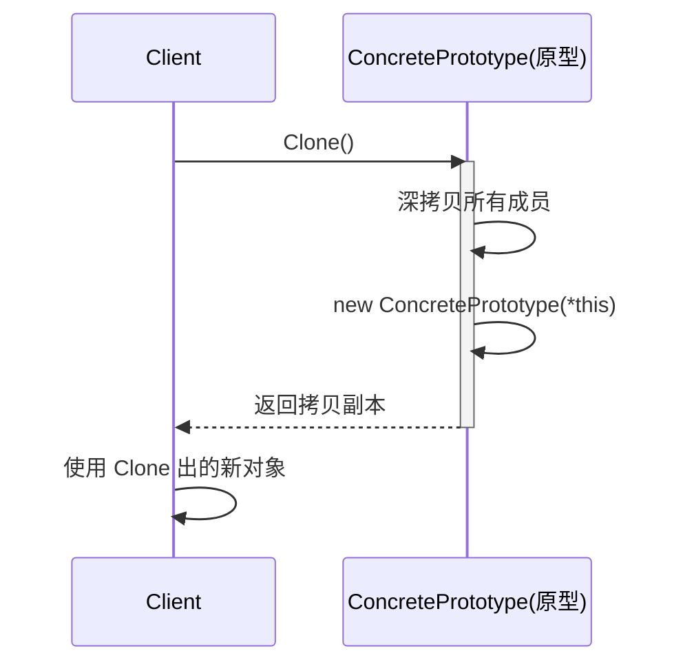

# 原型模式 (Prototype Pattern)

## 概述

**原型模式**（Prototype Pattern），属于 **创建型设计模式**。它不再用 `new` 关键字直接创建对象，而是通过**复制一个已有的实例**来得到新对象。被复制的那个实例就是"原型"。

> **定义**：用原型实例指定创建对象的种类，并通过拷贝这些原型来创建新的对象。

### 一个直觉感受

```cpp
// 不用原型：
// 每次创建游戏怪物都要重新初始化，数据可能很复杂
Goblin g1;
g1.LoadConfig("goblin");     // 属性、技能、掉落表……初始化很耗时
Goblin g2;
g2.LoadConfig("goblin");     // 又来一遍！能不能直接复制 g1？

// 用原型：
Goblin& prototype = Goblin::GetPrototype();  // 初始化一次
Goblin* g1 = prototype.Clone();              // 拷贝，瞬间完成
Goblin* g2 = prototype.Clone();              // 拷贝，瞬间完成
Goblin* g3 = prototype.Clone();              // 拷贝，瞬间完成
```

用原型模式有两大核心优势：

1. **避免重复的昂贵初始化** — 如果对象的默认构造过程涉及加载文件、解析配置、查询数据库等耗时操作，第一次构造完成后，后续 Clone 只走拷贝构造（复制已有的值），省去所有重复开销
2. **简化** — 不需要创建与产品类平行的工厂类体系（比工厂方法更少类）

> **注意**：`Clone()` 内部 `make_unique<T>(*this)` 确实分配了内存、调用了构造函数——**但调用的是拷贝构造函数**。从头构造可能要加载文件（几百毫秒），拷贝构造只复制已有值（几微秒）。区别不在"要不要构造"，而在"构造时做了什么"。

---

## 核心设计思想

### 三个角色

| 角色 | 名称 | 职责 |
|---|---|---|
| **抽象原型 (Prototype)** | `Prototype` | 声明一个克隆自身的接口 `Clone()`，通常返回自身的智能指针 |
| **具体原型 (ConcretePrototype)** | `ConcretePrototype` | 实现 `Clone()` 方法，真正执行拷贝自身的操作 |
| **客户端 (Client)** | `Client` | 通过调用原型的 `Clone()` 获取新对象 |

### 两条路线对比：工厂方法 vs 原型

```
工厂方法路线：每个产品 = 一个工厂类
  ProductA ⇢ CreatorA（一个类）     ProductB ⇢ CreatorB（又一个类）
  产品 + 工厂 = 2 倍类数量

原型路线：每个产品自带复制能力
  ProductA::Clone()（一个方法实现）   ProductB::Clone()（一个方法实现）
  产品自身 = 克隆能力，不需要额外的工厂类
```

### Clone 方法的本质

```cpp
// Clone() 的本质就是一句话：
// "返回一个和当前对象状态一样的新对象"

class Prototype {
public:
    virtual unique_ptr<Prototype> Clone() const = 0;
    //     ↑              ↑          ↑
    //   返回拷贝        接口        const承诺不修改原对象
};
```

---

## UML 类图



### 时序图



---

## C++ 实现

### 经典实现：简历复印

```cpp
#include <iostream>
#include <memory>
#include <string>

// ============ 抽象原型 ============
class Resume {
public:
    virtual ~Resume() = default;
    virtual std::unique_ptr<Resume> Clone() const = 0;
    virtual void Display() const = 0;
};

// ============ 具体原型 ============
class ConcreteResume : public Resume {
private:
    std::string name_;
    std::string email_;
    int age_;
    std::string experience_;

public:
    ConcreteResume(const std::string& name,
                   const std::string& email,
                   int age)
        : name_(name), email_(email), age_(age) {
        // 模拟耗时初始化
        std::cout << "  [构造] 创建简历模板: " << name_ << std::endl;
    }

    // 拷贝构造函数 —— Clone() 的本质
    ConcreteResume(const ConcreteResume& other)
        : name_(other.name_ + "（副本）")
        , email_(other.email_)
        , age_(other.age_)
        , experience_(other.experience_) {
        std::cout << "  [拷贝] 克隆简历: " << name_ << std::endl;
    }

    // ★★★ Clone() 的核心实现 ★★★
    std::unique_ptr<Resume> Clone() const override {
        return std::make_unique<ConcreteResume>(*this);
    }

    // 另一个返回子类类型的方法 —— 调用方不需要 cast
    std::unique_ptr<ConcreteResume> CloneConcrete() const {
        return std::make_unique<ConcreteResume>(*this);
    }

    // 修改方法 —— Clone 之后可以个性化微调
    void SetExperience(const std::string& exp) { experience_ = exp; }

    void Display() const override {
        std::cout << "  姓名: " << name_ << "\n"
                  << "  邮箱: " << email_ << "\n"
                  << "  年龄: " << age_ << "\n"
                  << "  经历: " << (experience_.empty() ? "(未填写)" : experience_)
                  << std::endl;
    }
};

// ============ 客户端 ============
int main() {
    // ① 创建原型模板 —— 只初始化一次
    std::cout << "=== 创建原型 ===\n";
    ConcreteResume prototype("张三", "zhangsan@email.com", 28);
    prototype.SetExperience("腾讯 3 年，阿里 2 年");
    prototype.Display();

    // ② Clone 多份，微调不同信息投不同公司
    std::cout << "\n=== 投递字节跳动 ===\n";
    auto resume1 = prototype.CloneConcrete();
    resume1->SetExperience("腾讯 3 年，字节跳动方向匹配");
    resume1->Display();

    std::cout << "\n=== 投递美团 ===\n";
    auto resume2 = prototype.CloneConcrete();
    resume2->SetExperience("腾讯 3 年，熟悉电商业务");
    resume2->Display();

    std::cout << "\n=== 原型未变 ===\n";
    prototype.Display();

    return 0;
}
```

### 输出

```
=== 创建原型 ===
  [构造] 创建简历模板: 张三
  姓名: 张三
  邮箱: zhangsan@email.com
  年龄: 28
  经历: 腾讯 3 年，阿里 2 年

=== 投递字节跳动 ===
  [拷贝] 克隆简历: 张三（副本）
  姓名: 张三（副本）
  邮箱: zhangsan@email.com
  年龄: 28
  经历: 腾讯 3 年，字节跳动方向匹配

=== 投递美团 ===
  [拷贝] 克隆简历: 张三（副本）
  姓名: 张三（副本）
  邮箱: zhangsan@email.com
  年龄: 28
  经历: 腾讯 3 年，熟悉电商业务

=== 原型未变 ===
  姓名: 张三
  邮箱: zhangsan@email.com
  年龄: 28
  经历: 腾讯 3 年，阿里 2 年          ← 原型的经历没有变！
```

> **为什么有两个 Clone 方法？**
>
> - `Clone()` 返回 `unique_ptr<Resume>`（基类指针），这是原型模式的标准接口——任何通过基类指针拿到的原型，都能统一调用 `Clone()`，不需要知道它是什么子类。
> - `CloneConcrete()` 返回 `unique_ptr<ConcreteResume>`（子类指针），这是方便调用方的一个辅助方法——拿到子类指针后，可以直接调 `SetExperience()` 等子类特有的方法。
>
> 之前版本的代码用 `dynamic_cast<ConcreteResume*>(resume1.get())->SetExperience(...)` 也能达到同样的效果，但写法太绕了：
>   1. `resume1` 是 `unique_ptr<Resume>`，像一个带自动 `delete` 功能的盒子，里面装着 `Resume*` 裸指针
>   2. `.get()` 把盒子里的裸指针**取出来**（不释放所有权，`unique_ptr` 照常管理生命周期）
>   3. `dynamic_cast<ConcreteResume*>(...)` 把 `Resume*` 安全地向下转成 `ConcreteResume*`
>   4. 最后 `->SetExperience()` 调用子类的方法
>
> 多写一个 `CloneConcrete()` 方法，省掉 `.get()` 和 `dynamic_cast`，调用方直接用子类类型接收，干净又安全。

---

## 深拷贝 vs 浅拷贝

原型模式最大的坑就在这里。

### 浅拷贝（默认拷贝构造）——会出问题

```cpp
class Document {
private:
    std::string title_;
    std::string* content_;   // ← 指针成员！

public:
    Document(const std::string& t, const std::string& c)
        : title_(t), content_(new std::string(c)) {}

    ~Document() { delete content_; }

    // 默认拷贝：只复制指针的值（地址），不复制指向的内容
    // Document(const Document&) = default;  ← 编译器生成的浅拷贝
};
```

```
浅拷贝之后：
    原对象                副本
  ┌─────────┐         ┌─────────┐
  │ content_│─────┐   │ content_│─────┐
  └─────────┘     │   └─────────┘     │
                  ▼                   ▼
             同一块内存！◄─────两个指针指向同一个地方！
```

**后果**：原对象析构时 `delete content_` 释放内存，副本的 `content_` 变成**野指针**。再析构副本时 `delete` 野指针 → **崩溃**。

### 深拷贝 —— 正确的做法

```cpp
class Document {
private:
    std::string title_;
    std::string* content_;   // 指针成员

public:
    Document(const std::string& t, const std::string& c)
        : title_(t), content_(new std::string(c)) {}

    // 深拷贝：不但复制指针，还复制指针指向的内容
    Document(const Document& other)
        : title_(other.title_)
        , content_(new std::string(*other.content_))  // ← 新建内存，拷贝内容
    {}

    std::unique_ptr<Document> Clone() const {
        return std::make_unique<Document>(*this);  // 走深拷贝构造
    }

    ~Document() { delete content_; }
};
```

```
深拷贝之后：
    原对象                副本
  ┌─────────┐         ┌─────────┐
  │ content_│─────┐   │ content_│─────┐
  └─────────┘     │   └─────────┘     │
                  ▼                   ▼
            "hello world"        "hello world"
            两块独立的内存 ◄──────── 互不影响
```

### 判断规则

| 成员类型 | 默认拷贝行为 | 是否需要手动深拷贝 |
|---|---|---|
| `int`、`double`、`bool` | 值拷贝，安全 ✅ | 不需要 |
| `std::string` | 深拷贝，安全 ✅ | 不需要 |
| `std::vector<int>` | 深拷贝，安全 ✅ | 不需要 |
| `std::unique_ptr<T>` | **不能拷贝**，必须手动处理 | 需要 |
| 裸指针 `T*` | **浅拷贝**，两个指针指向同一块内存 ❌ | 需要 `new T(*ptr)` |
| C 数组 `char buf[256]` | 浅拷贝，安全（数组在对象内部）✅ | 一般不需要 |
| `std::shared_ptr<T>` | 浅拷贝（引用计数+1） | 取决于你要不要共享 |

**经验法则：**

> **如果对象里只有 `int`、`string`、`vector` 这类值类型，编译器默认的拷贝构造就是深拷贝，`Clone()` 直接 `return make_unique<T>(*this)` 就行。有裸指针就一定要写拷贝构造函数。**

---

## 原型注册表（Prototype Manager）

一个常见用法：用哈希表把原型"注册"起来，通过字符串查找对应的原型来 Clone：

```cpp
#include <iostream>
#include <memory>
#include <string>
#include <unordered_map>

// ============ 抽象原型 ============
class Shape {
public:
    virtual ~Shape() = default;
    virtual std::unique_ptr<Shape> Clone() const = 0;
    virtual void Draw() const = 0;
};

// ============ 具体原型 ============
class Circle : public Shape {
public:
    void Draw() const override { std::cout << "画一个圆" << std::endl; }
    std::unique_ptr<Shape> Clone() const override {
        return std::make_unique<Circle>(*this);
    }
};

class Rectangle : public Shape {
public:
    void Draw() const override { std::cout << "画一个矩形" << std::endl; }
    std::unique_ptr<Shape> Clone() const override {
        return std::make_unique<Rectangle>(*this);
    }
};

// ============ 原型管理器 ============
class ShapePrototypeManager {
private:
    std::unordered_map<std::string, std::unique_ptr<Shape>> prototypes_;

public:
    // 注册原型
    void Register(const std::string& key, std::unique_ptr<Shape> proto) {
        prototypes_[key] = std::move(proto);
    }

    // 通过 key 创建对象（Clone）
    std::unique_ptr<Shape> Create(const std::string& key) {
        auto it = prototypes_.find(key);
        if (it == prototypes_.end())
            return nullptr;
        return it->second->Clone();  // ← 核心：对原型调用 Clone()
    }
};

// ============ 客户端 ============
int main() {
    ShapePrototypeManager manager;

    // 注册原型 —— 程序启动时做一次
    manager.Register("circle", std::make_unique<Circle>());
    manager.Register("rect", std::make_unique<Rectangle>());

    // 运行时动态创建 —— 不需要知道 Circle / Rectangle 类名！
    auto shape1 = manager.Create("circle");
    shape1->Draw();

    auto shape2 = manager.Create("rect");
    shape2->Draw();

    auto shape3 = manager.Create("circle");
    shape3->Draw();

    return 0;
}
```

### 输出

```
画一个圆
画一个矩形
画一个圆
```

原型管理器的本质：**一个简单工厂，但创建方式不是 new，而是 Clone。**

---

## 实际应用场景

### 1. 游戏中的怪物生成

```cpp
class Monster {
public:
    virtual std::unique_ptr<Monster> Clone() const = 0;
    virtual int Attack() const = 0;
};

class Goblin : public Monster {
    int hp_, attack_, defense_;
    // 加载了模型、动画、音效、技能树...
public:
    std::unique_ptr<Monster> Clone() const override {
        return std::make_unique<Goblin>(*this);
    }
};

// 游戏初始化时注册原型
MonsterManager mgr;
mgr.Register("goblin", std::make_unique<Goblin>(100, 5, 2));
mgr.Register("elite_goblin", std::make_unique<Goblin>(200, 12, 8));

// 运行时：玩家进入副本，根据关卡生成怪物
for (int i = 0; i < 10; i++) {
    auto mob = mgr.Create(difficulty == EASY ? "goblin" : "elite_goblin");
    world.Spawn(mob);
    // 非常快——模型/纹理/动画全部共用
}
```

> **现实案例**：Unity 中的 **Prefab**（预制体）——一个 GameObject 可以保存成 Prefab，运行时通过 `Instantiate()` 复制出多个实例，这就是原型模式。

### 2. std::unique_ptr 的 make_unique —— C++ 最直接的类比

```cpp
// make_unique 就像 Clone：
//   你给它模板参数，它"复制一份"给你
auto a = std::make_unique<int>(5);
auto b = std::make_unique<int>(*a);   // b 是 a 的克隆（值拷贝）
```

虽然没有显式的 `Clone()` 接口，但 `make_unique<T>(*original)` 就是原型模式的思想——通过拷贝已有数据创建新对象。

### 3. 电子表格的单元格复制粘贴

```cpp
class Cell {
public:
    virtual std::unique_ptr<Cell> Clone() const = 0;
};

class TextCell : public Cell { /* 文本内容 */ };
class FormulaCell : public Cell { /* 公式计算 */ };

// Ctrl+C
Cell* copied = selected->Clone();

// Ctrl+V
cells[newPos] = copied->Clone();  // 再 Clone 一次，第3节互不影响
```

当你复制一个包含公式的单元格时，实际是获取它的原型，粘贴时再 Clone 一份——公式的相对引用还要根据粘贴位置调整。

### 4. 许可证/票据模板

```cpp
class Invoice {
    string client_; string item_; double amount_;
public:
    unique_ptr<Invoice> Clone() const { return make_unique<Invoice>(*this); }
};

// "VIP客户张三的标准发票模板"
Invoice proto("张三", "咨询服务", 5000);

// 每月开票，Clone 后微调
auto jan = proto.Clone(); jan->SetMonth("1月"); jan->Print();
auto feb = proto.Clone(); feb->SetMonth("2月"); feb->Print();
```

---

## 与工厂方法的对比

| 维度 | 工厂方法 | 原型模式 |
|---|---|---|
| **创建方式** | `new` 从头构建 | `Clone` 复制已有实例 |
| **是否有工厂类** | 每个产品对应一个工厂子类 | **不需要**独立的工厂类 |
| **类数量** | 产品 × 2（产品 + 工厂） | 产品 × 1 |
| **初始化成本** | 每次都重新初始化 | 只初始化一次原型，后续 Clone 极快 |
| **运行时动态添加新产品** | 需要编译新工厂类 | 可以动态注册新原型到管理器 |
| **新产品与旧产品区别小** | 都要新建 | Clone 后微调更自然 |

---

## 优缺点

### 优点

| # | 说明 |
|---|---|
| ✅ | **避免重复的昂贵初始化** — 对象创建时如果需要加载文件、解析配置、建立网络连接，第一次构造完成后，后续 Clone 只走拷贝构造（复制已有值），省去重复的 I/O 和复杂计算 |
| ✅ | **简化创建过程** — 不需要和工厂方法一样建立平行的工厂类层次 |
| ✅ | **运行时动态增删** — 原型管理器可以在运行时注册/移除原型，不需要修改代码 |
| ✅ | **Clone 后可以微调** — 复制原型后只修改需要改的部分，特别适合"模板+微调"的场景 |

### 缺点

| # | 说明 |
|---|---|
| ❌ | **深拷贝复杂** — 如果对象有复杂引用（循环引用、DAG），深拷贝实现难度陡增 |
| ❌ | **Clone 语义陷阱** — 默认拷贝构造是浅拷贝，忘记实现深拷贝会导致野指针崩溃 |
| ❌ | **接口不统一** — `Clone()` 虽然统一返回 `Product*`，但客户端往往需要 `dynamic_cast` 才能访问子类特有方法 |

---

## 适用场景

| 场景 | 为什么用原型 |
|---|---|
| **有"模板+微调"需求** | Clone 模板后只改几处，比重新构造再调 N 个 setter 方便 |
| **初始化很贵** | 对象涉及文件I/O、网络请求、大量配置，Clone 省去重复开销 |
| **多种稍有差异的变体** | 每种变体只需改少量成员，不需要写新类 |
| **运行时决定类型** | 结合管理器，根据配置动态创建不认识的类型 |

---

## 总结

原型模式的核心就两句话：

> **Clone() 代替 new。**
> **深拷贝代替浅拷贝。**

它把创建对象的逻辑从"怎么构造"变成了"怎么复制"。对于初始化昂贵的对象，原型模式能显著提升性能；对于需要"模板化"的场景，Clone+微调比构造+setter 更简洁。

但它最大的陷阱是深拷贝——裸指针成员必须手动处理，否则就是潜在的野指针崩溃。
