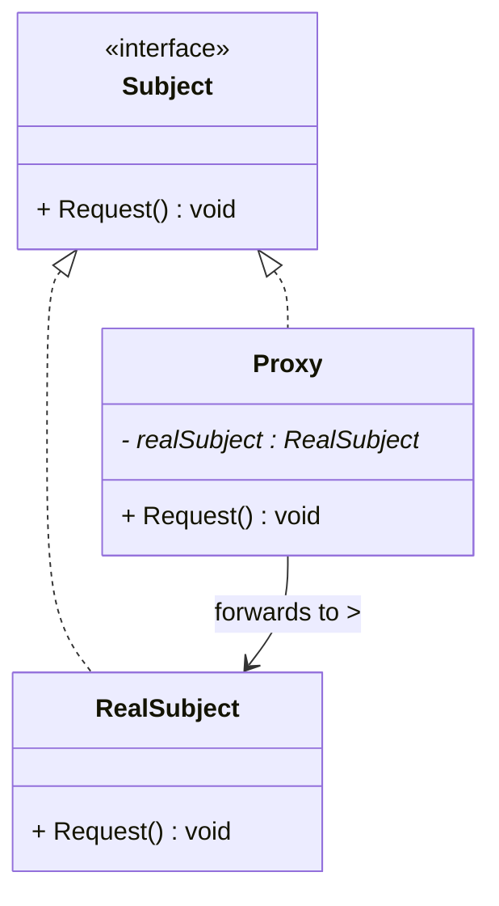
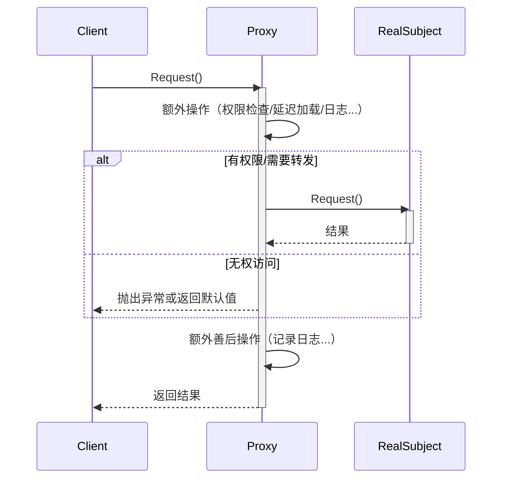

# 代理模式 (Proxy Pattern)

## 概述

**代理模式**（Proxy Pattern），又称 **委托模式**，属于 **结构型设计模式**。它为另一个对象提供一个替身或占位符，以**控制对这个对象的访问**。

> **定义**：为其他对象提供一种代理，以控制对这个对象的访问。

### 一个直觉感受

```cpp
// 没有代理：直接访问（可能很慢、有权限问题、或者对象不在本地）
ExpensiveImage img("4k_photo.png");     // 立刻从磁盘加载大图
img.Display();                           // 显示

// 有代理：通过代理人控制访问
ProxyImage img("4k_photo.png");          // 只记了文件名，不加载
img.Display();                           // 这时才真正加载+显示
img.Display();                           // 第二次不再加载，直接用缓存
```

代理和真实对象实现相同的接口，客户端**完全不知道**自己操作的是代理。代理在转发请求前后可以插入额外逻辑：

```
客户端 ──→ 代理（Proxy）──→ 真实对象（RealSubject）
               │
               ├─ 延迟创建
               ├─ 权限检查
               ├─ 日志记录
               ├─ 访问计数
               └─ 缓存结果
```

---

## 核心设计思想

### 三个角色

| 角色 | 名称 | 职责 |
|---|---|---|
| **抽象主题 (Subject)** | `Subject` | 定义 RealSubject 和 Proxy 的共同接口，这样 Proxy 就可以在任何需要 RealSubject 的地方使用 |
| **真实主题 (RealSubject)** | `RealSubject` | 真正的业务逻辑对象，Proxy 所代表的那个实际对象 |
| **代理 (Proxy)** | `Proxy` | 持有 RealSubject 的引用，控制对它的访问，并可以添加额外操作 |

### 四种常见代理类型

| 类型 | 核心用途 | 解决的问题 |
|---|---|---|
| **虚代理 (Virtual Proxy)** | 延迟加载 | 创建对象代价大，等到真正使用时才创建 |
| **保护代理 (Protection Proxy)** | 权限控制 | 控制不同客户端对对象的访问权限 |
| **远程代理 (Remote Proxy)** | 本地代表 | 隐藏对象位于不同地址空间的事实 |
| **智能引用 (Smart Reference)** | 附加操作 | 访问对象时附带额外动作（计数、日志、锁） |

### 工作流程（以虚代理为例）

```
① 客户端请求
       │
       ▼
   ┌────────┐     ② 检查真实对象是否已创建？
   │ Proxy  │──否──▶ ③ 创建 RealSubject（真正耗时）
   │        │&lt;──是──┘
   │        │                 ④ 转发请求
   │        │─────────────────▶┌────────────┐
   │        │                  │ RealSubject │
   │        │◄─────────────────│            │
   └────────┘     ⑤ 返回结果  └────────────┘
       │
       ▼
     客户端收到结果
```

---

## UML 类图



### 时序图



---

## C++ 实现

### 场景：图片查看器——虚代理（延时加载）

```cpp
#include <iostream>
#include <memory>
#include <string>
#include <unordered_map>

// ============ 抽象主题 ============
class Image {
public:
    virtual ~Image() = default;
    virtual void Display() = 0;
    virtual int GetSize() const = 0;
};

// ============ 真实主题：高分辨率图片 ============
class HighResImage : public Image {
    std::string filepath_;
    int size_mb_;

    // 模拟从磁盘加载图片（昂贵的操作）
    void LoadFromDisk() {
        std::cout << "  [加载] 从磁盘加载 " << filepath_
                  << " (" << size_mb_ << "MB)..." << std::endl;
        // 模拟耗时
        // 实际中这里会 decode 图片数据到内存
    }

public:
    explicit HighResImage(const std::string& path)
        : filepath_(path), size_mb_(0) {
        // 构造函数只记录路径，不加载！
    }

    // 真正的加载延迟到第一次使用时
    void EnsureLoaded() {
        if (size_mb_ == 0) {
            // 实际中：file_.size, decode image data...
            size_mb_ = 10;  // 模拟 10MB 大图
            LoadFromDisk();
        }
    }

    void Display() override {
        EnsureLoaded();
        std::cout << "  [显示] 渲染 " << filepath_
                  << " (" << size_mb_ << "MB)" << std::endl;
    }

    int GetSize() const override {
        return size_mb_;
    }
};

// ============ 代理：图片代理 ============
class ImageProxy : public Image {
    std::string filepath_;
    std::unique_ptr<HighResImage> realImage_;  // 真实对象（初始为空！）

public:
    explicit ImageProxy(const std::string& path)
        : filepath_(path) {
        // 只记录文件名，不创建真实对象，不加载图片
        std::cout << "[代理] 注册图片: " << filepath_ << std::endl;
    }

    void Display() override {
        // 虚代理核心：延迟创建
        if (!realImage_) {
            std::cout << "[代理] 首次访问，创建真实对象..." << std::endl;
            realImage_ = std::make_unique<HighResImage>(filepath_);
        }
        // 转发请求给真实对象
        realImage_->Display();
        // 可以在这里加额外统计
        accessCount_++;
    }

    int GetSize() const override {
        if (!realImage_) {
            // 如果还未加载，返回预估大小
            return 0;  // 还未知
        }
        return realImage_->GetSize();
    }

    int GetAccessCount() const { return accessCount_; }

private:
    int accessCount_ = 0;
};

// ============ 客户端 ============
int main() {
    // 创建代理——很快，不加载图片
    ImageProxy img1("全家福.png");
    ImageProxy img2("毕业照.png");
    std::cout << "--- 图片注册完成，尚未加载任何图片 ---\n\n";

    // 第一次显示——触发延迟加载
    std::cout << "--- 第一次显示 全家福 ---\n";
    img1.Display();
    std::cout << std::endl;

    // 第二次显示——使用缓存，不再加载！
    std::cout << "--- 第二次显示 全家福 ---\n";
    img1.Display();
    std::cout << std::endl;

    // 显示另一张——触发另一张的延迟加载
    std::cout << "--- 第一次显示 毕业照 ---\n";
    img2.Display();
    std::cout << std::endl;

    std::cout << "全家福被访问了 " << img1.GetAccessCount() << " 次" << std::endl;

    return 0;
}
```

### 输出

```
[代理] 注册图片: 全家福.png
[代理] 注册图片: 毕业照.png
--- 图片注册完成，尚未加载任何图片 ---

--- 第一次显示 全家福 ---
[代理] 首次访问，创建真实对象...
  [加载] 从磁盘加载 全家福.png (10MB)...
  [显示] 渲染 全家福.png (10MB)

--- 第二次显示 全家福 ---
  [显示] 渲染 全家福.png (10MB)      ← 没有加载过程！

--- 第一次显示 毕业照 ---
[代理] 首次访问，创建真实对象...
  [加载] 从磁盘加载 毕业照.png (10MB)...
  [显示] 渲染 毕业照.png (10MB)

全家福被访问了 2 次
```

**关键：** 代理在 `main()` 里创建了 2 个 ImageProxy 瞬间完成，图片在第一次 `Display()` 时才真正加载，第二次直接复用。

---

### 场景二：保护代理（权限控制）

```cpp
#include <iostream>
#include <memory>
#include <string>

// ============ 抽象主题 ============
class Document {
public:
    virtual ~Document() = default;
    virtual void Read() const = 0;
    virtual void Write(const std::string& content) = 0;
    virtual void AdminOnly() const = 0;
};

// ============ 真实主题 ============
class RealDocument : public Document {
    std::string content_;

public:
    explicit RealDocument(const std::string& initial)
        : content_(initial) {}

    void Read() const override {
        std::cout << "[读取] " << content_ << std::endl;
    }

    void Write(const std::string& content) override {
        content_ = content;
        std::cout << "[写入] 内容已更新" << std::endl;
    }

    void AdminOnly() const override {
        std::cout << "[管理] 执行敏感操作" << std::endl;
    }
};

// ============ 枚举角色 ============
enum class UserRole { Guest, Editor, Admin };

// ============ 保护代理 ============
class DocumentProxy : public Document {
    std::unique_ptr<RealDocument> realDoc_;
    UserRole userRole_;

public:
    DocumentProxy(const std::string& initial, UserRole role)
        : realDoc_(std::make_unique<RealDocument>(initial))
        , userRole_(role) {}

    void Read() const override {
        // 所有角色都能读
        realDoc_->Read();
    }

    void Write(const std::string& content) override {
        // 只有 Editor 和 Admin 能写
        if (userRole_ == UserRole::Guest) {
            std::cout << "[拒绝] 游客无权修改文档" << std::endl;
            return;
        }
        realDoc_->Write(content);
    }

    void AdminOnly() const override {
        // 只有 Admin 能执行管理操作
        if (userRole_ != UserRole::Admin) {
            std::cout << "[拒绝] 仅管理员可执行此操作" << std::endl;
            return;
        }
        realDoc_->AdminOnly();
    }
};

// ============ 客户端 ============
int main() {
    DocumentProxy doc("Hello World", UserRole::Guest);

    std::cout << "--- 游客访问 ---\n";
    doc.Read();
    doc.Write("new content");
    doc.AdminOnly();

    std::cout << "\n--- 切换为 Admin（换一个代理） ---\n";
    DocumentProxy doc2("Hello World", UserRole::Admin);
    doc2.Read();
    doc2.Write("admin content");
    doc2.AdminOnly();

    return 0;
}
```

### 输出

```
--- 游客访问 ---
[读取] Hello World
[拒绝] 游客无权修改文档
[拒绝] 仅管理员可执行此操作

--- 切换为 Admin（换一个代理） ---
[读取] Hello World
[写入] 内容已更新
[管理] 执行敏感操作
```

---

## 四种代理类型深入详解

上面已经用完整代码演示了「虚代理」和「保护代理」，下面把四种类型逐一拆解：**解决了什么问题**、**代理拦截后做了什么**、**用不用代理的对比**。

---

### 类型一：虚代理 (Virtual Proxy)

#### 解决的问题

创建一个对象时，如果这个对象很"重"（需要从磁盘加载大文件、需要建立数据库连接、需要从网络下载资源），但你**不确定后续是否真的要用到它**——那么提前创建就是浪费。

#### 类比

图书馆的闭架书库。你选书时只拿到一张**索书单**（代理），上面写了书名和编号。等你真正要看这本书了，图书管理员才去取书（加载）。如果你一直没翻那本书，就不需要去取。

#### 代理做了什么

```
┌─────────────────────────────────┐
│        虚代理的 Request()        │
│                                  │
│  ① 检查真实对象是否存在          │
│     ├─ 不存在 → 创建（耗时）      │
│     └─ 存在   → 跳过              │
│                                  │
│  ② 转发请求给真实对象            │
│                                  │
│  ③ 可选：记录统计信息            │
└─────────────────────────────────┘
```

#### 不用代理 vs 用代理

```cpp
// ❌ 不用代理：提前创建了 100 个对象，但用户只看了前 3 张
vector<HighResImage> gallery;
for (auto& photo : allPhotos)
    gallery.push_back(HighResImage(photo));  // 100 次磁盘 IO！

void OnClick(int index) {
    gallery[index].Display();  // 用户可能只点了前 3 张
}

// ✅ 虚代理：只注册名称，用户点到哪张才加载哪张
vector<ImageProxy> gallery;
for (auto& photo : allPhotos)
    gallery.push_back(ImageProxy(photo));    // 100 次都瞬间完成

void OnClick(int index) {
    gallery[index].Display();  // 第一次点才加载，之后缓存
}
```

| | 不用代理 | 虚代理 |
|---|---|---|
| 程序启动 | 加载全部 100 张图，等 10 秒 | 瞬间启动 |
| 用户只看 3 张 | 浪费了 97 次加载 | 只加载了 3 张 |
| 第二次看同一张 | 已经在内存，直接显示 | 已经在内存，直接显示 |

---

### 类型二：保护代理 (Protection Proxy)

#### 解决的问题

真实的业务对象暴露了所有方法（读、写、删除、管理），但不同用户应该有不同的权限。你不想把权限检查逻辑写进真实对象里——那是额外的职责。

#### 类比

公司门禁系统。你刷卡进来，不需要直接走到每间办公室、每个机柜前确认权限——**门禁系统**（代理）在每一道门前帮你判断：你能进这间吗？还是到此为止？

#### 代理做了什么

```
┌─────────────────────────────────┐
│       保护代理的 Request()       │
│                                  │
│  ① 获取当前用户身份/权限         │
│                                  │
│  ② 检查权限表：                  │
│     ├─ 允许 → 转发请求            │
│     └─ 拒绝 → 抛出异常/返回空值   │
│                                  │
│  ③ 不修改真实对象代码            │
└─────────────────────────────────┘
```

#### 不用代理 vs 用代理

```cpp
// ❌ 不用代理：权限逻辑和业务逻辑混在一起
class Document {
    UserRole userRole_;           // ← 额外的职责
    string content_;

public:
    void Write(const string& s) {
        if (userRole_ == Guest)   // ← 每个方法都要写一遍权限检查
            throw "no permission";
        content_ = s;
    }
};
// 文档对象既要管内容，又要管权限 → 违反单一职责

// ✅ 保护代理：真实对象只负责内容，代理只负责权限
class RealDocument {              // ← 只管内容，不知道权限的存在
    string content_;
public:
    void Write(const string& s) { content_ = s; }
};

class DocumentProxy {             // ← 只管权限，不管内容逻辑
    RealDocument* real_;
    UserRole role_;
public:
    void Write(const string& s) {
        if (role_ == Guest) throw "no permission";  // 只在这里拦截
        real_->Write(s);
    }
};
```

---

### 类型三：远程代理 (Remote Proxy)

#### 解决的问题

你想调用一台远程服务器上的对象的方法，但**网络通信的细节**（建立连接、序列化、发请求、收响应、反序列化）非常繁琐。你希望像调用本地对象一样调用远程对象。

#### 类比

外卖平台。你打开 App 点了一杯咖啡——你看到的是一个**"附近咖啡店"的列表**（远程代理），点咖啡的操作和楼下便利店买东西一样简单。但实际情况是：你的请求通过网络发到咖啡店、店员制作、骑手配送——这些复杂过程你完全看不到。

#### 代理做了什么

```
┌─────────────────────────────────────────┐
│           远程代理的 Request()           │
│                                          │
│  ① 将方法调用序列化为网络消息            │
│                                    (序列化)
│  ② 通过 Socket 发送到服务器              │
│                                    (网络传输)
│  ③ 等待服务器返回响应                    │
│                                    (网络传输)
│  ④ 将响应反序列化为 C++ 对象            │
│                                    (反序列化)
│  ⑤ 返回给客户端                         │
│                                          │
│  客户端完全不知道这中间走了网络          │
└─────────────────────────────────────────┘
```

#### 完整示例

```cpp
#include <iostream>
#include <memory>
#include <string>
#include <sstream>

// ============ 抽象主题 ============
class Calculator {
public:
    virtual ~Calculator() = default;
    virtual double Add(double a, double b) = 0;
    virtual double Multiply(double a, double b) = 0;
};

// ============ 真实主题：运行在远端服务器上 ============
class RemoteCalculator : public Calculator {
public:
    double Add(double a, double b) override {
        std::cout << "[真实对象] 服务器计算 " << a << " + " << b << std::endl;
        return a + b;
    }
    double Multiply(double a, double b) override {
        std::cout << "[真实对象] 服务器计算 " << a << " * " << b << std::endl;
        return a * b;
    }
};

// ============ 远程代理：本地替代品 ============
class CalculatorProxy : public Calculator {
    std::string serverHost_;
    int serverPort_;

    // 模拟发送网络请求
    // 实际上这里会做：json 序列化、Socket 连接、网络发送、等待响应、json 反序列化
    std::string SendRequest(const std::string& request) const {
        std::cout << "[代理] 序列化请求 → " << request << std::endl;
        std::cout << "[代理] 连接到 " << serverHost_ << ":" << serverPort_ << std::endl;
        std::cout << "[代理] 发送请求...等待响应..." << std::endl;

        // ═══════ 模拟网络细节 ═══════
        // 实际代码：
        //   Socket sock(serverHost_, serverPort_);
        //   sock.Send(request);
        //   return sock.Receive();
        //
        // 这里简化为本地直调来演示结构
        static RemoteCalculator realCalc;
        std::istringstream iss(request);
        std::string method; double a, b;
        iss >> method >> a >> b;

        double result = 0;
        if (method == "Add")      result = realCalc.Add(a, b);
        if (method == "Multiply") result = realCalc.Multiply(a, b);

        std::cout << "[代理] 收到响应，反序列化结果" << std::endl;
        return std::to_string(result);
    }

public:
    CalculatorProxy(const std::string& host, int port)
        : serverHost_(host), serverPort_(port) {
        std::cout << "[代理] 注册远程服务器: " << host << ":" << port << std::endl;
    }

    double Add(double a, double b) override {
        std::cout << "\n--- 客户端调用 Add(" << a << ", " << b << ") ---\n";
        std::string request = "Add " + std::to_string(a) + " "
                                     + std::to_string(b);
        std::string response = SendRequest(request);
        return std::stod(response);
    }

    double Multiply(double a, double b) override {
        std::cout << "\n--- 客户端调用 Multiply(" << a << ", " << b << ") ---\n";
        std::string request = "Multiply " + std::to_string(a) + " "
                                         + std::to_string(b);
        std::string response = SendRequest(request);
        return std::stod(response);
    }
};

// ============ 客户端：看起来就是本地调用！ ============
int main() {
    // 客户端只看到 Calculator 接口
    CalculatorProxy calc("192.168.1.100", 8080);

    double r1 = calc.Add(3, 5);           // 对客户端来说和本地对象没区别
    double r2 = calc.Multiply(4, 7);

    std::cout << "\n=== 结果 ===\n";
    std::cout << "3 + 5 = " << r1 << std::endl;
    std::cout << "4 * 7 = " << r2 << std::endl;

    return 0;
}
```

#### 输出

```
[代理] 注册远程服务器: 192.168.1.100:8080

--- 客户端调用 Add(3, 5) ---
[代理] 序列化请求 → Add 3.000000 5.000000
[代理] 连接到 192.168.1.100:8080
[代理] 发送请求...等待响应...
[真实对象] 服务器计算 3 + 5
[代理] 收到响应，反序列化结果

--- 客户端调用 Multiply(4, 7) ---
[代理] 序列化请求 → Multiply 4.000000 7.000000
[代理] 连接到 192.168.1.100:8080
[代理] 发送请求...等待响应...
[真实对象] 服务器计算 4 * 7
[代理] 收到响应，反序列化结果

=== 结果 ===
3 + 5 = 8
4 * 7 = 28
```

#### 四个步骤，对客户端完全透明

```
  客户端               远程代理              网络              真实对象
    │                     │                   │                  │
    │ calc.Add(3,5)       │                   │                  │
    │────────────────────▶│                   │                  │
    │                     │──序列化─────────▶ │                  │
    │                     │                   │──网络包────────▶│
    │                     │                   │                  │ 计算 3+5
    │                     │                   │◄──网络包─────────│
    │                     │◄──反序列化────────│                  │
    │◄────────────────────│                   │                  │
    │ 返回 8              │                   │                  │
```

> **现实案例**：gRPC——你写 `stub.SayHello(request)`，gRPC 帮你做序列化(protobuf)、网络传输(HTTP/2)、反序列化。客户端完全看不到这些步骤。每个 `stub` 就是一个远程代理。

---

### 类型四：智能引用 (Smart Reference)

#### 解决的问题

你需要在使用一个对象时**自动附带一些额外动作**——比如引用计数、加锁解锁、记录日志——但你不想在每次使用时手动写这些代码。

#### 类比

酒店的前台。你把行李寄存到前台——前台（智能引用）给你一个号牌。你拿着这个号牌（看起来和普通行李标签一样），但当你去取行李时，前台的号牌会自动触发：验证你的身份、找到你的包、记录取包时间。你不需要自己去库房翻行李，你只需要拿着号牌。

#### 代理做了什么

```
┌─────────────────────────────────┐
│      智能引用的 Request()        │
│                                  │
│  ① 访问前：加锁 / 计数+1           │
│                                  │
│  ② 转发请求给真实对象            │
│                                  │
│  ③ 访问后：解锁 / 计数-1           │
│          如果计数归零，自动释放    │
│                                  │
│  ④ 记录访问日志或统计信息        │
└─────────────────────────────────┘
```

#### 完整示例 1：自动加锁

```cpp
#include <iostream>
#include <memory>
#include <mutex>
#include <thread>
#include <vector>

// ============ 抽象主题 ============
class Counter {
public:
    virtual ~Counter() = default;
    virtual void Increment() = 0;
    virtual int  GetValue() = 0;
};

// ============ 真实主题：不处理线程安全 ============
class UnsafeCounter : public Counter {
    int value_ = 0;
public:
    void Increment() override {
        int tmp = value_;
        tmp = tmp + 1;             // 非原子操作！
        value_ = tmp;
    }
    int GetValue() override { return value_; }
};

// ============ 智能引用代理：自动加锁 ============
class SafeCounterProxy : public Counter {
    std::unique_ptr<Counter> real_;   // 被代理的真实计数器
    std::mutex mutex_;                // 代理额外持有的锁

public:
    explicit SafeCounterProxy(std::unique_ptr<Counter> real)
        : real_(std::move(real)) {}

    void Increment() override {
        std::lock_guard<std::mutex> guard(mutex_);  // ← 自动加锁
        real_->Increment();                          // ← 安全调用
        // guard 析构时自动解锁
    }

    int GetValue() override {
        std::lock_guard<std::mutex> guard(mutex_);
        return real_->GetValue();
    }
};

// ============ 客户端：不用写任何 lock/unlock ============
int main() {
    // 把不安全的计数器包进安全代理
    SafeCounterProxy counter(std::make_unique<UnsafeCounter>());

    std::vector<std::thread> threads;
    for (int i = 0; i < 10; ++i) {
        threads.emplace_back([&counter] {
            for (int j = 0; j < 1000; ++j) {
                counter.Increment();  // ← 对客户端透明，自动加锁
            }
        });
    }

    for (auto& t : threads) t.join();

    // 安全的结果：10000
    std::cout << "最终计数: " << counter.GetValue()
              << " (期望 10000)" << std::endl;
    return 0;
}
```

#### 输出

```
最终计数: 10000 (期望 10000)
```

> 如果不用代理，直接多线程调用 `UnsafeCounter::Increment()`，由于 `tmp = value_; tmp = tmp + 1; value_ = tmp;` 不是原子操作，结果会远小于 10000。

#### 完整示例 2：调用计数

```cpp
// 智能引用代理：记录每次调用的次数和频率
class CountingProxy : public Subject {
    std::unique_ptr<Subject> real_;
    int callCount_ = 0;

public:
    void Request() override {
        callCount_++;                              // ← 自动计数
        std::cout << "[调用 #" << callCount_ << "] ";
        real_->Request();
        // 还可以在这里记录调用耗时、频率统计...
    }

    int GetCallCount() const { return callCount_; }
};
```

#### 不用代理 vs 用代理

```cpp
// ❌ 不用代理：每次调用都要手动写加锁代码
std::mutex mtx;

void ThreadFunc(UnsafeCounter& c) {
    for (int i = 0; i < 1000; i++) {
        mtx.lock();           // 手动加 —— 容易忘！
        c.Increment();
        mtx.unlock();         // 手动解 —— 异常时不执行！
    }
}

// ✅ 智能引用代理：加锁对客户端不可见
void ThreadFunc(SafeCounterProxy& c) {
    for (int i = 0; i < 1000; i++) {
        c.Increment();        // 代理内部已自动加锁
    }
}
```

---

### 四种类型对比总结

| 类型 | 拦截时机 | 拦截后做什么 | 真实对象在哪 | 典型场景 |
|---|---|---|---|---|
| **虚代理** | 创建时 | 先不创建，等真的要用才创建 | 本地 | 大图加载、数据库连接池 |
| **保护代理** | 每次调用前 | 检查权限，通过才转发 | 本地 | 文档权限、API 访问控制 |
| **远程代理** | 每次调用前后 | 序列化→发网络→收响应→反序列化 | **远程服务器** | gRPC、REST client、RMI |
| **智能引用** | 每次调用前后 | 加锁/解锁、计数、日志 | 本地 | `shared_ptr`、`lock_guard` |

---

## 实际应用场景

### 1. 智能指针——C++ 标准库的代理

`std::shared_ptr` 和 `std::unique_ptr` 本质上就是代理模式——它们是原始指针的"代理"，在访问原始指针前后附加了额外行为：

```cpp
// 原始指针
Object* raw = new Object();
raw->DoSomething();
delete raw;                  // 手动管理生命周期

// shared_ptr —— 智能引用代理
std::shared_ptr<Object> ptr = std::make_shared<Object>();
ptr->DoSomething();          // 透明使用
// 自动 delete，还附带引用计数
```

```cpp
// shared_ptr 内部做的事情类似于：
template <typename T>
class SharedPtr {
    T* rawPtr_;              // 被代理的真实对象
    int* refCount_;          // 额外行为：引用计数

public:
    T* operator->() {
        return rawPtr_;      // 透明的箭头操作符
    }

    ~SharedPtr() {
        if (--(*refCount_) == 0) {
            delete rawPtr_;  // 额外行为：自动释放
            delete refCount_;
        }
    }
};
```

> **现实案例**：C++11 引入的 `shared_ptr` / `unique_ptr` 是最广泛使用的代理模式实例，它们代理了原始指针并附加了生命周期管理的能力。

### 2. ORM 的延迟加载

```cpp
// 从数据库查询一个用户 —— 假设关联了订单
class User {
    int id_;
    std::string name_;
    std::vector<Order> orders_;  // ← 如果每次查用户都加载所有订单...
public:
    // 立即加载所有数据
    User(int id) {
        id_ = id;
        name_ = DB::QueryName(id);
        orders_ = DB::QueryOrders(id);   // 昂贵的 JOIN 查询！
    }
};

// 用户每页列表显示 20 条 —— 每条都查了 orders，性能灾难！
```

使用代理：

```cpp
// 懒加载代理
class LazyOrders {
    int userId_;
    mutable std::unique_ptr<std::vector<Order>> cache_;

    void Load() const {
        if (!cache_) {
            std::cout << "  [懒加载] 查询订单..." << std::endl;
            cache_ = std::make_unique<std::vector<Order>>(
                DB::QueryOrders(userId_));
        }
    }

public:
    explicit LazyOrders(int uid) : userId_(uid) {}

    int Count() const { Load(); return cache_->size(); }
    const Order& Get(int i) const { Load(); return (*cache_)[i]; }
};

// ---------- mutable 关键字说明 ----------
// ↑ 注意到 `cache_` 前面加了 `mutable`。
//
// 问题：Count() 和 Get() 都标了 const，承诺"不修改对象状态"。
//       但它们内部调了 Load()，Load() 要修改 cache_（赋值加载数据）。
//       如果不加 mutable，编译器会拒绝 —— const 方法不能修改成员变量。
//
// mutable 的作用：
//   "这个成员变量不参与 const 语义。即使在 const 方法里，也可以修改它。"
//
// 为什么这里合理？
//   cache_ 是缓存，不是对象的"逻辑状态"。
//   从外部看，Count() 每次返回的订单数是一样的（逻辑不变），
//   只是内部缓存了结果（物理状态变了）。这符合 const 的语义本意。
//
// 常见的使用 mutable 的场景：
//   ① 懒加载的缓存（本示例）
//   ② 线程锁（mutex 通常标 mutable，因为 lock/unlock 不改变逻辑状态）
//   ③ 访问计数（记录这个 const 对象被调用了多少次）
// ----------

class User {
    int id_;
    std::string name_;
    mutable LazyOrders orders_;  // ← 代理，不立即加载

public:
    User(int id)
        : id_(id)
        , name_(DB::QueryName(id))   // 只查 name
        , orders_(id) {}              // 不查订单！

    const LazyOrders& GetOrders() const { return orders_; }
};

// 使用：列表页只显示用户名，不触发订单查询
void ShowUserList() {
    for (int id = 1; id <= 20; id++) {
        User u(id);
        std::cout << u.GetName();  // 只查了 20 次 name

        // GetOrders().Count() 才会真正触发订单查询
        // 如果不访问订单，永远不查询
    }
}
```

> **现实案例**：Hibernate / Entity Framework 等 ORM 框架的**懒加载**（Lazy Loading）就是通过代理对象实现的。导航属性 `user.Orders` 实际上是一个代理对象，只有在真正访问它时才去查询数据库。

### 3. 日志代理（AOP 思想）

```cpp
// 记录每个方法的调用耗时
class LoggerProxy : public Service {
    std::unique_ptr<Service> realService_;

public:
    void DoWork() override {
        auto start = std::chrono::steady_clock::now();

        realService_->DoWork();  // 转发给真实对象

        auto end = std::chrono::steady_clock::now();
        auto ms = std::chrono::duration_cast<std::chrono::milliseconds>(
                      end - start).count();
        std::cout << "[日志] DoWork() 耗时 " << ms << "ms" << std::endl;
    }
};
```

> **现实案例**：Spring AOP 的 `@Around` 切面、.NET 的 `Castle DynamicProxy`——它们都在方法调用前后插入日志/事务/缓存逻辑，本质上就是代理模式。

### 4. 远程代理（RPC）

```cpp
// 客户端本地看上去是个 Service 对象
class RemoteServiceProxy : public Service {
    std::string host_;
    int port_;

public:
    void DoWork() override {
        // 实际上通过网络发送请求
        Socket client(host_, port_);
        client.Send("DoWork");
        Response res = client.Receive();
        // ...
    }
};

// 客户端完全不知道 DoWork 执行在远程服务器上
Service* svc = new RemoteServiceProxy("192.168.1.100", 8080);
svc->DoWork();  // 看起来是本地调用，实际上走了网络
```

> **现实案例**：gRPC 的 Stub、Java RMI 的 Stub、CORBA 的 Proxy——都是远程代理。客户端调用本地方法，代理负责序列化、网络传输、反序列化。

### 5. 写时复制（Copy-on-Write）

```cpp
class StringProxy {
    std::shared_ptr<std::string> data_;  // 共享底层数据

public:
    StringProxy(const std::string& s)
        : data_(std::make_shared<std::string>(s)) {}

    // 读操作——共享，不拷贝
    char operator[](size_t i) const {
        return (*data_)[i];
    }

    // 写操作——需要先拷贝再修改
    void SetChar(size_t i, char c) {
        if (data_.use_count() > 1) {           // 如果被共享
            data_ = std::make_shared<std::string>(*data_);  // 深拷贝
        }
        (*data_)[i] = c;                       // 修改自己的副本
    }
};
```

> **现实案例**：Qt 的 `QString` / `QByteArray`、C++17 之前的 `std::string` COW 实现——多个字符串共享同一块内存，只有在某个字符串要修改时才真正拷贝。

---

## 代理模式 vs 装饰模式

代理模式和装饰模式**结构完全一样**，区别在于**意图**：

| 维度 | 代理模式 | 装饰模式 |
|---|---|---|
| **意图** | 控制访问（延迟、权限、远程） | 增加功能（叠加职责） |
| **创建时机** | 延迟创建（虚代理）或不创建 | 始终和真实对象同时存在 |
| **是否扩展功能** | 可选（不是主要目的） | 核心目的 |
| **客户端感知** | 一般不知晓代理的存在 | 同样透明 |
| **典型关键词** | 控制、延迟、保护、远程 | 增强、叠加、包装 |

```cpp
// 代理：控制"能不能调"
class Proxy : public Subject {
    void Request() override {
        if (CheckAccess())          // ← 控制
            realSubject_->Request();
    }
};

// 装饰：增强"调的结果"
class Decorator : public Subject {
    void Request() override {
        Before();                   // ← 增强
        component_->Request();
        After();                    // ← 增强
    }
};
```

**一条记忆口诀：**

> **代理管你能不能调，装饰管你调完变啥样。**

---

## 优缺点

### 优点

| # | 说明 |
|---|---|
| ✅ | **职责清晰** — 代理将访问控制与业务逻辑分离，真实对象只关注自身业务 |
| ✅ | **符合开闭原则** — 在不修改真实对象的前提下，通过代理增加新的控制逻辑 |
| ✅ | **性能优化** — 虚代理延迟了对象的创建和初始化，避免不必要的资源消耗 |
| ✅ | **安全控制** — 保护代理可以细粒度地控制不同客户端的访问权限 |
| ✅ | **远程透明** — 远程代理让客户端可以像调用本地对象一样调用远程服务 |

### 缺点

| # | 说明 |
|---|---|
| ❌ | **增加系统复杂度** — 引入额外的类层次，多了一层间接调用 |
| ❌ | **响应延迟** — 每经过一层代理就多一次间接调用（虚函数调用开销） |
| ❌ | **可能过度设计** — 如果没有明确的访问控制或延迟加载需求，代理就是多余 |
| ❌ | **保护代理的安全陷阱** — 如果真实对象通过其他方式泄漏，保护代理形同虚设 |

---

## 适用场景

### 通用原则

- 需要一个**比原始对象更灵活或更强大的引用**
- 需要在访问对象时**附加额外的操作**（权限检查、日志记录、计数）
- 对象的**创建代价很大**，希望延迟到真正需要时才创建
- 需要**隐藏对象的位置**（远程、不同进程）

### 快速判断

| 场景 | 用哪种代理 |
|---|---|
| 大图列表，预览时才加载 | 虚代理 |
| 不同用户操作权限不同 | 保护代理 |
| 调用远端服务像调用本地函数 | 远程代理 |
| 记录所有接口调用的耗时 | 智能引用 / 日志代理 |
| 对象会被共享，修改时才拷贝 | 写时复制代理 |

---

## 总结

代理模式的关键在于一层**间接层**——客户端不与真实对象直接对话，而是通过一个代表来沟通。这层间接赋予了控制能力：

```
直接调用：Client ──▶ RealSubject     （简单，但无法介入）
代理调用：Client ──▶ Proxy ──▶ RealSubject  （多了一层，可以拦截）
                         │
                         ├─ "迟点创建"（虚代理）
                         ├─ "你没权限"（保护代理）
                         ├─ "他在远程"（远程代理）
                         └─ "记录一下"（智能引用）
```

代理模式在 C++ 中最有名的应用就是 `shared_ptr`——它代理了原始指针，附加了引用计数和自动释放的能力。理解代理模式，也就理解了智能指针的设计思想。
