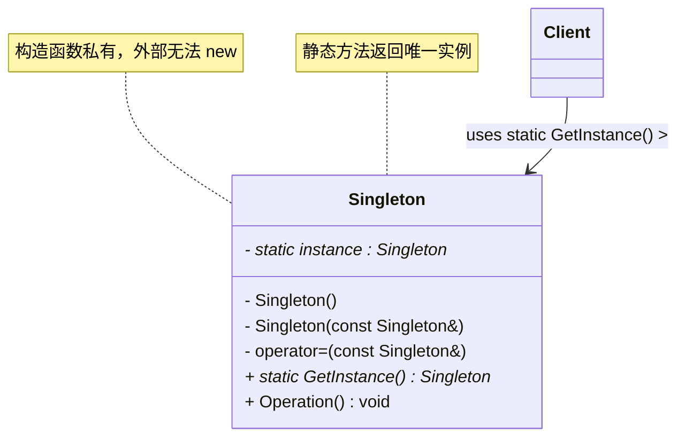
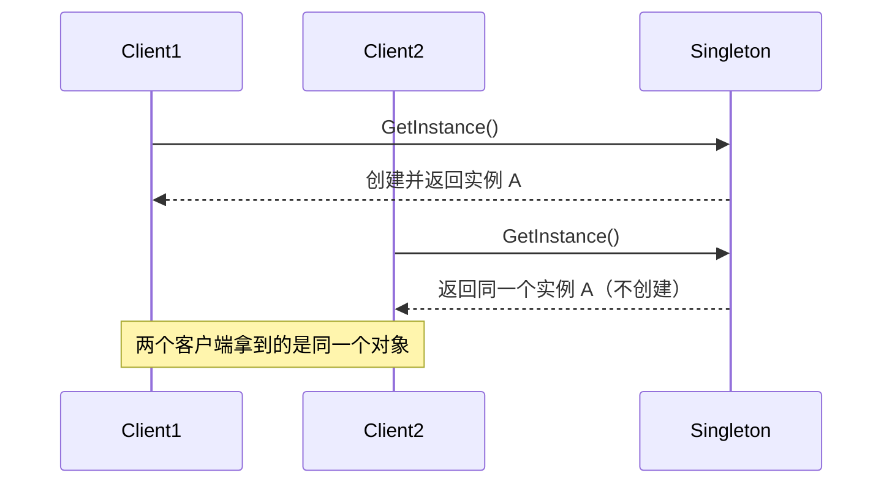

# 单例模式 (Singleton Pattern)

## 概述

**单例模式**（Singleton Pattern），属于 **创建型设计模式**。它确保一个类**只有一个实例**，并提供一个**全局访问点**来获取这个实例。

> **定义**：保证一个类仅有一个实例，并提供一个访问它的全局访问点。

### 一个直觉感受

```cpp
// 系统里只需要一个配置管理器、一个日志器、一个数据库连接池
// 如果 new 了两次，就出现了两个配置管理器 → 配置不一致！

// 单例保证：
ConfigManager::GetInstance().Set("theme", "dark");
ConfigManager::GetInstance().Get("theme");   // 拿到的是同一个对象
//                    ↑ 每次调用都是同一个实例
```

### 单例的三大特征

| 特征 | 说明 | C++ 实现 |
|---|---|---|
| **私有构造函数** | 外部不能 `new` | `private: Singleton() {}` |
| **删除拷贝/赋值** | 不能复制出第二个 | `= delete`（C++11）/ 私有声明（C++98） |
| **静态访问点** | 通过静态方法拿唯一实例 | `static Singleton& GetInstance()` |

---

## 核心设计思想

### 两个角色

| 角色 | 名称 | 职责 |
|---|---|---|
| **单例类 (Singleton)** | `Singleton` | 私有构造函数 + 静态实例 + 静态访问方法 |
| **客户端 (Client)** | `Client` | 通过 `GetInstance()` 获取唯一实例 |

### 两种创建时机

```
饿汉式（Eager）：程序启动时就创建实例
  static Singleton instance;  → 立即创建
  优点：简单、线程安全
  缺点：启动慢，可能用不上还占内存

懒汉式（Lazy）：第一次使用时才创建
  if (instance == nullptr) instance = new Singleton();
  优点：用的时候才创建，省资源
  缺点：多线程下要处理竞态（经典坑！）
```

---

## UML 类图



### 时序图



---

## C++98：经典懒汉式（有线程安全隐患）

> 每个类的注释标明了它的模式角色：`Singleton` = 单例类，`main` = 客户端。

```cpp
// ══════════════ 单例类 (Singleton) ══════════════
// 模式角色：Singleton —— 唯一实例 + 全局访问点
class Singleton {
private:
    // 唯一的静态实例指针
    static Singleton* instance_;

    // 私有构造函数：外部不能 new
    Singleton() { std::cout << "  [构造] 实例已创建" << std::endl; }
    ~Singleton() { std::cout << "  [析构] 实例已销毁" << std::endl; }

    // C++98 防拷贝：只声明不实现，且为私有
    Singleton(const Singleton&);            // 拷贝构造
    Singleton& operator=(const Singleton&); // 赋值运算符

public:
    // 全局访问点
    static Singleton* GetInstance() {
        if (instance_ == NULL)              // 还没创建？
            instance_ = new Singleton();    // 创建（⚠️ 多线程不安全！）
        return instance_;
    }

    void DoSomething() const {
        std::cout << "  [方法] 单例在做事情（地址: " << this << "）" << std::endl;
    }
};

// 静态成员定义（在类外初始化）
Singleton* Singleton::instance_ = NULL;

// ══════════════ 客户端 (Client) ══════════════
int main() {
    Singleton* s1 = Singleton::GetInstance();
    Singleton* s2 = Singleton::GetInstance();
    Singleton* s3 = Singleton::GetInstance();

    s1->DoSomething();
    s2->DoSomething();

    // 三个指针指向同一个地址
    std::cout << "s1 == s2 == s3 ? "
              << (s1 == s2 && s2 == s3 ? "是 ✅" : "否 ❌") << std::endl;
    return 0;
}
```

### 输出

```
  [构造] 实例已创建
  [方法] 单例在做事情（地址: 0x55a2a0a7d2c0）
  [方法] 单例在做事情（地址: 0x55a2a0a7d2c0）
s1 == s2 == s3 ? 是 ✅
```

### C++98 版的问题

| 问题 | 说明 |
|---|---|
| ⚠️ **多线程不安全** | 两个线程同时进入 `if (instance_ == NULL)`，可能都执行 `new`，创建两个实例 |
| ⚠️ **内存泄漏** | `new Singleton()` 永远没人 `delete` |
| ⚠️ **拷贝防范笨拙** | 只声明不实现 + 私有，靠"链接错误"防拷贝 |

---

## C++11：Meyers 单例（推荐！）

Scott Meyers 提出的写法——用**函数内的静态局部变量**：

```cpp
// ══════════════ 单例类 (Singleton) ══════════════
// 模式角色：Singleton —— 最推荐的 C++11 单例写法
class Singleton {
private:
    // 私有构造函数
    Singleton() { std::cout << "  [构造] 实例已创建" << std::endl; }
    ~Singleton() { std::cout << "  [析构] 实例已销毁" << std::endl; }

public:
    // 禁止拷贝（C++11 新语法）
    Singleton(const Singleton&) = delete;
    Singleton& operator=(const Singleton&) = delete;

    // 全局访问点 —— ★ 函数内 static 局部变量 ★
    static Singleton& GetInstance() {
        // C++11 起：函数内静态局部变量的初始化是线程安全的！
        // 首次调用时创建，之后直接返回；程序结束时自动析构
        static Singleton instance;
        return instance;
    }

    void DoSomething() const {
        std::cout << "  [方法] 单例做事（地址: " << this << "）" << std::endl;
    }
};

// ══════════════ 客户端 (Client) ══════════════
int main() {
    // 注意：返回引用，不是指针
    Singleton& s1 = Singleton::GetInstance();
    Singleton& s2 = Singleton::GetInstance();

    s1.DoSomething();
    s2.DoSomething();

    std::cout << "s1 和 s2 是同一个对象? "
              << (&s1 == &s2 ? "是 ✅" : "否 ❌") << std::endl;
    return 0;
}
```

### 为什么 Meyers 单例是 C++11 的推荐写法？

| 特性 | 说明 |
|---|---|
| ✅ **线程安全** | C++11 标准规定：函数内静态局部变量的初始化是线程安全的（编译器自动加锁） |
| ✅ **懒加载** | 首次调用 `GetInstance()` 才创建 |
| ✅ **自动析构** | 程序退出时自动调用析构函数，无内存泄漏 |
| ✅ **极简** | 一个静态局部变量搞定，没有指针、没有 new/delete |

> **C++11 魔法静态变量（Magic Statics）**：`static Singleton instance;` 在函数内部时，编译器保证它的初始化只发生一次，且多线程安全。这是 C++11 标准的规定。

---

## 饿汉式：程序启动即创建

```cpp
// ══════════════ 单例类 (Singleton) ══════════════
// 模式角色：Singleton —— 饿汉式（启动即创建）
class Singleton {
private:
    Singleton() { std::cout << "  [构造] 启动即创建" << std::endl; }
    ~Singleton() = default;

    // 私有拷贝
    Singleton(const Singleton&) = delete;
    Singleton& operator=(const Singleton&) = delete;

    // ★ 静态成员直接初始化 —— 程序启动时就创建
    static Singleton instance_;

public:
    static Singleton& GetInstance() {
        return instance_;   // 直接返回，无需判空
    }
};

// 在 main() 之前就完成构造
Singleton Singleton::instance_;

// ══════════════ 客户端 (Client) ══════════════
int main() {
    Singleton& s = Singleton::GetInstance();  // 此时早已创建好
    return 0;
}
```

| 饿汉式 | 特点 |
|---|---|
| ✅ 线程安全（启动时单线程初始化） | ✅ 实现最简单 |
| ❌ 启动慢 | ❌ 不用也创建，浪费资源 |

---

## C++11 进阶：多线程安全的懒汉式（三种写法对比）

如果你坚持要懒加载 + 指针形式，C++11 有几种方式：

### 写法 1：`std::call_once`（标准做法）

```cpp
#include <mutex>

// ══════════════ 单例类 (Singleton) ══════════════
// 模式角色：Singleton —— call_once 版懒汉式
class Singleton {
private:
    static Singleton* instance_;
    static std::once_flag flag_;      // once_flag：只执行一次的标志

    Singleton() { std::cout << "  [构造] call_once 创建" << std::endl; }
    ~Singleton() = default;

public:
    Singleton(const Singleton&) = delete;
    Singleton& operator=(const Singleton&) = delete;

    static Singleton* GetInstance() {
        // 保证 createInstance 只执行一次（线程安全）
        std::call_once(flag_, [] {
            instance_ = new Singleton();
        });
        return instance_;
    }
};

Singleton* Singleton::instance_ = nullptr;
std::once_flag Singleton::flag_;
```

### 写法 2：双检锁（Double-Checked Locking）—— 容易写错

```cpp
#include <mutex>

// ══════════════ 单例类 (Singleton) ══════════════
// 模式角色：Singleton —— 双检锁版（经典但易错）
class Singleton {
private:
    static Singleton* instance_;
    static std::mutex mutex_;

    Singleton() = default;
    ~Singleton() = default;

public:
    static Singleton* GetInstance() {
        // 第一次检查：不加锁（避免每次都加锁的开销）
        if (instance_ == nullptr) {
            std::lock_guard<std::mutex> lock(mutex_);  // 加锁
            // 第二次检查：拿到锁后再确认一次（防止两个线程都通过了第一次检查）
            if (instance_ == nullptr) {
                instance_ = new Singleton();
            }
        }
        return instance_;
    }
};
```

> ⚠️ **双检锁在 C++11 之前是有问题的**：`new Singleton()` 的指令顺序可能被编译器重排（先赋指针值，后执行构造函数），另一个线程可能看到"半构造"的实例。C++11 的内存模型修复了这个问题（`new` 内部有内存屏障），但**双检锁仍然不如 Meyers 单例简洁**。

### 写法 3：`std::shared_ptr` 版

```cpp
#include <memory>

// ══════════════ 单例类 (Singleton) ══════════════
// 模式角色：Singleton —— shared_ptr 版
class Singleton {
private:
    static std::shared_ptr<Singleton> instance_;

    Singleton() = default;
    ~Singleton() = default;

public:
    static std::shared_ptr<Singleton> GetInstance() {
        static std::once_flag flag;
        std::call_once(flag, [] {
            instance_ = std::make_shared<Singleton>();
        });
        return instance_;
    }
};

std::shared_ptr<Singleton> Singleton::instance_;
```

---

## 各种写法的对比总结

| 写法 | C++ 标准 | 线程安全 | 懒加载 | 自动析构 | 简洁度 | 推荐度 |
|---|---|---|---|---|---|---|
| **C++98 经典懒汉** | C++98 | ❌ 不安全 | ✅ | ❌ 泄漏 | ⭐ | 了解即可 |
| **饿汉式** | C++98 | ✅ | ❌ | ✅ | ⭐⭐ | 简单场景可用 |
| **Meyers 单例** | **C++11** | ✅ | ✅ | ✅ | ⭐⭐⭐⭐⭐ | **⭐ 最推荐** |
| **call_once** | C++11 | ✅ | ✅ | ⚠️ 需手动 delete | ⭐⭐⭐ | 需要指针时用 |
| **双检锁** | C++11 | ✅（有坑） | ✅ | ❌ | ⭐⭐ | 学习用，不推荐 |
| **shared_ptr** | C++11 | ✅ | ✅ | ✅ | ⭐⭐⭐ | 需要共享所有权时 |

> **结论：99% 的场景直接用 Meyers 单例（函数内 static 局部变量）就够了。**

---

## 模板化单例（通用基类）

实际项目里经常需要多个单例类，可以写一个模板基类复用：

```cpp
// ══════════════ 单例基类 (Singleton Base) ══════════════
// 模式角色：Singleton —— 模板化的单例基类
template <typename T>
class SingletonBase {
protected:
    SingletonBase() = default;                 // 保护构造，只有派生类能调
    ~SingletonBase() = default;

public:
    SingletonBase(const SingletonBase&) = delete;
    SingletonBase& operator=(const SingletonBase&) = delete;

    static T& GetInstance() {
        static T instance;                     // Meyers 模式
        return instance;
    }
};

// ══════════════ 具体单例 (Concrete Singleton) ══════════════
// 模式角色：Singleton 派生类 —— 继承模板基类即可获得单例能力
class ConfigManager : public SingletonBase<ConfigManager> {
public:
    void Set(const std::string& k, const std::string& v) { map_[k] = v; }
    std::string Get(const std::string& k) const { return map_.at(k); }

private:
    std::map<std::string, std::string> map_;
    // 注意：构造函数要私有，防止直接实例化
    ConfigManager() = default;
    friend class SingletonBase<ConfigManager>;  // 基类需要访问私有构造
};

class Logger : public SingletonBase<Logger> {
public:
    void Log(const std::string& msg) { std::cout << "[LOG] " << msg << std::endl; }
private:
    Logger() = default;
    friend class SingletonBase<Logger>;
};

// ══════════════ 客户端 (Client) ══════════════
int main() {
    ConfigManager::GetInstance().Set("theme", "dark");
    std::cout << ConfigManager::GetInstance().Get("theme") << std::endl;

    Logger::GetInstance().Log("系统启动");

    return 0;
}
```

---

## 实际应用场景

| 场景 | 说明 |
|---|---|
| **配置管理器** | 全局唯一配置，任何模块读取同一份 |
| **日志器** | 所有模块往同一个日志文件写 |
| **线程池 / 连接池** | 全局共享的资源池 |
| **硬件访问** | 打印机、显卡只有一个 |
| **事件总线** | 全局消息分发中心 |
| **游戏引擎** | 渲染器、音频系统、资源管理器全局唯一 |

```cpp
// 典型使用：
Logger::GetInstance().Log("user login");          // 日志单例
Config::GetInstance().Get("server.port");         // 配置单例
ConnectionPool::GetInstance().Acquire();          // 连接池单例
```

---

## 单例模式是"反模式"吗？

### 为什么有人批判单例

| 批判点 | 说明 |
|---|---|
| ⚠️ **隐藏依赖** | 全局访问让类之间的依赖关系不明显，测试困难 |
| ⚠️ **违反单一职责** | 单例同时管理"实例唯一性"和"业务逻辑" |
| ⚠️ **多线程隐患** | 初始化顺序问题（饿汉式 A 单例构造时需要 B 单例） |
| ⚠️ **全局状态** | 全局可变状态让代码难以推理 |

### 什么时候该用 / 不该用

```
✅ 该用：天然唯一的事物（日志、配置、硬件）
❌ 不该用：仅仅为了"省事"而全局化（应该用依赖注入传参）
```

> **现代 C++ 工程建议**：能用**依赖注入**（构造函数传参）就别用单例；只有那些"从设计上就唯一"的组件（日志、配置）才适合单例。C++11 的 Meyers 单例写好了线程安全和生命周期，但**设计上**是否该用单例仍要慎重。

---

## 优缺点

### 优点

| # | 说明 |
|---|---|
| ✅ | **保证唯一实例** — 全局只有一个，状态一致 |
| ✅ | **全局访问点** — 任何地方都能拿到 |
| ✅ | **懒加载（懒汉式）** — 用到才创建 |
| ✅ | **避免重复创建开销** — 大对象只 new 一次 |

### 缺点

| # | 说明 |
|---|---|
| ❌ | **全局状态难测试** — 单例难以 mock，单元测试互相影响 |
| ❌ | **隐藏依赖** — 看不出谁在用它 |
| ❌ | **违反单一职责** — 实例管理 + 业务逻辑混在一起 |
| ❌ | **生命周期难控制** — 静态实例的析构顺序不受控制 |

---

## 总结

单例模式的核心：

> **一个类只许有一个实例，给个全局门卫（GetInstance）管着。**

```
C++ 各版本的最佳实践演进：

C++98：裸指针 + 判空（线程不安全，手动防拷贝）     ← 过时
C++11：static 局部变量（Meyers）+ = delete 防拷贝   ← 现代首选
C++14：同 C++11（Meyers 已经最优）
C++17：同 C++11，还可配合 std::optional 等扩展

面试口诀：
  私有构造防 new
  = delete 防拷贝
  静态函数管唯一
  static 局部变量最省心
```
