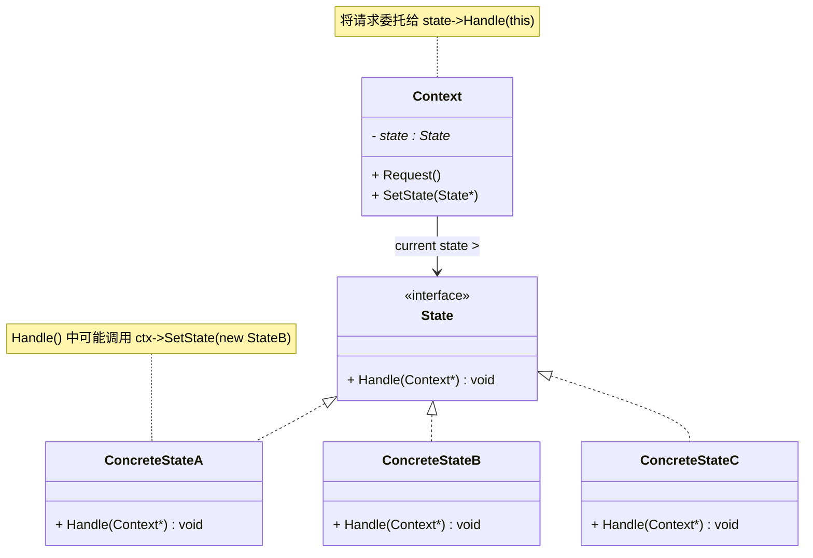
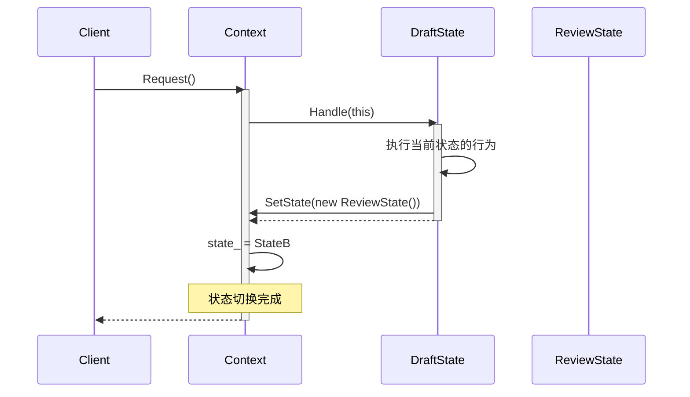

# 状态模式 (State Pattern)

## 概述

**状态模式**（State Pattern），属于 **行为型设计模式**。它允许一个对象在其内部状态改变时**改变它的行为**，看起来就好像这个对象改变了它的类。

> **定义**：允许一个对象在其内部状态改变时改变它的行为。对象看起来似乎修改了它的类。

### 一个直觉感受

```cpp
// ❌ 不用状态模式：一堆 if-else 判断状态
class Document {
    string state_;  // "draft", "review", "published"

public:
    void Edit() {
        if (state_ == "draft") { /* 可以编辑 */ }
        else if (state_ == "review") { /* 只能添加批注 */ }
        else /* published */ { /* 拒绝编辑 */ }
    }

    void Publish() {
        if (state_ == "draft") { state_ = "review"; }
        else if (state_ == "review") { state_ = "published"; }
        else /* published */ { /* 已发布，不能重复 */ }
    }
    // 每加一个新状态，所有 if-else 都要改！
};

// ✅ 状态模式：每种状态独立成一个类
Document doc;
doc.Edit();     // DraftState 处理 → 允许编辑
doc.Publish();  // DraftState 处理 → 转 ReviewState
doc.Edit();     // ReviewState 处理 → 只能添加批注
doc.Publish();  // ReviewState 处理 → 转 PublishedState
doc.Edit();     // PublishedState 处理 → 拒绝
```

---

## 核心设计思想

### 三个角色

| 角色 | 名称 | 职责 |
|---|---|---|
| **上下文 (Context)** | `Context` | 维护一个 State 实例的引用，将状态相关的请求委托给当前状态对象 |
| **抽象状态 (State)** | `State` | 定义所有具体状态的公共接口——每一个方法对应一种行为 |
| **具体状态 (ConcreteState)** | `DraftState / ReviewState` | 实现该状态下各自的行为，**并且负责状态的切换** |

### 状态转换由谁负责？

这是状态模式最关键的设计决策——**谁来切换状态**。

```
方式一：Context 负责切换
  Context.SetState(new ReviewState())  → 决策在外部
  优点：Context 集中管理转换逻辑
  缺点：Context 需要知道下一个状态是什么

方式二：State 负责切换（本文采用）
  DraftState::Publish() { context_->SetState(new ReviewState()); }
  优点：每个状态知道自己之后是什么，新增状态改得少
  缺点：状态对象之间产生了耦合（DraftState 知道 ReviewState）
```

### 与策略模式的本质区别

| | 状态模式 | 策略模式 |
|---|---|---|
| **谁决定切换** | 状态**自己**决定何时切换到下一个状态 | **客户端**决定用哪个策略 |
| **知道彼此吗** | 状态之间互相知道（Draft→Review→Published） | 策略之间互不关心 |
| **典型场景** | "流程"——审批流、TCP 连接状态 | "算法"——排序、压缩、加密 |

---

## UML 类图



### 时序图



---

## C++ 实现

### 完整示例：文档审批流程

```cpp
#include <iostream>
#include <memory>
#include <string>

// 前向声明
class Document;

// ============ 抽象状态 ============
class DocumentState {
public:
    virtual ~DocumentState() = default;
    virtual std::string GetName() const = 0;
    virtual void Edit(Document& doc) = 0;
    virtual void Publish(Document& doc) = 0;
};

// ============ 上下文 ============
class Document {
    std::unique_ptr<DocumentState> state_;
    std::string content_;

public:
    explicit Document(std::unique_ptr<DocumentState> initial)
        : state_(std::move(initial)) {
        std::cout << "[文档] 初始状态: " << state_->GetName() << std::endl;
    }

    void SetState(std::unique_ptr<DocumentState> next) {
        std::cout << "  [转换] " << state_->GetName()
                  << " → " << next->GetName() << std::endl;
        state_ = std::move(next);
    }

    void Edit(const std::string& text) {
        state_->Edit(*this);          // ★ 委托给当前状态
        if (!text.empty()) content_ = text;
    }

    void Publish() {
        state_->Publish(*this);       // ★ 委托给当前状态
    }

    const std::string& GetContent() const { return content_; }
};

// ============ 具体状态：草稿 ============
class DraftState : public DocumentState {
public:
    std::string GetName() const override { return "草稿"; }

    void Edit(Document& doc) override {
        std::cout << "  [草稿] 可以自由编辑" << std::endl;
    }

    void Publish(Document& doc) override {
        std::cout << "  [草稿] 提交审核" << std::endl;
        // ★ 状态自己决定下一个状态是谁
        doc.SetState(std::make_unique<ReviewState>());
    }
};

// ============ 具体状态：审核中 ============
class ReviewState : public DocumentState {
public:
    std::string GetName() const override { return "审核中"; }

    void Edit(Document& doc) override {
        std::cout << "  [审核] 只能添加批注，不能修改正文" << std::endl;
    }

    void Publish(Document& doc) override {
        std::cout << "  [审核] 审核通过，正式发布" << std::endl;
        doc.SetState(std::make_unique<PublishedState>());
    }
};

// ============ 具体状态：已发布 ============
class PublishedState : public DocumentState {
public:
    std::string GetName() const override { return "已发布"; }

    void Edit(Document& doc) override {
        std::cout << "  [已发布] ❌ 文档已发布，不可编辑" << std::endl;
    }

    void Publish(Document& doc) override {
        std::cout << "  [已发布] ❌ 文档已发布，无需重复操作" << std::endl;
    }
};

// ============ 客户端 ============
int main() {
    Document doc(std::make_unique<DraftState>());

    std::cout << "\n=== 步骤 1：编辑草稿 ===" << std::endl;
    doc.Edit("第一版内容");

    std::cout << "\n=== 步骤 2：提审 ===" << std::endl;
    doc.Publish();  // 草稿 → 审核中

    std::cout << "\n=== 步骤 3：审核中尝试编辑 ===" << std::endl;
    doc.Edit("修改");

    std::cout << "\n=== 步骤 4：审核通过发布 ===" << std::endl;
    doc.Publish();  // 审核中 → 已发布

    std::cout << "\n=== 步骤 5：发布后尝试编辑 ===" << std::endl;
    doc.Edit("偷偷改一下");

    std::cout << "\n=== 步骤 6：发布后尝试重新发布 ===" << std::endl;
    doc.Publish();

    return 0;
}
```

### 输出

```
[文档] 初始状态: 草稿

=== 步骤 1：编辑草稿 ===
  [草稿] 可以自由编辑

=== 步骤 2：提审 ===
  [草稿] 提交审核
  [转换] 草稿 → 审核中

=== 步骤 3：审核中尝试编辑 ===
  [审核] 只能添加批注，不能修改正文

=== 步骤 4：审核通过发布 ===
  [审核] 审核通过，正式发布
  [转换] 审核中 → 已发布

=== 步骤 5：发布后尝试编辑 ===
  [已发布] ❌ 文档已发布，不可编辑

=== 步骤 6：发布后尝试重新发布 ===
  [已发布] ❌ 文档已发布，无需重复操作
```

### 状态流转图

```
    Edit()
  ┌────◇─────┐
  │          │
  ▼          │
┌──────┐ Publish() ┌──────────┐ Publish() ┌───────────┐
│ 草稿  │─────────▶│  审核中   │─────────▶│  已发布    │
│      │          │          │          │           │
│ 自由  │          │ 只能批注  │          │ 禁止编辑   │
│ 编辑  │          │ 禁止修改  │          │ 禁止重发   │
└──────┘          └──────────┘          └───────────┘
```

---

### 状态模式 vs if-else

文档审批流如果用 `if-else` 会变成什么样：

```cpp
// ❌ if-else 地狱
class Document {
    enum State { DRAFT, REVIEW, PUBLISHED };
    State state_ = DRAFT;

public:
    void Edit() {
        if (state_ == DRAFT) {
            // 允许编辑
        } else if (state_ == REVIEW) {
            // 只能批注
        } else if (state_ == PUBLISHED) {
            // 拒绝
        } else {
            // 又加了一个新状态...忘改这个方法了！
        }
    }

    void Publish() {
        if (state_ == DRAFT) {
            state_ = REVIEW;
        } else if (state_ == REVIEW) {
            state_ = PUBLISHED;
        } else if (state_ == PUBLISHED) {
            // 拒绝
        }
    }
};
```

| 问题 | if-else | 状态模式 |
|---|---|---|
| 新增状态 | 所有 if-else 方法都要加一个分支 | 新增一个 State 子类 |
| 缺失分支 | 编译不报错，运行时可能漏掉 | 纯虚函数强制子类实现 |
| 代码可读性 | 分支多以后很难看出状态转换逻辑 | 每个类清晰描述一种状态的行为 |
| 开闭原则 | ❌ 违反 | ✅ 符合 |

---

## 实际应用场景

### 1. TCP 连接状态

```cpp
class TCPState {
public:
    virtual void Open(TCPConnection& conn)  = 0;
    virtual void Close(TCPConnection& conn) = 0;
    virtual void Send(TCPConnection& conn, const Data& d) = 0;
};

class ClosedState : public TCPState {
    void Open(TCPConnection& c) override {
        // 三次握手
        c.SetState(std::make_unique<EstablishedState>());
    }
    void Close(TCPConnection& c) override { /* 已关闭，忽略 */ }
    void Send(TCPConnection& c, const Data& d) override {
        throw "连接未建立";
    }
};

class EstablishedState : public TCPState {
    void Open(TCPConnection& c) override  { /* 已连接，忽略 */ }
    void Close(TCPConnection& c) override {
        // 四次挥手
        c.SetState(std::make_unique<ClosedState>());
    }
    void Send(TCPConnection& c, const Data& d) override {
        // 发送 TCP 报文
    }
};
```

```
CLOSED ──Open()──▶ ESTABLISHED
  ▲                  │
  └──Close()─────────┘

在 ESTABLISHED 状态下调 Send() → 正常发送
在 CLOSED 状态下调 Send()    → 抛异常
同是一个方法，状态不同行为完全不同
```

> **现实案例**：Linux 内核中 TCP 的状态机（`tcp_rcv_state_process()`）——就是状态模式的思想。

### 2. 订单状态流转

```cpp
// 待支付 → 已支付 → 已发货 → 已签收 → 已完成
class OrderState {
public:
    virtual void Pay(Order& o)   { std::cout << "❌ 当前状态不支持支付" << std::endl; }
    virtual void Ship(Order& o)  { std::cout << "❌ 当前状态不支持发货" << std::endl; }
    virtual void Confirm(Order& o) { std::cout << "❌ 当前状态不支持签收" << std::endl; }
};

class PendingState : public OrderState {
    void Pay(Order& o) override {
        o.SetState(std::make_unique<PaidState>());
        std::cout << "✅ 支付成功" << std::endl;
    }
};

class PaidState : public OrderState {
    void Ship(Order& o) override {
        o.SetState(std::make_unique<ShippedState>());
        std::cout << "✅ 已发货" << std::endl;
    }
};

// 在 Pending 状态调 Ship() → "❌ 当前状态不支持发货"
// 在 Paid 状态调 Ship()    → "✅ 已发货"
```

### 3. 播放器状态

```cpp
class PlayerState {
public:
    virtual void Play(Player& p)  = 0;
    virtual void Pause(Player& p) = 0;
    virtual void Stop(Player& p)  = 0;
};

// Playing → 按暂停 → Paused → 按播放 → Playing
// Stopped → 按播放 → Playing（从头开始）
// Playing → 按播放 → 忽略（已经在播）
```

### 4. 电梯运行状态

```cpp
class ElevatorState {
public:
    virtual void GoTo(Elevator& e, int floor) = 0;
    virtual void OpenDoor(Elevator& e) = 0;
    virtual void CloseDoor(Elevator& e) = 0;
};

class MovingState : public ElevatorState {
    void OpenDoor(Elevator& e) override { /* ❌ 运行中不能开门 */ }
};
class StoppedState : public ElevatorState {
    void OpenDoor(Elevator& e) override { /* ✅ 可以开门 */ }
};
```

---

## 优缺点

### 优点

| # | 说明 |
|---|---|
| ✅ | **消除庞大的 if-else / switch** — 每个状态独立成一个类，职责清晰 |
| ✅ | **符合开闭原则** — 新增状态只需新增一个 State 子类，不改已有代码 |
| ✅ | **状态转换显式化** — 状态之间的切换关系写在各 State 类里，容易追踪 |
| ✅ | **避免非法操作** — 每个状态自己判断什么能做、什么不能做 |

### 缺点

| # | 说明 |
|---|---|
| ❌ | **类数量增加** — 每个状态一个类，状态多了类就多 |
| ❌ | **状态之间耦合** — 状态 A 要知道状态 B 的存在（便于切换） |
| ❌ | **Context 对 State 暴露过多** — State 需要操作 Context，容易破坏 Context 的封装 |
| ❌ | **简单场景过度设计** — 3 个状态 + 2 个操作，if-else 完全够用 |

---

## 适用场景

| 场景 | 说明 |
|---|---|
| **对象行为随状态变化的场景** | 一个对象在不同状态下执行同一操作的结果不同 |
| **代码里有大量 if-else/switch 判断状态** | 如果分支超过 3-4 个，就该考虑状态模式 |
| **状态之间有严格的流转顺序** | 审批流、订单流、连接状态机 |
| **需要防止非法状态转换** | 比如"已签收的订单不能回到待支付" |

---

## 总结

状态模式的核心思想：

> **把"什么是当前状态"和"在这个状态下做什么"写在一个类里。Context 只管"谁是我的当前状态"，行为全部委托出去。**

```
if-else 版：   Context 一手包办 → 所有状态的逻辑堆在 Context 里
状态模式版：   Context 委托 State → 每种状态的逻辑各回各家
```

它和策略模式长得一模一样，但意图完全不同——策略是"算法可替换"，状态是"行为随状态自发改变"。你可以这样记：

> **策略是你主动选的，状态是它自己变的。**
