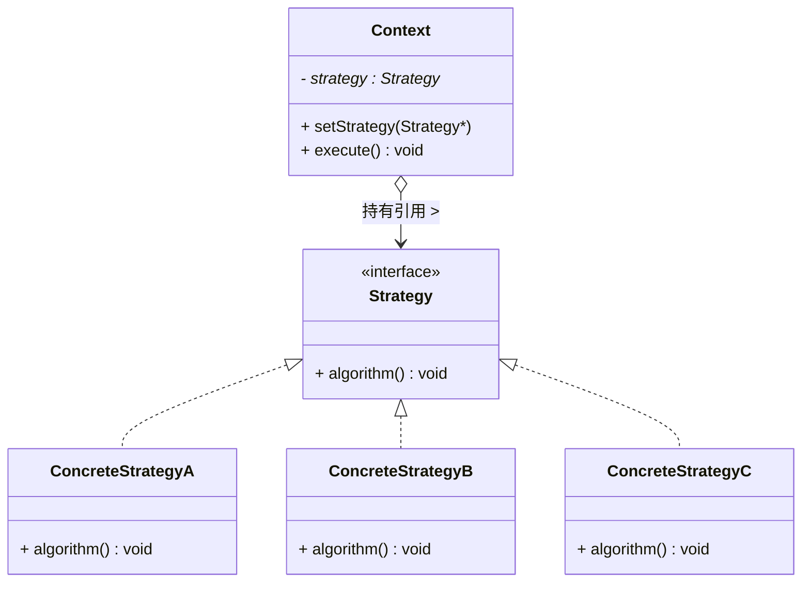
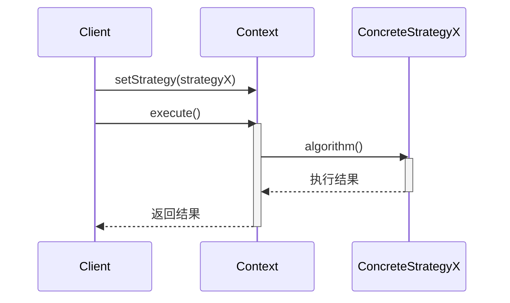
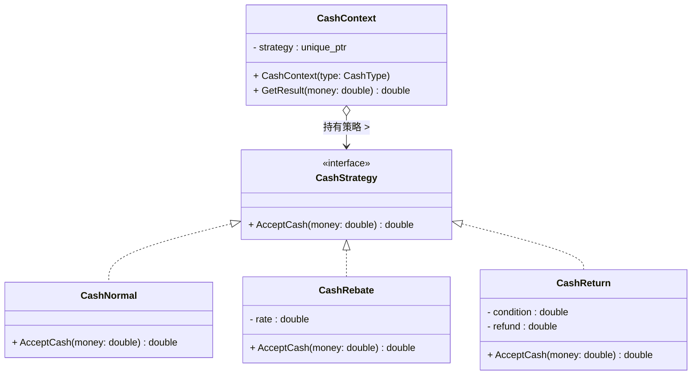
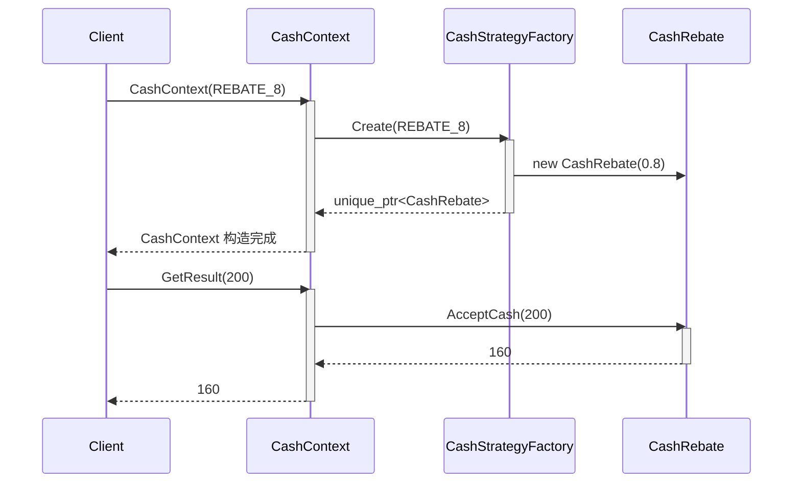

# 策略模式 (Strategy Pattern)

## 概述

**策略模式**（Strategy Pattern），又称 **政策模式**（Policy Pattern），属于 **行为型设计模式**。它定义了一系列算法，将每个算法封装到独立的类中，使它们可以互相替换。算法的变化独立于使用算法的客户端。

> **定义**：定义一系列算法，将它们一个个封装起来，并使它们可以相互替换。策略模式让算法的变化独立于使用它的客户。

---

## 核心设计思想

### 核心三要素

| 角色 | 名称 | 职责 |
|---|---|---|
| **上下文 (Context)** | `Context` | 持有策略对象的引用，负责维护和切换策略，对客户端屏蔽策略细节 |
| **策略接口 (Strategy)** | `Strategy` | 定义所有算法共有的接口，通常为抽象类或接口 |
| **具体策略 (ConcreteStrategy)** | `ConcreteStrategyA/B/C` | 实现策略接口的具体算法 |

### 核心原则

**"组合优于继承"** — 策略模式使用组合（`Context` 持有 `Strategy` 引用）而非继承来达到行为复用和替换，在运行时即可切换算法，无需修改源码。

### 工作流程

```
┌──────────┐     setStrategy()     ┌──────────────┐
│  Client  │ ───────────────────→  │   Context    │
│          │                      │ - strategy   │
│          │     context.         │              │
│          │ ◄─ execute() ─────── │ + execute()  │
└──────────┘                      └──────┬───────┘
                                         │  strategy->algorithm()
                                         ▼
                               ┌─────────────────────┐
                               │   <<interface>>     │
                               │     Strategy        │
                               ├─────────────────────┤
                               │ + algorithm()       │
                               └─────────────────────┘
                                     ▲          ▲
                        implements   │          │  implements
                          ┌──────────┘          └──────────┐
                    ┌─────┴──────┐                 ┌──────┴─────┐
                    │ Concrete   │                 │ Concrete   │
                    │StrategyA   │                 │StrategyB   │
                    ├────────────┤                 ├────────────┤
                    │algorithm() │                 │algorithm() │
                    └────────────┘                 └────────────┘
```

1. 客户端创建上下文对象（可附带默认策略）
2. 客户端通过 `setStrategy()` 设置具体策略
3. 客户端调用 `Context.execute()`，内部委托给当前策略对象的 `algorithm()`
4. 运行时可再次调用 `setStrategy()` 切换策略，无需停止或重建上下文

---

## UML 类图



### 时序图



---

## C++ 实现

### 经典实现（排序策略）

```cpp
#include <iostream>
#include <memory>
#include <vector>
#include <algorithm>

// ============ 策略接口 ============
class SortStrategy {
public:
    virtual ~SortStrategy() = default;
    virtual void Sort(std::vector<int>& data) const = 0;
};

// ============ 具体策略：冒泡排序 ============
class BubbleSort : public SortStrategy {
public:
    void Sort(std::vector<int>& data) const override {
        size_t n = data.size();
        for (size_t i = 0; i < n - 1; ++i) {
            for (size_t j = 0; j < n - i - 1; ++j) {
                if (data[j] > data[j + 1])
                    std::swap(data[j], data[j + 1]);
            }
        }
        std::cout << "[BubbleSort] 冒泡排序完成" << std::endl;
    }
};

// ============ 具体策略：快速排序 ============
class QuickSort : public SortStrategy {
private:
    static int Partition(std::vector<int>& data, int low, int high) {
        int pivot = data[high];
        int i = low - 1;
        for (int j = low; j < high; ++j) {
            if (data[j] <= pivot) {
                ++i;
                std::swap(data[i], data[j]);
            }
        }
        std::swap(data[i + 1], data[high]);
        return i + 1;
    }

    static void QuickSortImpl(std::vector<int>& data, int low, int high) {
        if (low < high) {
            int pi = Partition(data, low, high);
            QuickSortImpl(data, low, pi - 1);
            QuickSortImpl(data, pi + 1, high);
        }
    }

public:
    void Sort(std::vector<int>& data) const override {
        QuickSortImpl(data, 0, data.size() - 1);
        std::cout << "[QuickSort] 快速排序完成" << std::endl;
    }
};

// ============ 具体策略：标准库排序 ============
class StdSort : public SortStrategy {
public:
    void Sort(std::vector<int>& data) const override {
        std::sort(data.begin(), data.end());
        std::cout << "[StdSort] 标准库排序完成" << std::endl;
    }
};

// ============ 上下文 ============
class SortContext {
private:
    std::unique_ptr<SortStrategy> strategy_;

public:
    explicit SortContext(std::unique_ptr<SortStrategy> strategy)
        : strategy_(std::move(strategy)) {}

    void SetStrategy(std::unique_ptr<SortStrategy> strategy) {
        strategy_ = std::move(strategy);
    }

    void ExecuteSort(std::vector<int>& data) const {
        if (!strategy_) {
            throw std::runtime_error("No sort strategy set");
        }
        strategy_->Sort(data);
    }
};

// ============ 客户端 ============
int main() {
    std::vector<int> data = {64, 34, 25, 12, 22, 11, 90};

    // 默认使用标准库排序
    SortContext ctx(std::make_unique<StdSort>());
    ctx.ExecuteSort(data);

    // 小数据量 → 切换冒泡排序
    data = {5, 1, 4, 2, 8};
    ctx.SetStrategy(std::make_unique<BubbleSort>());
    ctx.ExecuteSort(data);

    // 大数据量 → 切换快速排序
    data = {9, -3, 5, 0, 1, 4, 7, 2, 8, 6};
    ctx.SetStrategy(std::make_unique<QuickSort>());
    ctx.ExecuteSort(data);

    // 验证结果
    for (int v : data) std::cout << v << " ";
    std::cout << std::endl;

    return 0;
}
```

### C++ 现代简化实现（std::function）

当策略比较简单时，无需定义完整的类层次，直接使用 `std::function` 即可实现策略模式：

```cpp
#include <iostream>
#include <vector>
#include <functional>
#include <algorithm>

class SortContext {
private:
    std::function<void(std::vector<int>&)> strategy_;

public:
    explicit SortContext(std::function<void(std::vector<int>&)> strategy)
        : strategy_(std::move(strategy)) {}

    void SetStrategy(std::function<void(std::vector<int>&)> strategy) {
        strategy_ = std::move(strategy);
    }

    void Execute(std::vector<int>& data) const {
        if (strategy_)
            strategy_(data);
    }
};

int main() {
    std::vector<int> data = {3, 1, 4, 1, 5};

    // 直接传入 lambda 作为策略
    SortContext ctx([](std::vector<int>& d) {
        std::sort(d.begin(), d.end());
        std::cout << "升序排序" << std::endl;
    });
    ctx.Execute(data);

    // 运行时切换为降序策略
    ctx.SetStrategy([](std::vector<int>& d) {
        std::sort(d.begin(), d.end(), std::greater<>());
        std::cout << "降序排序" << std::endl;
    });
    ctx.Execute(data);

    for (int v : data) std::cout << v << " ";
    return 0;
}
```

> **说明**：`std::function` 版本去掉了策略类的继承层次，适合策略简单、无需状态、数量少的场景。当策略本身有复杂的内部状态时，仍然推荐传统的类层次实现。

---

## 策略模式 + 简单工厂模式

### 为什么要结合？

客户端在使用策略模式时，仍然需要知道**有哪些具体策略类**存在，并自己决定创建哪一个：

```cpp
// 客户端仍然需要知道具体类名
auto ctx = SortContext(std::make_unique<BubbleSort>());
```

这违背了"封装变化点"的初衷。结合简单工厂模式后，客户端只需要传入一个**参数**（字符串、枚举），由工厂内部决定创建哪个策略——**策略的创建和选择完全对客户端隐藏**。

### 结合方式一：工厂内置于 Context

最常用的方式——将简单工厂直接放在 Context 的构造函数中，Context 自己负责创建策略：

```cpp
#include <iostream>
#include <memory>
#include <stdexcept>

// ============ 策略接口 ============
class CashStrategy {
public:
    virtual ~CashStrategy() = default;
    virtual double AcceptCash(double money) const = 0;
};

// ============ 具体策略 ============
class CashNormal : public CashStrategy {
public:
    double AcceptCash(double money) const override { return money; }
};

class CashRebate : public CashStrategy {
    double rate_;
public:
    explicit CashRebate(double rate) : rate_(rate) {}
    double AcceptCash(double money) const override { return money * rate_; }
};

class CashReturn : public CashStrategy {
    double condition_, refund_;
public:
    CashReturn(double cond, double ref) : condition_(cond), refund_(ref) {}
    double AcceptCash(double money) const override {
        if (money >= condition_)
            return money - static_cast<int>(money / condition_) * refund_;
        return money;
    }
};

// ============ 上下文 ============
// 策略 + 简单工厂 合二为一！
enum class CashType { NORMAL, REBATE_8, REBATE_7, RETURN_300_100 };

class CashContext {
private:
    std::unique_ptr<CashStrategy> strategy_;

public:
    // 构造函数 = 简单工厂！
    explicit CashContext(CashType type) {
        switch (type) {
            case CashType::NORMAL:
                strategy_ = std::make_unique<CashNormal>();
                break;
            case CashType::REBATE_8:
                strategy_ = std::make_unique<CashRebate>(0.8);
                break;
            case CashType::REBATE_7:
                strategy_ = std::make_unique<CashRebate>(0.7);
                break;
            case CashType::RETURN_300_100:
                strategy_ = std::make_unique<CashReturn>(300, 100);
                break;
            default:
                throw std::invalid_argument("Unknown cash type");
        }
    }

    double GetResult(double money) const {
        return strategy_->AcceptCash(money);
    }
};

// ============ 客户端 ============
int main() {
    // 客户端只需要传一个枚举，完全不知道 CashNormal / CashRebate 的存在！
    CashContext ctx(CashType::REBATE_8);
    std::cout << "打 8 折 200 → " << ctx.GetResult(200) << std::endl;

    CashContext ctx2(CashType::RETURN_300_100);
    std::cout << "满 300 减 100 (600) → " << ctx2.GetResult(600) << std::endl;

    return 0;
}
```

**关键变化**：客户端从"创建策略对象再传给 Context"变成了"告诉 Context 我要什么类型"——创建细节完全封装在 Context 内部。

### 结合方式二：独立的工厂类 + Context

当策略的创建逻辑复杂，或需要被多处复用时，可将工厂独立出来：

```cpp
// 独立的策略工厂
class CashStrategyFactory {
public:
    static std::unique_ptr<CashStrategy> Create(CashType type) {
        switch (type) {
            case CashType::NORMAL:        return std::make_unique<CashNormal>();
            case CashType::REBATE_8:      return std::make_unique<CashRebate>(0.8);
            case CashType::REBATE_7:      return std::make_unique<CashRebate>(0.7);
            case CashType::RETURN_300_100: return std::make_unique<CashReturn>(300, 100);
            default: throw std::invalid_argument("Unknown type");
        }
    }
};

// Context 不再负责创建，只负责执行
class CashContext {
    std::unique_ptr<CashStrategy> strategy_;
public:
    explicit CashContext(CashType type)
        : strategy_(CashStrategyFactory::Create(type)) {}
    double GetResult(double money) const { return strategy_->AcceptCash(money); }
};
```

### UML 类图（结合方式）



> 注意：这里的 `CashContext` 内部多了一个 **工厂职责**——它自己根据 `CashType` 创建策略对象。图中虽没有显式画出工厂类，但这一逻辑隐含在 `CashContext` 的构造函数中。

### 时序图



### 优缺点

| # | 说明 |
|---|---|
| ✅ | **客户端极简** — 客户端只需传一个枚举或字符串，无需知道任何具体策略类 |
| ✅ | **创建逻辑集中** — 所有策略的创建参数（如折扣率 0.8、满减条件 300/100）集中在工厂一处 |
| ✅ | **开闭原则部分满足** — 增加新策略只需改工厂，客户端代码无需改动 |
| ❌ | **工厂仍需修改** — 新增策略时工厂的 `switch` 要同步修改（简单工厂的通病） |
| ❌ | **Context 职责加重** — 方式一中 Context 同时承担策略持有 + 策略创建双重职责 |

### 实际应用：收银系统

这正是你目录下 `strategy/` 的完整形态——一个商场收银系统：

| 参数 | 策略 | 说明 |
|---|---|---|
| `NORMAL` | `CashNormal` | 原价收费 |
| `REBATE_8` | `CashRebate(0.8)` | 打 8 折 |
| `REBATE_7` | `CashRebate(0.7)` | 打 7 折 |
| `RETURN_300_100` | `CashReturn(300, 100)` | 满 300 减 100 |

```cpp
// 在前端收银界面，下拉框选择优惠类型
CashType type = ComboBox::GetSelectedType();  // 用户选了"满300减100"

// 一个 Context 搞定，不出现任何具体策略类名
CashContext ctx(type);
double payable = ctx.GetResult(totalPrice);
```

### 另一种思路：策略枚举 + 工厂表

当策略种类较多时，可用查表代替 `switch`：

```cpp
class CashContext {
    using Creator = std::unique_ptr<CashStrategy>(*)();
    static inline const std::unordered_map<CashType, Creator> factory_ = {
        {CashType::NORMAL,        [] { return std::make_unique<CashNormal>(); }},
        {CashType::REBATE_8,      [] { return std::make_unique<CashRebate>(0.8); }},
        {CashType::REBATE_7,      [] { return std::make_unique<CashRebate>(0.7); }},
        {CashType::RETURN_300_100, [] { return std::make_unique<CashReturn>(300, 100); }},
    };

    std::unique_ptr<CashStrategy> strategy_;

public:
    explicit CashContext(CashType type) : strategy_(factory_.at(type)()) {}
};
```

> 这种方式将"策略名 → 创建逻辑"的映射表与业务逻辑分离，新增策略只需在 `factory_` 表中加一行，不需要修改 `switch`。

---

## 底层应用场景

策略模式在底层系统中有极其广泛的应用，以下是几个典型场景：

### 1. 内存分配器策略

```cpp
// 策略接口
class Allocator {
public:
    virtual ~Allocator() = default;
    virtual void* Allocate(size_t size) = 0;
    virtual void Deallocate(void* ptr) = 0;
};

// 具体策略：伙伴系统分配器
class BuddyAllocator : public Allocator { /* ... */ };

// 具体策略：SLAB 分配器
class SlabAllocator : public Allocator { /* ... */ };

// 具体策略：TLSF（Two-Level Segregated Fit）分配器
class TLSFAllocator : public Allocator { /* ... */ };

// 上下文：内存池
class MemoryPool {
    Allocator* allocator_;  // 可切换分配策略
public:
    void* Alloc(size_t size) { return allocator_->Allocate(size); }
    void Free(void* ptr)     { allocator_->Deallocate(ptr); }
};
```

> **实际案例**：Linux 内核的 `kmalloc` 在不同场景下会使用不同的内存分配策略；glibc 的 `malloc` 使用 `ptmalloc`，Google 的 `tcmalloc` 和 Facebook 的 `jemalloc` 提供了不同的分配策略，应用层通过 LD_PRELOAD 即可替换——这正是策略模式的思想。

### 2. 文件系统缓存淘汰策略

```cpp
// 策略接口
class EvictionPolicy {
public:
    virtual ~EvictionPolicy() = default;
    virtual void OnAccess(int key) = 0;       // 访问时记录
    virtual int Evict() = 0;                  // 淘汰一个 key
};

// LRU（最近最少使用）
class LRUPolicy : public EvictionPolicy { /* 链表 + 哈希表 */ };

// LFU（最不经常使用）
class LFUPolicy : public EvictionPolicy { /* 计数排序 */ };

// FIFO（先进先出）
class FIFOPolicy : public EvictionPolicy { /* 队列 */ };

// ARC（自适应替换缓存）
class ARCPolicy : public EvictionPolicy { /* 同时维护近期与高频 */ };

// 上下文：缓存
class Cache {
    EvictionPolicy* policy_;
    std::unordered_map<int, Item> items_;
public:
    Item Get(int key) {
        policy_->OnAccess(key);
        return items_[key];
    }
    void Put(int key, Item val) {
        if (items_.size() >= capacity) {
            int evictKey = policy_->Evict();
            items_.erase(evictKey);
        }
        items_[key] = val;
    }
};
```

> **实际案例**：Redis 支持 `maxmemory-policy` 参数可选 `allkeys-lru`、`volatile-lfu`、`allkeys-random`、`noeviction` 等，运行时可通过 `CONFIG SET` 命令切换——这正是策略模式的经典应用。

### 3. 网络拥塞控制算法

```cpp
class CongestionControl {
public:
    virtual ~CongestionControl() = default;
    virtual void OnPacketLoss() = 0;       // 丢包处理
    virtual void OnAck() = 0;              // 收到 ACK
    virtual int GetWindowSize() const = 0; // 当前拥塞窗口
};

// Tahoe / Reno / BBR / Cubic ...
class CubicCC : public CongestionControl { /* ... */ };
class BBRCC   : public CongestionControl { /* ... */ };

// TCP 套接字上下文
class TCPSocket {
    CongestionControl* cc_;
    // 可通过 socket option 切换
    // setsockopt(fd, IPPROTO_TCP, TCP_CONGESTION, "bbr", ...)
};
```

> **实际案例**：Linux TCP 协议栈通过 `setsockopt(IPPROTO_TCP, TCP_CONGESTION)` 在 cubic、bbr、reno 等拥塞控制算法间切换——策略模式在此处是内核级的运行时多态。

### 4. 日志输出格式

```cpp
class LogFormatter {
public:
    virtual ~LogFormatter() = default;
    virtual std::string Format(const LogRecord& record) = 0;
};

class JsonFormatter : public LogFormatter { /* → JSON 字符串 */ };
class PlainTextFormatter : public LogFormatter { /* → 纯文本日志 */ };
class BinaryFormatter : public LogFormatter { /* → 紧凑二进制 */ };

class Logger {
    LogFormatter* formatter_;
    // 运行时切换输出格式
    void SetFormatter(LogFormatter* f) { formatter_ = f; }
    void Log(const LogRecord& r) {
        auto str = formatter_->Format(r);
        write(fd_, str.data(), str.size());
    }
};
```

### 5. 磁盘 IO 调度策略

| 调度器 | 策略 | 适用场景 |
|---|---|---|
| **CFQ** (Completely Fair Queueing) | 公平时间片分配 | 通用桌面/服务器 |
| **Deadline** | 按截止时间优先 | 数据库、实时应用 |
| **NOOP** | 简单 FIFO 合并 | SSD、闪存设备 |
| **MQ-DEADLINE** | 多队列 Deadline | NVMe 高速 SSD |

Linux 通过 `echo deadline > /sys/block/sda/queue/scheduler` 即可在运行时切换 IO 调度策略——底层内核正是用策略模式实现的这些调度器。

---

## 与状态模式的对比

| 维度 | 策略模式 | 状态模式 |
|---|---|---|
| **关注点** | 算法的替换 | 状态的切换 |
| **切换触发** | 客户端主动 `setStrategy()` | 状态内部自动转换 |
| **是否知道彼此** | 策略之间互相独立 | 状态之间互相知道，可主动切换 |
| **典型场景** | 排序、压缩、加密 | TCP 连接状态机、订单状态流转 |

---

## 优缺点

### 优点

| # | 说明 |
|---|---|
| ✅ | **符合开闭原则** — 新增策略无需修改上下文和现有策略 |
| ✅ | **消除条件分支** — 替代大量的 `if/else` 或 `switch/case` |
| ✅ | **运行时切换** — 可在应用运行时动态切换算法行为 |
| ✅ | **策略可复用** — 同一策略可在不同上下文中使用 |

### 缺点

| # | 说明 |
|---|---|
| ❌ | **类数量增加** — 每个策略一个类，策略多了类会膨胀（可用 `std::function` + lambda 缓解） |
| ❌ | **客户端需要了解策略差异** — 客户端得知道有哪些策略可用以及它们的区别 |
| ❌ | **策略间通信成本** — 某些场景下策略之间需要共享数据，会增加上下文的设计复杂度 |

---

## 适用场景

### 通用原则

- 一个系统需要在**多种算法/行为之间切换**
- 需要在**运行时**动态决定使用哪种算法
- 算法逻辑复杂，需要**独立测试和维护**
- 系统中存在大量 `if/else` 或 `switch` 来处理不同情况（即"代码坏味道"——`switch` 语句的滥用）

### 典型场景案例

#### 1. 数据压缩策略

```cpp
class CompressionStrategy {
public:
    virtual ~CompressionStrategy() = default;
    virtual std::vector<uint8_t> Compress(const uint8_t* data, size_t len) = 0;
    virtual std::vector<uint8_t> Decompress(const uint8_t* data, size_t len) = 0;
};

class GzipCompression : public CompressionStrategy { /* zlib gzip 格式 */ };
class ZstdCompression  : public CompressionStrategy { /* Facebook Zstandard */ };
class LZ4Compression   : public CompressionStrategy { /* 极速压缩 */ };

class Compressor {
    CompressionStrategy* strategy_;
public:
    void SetStrategy(CompressionStrategy* s) { strategy_ = s; }
    std::vector<uint8_t> Compress(const uint8_t* d, size_t len) {
        return strategy_->Compress(d, len);
    }
};

// 按场景切换：网络传输用 LZ4（快），归档存储用 Zstd（压缩率高）
Compressor cmp;
cmp.SetStrategy(new LZ4Compression());   // 网络发送
auto fast = cmp.Compress(data, len);
cmp.SetStrategy(new ZstdCompression());  // 磁盘归档
auto dense = cmp.Compress(data, len);
```

> **现实案例**：Kafka 允许在 topic 级别配置压缩类型（gzip / snappy / lz4 / zstd），生产者发送时根据配置选择压缩器——这正是策略模式。

#### 2. 加密算法

```cpp
class EncryptionStrategy {
public:
    virtual ~EncryptionStrategy() = default;
    virtual std::vector<uint8_t> Encrypt(const uint8_t* plain, size_t len) = 0;
    virtual std::vector<uint8_t> Decrypt(const uint8_t* cipher, size_t len) = 0;
};

class AES256GCM : public EncryptionStrategy { /* 对称加密，高性能 */ };
class RSA2048   : public EncryptionStrategy { /* 非对称加密，安全交换密钥 */ };
class ChaCha20  : public EncryptionStrategy { /* 流加密，移动端高效 */ };

class SecureChannel {
    EncryptionStrategy* enc_;
public:
    void SetEncryption(EncryptionStrategy* e) { enc_ = e; }
    void Send(const uint8_t* data, size_t len) {
        auto cipher = enc_->Encrypt(data, len);
        socket_.Send(cipher);
    }
};

// 握手时协商加密算法
SecureChannel chan;
if (client.Supports("chacha20"))
    chan.SetEncryption(new ChaCha20());
else
    chan.SetEncryption(new AES256GCM());
```

> **现实案例**：TLS 1.3 握手阶段，客户端和服务端通过 CipherSuite 协商选用哪个加密套件——每一步（密钥交换、认证、对称加密）都是一个策略选择点。

#### 3. 促销定价引擎

```cpp
class PricingStrategy {
public:
    virtual ~PricingStrategy() = default;
    virtual double Calculate(double basePrice) = 0;
};

class NoDiscount : public PricingStrategy {
    double Calculate(double price) override { return price; }
};

class PercentageDiscount : public PricingStrategy {
    double rate_;
public:
    explicit PercentageDiscount(double r) : rate_(r) {}
    double Calculate(double price) override { return price * (1 - rate_); }
};

class BuyXGetYFree : public PricingStrategy { /* 满 X 件 Y 件免费 */ };
class VipPricing : public PricingStrategy { /* 会员专享价 */ };

class Order {
    PricingStrategy* strategy_;
    std::vector<Item> items_;
public:
    void SetPromotion(PricingStrategy* s) { strategy_ = s; }
    double Checkout() {
        double total = std::accumulate(...);
        return strategy_->Calculate(total);
    }
};

// 根据用户等级 + 促销活动动态切换
Order order;
if (user.IsVip() && promo.IsActive("618"))
    order.SetPromotion(new PercentageDiscount(0.3));
```

#### 4. 数据校验策略

```cpp
class ValidationStrategy {
public:
    virtual ~ValidationStrategy() = default;
    virtual bool Validate(const std::string& input) = 0;
};

class EmailValidator : public ValidationStrategy {
    bool Validate(const std::string& input) override {
        // 正则匹配 email 格式
        return std::regex_match(input, std::regex(R"([\w.]+@\w+\.\w+)"));
    }
};

class PhoneValidator : public ValidationStrategy {
    bool Validate(const std::string& input) override {
        // 校验手机号格式
        return input.size() == 11 && input[0] == '1';
    }
};

class NotEmptyValidator : public ValidationStrategy {
    bool Validate(const std::string& input) override {
        return !input.empty();
    }
};

class FormField {
    ValidationStrategy* validator_;
public:
    FormField(ValidationStrategy* v) : validator_(v) {}
    bool IsValid(const std::string& value) { return validator_->Validate(value); }
};

// 每个字段使用不同的校验策略
FormField emailField(new EmailValidator());
FormField phoneField(new PhoneValidator());
```

#### 5. 路径规划算法

```cpp
class RouteStrategy {
public:
    virtual ~RouteStrategy() = default;
    virtual Route Calculate(const Point& from, const Point& to) = 0;
};

class DrivingRoute : public RouteStrategy { /* 驾车：高速优先 */ };
class CyclingRoute : public RouteStrategy { /* 骑行：自行车道优先 */ };
class WalkingRoute : public RouteStrategy { /* 步行：最短距离 */ };
class TransitRoute : public RouteStrategy { /* 公交：换乘最少 */ };

class Navigator {
    RouteStrategy* strategy_;
public:
    void SetTransportMode(const std::string& mode) {
        if (mode == "car")  strategy_ = new DrivingRoute();
        if (mode == "bike") strategy_ = new CyclingRoute();
        // ...
    }
    Route Plan(const Point& from, const Point& to) {
        return strategy_->Calculate(from, to);
    }
};

// 用户点击"驾车/公交/骑行"按钮 = 切换策略
Navigator nav;
nav.SetTransportMode("transit");
auto route = nav.Plan(here, there);
```

> **现实案例**：Google Maps / 高德地图的路线规划—用户选择交通方式时，后端切换到对应的路线算法引擎，计算耗时、距离和路线的策略完全不同。

---

## 总结

策略模式将"做什么"和"怎么做"分离，通过组合而非继承实现行为的动态替换。它在底层系统中无处不在——CPU 调度、内存分配、IO 调度、拥塞控制、缓存淘汰——这些场景都遵循同一个模式：**定义接口 → 实现多个策略 → 运行时按需切换**。

理解策略模式不仅是学会一种设计模式，更是掌握了一种构建**可配置系统**的方法论。
