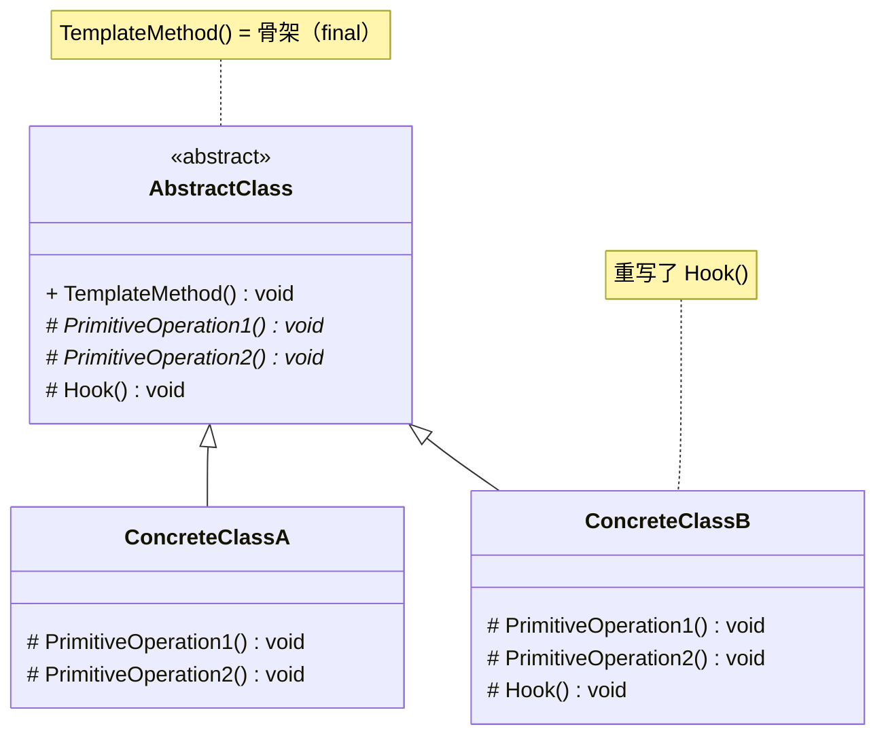
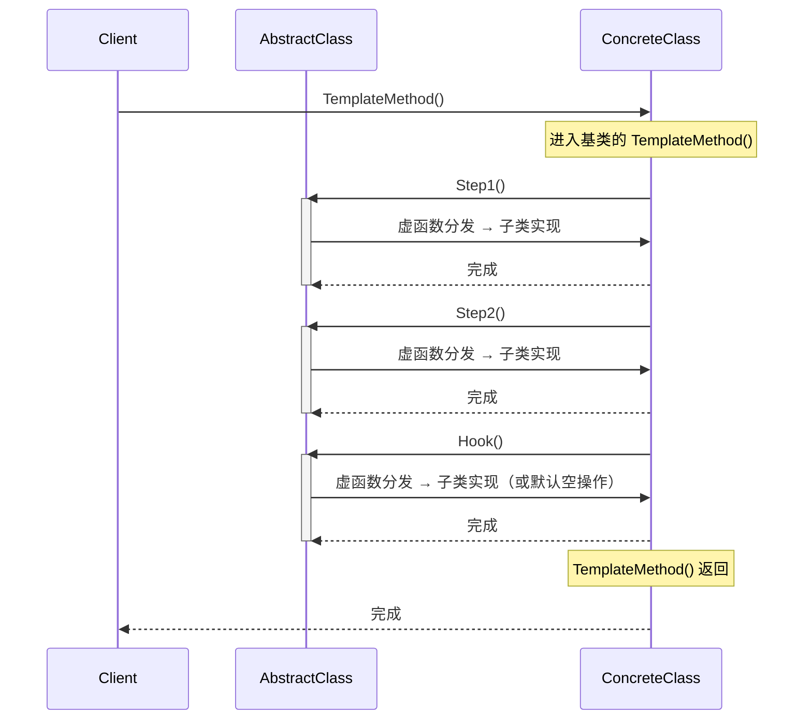

# 模板方法模式 (Template Method Pattern)

## 概述

**模板方法模式**（Template Method Pattern），属于 **行为型设计模式**。它在基类中定义一个算法的骨架，将某些步骤延迟到子类中实现。子类可以重写这些步骤，而不改变算法的整体结构。

> **定义**：定义一个操作中算法的骨架，而将某些步骤延迟到子类中。模板方法使得子类可以不改变一个算法的结构即可重定义该算法的某些特定步骤。

### 一个直觉感受

```cpp
// 煮咖啡和泡茶的步骤很像：
//   煮咖啡：烧水 → 冲咖啡粉 → 倒入杯子 → 加糖和牛奶
//   泡茶：  烧水 → 泡茶叶   → 倒入杯子 → 加柠檬
//           ^^^      ^^^^         ^^^^      ^^^^
//           相同     不同         相同      不同

// 不用模板方法：两套重复代码
// 用模板方法：基类写好骨架，子类只填空
```

模板方法模式的核心思想就是一句口诀：

> **"骨架我定，细节你填。"**

---

## 核心设计思想

### 两个角色

| 角色 | 名称 | 职责 |
|---|---|---|
| **抽象类 (AbstractClass)** | `AbstractClass` | 定义模板方法（骨架），声明抽象的原语操作让子类实现 |
| **具体类 (ConcreteClass)** | `ConcreteClass` | 实现抽象的原语操作，完成算法中特定步骤的具体逻辑 |

### 模板方法的结构

```
class AbstractClass {
public:
    void TemplateMethod() {         // ← 模板方法（骨架），普通方法子类无法重写
        Step1();                    // ← 子类可以实现
        Step2();                    // ← 子类可以实现
        Step3();                    // ← 子类可以实现
        Hook();                     // ← 可选钩子（子类可覆盖，可不覆盖）
    }

protected:
    virtual void Step1() = 0;       // ← 纯虚：子类必须实现
    virtual void Step2() = 0;       // ← 纯虚：子类必须实现
    virtual void Step3() = 0;       // ← 纯虚：子类必须实现
    virtual void Hook() {}          // ← 钩子：有默认空实现，子类可选覆盖
};
```

### 三种方法类型

| 类型 | C++ 写法 | 谁实现 | 子类能否改 |
|---|---|---|---|
| **模板方法** | 普通 public 方法（非虚函数） | 基类（一次写成） | ❌ 不能 |
| **原语操作** | `virtual ... = 0` 纯虚函数 | 子类 | ✅ 必须 |
| **钩子方法** | `virtual ... {}` 有默认实现 | 基类（默认空，子类可覆盖） | ✅ 可选 |

### `final` 关键字在模板方法模式中的用法

#### `final` 是干什么的

`final` 是 C++11 引入的关键字，作用是**禁止**——像一扇"此路不通"的门：

- 加在函数上 → **禁止子类重写这个函数**
- 加在类上 → **禁止其他类继承这个类**

```cpp
// 没有 final：一切正常，子类可以重写、可以继承
class Animal {
public:
    virtual void Speak() { std::cout << "..."; }
};
class Dog : public Animal {
    void Speak() override { std::cout << "Woof!"; }  // ✅ 可以重写
};
class Husky : public Dog { };  // ✅ 可以继承
```

```cpp
// 有 final：封堵继承链
class Animal {
public:
    virtual void Speak() final { std::cout << "..."; }
    //                        ^^^^^ 到这里止步，子类不许再改
};
class Dog : public Animal {
    // void Speak() override { }  // ❌ 编译错误：父类 final 禁止重写
};

class Immutable final {   // ← 这个类不能被继承
    //                        ^^^^^
};
// class Child : public Immutable { };  // ❌ 编译错误：final 类不能被继承
```

> **一句话：`final` = "到此为止，不许再改 / 不许再继承"。**

在设计模式中，`final` 最常见的用途是**保护模板方法的骨架不被篡改**——基类定好了调用顺序，谁来都不能改。

#### `final` 的两种语法

```cpp
// 用法一：final 修饰虚函数 —— 阻止子类继续重写
class Base {
public:
    virtual void Step() final { /* ... */ }
};

class Derived : public Base {
    // void Step() override { }  // ❌ 编译错误：final 禁止重写
};

// 用法二：final 修饰类 —— 阻止其他类继承
class FinalClass final {
    // ...
};

// class TryDerive : public FinalClass { };  // ❌ 编译错误：final 禁止继承
```

#### 模板方法该不该加 `final`？

取决于这个模板方法本身是不是虚函数：

```
情况 1：模板方法是普通成员函数（非虚）
  void PrepareRecipe() { ... }
  子类本来就不能重写普通方法（写同名函数只是隐藏，不走虚表）
  不需要加 final，加了反而编译报错 ❌

情况 2：模板方法是虚函数（基类希望它是虚的）
  virtual void Update() final { ... }
  需要加 final，明确告诉子类：这个虚函数到此为止，不许再改 ✅
```

#### 文档中的两种写法

```cpp
// 写法一：非虚模板方法（本文咖啡/茶示例）
// 原因：PrepareRecipe() 是基类独占的流程控制，没有任何场景需要子类重写它
class CaffeineBeverage {
public:
    void PrepareRecipe() {              // ← 普通方法，不写 final
        BoilWater();
        Brew();           // 子类通过虚函数填空
        PourInCup();
        AddCondiments();  // 子类通过虚函数填空
    }
    // ...
};

// 写法二：虚模板方法 + final（本文游戏角色示例）
// 原因：Update() 本身在多态体系中被声明为 virtual，用 final 封堵更安全
class GameCharacter {
public:
    virtual void Update() final {       // ← virtual + final，正确
        HandleInput();
        UpdateState();    // 子类重写这些内部的虚函数
        Render();
    }
    // ...
};
```

> **经验法则：**
> - 模板方法是**普通的 public 方法** → 不写 `final`（写了反而报错）
> - 模板方法**本身就在虚函数链中**且不希望再被改 → `virtual ... final`
> - `final` 适用于需要阻止**类被继承**的保护场景，但和模板方法关系不大

---

## UML 类图



### 时序图



---

## C++ 实现

### 经典实现：咖啡和茶

```cpp
#include <iostream>
#include <memory>

// ============ 抽象类 ============
class CaffeineBeverage {
public:
    virtual ~CaffeineBeverage() = default;

    // ★★★ 模板方法——骨架由基类定义，子类不应重写 ★★★
    void PrepareRecipe() {
        BoilWater();              // ① 公共步骤：烧水
        Brew();                   // ② 差异步骤：冲泡（子类实现）
        PourInCup();              // ③ 公共步骤：倒入杯子
        AddCondiments();          // ④ 差异步骤：加调料（子类实现）

        if (CustomerWantsExtra()) // ⑤ 钩子：控制是否加额外步骤
            ExtraStep();
    }

protected:
    // 公共方法——基类实现，子类直接用
    void BoilWater() {
        std::cout << "  [公共] 将水烧到 100°C" << std::endl;
    }

    void PourInCup() {
        std::cout << "  [公共] 倒入杯子" << std::endl;
    }

    // 原语操作——子类必须实现的步骤
    virtual void Brew() = 0;
    virtual void AddCondiments() = 0;

    // 钩子方法——有默认实现，子类可选覆盖
    virtual bool CustomerWantsExtra() { return false; }
    virtual void ExtraStep() {}   // 默认什么都不做
};

// ============ 具体类：咖啡 ============
class Coffee : public CaffeineBeverage {
protected:
    void Brew() override {
        std::cout << "  [咖啡] 用沸水冲泡咖啡粉" << std::endl;
    }

    void AddCondiments() override {
        std::cout << "  [咖啡] 加糖和牛奶" << std::endl;
    }

    // 覆盖钩子：咖啡需要额外步骤
    bool CustomerWantsExtra() override {
        return true;
    }

    void ExtraStep() override {
        std::cout << "  [咖啡] 拉花（额外步骤）" << std::endl;
    }
};

// ============ 具体类：茶 ============
class Tea : public CaffeineBeverage {
protected:
    void Brew() override {
        std::cout << "  [茶]   用沸水浸泡茶叶" << std::endl;
    }

    void AddCondiments() override {
        std::cout << "  [茶]   加柠檬" << std::endl;
    }

    // 不覆盖钩子——茶不需要额外步骤（使用基类默认 false）
};

// ============ 客户端 ============
int main() {
    std::cout << "===== 制作咖啡 =====" << std::endl;
    Coffee coffee;
    coffee.PrepareRecipe();

    std::cout << "\n===== 制作茶 =====" << std::endl;
    Tea tea;
    tea.PrepareRecipe();

    return 0;
}
```

### 输出

```
===== 制作咖啡 =====
  [公共] 将水烧到 100°C
  [咖啡] 用沸水冲泡咖啡粉
  [公共] 倒入杯子
  [咖啡] 加糖和牛奶
  [咖啡] 拉花（额外步骤）

===== 制作茶 =====
  [公共] 将水烧到 100°C
  [茶]   用沸水浸泡茶叶
  [公共] 倒入杯子
  [茶]   加柠檬
```

### 关键解读

```cpp
// 基类的模板方法：
void PrepareRecipe() {
    BoilWater();           // 基类实现——子类不会重复写
    Brew();                // 虚函数——Coffee 和 Tea 各自实现
    PourInCup();           // 基类实现——子类不会重复写
    AddCondiments();       // 虚函数——Coffee 和 Tea 各自实现

    if (CustomerWantsExtra())  // ← 钩子：控制流程分支
        ExtraStep();           // 只有 Coffee 触发
}
```

**核心："好莱坞原则"**——Don't call us, we'll call you（不要打电话给我们，我们会打给你）。

> 子类不需要自己组织调用步骤、不需要关心顺序。基类的 `PrepareRecipe()` 会在合适的时机调用子类实现的 `Brew()` 和 `AddCondiments()`。控制权在基类手中。

---

## 钩子方法的威力

钩子让子类不仅能**填充空白**，还能**控制流程**：

```cpp
class CaffeineBeverage {
    void PrepareRecipe() {
        BoilWater();
        Brew();
        PourInCup();

        if (CustomerWantsCondiments())  // ← 钩子决定是否加调料
            AddCondiments();
    }

    virtual bool CustomerWantsCondiments() { return true; }  // 默认加
};

// 有些人不加糖不加奶：
class BlackCoffee : public Coffee {
protected:
    bool CustomerWantsCondiments() override {
        // 可以和用户交互！
        std::string answer;
        std::cout << "要加糖和奶吗？(y/n) ";
        std::cin >> answer;
        return answer == "y";
    }
};
```

| 钩子类型 | 例子 | 作用 |
|---|---|---|
| **开关钩子** | `CustomerWantsExtra()` 返回 bool | 控制某个步骤是否执行 |
| **插入钩子** | `ExtraStep()` 默认空实现 | 在骨架中预留一个可选扩展点 |
| **参数钩子** | `GetSugarAmount()` 返回 int | 子类可以调节步骤的参数 |

---

## 与策略模式、工厂方法的对比

模板方法模式最容易和策略模式、工厂方法混淆——三者都有"基类定义接口、子类实现细节"的结构。

### 模板方法 vs 策略模式

| 维度 | 模板方法 | 策略模式 |
|---|---|---|
| **控制权** | 在**基类**（好莱坞原则） | 在**客户端**（客户端选择策略） |
| **粒度** | 控制多个步骤的**整体流程** | 替换**一个完整算法** |
| **关系** | 继承（白盒复用） | 组合（黑盒复用） |
| **运行时切换** | ❌ 固定继承，编译期绑定 | ✅ 可随时换策略对象 |

```cpp
// 模板方法：基类控制流程
class Beverage {
    void Prepare() final { Step1(); Step2(); Step3(); }
    virtual void Step2() = 0;  // 子类填空
};

// 策略：客户端控制
SortContext ctx;
ctx.SetStrategy(new QuickSort());   // 客户端选择算法
ctx.Execute(data);
```

### 模板方法 vs 工厂方法

工厂方法实际上是**模板方法的一种特殊形式**——模板方法中某一个步骤正好是"创建对象"。

```cpp
class Application {
public:
    void OpenDocument() {            // ← 模板方法
        auto doc = CreateDocument(); // ← 工厂方法（模板中的一步）
        doc->Load();
        doc->Display();
    }
    virtual unique_ptr<Document> CreateDocument() = 0;  // ← 工厂方法
};
```

> **工厂方法是模板方法模式的一个特例。**

### 三句话区分

| 模式 | 一句话 |
|---|---|
| **模板方法** | "流程我定，填空你来" |
| **策略模式** | "算法全换，你说了算" |
| **工厂方法** | "产品你造，剩下我来" |

---

## 实际应用场景

### 1. 游戏角色更新循环

```cpp
class GameCharacter {
public:
    virtual void Update() final {              // 模板方法（每帧调用），virtual+final 禁止子类重写
        HandleInput();                         // 公共：处理输入
        UpdateState();                         // 子类：更新自身状态
        UpdateAnimation();                     // 子类：更新动画
        CheckCollision();                      // 公共：碰撞检测
        if (IsAlive())                         // 钩子：死了就不渲染
            Render();
    }

protected:
    void HandleInput()   { /* 统一按键映射 */ }
    void CheckCollision(){ /* 统一碰撞引擎 */  }
    virtual void UpdateState() = 0;            // 战士、法师状态更新不同
    virtual void UpdateAnimation() = 0;        // 动画各不同
    virtual bool IsAlive() { return true; }    // 钩子
    virtual void Render() = 0;
};

class Warrior : public GameCharacter {
    void UpdateState() override     { /* 怒气值衰减 */ }
    void UpdateAnimation() override { /* 播放挥舞动作 */ }
    void Render() override          { /* 绘制重甲模型 */ }
};

class Mage : public GameCharacter {
    void UpdateState() override     { /* 法力回复 */ }
    void UpdateAnimation() override { /* 播放施法动作 */ }
    void Render() override          { /* 绘制法袍模型 */ }
};
```

> **现实案例**：Unity 的 `MonoBehaviour.Update()` 就是一个模板方法——引擎在每一帧调用它，开发者填空。

### 2. 数据导入流程

```cpp
class DataImporter {
public:
    void Import(const string& path) {
        auto raw = ReadFile(path);           // 统一：读文件
        auto parsed = ParseData(raw);        // 子类：解析格式
        Validate(parsed);                     // 子类：校验规则
        Save(parsed);                         // 子类：存储方式
        AfterImport();                        // 钩子：导入后处理
    }

private:
    vector<uint8_t> ReadFile(const string& p) { /* 统一文件 I/O */ }

protected:
    virtual vector<Record> ParseData(const vector<uint8_t>&) = 0;
    virtual void Validate(const vector<Record>&) = 0;
    virtual void Save(const vector<Record>&) = 0;
    virtual void AfterImport() {}
};

class CSVImporter : public DataImporter { /* 解析 CSV */ };
class XMLImporter : public DataImporter { /* 解析 XML */ };
class JSONImporter : public DataImporter { /* 解析 JSON */ };
```

### 3. 单元测试框架

```cpp
class TestCase {
public:
    void Run() {                             // 模板方法
        SetUp();                             // 子类：准备环境
        try {
            DoTest();                        // 子类：执行测试
            result_ = PASS;
        } catch (...) {
            result_ = FAIL;
        }
        TearDown();                          // 子类：清理环境
        Report();                            // 基类：输出结果
    }

protected:
    virtual void SetUp() {}                  // 钩子：默认空
    virtual void DoTest() = 0;               // 必须实现
    virtual void TearDown() {}               // 钩子：默认空

private:
    void Report() {                          // 基类实现
        std::cout << (result_ == PASS ? "✓ 通过" : "✗ 失败") << std::endl;
    }
    enum { PASS, FAIL } result_;
};
```

> **现实案例**：Google Test 的 `TEST_F()` 宏——`SetUp()` → 测试体 → `TearDown()` 就是模板方法模式。

### 4. 编译器代码生成

```cpp
class CodeGenerator {
public:
    void Generate(const AST& ast) {
        EmitPrologue();           // 子类：头文件/package 声明
        for (auto& node : ast)
            EmitStatement(node);  // 子类：翻译每条语句
        EmitEpilogue();           // 子类：收尾
    }

protected:
    virtual void EmitPrologue() = 0;
    virtual void EmitStatement(const ASTNode&) = 0;
    virtual void EmitEpilogue() = 0;
};

class X86Generator : public CodeGenerator { /* 生成 x86 汇编 */ };
class ARMGenerator : public CodeGenerator { /* 生成 ARM 汇编 */ };
```

---

## 优缺点

### 优点

| # | 说明 |
|---|---|
| ✅ | **代码复用最大化** — 算法骨架只写一次在基类，所有子类共享，消除了重复代码 |
| ✅ | **符合开闭原则** — 新增一种具体实现，只需新增子类，不改基类骨架 |
| ✅ | **控制反转** — 基类控制流程，体现了"好莱坞原则" |
| ✅ | **容易维护** — 算法流程的修改集中在基类一处，不会散落在多个子类 |

### 缺点

| # | 说明 |
|---|---|
| ❌ | **继承的局限性** — 子类必须继承基类，C++ 没有多继承的灵活性受限 |
| ❌ | **子类数量增多** — 每种不同实现都需要一个子类 |
| ❌ | **基类脆弱** — 模板方法的骨架如果修改，所有子类都可能受影响 |
| ❌ | **不宜过多步骤** — 模板方法中的步骤太多时，子类实现负担重，且容易出错 |

---

## 适用场景

| 场景 | 说明 |
|---|---|
| **多个类的流程相同，具体步骤不同** | 咖啡和茶步骤一样（烧水→冲泡→倒杯→加料），具体操作不同 |
| **需要控制子类的扩展点** | 只允许子类修改某些步骤，不允许修改流程结构 |
| **公共代码要集中维护** | 日志、异常处理、资源释放等横切关注点放在基类骨架中 |
| **框架/库设计** | 框架定义流程，用户填空（测试框架、游戏引擎生命周期） |

---

## 总结

模板方法模式的核心思想用一句话概括：

> **不变的部分放在基类，变化的部分留给子类。控制流属于不变的部分，具体实现属于变化的部分。**

```
┌─────────────────────────────────────────┐
│            PrepareRecipe()              │
│  ┌───────────────────────────────────┐  │
│  │ BoilWater()    ← 基类（不变的）    │  │
│  ├───────────────────────────────────┤  │
│  │ Brew()         ← 子类（变化的）    │  │
│  ├───────────────────────────────────┤  │
│  │ PourInCup()    ← 基类（不变的）    │  │
│  ├───────────────────────────────────┤  │
│  │ AddCondiments()← 子类（变化的）    │  │
│  ├───────────────────────────────────┤  │
│  │ Hook()         ← 子类（可选的）    │  │
│  └───────────────────────────────────┘  │
│            控制权在基类手中              │
└─────────────────────────────────────────┘
```

模板方法模式是**设计模式中最常用的模式之一**——你在使用任何框架时，实际上都在不断地"填空"模板方法：写一个 `main()`、实现一个虚函数、覆盖一个回调。理解模板方法，也就理解了框架设计的核心思想。
