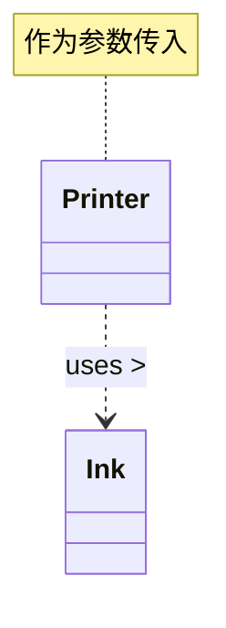
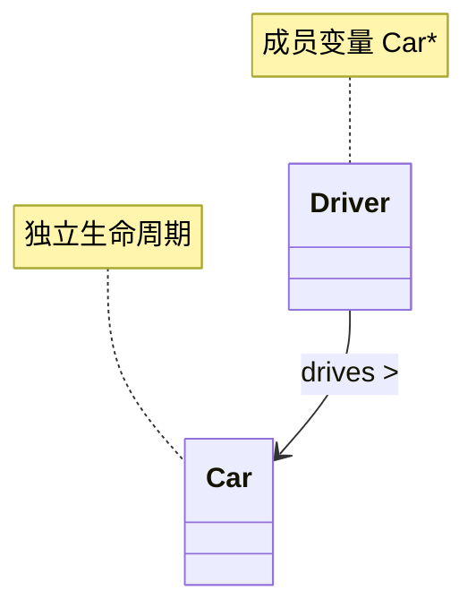
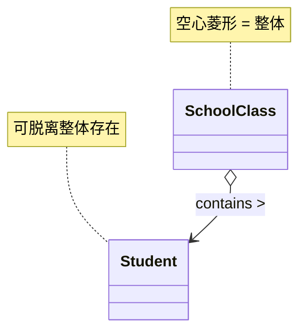
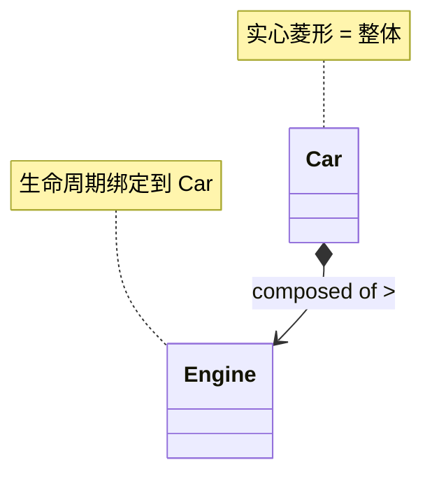
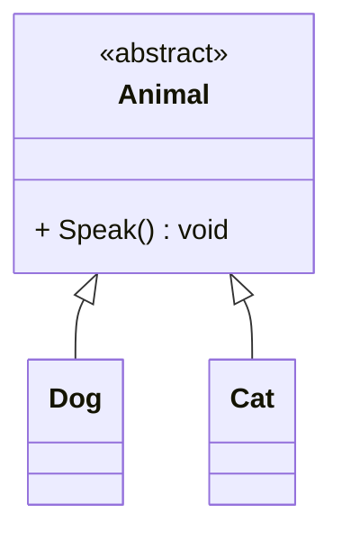
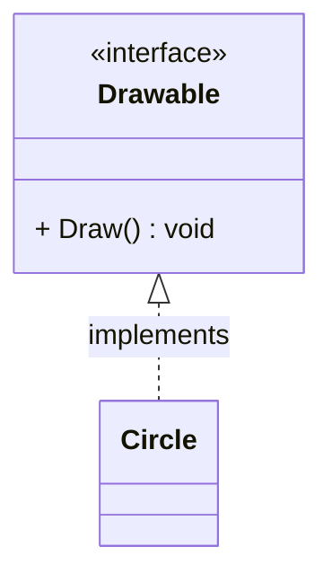
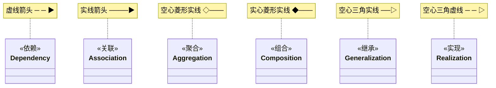
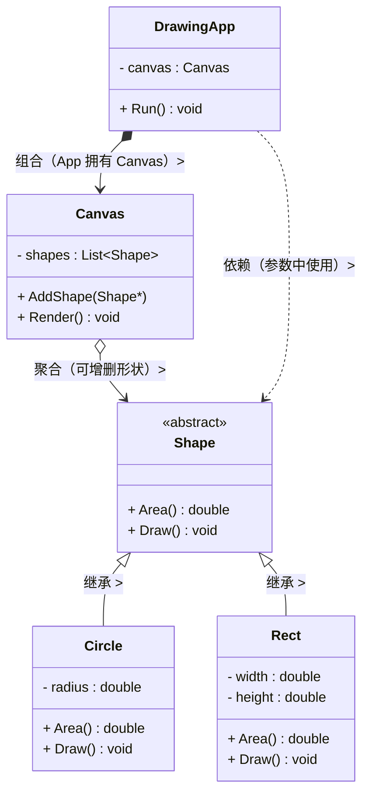
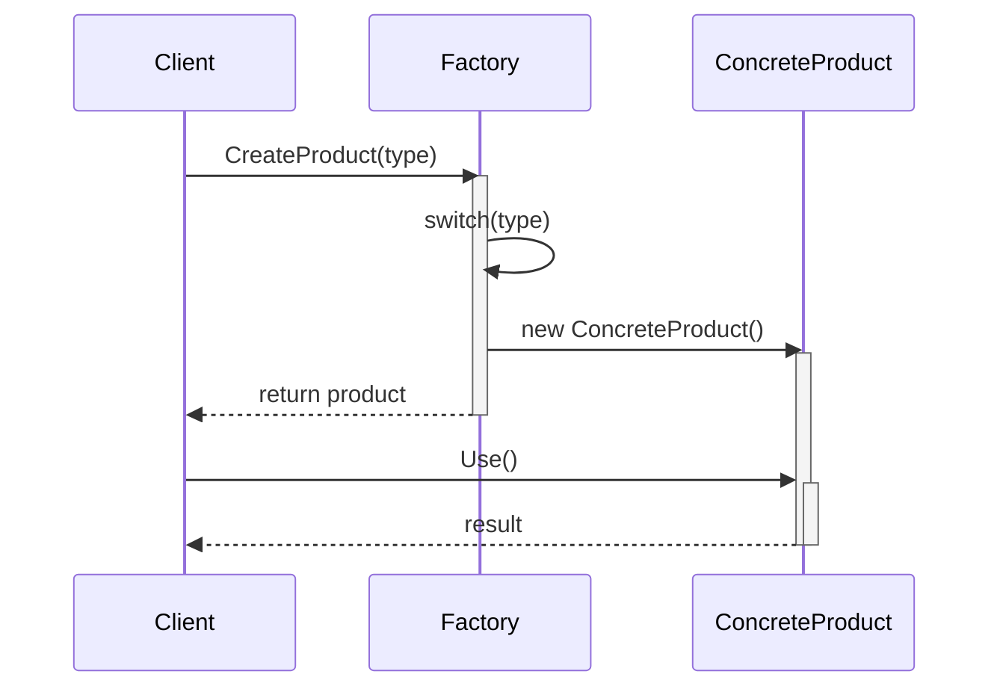

# UML 类图与常见图详解

## 概述

**UML**（Unified Modeling Language，统一建模语言）是软件工程中用于可视化系统设计的标准图形化语言。设计模式文档中最常用的是 **类图** 和 **时序图**，本文详细拆解每种符号的精确含义。

> 本文所有示例同时标注 UML 符号和对应的 C++ 代码。

---

## 一、类图 (Class Diagram)

### 类框结构

```
┌──────────────────────────────┐
│          ClassName           │  ← 类名（抽象类用斜体或 <<abstract>>）
├──────────────────────────────┤
│ - privateField : int         │  ← 属性（成员变量）
│ # protectedField : string    │
│ + publicField : double       │
│ $ staticField : type         │  ← $ 表示静态
├──────────────────────────────┤
│ + publicMethod() void        │  ← 方法（成员函数）
│ # protectedMethod() int      │
│ - privateMethod() string     │
│ $ staticMethod() type        │
│ abstractMethod() void        │  ← 抽象方法（斜体）
└──────────────────────────────┘
```

#### 访问修饰符

| UML 符号 | 含义 | C++ 关键字 |
|---|---|---|
| `+` | **public**（公开） | `public:` |
| `-` | **private**（私有） | `private:` |
| `#` | **protected**（保护） | `protected:` |
| `$` | **static**（静态） | `static` |
| `~` | **package**（包级，C++ 无对应） | — |
| *斜体* | 抽象类 / 抽象方法 | `virtual ... = 0` |
| `<< >>` | **构造型**（stereotype），标注特殊角色 | `<<interface>>`、`<<abstract>>` |
| `:` | 分隔**属性名与类型** / **方法名与返回值** | `+ age : int`、`+ GetName() : string` |
| `下划线` | 静态成员 | `$ count : int`（或加下划线） |

---

### 六大关系详解

UML 类图定义了 6 种关系，从弱到强依次排列。

---

#### 1. 依赖（Dependency）

```
  ─ ─ ─ ─ ▶   虚线箭头  («use»)
  A - - - -▶ B
```

| 属性 | 说明 |
|---|---|
| **方向** | 指向被依赖方 |
| **强度** | 最弱 |
| **C++ 对应** | 函数参数、局部变量、静态方法调用 |
| **关系描述** | "A 用到 B" / "A uses B" |

**含义**：A 在某个有限的作用域内短暂地使用了 B（函数参数、局部变量），B 的变更可能影响 A。

```cpp
// B 作为函数参数：A 依赖 B
class Printer {
public:
    // Printer 依赖 Ink —— 只在函数参数中出现，不持有
    void Print(Ink& ink) {
        ink.Apply();             // 使用 B 的方法
    }
};

class Ink {
public:
    void Apply() { /* 涂墨水 */ }
};
```



---

#### 2. 关联（Association）

```
  ─────────▶   实线箭头
  A ────────▶ B
```

| 属性 | 说明 |
|---|---|
| **方向** | 可单向、可双向（无箭头） |
| **强度** | 弱 |
| **C++ 对应** | 指针/引用成员变量（长期持有） |
| **关系描述** | "A 知道 B" / "A has a B" |

**含义**：A 长期持有 B 的引用/指针（成员变量），但 B 的生命周期独立于 A。

```cpp
class Driver {
private:
    Car* myCar_;         // 关联：Driver 知道 Car，长期持有
public:
    explicit Driver(Car* car) : myCar_(car) {}
    void Drive() {
        myCar_->Start();  // 使用 B
    }
};

class Car {
public:
    void Start() { /* ... */ }
};
// Driver 持有 Car*，但 Car 的生死不由 Driver 管理
```



**关联可以标注多重性**：

```
┌──────────┐         ┌──────────┐
│  Student │1       *│  Course  │
│          │────────▶│          │
│          │   takes  │          │
└──────────┘         └──────────┘
```

| 标记 | 含义 |
|---|---|
| `1` | 恰好一个 |
| `0..1` | 零或一个 |
| `*` | 零或多个 |
| `1..*` | 一个或多个 |
| `0..n` | 零到 n 个 |

---

#### 3. 聚合（Aggregation）

```
  ─────────◇   空心菱形 + 实线
  A ◇──────── B
```

| 属性 | 说明 |
|---|---|
| **菱形端** | 指向整体（容器） |
| **强度** | 中 |
| **C++ 对应** | 指针成员，整体析构时部分对象不被销毁 |
| **关系描述** | "A 拥有 B，但 B 可以独立存在" / "has-a" |

**含义**：整体-部分关系，**部分可以脱离整体独立存在**。整体析构时，部分不析构。

```cpp
class Student {
public:
    void Study() { /* ... */ }
};

// 班级聚合学生：班级没了，学生还在
class SchoolClass {
private:
    vector<Student*> students_;   // 聚合：学生不是班级的一部分
public:
    void AddStudent(Student* s) { students_.push_back(s); }
    // ~SchoolClass() 不 delete students_
    // 学生可以转到别的班级
};
```



---

#### 4. 组合（Composition）

```
  ─────────◆   实心菱形 + 实线
  A ◆──────── B
```

| 属性 | 说明 |
|---|---|
| **菱形端** | 指向整体（容器） |
| **强度** | 强 |
| **C++ 对应** | 值成员、`unique_ptr` 成员，整体负责部分的生命周期 |
| **关系描述** | "A 由 B 组成，B 不能脱离 A 存在" / "part-of" |

**含义**：更强的整体-部分关系。**部分不能脱离整体独立存在**。整体析构时，部分也一起析构。

```cpp
class Engine {
public:
    void Start() { /* 点火 */ }
};

// 汽车组合发动机：车没了，发动机也没了
class Car {
private:
    Engine engine_;               // 组合：值成员，生命周期绑定
    // 或：std::unique_ptr<Engine> engine_;
public:
    Car() : engine_() {}
    void Start() { engine_.Start(); }
    // ~Car() 自动调用 ~Engine()
};
```



#### 聚合 vs 组合 对比

| 维度 | 聚合 (Aggregation) | 组合 (Composition) |
|---|---|---|
| **菱形** | **空心** ◇ | **实心** ◆ |
| **生命周期** | 部分可脱离整体 | 部分绑定整体 |
| **整体析构时** | 部分不析构 | 部分一同析构 |
| **C++ 实现** | 原始指针 `T*`、`shared_ptr` | 值成员 `T`、`unique_ptr<T>` |
| **例子** | 班级→学生（学生可转班） | 汽车→引擎（车毁引擎亡） |

---

#### 5. 继承 / 泛化（Generalization）

```
  ─────────▷   空心三角 + 实线
  子类 ────────▷ 父类
```

| 属性 | 说明 |
|---|---|
| **三角端** | 指向父类（基类） |
| **C++ 对应** | `class Derived : public Base` |
| **关系描述** | "A 是 B" / "is-a" |

```cpp
class Animal {
public:
    virtual void Speak() = 0;
    virtual ~Animal() = default;
};

class Dog : public Animal {
public:
    void Speak() override { cout << "Woof!" << endl; }
};

class Cat : public Animal {
public:
    void Speak() override { cout << "Meow!" << endl; }
};
```



---

#### 6. 实现（Realization / Implementation）

```
  ─ ─ ─ ▷   空心三角 + 虚线
  类 ─ ─ ─ ▷ 接口
```

| 属性 | 说明 |
|---|---|
| **三角端** | 指向接口 |
| **C++ 对应** | `class Impl : public Interface`（均为 public 继承，语义上区分） |
| **关系描述** | "A 实现接口 B" |

```cpp
class Drawable {       // 接口（纯抽象类）
public:
    virtual void Draw() = 0;
    virtual ~Drawable() = default;
};

class Circle : public Drawable {  // Circle 实现 Drawable 接口
public:
    void Draw() override { /* 画圆 */ }
};
```



#### 继承 vs 实现

| | 继承（泛化） | 实现（接口） |
|---|---|---|
| **线型** | 实线 | **虚线** |
| **三角** | 空心 ▷ | 空心 ▷ |
| **C++ 语法** | `class A : public B` | 同上（C++ 无接口关键字，纯虚类语义上区分） |
| **语义** | is-a（代码复用） | can-do（能力契约） |

---

### 关系速查表



| 关系 | 线型 | 箭头/菱形 | C++ 代码特征 | 强度 |
|---|---|---|---|---|
| **依赖** | `----▶` 虚线 | 箭头指向被依赖方 | 函数参数、局部对象 | ⭐ |
| **关联** | `────▶` 实线 | 箭头指向被关联方 | 成员指针/引用 | ⭐⭐ |
| **聚合** | `◇────` 实线 | 空心菱形在整体端 | 成员指针，整体不管理生命周期 | ⭐⭐⭐ |
| **组合** | `◆────` 实线 | 实心菱形在整体端 | 值成员 / `unique_ptr` | ⭐⭐⭐⭐ |
| **继承** | `───▷` 实线 | 空心三角在父类端 | `class A : public B` | ⭐⭐⭐⭐⭐ |
| **实现** | `─ ─ ▷` 虚线 | 空心三角在接口端 | `class A : public Interface` | ⭐⭐⭐⭐⭐ |

> **强度：** 从依赖到实现，耦合程度依次增强。组合 > 聚合 > 关联 > 依赖。

---

### 综合示例：完整类图



```cpp
// 对应代码
class Shape {
public:
    virtual double Area() const = 0;
    virtual void Draw() const = 0;
    virtual ~Shape() = default;
};

class Circle : public Shape {
    double radius_;
public:
    double Area() const override { return 3.14 * radius_ * radius_; }
    void Draw() const override { /* 画圆 */ }
};

class Rect : public Shape {
    double width_, height_;
public:
    double Area() const override { return width_ * height_; }
    void Draw() const override { /* 画矩形 */ }
};

class Canvas {
    std::vector<Shape*> shapes_;           // 聚合
public:
    void AddShape(Shape* s) { shapes_.push_back(s); }
    void Render() {
        for (auto* s : shapes_) s->Draw(); // 依赖（使用参数、局部变量）
    }
};

class DrawingApp {
    Canvas canvas_;                         // 组合
public:
    void Run() {
        Circle c;
        Rect r;
        canvas_.AddShape(&c);
        canvas_.AddShape(&r);
        canvas_.Render();                   // 依赖
    }
};
```

---

## 二、时序图 (Sequence Diagram)

时序图描述**对象之间按时间顺序的交互过程**。

### 基本元素

```
┌──────┐         ┌──────┐         ┌──────┐
│Client│         │Object│         │Target│    ← 参与者/对象
└──┬───┘         └──┬───┘         └──┬───┘
   │                │                │
   │  实线箭头       │                │
   │───────────────▶│                │    ← 同步消息（函数调用）
   │                │                │
   │                │  虚线箭头       │
   │                │◄───────────────│    ← 返回消息（return）
   │                │                │
   │  实线 + X       │                │
   │XXXXXXXXXXXXXXXX│                │    ← 异步消息
   │                │                │
   │                │  自调用         │
   │                │──▶(自身)        │    ← 自调用（self-call）
   │                │                │
   │  创建消息       │                │
   │───────────────▶│«create»        │    ← 创建对象
   │                │                │
   │                │  销毁           │
   │                │  X              │    ← 销毁对象
```

| 箭头 | 含义 | C++ 对应 |
|---|---|---|
| **─▶** 实线箭头 | **同步消息**（同步函数调用，调用方等待返回） | `obj.Method()` |
| **--▶** 虚线箭头 | **返回消息**（函数 return） | `return result;` |
| **─▶** 实线 + **X** 箭头 | **异步消息**（调用方不等待） | `std::async()`、消息队列 |
| **─▶(自身)** | **自调用**（对象调自己的方法） | `this->Method()` |
| **─▶`<<create>>`** | **创建对象** | `new Object()`、`make_unique<Object>()` |
| **X** | **销毁对象** | `delete obj;` |

### 激活条（Activation Bar）

```
┌─────┐
│Client│
└──┬──┘
   │
   │  ┌──────────────┐
   │  │   Context    │
   │  └──────┬───────┘
   │         │
   │         │  ┌─────────────┐
   │         │  │  Strategy   │
   │         │  └──────┬──────┘
   │   call()│         │
   │────────▶│         │             ← Client 激活 Context
   │         │algo()   │
   │         │────────▶│             ← Context 激活 Strategy
   │         │         │
   │         │◄────────│             ← Strategy 返回
   │◄────────│         │             ← Context 返回给 Client
```

- 矩形竖条 = **生命线**（lifeline），表示对象在时间线上存在
- 窄长矩形 = **激活条**（activation bar），表示对象正在执行
- 激活条嵌套表示调用栈深度

### 时序图完整示例



**阅读时序图的三步法：**

1. **看顶栏** — 有哪些参与者（Client、Factory、ConcreteProduct）
2. **看箭头方向 + 从上到下** — 时间顺序，谁调了谁
3. **看虚实线** — 实线是主动调用，虚线是返回结果

---

## 三、其他常用 UML 图

设计模式文档中偶尔用到的其他图：

### 1. 对象图（Object Diagram）

类图的**实例版本**，展示某一时刻对象的具体状态：

```
矩形代表具体对象，格式：对象名:类名
┌─────────────┐     ┌────────────────────────┐
│client:Client│     │   ctx:CashContext       │
│             │     │ - strategy_ = 0x7fff..  │
└─────────────┘     └───────────┬────────────┘
                                │
                                ▼
                       ┌────────────────┐
                       │rebate:CashRebate│
                       │ - rate_ = 0.8  │
                       └────────────────┘
```

### 2. 状态图（State Diagram）

展示对象的状态流转，用于状态模式：

```
状态 ──事件──▶ 状态
                   ┌────────────┐
                   │   Pending   │
                   └─────┬──────┘
                         │ pay()
                         ▼
                   ┌────────────┐
                   │   Paid      │
                   └─────┬──────┘
                         │ ship()
                         ▼
                   ┌────────────┐
                   │  Shipped    │
                   └────────────┘
```

### 3. 活动图（Activity Diagram）

类似流程图，展示一个过程的步骤：

```
    ┌──────┐
    │ Start │
    └──┬───┘
       ▼
  ┌─────────┐
  │ 验证订单  │
  └────┬────┘
       │
       ▼
  ┌─────────┐      ┌──────────┐
  │ 有库存？  │──否──▶ 拒绝订单  │
  └────┬────┘      └──────────┘
       │是
       ▼
  ┌─────────┐
  │ 扣库存 +  │
  │ 生成订单  │
  └────┬────┘
       ▼
  ┌─────────┐
  │   End   │
  └─────────┘
```

---

## 四、常见错误与陷阱

| 错误 | 说明 | 正确做法 |
|---|---|---|
| **继承用虚线** | `..|>` 是错误的 | 继承用**实线** `--|>`，实现用**虚线** `..|>` |
| **依赖与关联混淆** | 函数参数用了实线箭头 `-->` | 函数参数是依赖，用**虚线** `..>` |
| **聚合/组合分不清** | 一直在用空心菱形 | 部分不能独立存在（engine）→ 实心 ◆；可独立存在（student）→ 空心 ◇ |
| **忘记标注多重性** | `Student ---> Course` | 标注 `1` 和 `*` 更精确：`Student 1 ---> * Course` |
| **时序图忘激活条** | 只有箭头没有激活条 | 激活条 = "谁正在执行"，有助于看调用栈 |

---

## 总结速查

### 类图六种关系一目了然

| 符号 | 关系 | 线条 | 末端 |
|---|---|---|---|
| `..>` | 依赖 | 虚线 | 箭头 |
| `-->` | 关联 | 实线 | 箭头 |
| `o-->` | 聚合 | 实线 | 空心菱形 |
| `*-->` | 组合 | 实线 | 实心菱形 |
| `--\|>` | 继承 | 实线 | 空心三角 |
| `..\|>` | 实现 | 虚线 | 空心三角 |

### 时序图箭头

| 符号 | 含义 |
|---|---|
| `->>` | 同步消息 |
| `-->>` | 返回消息 |
| `->>+` / `-->>-` | 激活/反激活 |
| `--x` | 异步消息 |
| `-->?` | 丢失消息或未知 |
