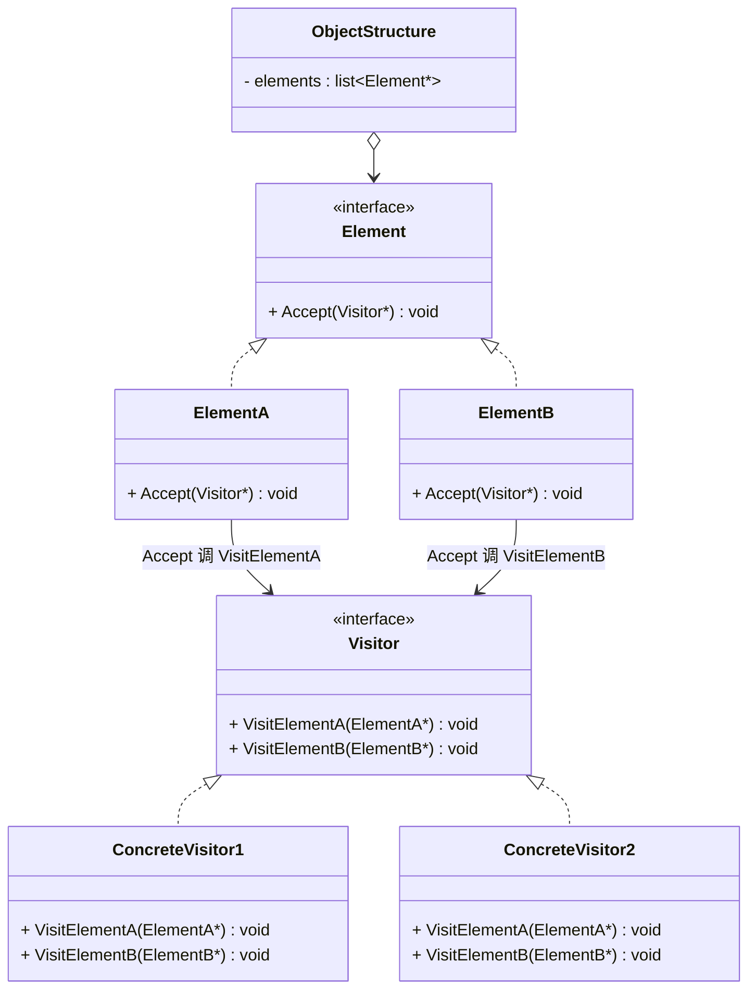
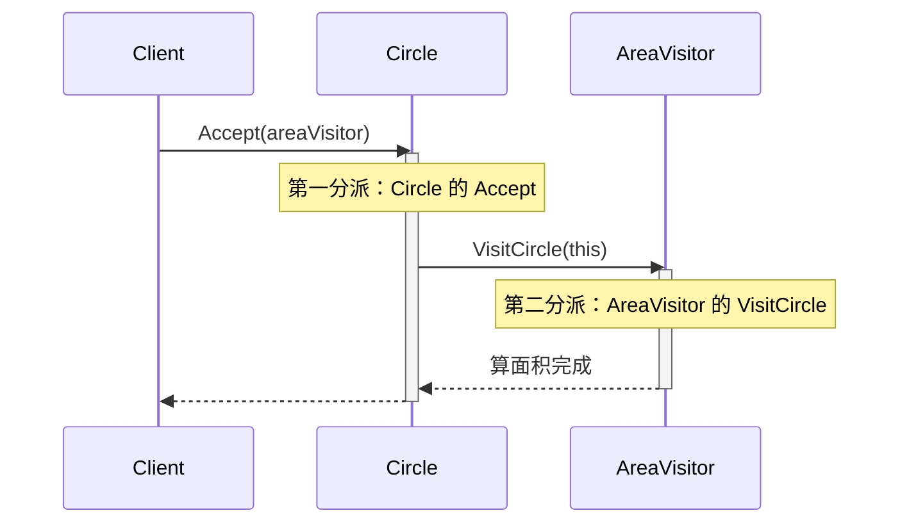

# 访问者模式 (Visitor Pattern)

## 概述

**访问者模式**（Visitor Pattern），属于 **行为型设计模式**。它表示一个作用于某对象结构中的各元素的操作。它使你可以在**不改变各元素类**的前提下**定义作用于这些元素的新操作**。

> **定义**：表示一个作用于某对象结构中的各元素的操作。它使你可以在不改变各元素的类的前提下定义作用于这些元素的新操作。

### 一个直觉感受

```cpp
// 你的程序里有一组形状：圆形、矩形、三角形（元素）
// 现在要给它们加各种"操作"：算面积、存文件、画成 SVG、导出 JSON...

// ❌ 普通做法：每个操作都往每个类里加方法
//   Circle::CalcArea()  Circle::Save()  Circle::ToSVG()  Circle::ToJSON()
//   Rect::CalcArea()    Rect::Save()    Rect::ToSVG()    Rect::ToJSON()
//   ...每次加一个新操作（比如 ToPNG），每个类都要改 —— 违反开闭原则！

// ✅ 访问者模式：操作抽出来单独做
//   元素类：Circle / Rect（不修改！）
//   访问者：AreaVisitor / SaveVisitor / SVGVisitor / JSONVisitor（新增操作=新增类）
//   "操作"从"散落在每个元素里"变成"集中在访问者里"
```

### 核心价值

> **当"对象结构"稳定但"操作"频繁变化时，把操作集中到 Visitor 里——加新操作不用改任何元素类。**

```
稳定：元素类型（形状种类固定）
变化：操作（算面积 / 保存 / 导出格式...）

访问者模式 = 把"变化的部分"（操作）和"稳定的部分"（元素）彻底分开
```

---

## 核心设计思想

### 四个角色

| 角色 | 名称 | 职责 |
|---|---|---|
| **访问者 (Visitor)** | `Visitor` | 声明访问操作的接口，**每种元素一个 Visit 方法** |
| **具体访问者 (ConcreteVisitor)** | `AreaVisitor` / `SVGVisitor` | 实现每种元素的具体操作 |
| **元素 (Element)** | `Element` | 声明 `Accept(Visitor*)` 接口 |
| **具体元素 (ConcreteElement)** | `Circle` / `Rect` | 实现 `Accept`：调用 `visitor->Visit(this)` |

### 核心机制：双分派（Double Dispatch）

普通虚函数调用是**单分派**（只根据对象类型选择方法）。访问者模式需要**根据两种类型**选择操作——这就是双分派：

```
操作的选择取决于两个东西：
  ① 访问者类型（AreaVisitor？SVGVisitor？）
  ② 元素类型（Circle？Rect？）

第一分派：element->Accept(visitor)     → 根据元素类型进入 Circle::Accept / Rect::Accept
第二分派：visitor->Visit(circle)        → 根据访问者类型进入 AreaVisitor::Visit(Circle)
```

```
Circle circle;  AreaVisitor area;

circle.Accept(&area);                        ← 第一分派：进 Circle::Accept
  └─ area.Visit(*this);  // this = Circle   ← 第二分派：进 AreaVisitor::Visit(Circle)
```

**这就是访问者模式"长得很怪"的原因**——`Accept` 和 `Visit` 两个方法互相调用，完成两次类型分发。

---

## UML 类图



### 时序图（双分派全过程）



---

## C++ 实现

### 经典示例：形状 + 多种操作

> 每个类的注释标明了它对应的模式角色：`Visitor` = 访问者接口，`AreaVisitor/SVGVisitor` = 具体访问者，`Shape` = 元素接口，`Circle/Rectangle` = 具体元素，`main` = 客户端。

```cpp
#include <iostream>
#include <memory>
#include <vector>

// 前向声明（Visit 方法需要互相引用）
class Circle;
class Rectangle;

// ══════════════ 访问者 (Visitor) ══════════════
// 模式角色：Visitor —— 每种元素一个 Visit 方法
class ShapeVisitor {
public:
    virtual ~ShapeVisitor() = default;
    virtual void VisitCircle(const Circle& c) = 0;
    virtual void VisitRectangle(const Rectangle& r) = 0;
};

// ══════════════ 元素 (Element) ══════════════
// 模式角色：Element —— 声明 Accept 接口
class Shape {
public:
    virtual ~Shape() = default;
    virtual void Accept(ShapeVisitor& visitor) const = 0;
};

// ══════════════ 具体元素 A (ConcreteElement) ══════════════
// 模式角色：ConcreteElement —— 圆形
class Circle : public Shape {
    double radius_;

public:
    explicit Circle(double r) : radius_(r) {}
    double GetRadius() const { return radius_; }

    // ★ 第一分派：元素决定调用哪个 Visit 方法
    void Accept(ShapeVisitor& visitor) const override {
        visitor.VisitCircle(*this);   // 把"我是圆形"告诉访问者
    }
};

// ══════════════ 具体元素 B (ConcreteElement) ══════════════
// 模式角色：ConcreteElement —— 矩形
class Rectangle : public Shape {
    double width_, height_;

public:
    Rectangle(double w, double h) : width_(w), height_(h) {}
    double GetWidth() const { return width_; }
    double GetHeight() const { return height_; }

    void Accept(ShapeVisitor& visitor) const override {
        visitor.VisitRectangle(*this);   // 把"我是矩形"告诉访问者
    }
};

// ══════════════ 具体访问者 A (ConcreteVisitor) ══════════════
// 模式角色：ConcreteVisitor —— 面积计算操作
class AreaVisitor : public ShapeVisitor {
public:
    void VisitCircle(const Circle& c) override {
        std::cout << "  [算面积] 圆形: π×" << c.GetRadius()
                  << "² = " << 3.14159 * c.GetRadius() * c.GetRadius() << std::endl;
    }

    void VisitRectangle(const Rectangle& r) override {
        std::cout << "  [算面积] 矩形: " << r.GetWidth() << "×"
                  << r.GetHeight() << " = "
                  << r.GetWidth() * r.GetHeight() << std::endl;
    }
};

// ══════════════ 具体访问者 B (ConcreteVisitor) ══════════════
// 模式角色：ConcreteVisitor —— SVG 导出操作
class SVGVisitor : public ShapeVisitor {
public:
    void VisitCircle(const Circle& c) override {
        std::cout << "  [导出SVG] <circle r=\"" << c.GetRadius()
                  << "\" />" << std::endl;
    }

    void VisitRectangle(const Rectangle& r) override {
        std::cout << "  [导出SVG] <rect width=\"" << r.GetWidth()
                  << "\" height=\"" << r.GetHeight() << "\" />" << std::endl;
    }
};

// ══════════════ 客户端 (Client) ══════════════
// 模式角色：Client —— 把访问者传给每个元素
int main() {
    std::vector<std::unique_ptr<Shape>> shapes;
    shapes.push_back(std::make_unique<Circle>(5));
    shapes.push_back(std::make_unique<Rectangle>(3, 4));

    std::cout << "=== 操作 1：计算面积 ===" << std::endl;
    AreaVisitor area;
    for (const auto& s : shapes)
        s->Accept(area);          // 传访问者给元素

    std::cout << "\n=== 操作 2：导出 SVG ===" << std::endl;
    SVGVisitor svg;
    for (const auto& s : shapes)
        s->Accept(svg);           // 换一个访问者 = 换一种操作

    // ★ 元素类（Circle/Rectangle）一行没改！
    return 0;
}
```

### 输出

```
=== 操作 1：计算面积 ===
  [算面积] 圆形: π×5² = 78.5398
  [算面积] 矩形: 3×4 = 12

=== 操作 2：导出 SVG ===
  [导出SVG] <circle r="5" />
  [导出SVG] <rect width="3" height="4" />
```

### 关键解读：双分派一步步走

```cpp
// 客户端：s->Accept(area)
//   s 指向 Circle（运行时才知道）

// 第一步（第一分派）：
//   虚函数 Accept → 进入 Circle::Accept(area)   ← 元素类型决定
//   如果 s 指向 Rectangle → 进入 Rectangle::Accept(area)

// 第二步（第二分派）：
//   Circle::Accept 内部 → area.VisitCircle(*this)  ← 访问者类型决定
//   如果 area 换成 svg → svg.VisitCircle(*this)

// 组合起来：元素类型 × 访问者类型 = 精确匹配到 (VisitCircle + AreaVisitor)
```

| 分派 | 谁决定 | 调用什么 |
|---|---|---|
| 第一分派 | **元素类型** | `Circle::Accept` 或 `Rectangle::Accept` |
| 第二分派 | **访问者类型** | `AreaVisitor::VisitCircle` 或 `SVGVisitor::VisitCircle` |
| 最终操作 | 两者叠加 | 精确的"操作 × 元素"组合 |

---

## 为什么元素类不用改？——开闭原则的完美体现

```
新增一个操作（比如 ToPNG）：
  ❌ 传统做法：给 Circle、Rectangle 各加一个 ToPNG() —— 改 2 个类
  ✅ 访问者：新增 PNGVisitor 类 —— 改 0 个已有类，只加 1 个新类

代价（访问者的缺点）：
  新增一个元素类型（比如 Triangle）：
  ❌ 要改所有已有访问者（每个都要加 VisitTriangle 方法）
  → 所以访问者模式适合"元素稳定、操作多变"的场景
```

| | 传统方法 | 访问者模式 |
|---|---|---|
| 新增**操作** | 改所有元素类 ❌ | 只加访问者类 ✅ |
| 新增**元素** | 只加元素类 ✅ | 改所有访问者 ❌ |
| 适合场景 | 元素多变 | **操作多变** |

---

## 实际应用场景

### 1. 编译器 AST 遍历（访问者的经典用途）

```cpp
// 语法树节点（元素）：NumberNode / AddNode / VariableNode ...
// 操作（访问者）：代码生成器 / 类型检查器 / 优化器 / 打印器

class ASTNode {
public:
    virtual void Accept(ASTVisitor& v) const = 0;
};

class NumberNode : public ASTNode {
    void Accept(ASTVisitor& v) const override { v.VisitNumber(*this); }
};

// 同一棵 AST，不同的访问者做不同的事：
ASTVisitor* codegen = new X86CodeGen();    // 生成汇编
ASTVisitor* checker = new TypeChecker();   // 类型检查
ASTVisitor* printer = new ASTPrinter();    // 打印树结构
ast->Accept(*codegen);
ast->Accept(*checker);
ast->Accept(*printer);
// 编译器加新优化 pass = 加一个新 Visitor，AST 节点类一行不改！
```

> **现实案例**：LLVM 的 Pass、Java 编译器 javac 的 TreeVisitor、Clang 的 ASTVisitor——编译器是访问者模式最大的应用场景。

### 2. 文件系统多操作

```cpp
class FileNode { virtual void Accept(FSVisitor& v) const = 0; };  // 元素
class DirNode  { virtual void Accept(FSVisitor& v) const = 0; };  // 元素

class SizeVisitor : public FSVisitor {   // 操作1：算总大小
    void VisitFile(const FileNode& f) override { total += f.GetSize(); }
    void VisitDir(const DirNode& d) override { /* 递归子目录 */ }
};

class BackupVisitor : public FSVisitor {  // 操作2：备份
    void VisitFile(const FileNode& f) override { CopyTo(f, backup_dir_); }
};

class FindVisitor : public FSVisitor {    // 操作3：按名字查找
    void VisitFile(const FileNode& f) override {
        if (f.GetName().find(keyword_) != npos) results_.push_back(&f);
    }
};
```

### 3. 文档/报表导出

```cpp
// 文档元素：Paragraph / Table / Image
// 导出操作：PDF / HTML / Markdown / Word

// 加一种导出格式 = 加一个 Visitor，文档结构类不动
class PdfExporter : public DocVisitor { /* 每个元素 → PDF 片段 */ };
class HtmlExporter : public DocVisitor { /* 每个元素 → HTML 标签 */ };
```

### 4. 游戏伤害结算

```cpp
// 单位类型（元素）：战士 / 法师 / 弓箭手
// 攻击类型（访问者）：物理攻击 / 魔法攻击 / 毒攻击
// 不同攻击 × 不同单位 = 不同伤害系数

class PhysicalAttack : public AttackVisitor {
    void VisitWarrior(const Warrior& w) override { dmg = 100; }   // 战士物防高
    void VisitMage(const Mage& m) override { dmg = 150; }         // 法师脆皮
};
```

---

## 访问者 vs 策略模式

| 维度 | 访问者 | 策略 |
|---|---|---|
| **作用对象** | 一组**不同类型**的元素 | 一个**算法** |
| **分派** | 双分派（元素×操作） | 单分派 |
| **修改** | 操作集中，不改元素 | 算法可替换 |
| **典型场景** | 编译器 pass、多导出格式 | 排序、压缩 |

```
策略：一个对象换算法（对象固定，算法多变）
访问者：一群对象加操作（对象类型固定，操作多变）
```

---

## 文件拆分建议

```
code/visitor/
├── visitor.hpp        ← Visitor 接口（VisitCircle / VisitRectangle 声明）
├── visitor.cpp        ← AreaVisitor / SVGVisitor 实现
├── shape.hpp          ← Shape 接口 + Circle/Rectangle 声明
├── shape.cpp          ← Circle/Rectangle 的 Accept 实现
├── main.cpp           ← Client：创建形状 + 传访问者
└── main               ← 可执行文件
```

编译：`g++ -std=c++14 main.cpp visitor.cpp shape.cpp -o main`

---

## 优缺点

### 优点

| # | 说明 |
|---|---|
| ✅ | **符合开闭原则（对操作）** — 新增操作只加访问者类，元素类不改 |
| ✅ | **操作集中** — 同类操作的所有逻辑在同一个 Visitor 里，易维护 |
| ✅ | **双分派** — 精确匹配"操作 × 元素"组合 |
| ✅ | **职责清晰** — 元素管数据，访问者管操作 |

### 缺点

| # | 说明 |
|---|---|
| ❌ | **新增元素类型很痛苦** — 所有访问者都要加一个 Visit 方法 |
| ❌ | **违反依赖倒置** — 访问者需要知道每个具体元素类型 |
| ❌ | **破坏封装** — 访问者需要访问元素的内部数据（GetRadius 等 getter 必须公开） |
| ❌ | **双分派理解成本高** — 代码阅读难度大，是"怪"的模式之一 |

---

## 适用场景

| 场景 | 说明 |
|---|---|
| **对象结构稳定，操作频繁变化** | 编译器 AST、多格式导出、报表生成 |
| **需要对一组不同类型对象执行不同操作** | 每个元素的操作随访问者变化 |
| **操作逻辑分散在各个类中，想集中** | 把散落的操作收拢到 Visitor |
| **不修改元素类的前提下加操作** | 第三方库的元素类不能改，用访问者加操作 |

---

## 总结

访问者模式的核心思想：

> **把"操作"从"元素"里搬出来——元素只负责接待，操作全部交给访问者。**

```
理解双分派（访问者的灵魂）：
  element->Accept(visitor)
    └─ visitor->Visit(element)
  ↑ 第一分派（元素）   ↑ 第二分派（操作）
  两次虚函数调用 = 精确锁定"哪个操作作用于哪种元素"

记忆口诀：
  元素接待不干活，操作全在访问者
  加操作只加新类，加元素要改全部
  双分派层层递进，Accept 叫 Visit

实战忠告：
  访问者是最"重"的模式之一，只为解决"操作多变 + 元素稳定"的特定场景。
  用之前先确认：你的元素类型真的不会增加吗？
  如果元素会频繁增加，访问者是灾难而不是福音。
```

---

# 🎉 GoF 23 个设计模式全部完成！

```
创建型 (5)：工厂方法、抽象工厂、建造者、原型、单例
结构型 (7)：适配器、桥接、组合、装饰器、外观、享元、代理
行为型 (11)：解释器、模板方法、责任链、命令、迭代器、中介者、
            备忘录、观察者、状态、策略、访问者

另有：简单工厂（+1）、六大原则、UML 速查 —— 共 27 篇文档
```
