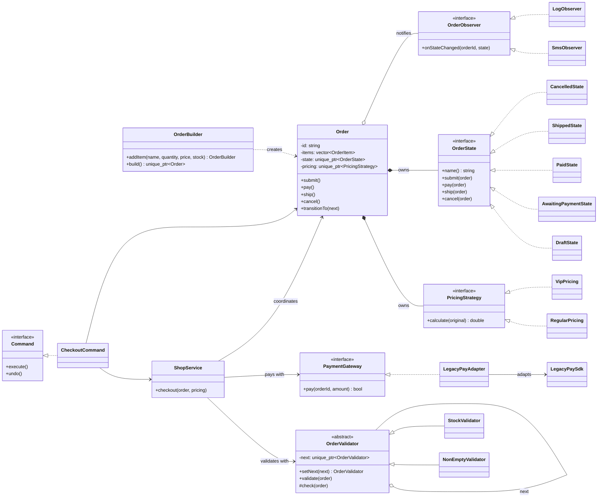
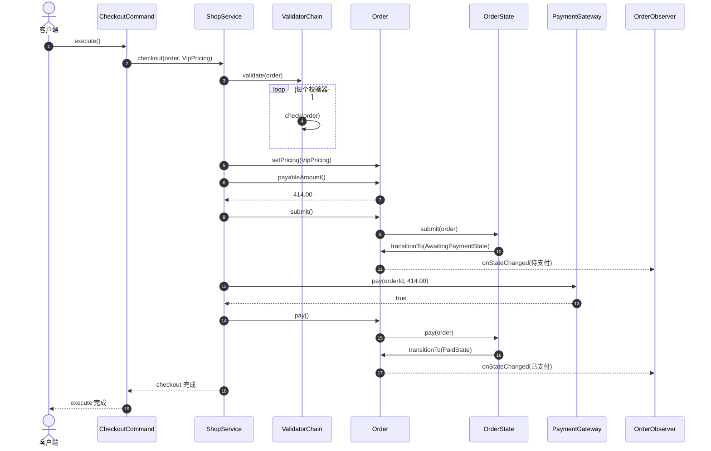
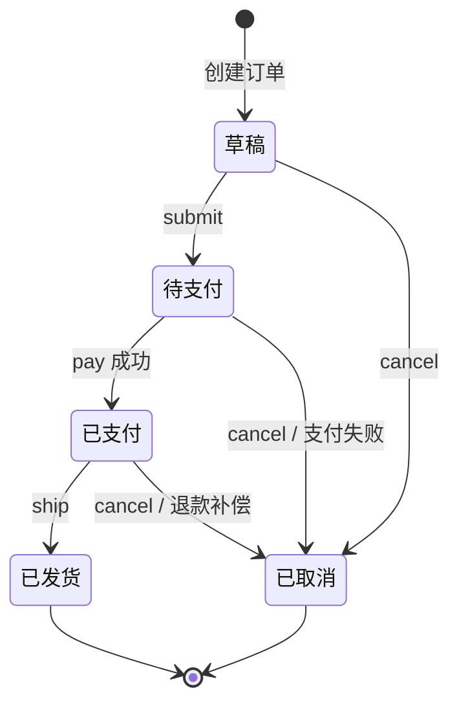
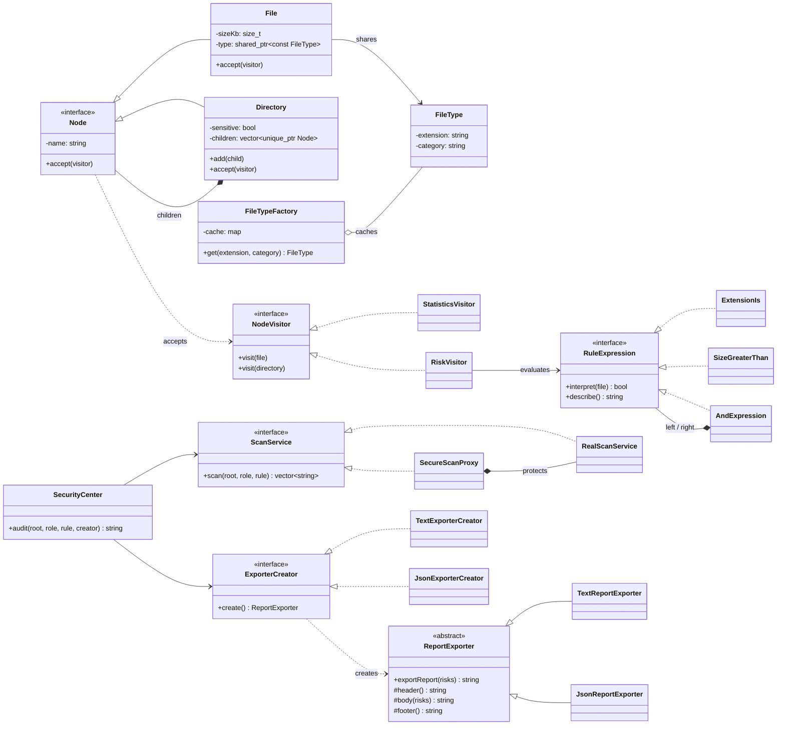
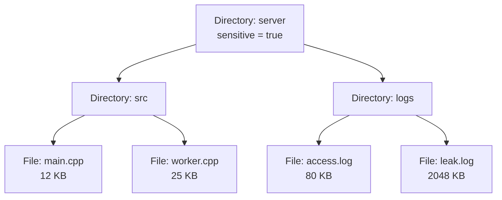
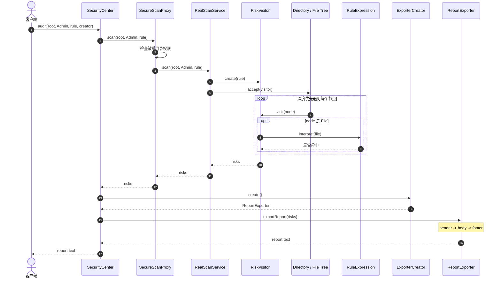

# 设计模式综合实战

前面的示例大多用于理解单个模式，现通过两个完整的小项目练习如何在同一个业务中组合多种模式。重点不是“使用的模式越多越好”，而是先识别变化点、对象职责和依赖方向，再选择恰当的模式。

示例均为单文件程序，使用 C++14 标准，可直接复制、编译和运行。

> **编译验证：** 两个示例已于 2026-08-30 在沙箱中使用 `g++ 13.3.0`，配合 `-std=c++14 -Wall -Wextra -pedantic` 选项从本文代码块直接提取、编译并运行。两者均以退出码 0 结束，未产生编译警告，实际输出与文中的预期输出一致。

## 通用开发分析方法

面对一个综合需求时，不建议先从 23 个设计模式中挑名称。可以按下面的顺序分析：

1. **描述核心用例。** 先用自然语言写出一次成功流程和几个失败流程，确定系统真正要完成什么。
2. **提取领域对象。** 从名词中寻找有状态、有行为或有身份的对象，从动词中寻找用例和对象职责，但不要机械地做到“一名词一类”。
3. **识别变化轴。** 标出未来可能独立变化的算法、流程步骤、外部接口、对象结构和业务状态。
4. **寻找稳定边界。** 为变化部分定义小而稳定的抽象，让高层业务依赖抽象而不是某个具体实现。
5. **确定对象所有权。** 明确谁创建、谁销毁、谁仅观察对象；再决定使用值、引用、`unique_ptr`、`shared_ptr` 还是 `weak_ptr`。
6. **画出协作过程。** 用时序图验证正常路径、失败路径和补偿路径，检查职责是否被错误地集中在一个“万能类”中。
7. **最后匹配模式。** 如果某个问题的结构恰好符合一个模式，再用模式术语沟通；模式是分析结果，不是分析起点。
8. **用变化需求验收设计。** 假设增加一种价格算法、输出格式或状态，观察需要修改多少稳定代码。扩展点越清晰，修改的波及范围越小。

可以用一句话概括这套方法：**先找到“为什么会变”，再决定“用什么隔离变化”。**

---

## Demo 1：可扩展的电商订单处理系统

### 任务场景

一家电商平台需要实现从创建订单到发货的核心流程。系统当前支持普通价和会员价、第三方支付、下单前校验以及订单状态通知，后续还会增加新的优惠方式、支付渠道和通知渠道。

### 功能要求

1. 使用构建器逐步创建订单，避免带有大量参数的构造函数。
2. 下单前依次校验“购物车非空”和“库存是否充足”；任一环节失败都终止下单。
3. 普通用户按原价结算，VIP 用户享受九折；新增计价规则时不修改订单类。
4. 将已有的第三方支付 SDK 接入统一支付接口。
5. 订单只能按照 `草稿 -> 待支付 -> 已支付 -> 已发货` 的合法路径流转，也允许在发货前取消。
6. 状态发生变化时通知短信、日志等观察者。
7. 使用命令对象封装“结账”，并提供撤销操作；这里的撤销是业务补偿——取消订单，而不是简单回退内存字段。
8. 客户端只通过商城服务外观完成结账，不直接组织校验、计价和支付步骤。

### 开发分析思路

#### 1. 先确定核心用例与失败边界

一次成功结账可以表达为：

```text
创建订单 -> 校验订单 -> 选择价格规则 -> 计算金额
         -> 进入待支付 -> 调用支付渠道 -> 进入已支付 -> 发货
```

同时必须考虑三类失败：

- 校验失败：订单仍处于草稿状态，不应调用支付。
- 支付失败：已经进入待支付，需要取消订单或允许后续重试。
- 非法操作：例如草稿订单直接发货、已发货订单再次取消，必须被拒绝。

这一步决定了结账不是一个简单的价格计算函数，而是一个带校验、外部调用、状态转换和失败补偿的应用用例。

#### 2. 区分稳定部分和变化部分

| 关注点 | 相对稳定的部分 | 容易变化的部分 | 设计决策 |
|---|---|---|---|
| 订单 | 订单号、订单项、金额和生命周期 | 状态转换规则 | 订单聚合持有状态对象 |
| 价格 | 输入原价、输出应付价 | 普通价、VIP、满减、优惠券 | 抽象为 `PricingStrategy` |
| 校验 | 下单前必须全部通过 | 库存、余额、地址、风控及顺序 | 组成 `OrderValidator` 责任链 |
| 支付 | 业务只关心成功或失败 | 各 SDK 的函数名、参数和返回码 | 统一为 `PaymentGateway` |
| 通知 | 状态变化后发送事件 | 短信、日志、邮件、消息队列 | 抽象为 `OrderObserver` |
| 用例 | 结账的总体目标 | 子系统数量和调用细节 | 由 `ShopService` 统一编排 |

关键判断是：价格规则、支付渠道和通知方式可以彼此独立变化，不应通过一个巨大的 `if-else` 同时处理这些维度，否则组合数量会迅速膨胀。

#### 3. 划分对象职责

- `Order` 是领域对象，维护订单数据和状态不变量，不直接认识第三方 SDK。
- `PricingStrategy` 只负责金额算法，不负责修改订单状态或发送通知。
- `OrderValidator` 只判断订单能否继续处理，不负责执行结账。
- `PaymentGateway` 是系统与外部支付平台之间的边界。
- `ShopService` 是应用服务，负责组织一次完整用例，但具体工作委托给领域对象和接口实现。
- `CheckoutCommand` 将“何时执行、是否记录、如何补偿”从结账业务中分离出来。

这种划分使类的变化原因尽量单一。例如支付 SDK 升级只影响适配器，VIP 折扣改变只影响对应策略。

#### 4. 推导模式，而不是堆叠模式

分析中出现以下问题后，模式才自然产生：

```text
创建参数和步骤较多              -> Builder
若干校验按顺序短路执行          -> Chain of Responsibility
同一金额存在可替换算法          -> Strategy
已有 SDK 与系统接口不兼容       -> Adapter
行为取决于当前业务状态          -> State
一个事件有多个独立订阅者        -> Observer
请求需要排队、记录或补偿        -> Command
客户端不应了解子系统编排细节    -> Facade
```

不是所有模式都需要加入。例如当前对象创建逻辑很简单，不需要额外引入抽象工厂；系统中也没有必须全局唯一的对象，因此不应为了“完整”而加入单例。

#### 5. 分析所有权和生命周期

- `Order` 独占价格策略和当前状态，所以使用 `unique_ptr`。
- 校验器独占链上的下一个节点，也使用 `unique_ptr`。
- 适配器不拥有外部 SDK，`ShopService` 不拥有校验链和支付网关，所以使用引用。
- 示例中的观察者使用非拥有型裸指针，因此客户端必须保证观察者比订单活得久。真实异步系统更适合使用事件总线，或用 `weak_ptr` 防止悬空引用。

#### 6. 推荐的实现与验证顺序

1. 先实现 `OrderItem`、`Order` 和金额计算，验证最小领域模型。
2. 加入状态对象，为每条合法和非法状态转换编写测试。
3. 加入价格策略和校验链，分别测试正常、空购物车和库存不足。
4. 定义 `PaymentGateway`，先用假实现测试，再接入适配器。
5. 加入观察者，确认通知只在状态真正转换后发送。
6. 最后用 `ShopService` 和命令对象串起整个流程，测试支付失败和撤销补偿。

### 模式分工

| 模式 | 在本例中的职责 | 主要变化点 |
|---|---|---|
| Builder | 构造包含多个订单项的订单 | 创建步骤 |
| Chain of Responsibility | 串联下单校验 | 校验规则及顺序 |
| Strategy | 计算最终价格 | 促销算法 |
| Adapter | 适配第三方支付 SDK | 外部接口 |
| State | 约束订单状态和行为 | 状态流转规则 |
| Observer | 广播订单状态变化 | 消息接收者 |
| Command | 封装结账及补偿操作 | 请求的执行方式 |
| Facade | 编排完整结账用例 | 子系统调用流程 |

### UML 与流程分析

#### 核心类图

下图省略了部分具体方法和字段，重点展示依赖方向。`ShopService` 只依赖校验器和支付接口；`Order` 分别持有可替换的计价策略和状态对象。



图中 `*--` 表示组合/独占拥有，`o--` 表示聚合或非独占关联，`<|..` 表示接口实现，`-->` 和 `..>` 表示依赖。

#### 结账时序图

时序图展示一次成功结账的运行时协作。责任链内部可包含任意数量的校验器，而调用方只看到统一的 `validate()`。



#### 订单状态图

状态图是检查业务规则最直接的方式。终态“已发货”和“已取消”没有后续转换，因此对它们执行支付、发货或取消会由基类默认实现抛出异常。



### 可执行示例（C++14）

```cpp
#include <iomanip>
#include <iostream>
#include <memory>
#include <stdexcept>
#include <string>
#include <utility>
#include <vector>

class Order;

// ---------- Observer ----------
class OrderObserver {
public:
    virtual ~OrderObserver() = default;
    virtual void onStateChanged(const std::string& orderId,
                                const std::string& state) = 0;
};

class SmsObserver final : public OrderObserver {
public:
    void onStateChanged(const std::string& id,
                        const std::string& state) override {
        std::cout << "[短信] 订单 " << id << " 状态变为：" << state << '\n';
    }
};

class LogObserver final : public OrderObserver {
public:
    void onStateChanged(const std::string& id,
                        const std::string& state) override {
        std::cout << "[日志] order=" << id << ", state=" << state << '\n';
    }
};

// ---------- Strategy ----------
class PricingStrategy {
public:
    virtual ~PricingStrategy() = default;
    virtual double calculate(double original) const = 0;
};

class RegularPricing final : public PricingStrategy {
public:
    double calculate(double original) const override { return original; }
};

class VipPricing final : public PricingStrategy {
public:
    double calculate(double original) const override { return original * 0.9; }
};

// ---------- State ----------
class OrderState {
public:
    virtual ~OrderState() = default;
    virtual const char* name() const = 0;
    virtual void submit(Order&) const;
    virtual void pay(Order&) const;
    virtual void ship(Order&) const;
    virtual void cancel(Order&) const;
};

class DraftState final : public OrderState {
public:
    const char* name() const override { return "草稿"; }
    void submit(Order&) const override;
    void cancel(Order&) const override;
};

class AwaitingPaymentState final : public OrderState {
public:
    const char* name() const override { return "待支付"; }
    void pay(Order&) const override;
    void cancel(Order&) const override;
};

class PaidState final : public OrderState {
public:
    const char* name() const override { return "已支付"; }
    void ship(Order&) const override;
    void cancel(Order&) const override;
};

class ShippedState final : public OrderState {
public:
    const char* name() const override { return "已发货"; }
};

class CancelledState final : public OrderState {
public:
    const char* name() const override { return "已取消"; }
};

struct OrderItem {
    std::string name;
    int quantity;
    double unitPrice;
    int stock;
};

class Order {
public:
    Order(std::string id, std::vector<OrderItem> items)
        : id_(std::move(id)), items_(std::move(items)),
          state_(new DraftState), pricing_(new RegularPricing) {}

    const std::string& id() const { return id_; }
    const std::vector<OrderItem>& items() const { return items_; }
    const std::string stateName() const { return state_->name(); }

    double originalAmount() const {
        double result = 0.0;
        for (const auto& item : items_) {
            result += item.quantity * item.unitPrice;
        }
        return result;
    }

    double payableAmount() const { return pricing_->calculate(originalAmount()); }

    void setPricing(std::unique_ptr<PricingStrategy> strategy) {
        pricing_ = std::move(strategy);
    }

    void addObserver(OrderObserver& observer) { observers_.push_back(&observer); }

    void transitionTo(std::unique_ptr<OrderState> next) {
        state_ = std::move(next);
        for (auto* observer : observers_) {
            observer->onStateChanged(id_, state_->name());
        }
    }

    void submit() { state_->submit(*this); }
    void pay() { state_->pay(*this); }
    void ship() { state_->ship(*this); }
    void cancel() { state_->cancel(*this); }

private:
    std::string id_;
    std::vector<OrderItem> items_;
    std::unique_ptr<OrderState> state_;
    std::unique_ptr<PricingStrategy> pricing_;
    std::vector<OrderObserver*> observers_; // 观察者生命周期由客户端管理
};

void OrderState::submit(Order&) const { throw std::logic_error("当前状态不能提交"); }
void OrderState::pay(Order&) const { throw std::logic_error("当前状态不能支付"); }
void OrderState::ship(Order&) const { throw std::logic_error("当前状态不能发货"); }
void OrderState::cancel(Order&) const { throw std::logic_error("当前状态不能取消"); }

void DraftState::submit(Order& order) const {
    order.transitionTo(std::unique_ptr<OrderState>(new AwaitingPaymentState));
}
void DraftState::cancel(Order& order) const {
    order.transitionTo(std::unique_ptr<OrderState>(new CancelledState));
}
void AwaitingPaymentState::pay(Order& order) const {
    order.transitionTo(std::unique_ptr<OrderState>(new PaidState));
}
void AwaitingPaymentState::cancel(Order& order) const {
    order.transitionTo(std::unique_ptr<OrderState>(new CancelledState));
}
void PaidState::ship(Order& order) const {
    order.transitionTo(std::unique_ptr<OrderState>(new ShippedState));
}
void PaidState::cancel(Order& order) const {
    std::cout << "[退款] 原支付将在原渠道退回\n";
    order.transitionTo(std::unique_ptr<OrderState>(new CancelledState));
}

// ---------- Builder ----------
class OrderBuilder {
public:
    explicit OrderBuilder(std::string id) : id_(std::move(id)) {}

    OrderBuilder& addItem(std::string name, int quantity,
                          double unitPrice, int stock) {
        items_.push_back({std::move(name), quantity, unitPrice, stock});
        return *this;
    }

    std::unique_ptr<Order> build() {
        return std::unique_ptr<Order>(new Order(std::move(id_), std::move(items_)));
    }

private:
    std::string id_;
    std::vector<OrderItem> items_;
};

// ---------- Chain of Responsibility ----------
class OrderValidator {
public:
    virtual ~OrderValidator() = default;

    OrderValidator& setNext(std::unique_ptr<OrderValidator> next) {
        next_ = std::move(next);
        return *next_;
    }

    void validate(const Order& order) const {
        check(order);
        if (next_) next_->validate(order);
    }

private:
    virtual void check(const Order&) const = 0;
    std::unique_ptr<OrderValidator> next_;
};

class NonEmptyValidator final : public OrderValidator {
    void check(const Order& order) const override {
        if (order.items().empty()) throw std::runtime_error("购物车不能为空");
    }
};

class StockValidator final : public OrderValidator {
    void check(const Order& order) const override {
        for (const auto& item : order.items()) {
            if (item.quantity <= 0 || item.quantity > item.stock) {
                throw std::runtime_error(item.name + " 库存不足或数量非法");
            }
        }
    }
};

// ---------- Adapter ----------
class PaymentGateway {
public:
    virtual ~PaymentGateway() = default;
    virtual bool pay(const std::string& orderId, double amount) = 0;
};

class LegacyPaySdk {
public:
    int makePayment(const std::string& tradeNo, long cents) {
        std::cout << "[第三方支付] trade=" << tradeNo << ", cents=" << cents << '\n';
        return 0; // 第三方约定：0 表示成功
    }
};

class LegacyPayAdapter final : public PaymentGateway {
public:
    explicit LegacyPayAdapter(LegacyPaySdk& sdk) : sdk_(sdk) {}

    bool pay(const std::string& orderId, double amount) override {
        return sdk_.makePayment(orderId, static_cast<long>(amount * 100 + 0.5)) == 0;
    }

private:
    LegacyPaySdk& sdk_;
};

// ---------- Facade ----------
class ShopService {
public:
    ShopService(const OrderValidator& validator, PaymentGateway& gateway)
        : validator_(validator), gateway_(gateway) {}

    void checkout(Order& order, std::unique_ptr<PricingStrategy> pricing) {
        validator_.validate(order);
        order.setPricing(std::move(pricing));
        std::cout << std::fixed << std::setprecision(2)
                  << "原价：" << order.originalAmount()
                  << "，应付：" << order.payableAmount() << '\n';
        order.submit();
        if (!gateway_.pay(order.id(), order.payableAmount())) {
            order.cancel();
            throw std::runtime_error("支付失败");
        }
        order.pay();
    }

private:
    const OrderValidator& validator_;
    PaymentGateway& gateway_;
};

// ---------- Command ----------
class Command {
public:
    virtual ~Command() = default;
    virtual void execute() = 0;
    virtual void undo() = 0;
};

class CheckoutCommand final : public Command {
public:
    CheckoutCommand(ShopService& shop, Order& order,
                    std::unique_ptr<PricingStrategy> pricing)
        : shop_(shop), order_(order), pricing_(std::move(pricing)) {}

    void execute() override {
        if (executed_) throw std::logic_error("命令不能重复执行");
        shop_.checkout(order_, std::move(pricing_));
        executed_ = true;
    }

    void undo() override {
        if (!executed_) throw std::logic_error("尚未执行，不能撤销");
        order_.cancel();
        executed_ = false;
    }

private:
    ShopService& shop_;
    Order& order_;
    std::unique_ptr<PricingStrategy> pricing_;
    bool executed_ = false;
};

int main() {
    try {
        auto order = OrderBuilder("ORD-2026-001")
                         .addItem("C++ 图书", 2, 80.0, 10)
                         .addItem("机械键盘", 1, 300.0, 3)
                         .build();

        SmsObserver sms;
        LogObserver log;
        order->addObserver(sms);
        order->addObserver(log);

        std::unique_ptr<OrderValidator> validators(new NonEmptyValidator);
        validators->setNext(std::unique_ptr<OrderValidator>(new StockValidator));

        LegacyPaySdk sdk;
        LegacyPayAdapter payment(sdk);
        ShopService shop(*validators, payment);

        CheckoutCommand checkout(shop, *order,
                                 std::unique_ptr<PricingStrategy>(new VipPricing));
        checkout.execute();
        order->ship();

        // 已发货订单不能取消，下面演示 State 对非法操作的保护。
        try {
            checkout.undo();
        } catch (const std::logic_error& e) {
            std::cout << "[业务拒绝] " << e.what() << '\n';
        }
    } catch (const std::exception& e) {
        std::cerr << "处理失败：" << e.what() << '\n';
        return 1;
    }
}
```

编译运行：

```bash
g++ -std=c++14 -Wall -Wextra -pedantic demo_order.cpp -o demo_order
./demo_order
```

预期输出（金额与主要事件）：

```text
原价：460.00，应付：414.00
[短信] 订单 ORD-2026-001 状态变为：待支付
[日志] order=ORD-2026-001, state=待支付
[第三方支付] trade=ORD-2026-001, cents=41400
[短信] 订单 ORD-2026-001 状态变为：已支付
[日志] order=ORD-2026-001, state=已支付
[短信] 订单 ORD-2026-001 状态变为：已发货
[日志] order=ORD-2026-001, state=已发货
[业务拒绝] 当前状态不能取消
```

### 练习与验收

1. 增加“满 500 减 80”策略，不能修改 `Order` 和 `ShopService`。
2. 增加余额校验，并将其插入库存校验之后；原校验器不能被修改。
3. 再接入一个返回 `true/false` 的现代支付 SDK，客户端仍只依赖 `PaymentGateway`。
4. 增加邮件观察者，并确保订单逻辑不包含任何邮件代码。
5. 调整程序，让未发货的已支付订单执行 `undo()` 时退款并取消；为失败的支付增加重试命令。
6. 思考：观察者若比订单先析构会怎样？尝试用 `weak_ptr` 改造生命周期管理。

---

## Demo 2：文件安全审计与报表系统

### 任务场景

企业需要扫描一棵虚拟文件目录。普通用户只能扫描公开目录，管理员可以扫描全部目录；安全规则由对象组合表达，并且扫描结果可以导出为不同格式。以后还会增加文件类型、审计指标、规则和报表格式。

### 功能要求

1. 文件和目录组成树形结构，客户端可以用统一接口处理两者。
2. 相同扩展名的文件共享不可变的类型元数据，避免重复对象。
3. 在不修改文件、目录类的情况下增加“统计”和“风险扫描”两种操作。
4. 风险规则表达式支持 `AND`、扩展名匹配和文件大小判断，并能自由组合。
5. 扫描服务代理必须在访问敏感目录前检查角色权限。
6. 报表生成流程固定为“标题 -> 正文 -> 页脚”，子类只定制具体格式。
7. 客户端通过安全中心外观调用扫描和导出功能。

### 开发分析思路

#### 1. 建立领域结构，而不是先写扫描算法

这个场景首先存在一个天然的递归模型：目录可以包含文件，也可以包含子目录。若分别为文件和目录编写扫描入口，调用方每深入一层都要判断节点类型。更合适的抽象是让两者都成为 `Node`：

```text
Node
├── File          叶节点：名称、大小、文件类型
└── Directory     容器节点：名称、敏感标记、若干 Node 子节点
```

因此组合模式不是为了复用代码，而是为了让客户端能够从任意节点统一开始遍历。

#### 2. 识别两个独立的扩展方向

文件系统中有两个可能变化的维度：

- **节点类型变化：** 将来可能增加符号链接、设备文件、压缩包。
- **节点操作变化：** 将来可能增加统计、风险扫描、校验和、索引和清理操作。

访问者模式适合“节点类型相对稳定、操作经常增加”的系统。它允许新增 `ChecksumVisitor` 而不修改 `File` 和 `Directory`，代价是每增加一种节点类型，都必须修改所有访问者接口及实现。

这项取舍很重要：如果预计节点类型经常变化而操作很少，直接在节点中使用虚函数可能更简单，不必强行使用访问者。

#### 3. 区分内部状态和外部状态

大量文件会重复保存扩展名及类别信息：

| 状态 | 示例 | 是否共享 |
|---|---|---|
| 文件名 | `main.cpp`、`worker.cpp` | 否，每个文件不同 |
| 文件大小 | 12KB、25KB | 否，每个文件不同 |
| 扩展名 | `.cpp` | 是，同类型文件相同 |
| 类别 | `source` | 是，同类型文件相同 |

因此文件名和大小保留在 `File` 中，共享且不可变的扩展名和类别进入 `FileType` 享元。`FileTypeFactory` 保证相同扩展名复用同一对象。若系统只有几个文件，享元带来的收益很小；它主要用于节点数量很大的场景。

#### 4. 将安全规则建模为对象树

规则不是简单的字符串，而是可组合、可执行的表达式：

```text
AndExpression
├── ExtensionIs(".log")
└── SizeGreaterThan(1024)
```

每个表达式实现 `interpret(file)`，组合表达式递归调用子表达式。这样新增 `OR`、`NOT` 或路径匹配时不需要修改风险访问者。不过，当规则语言发展出变量、优先级、括号和语法错误提示后，应增加词法/语法解析器，甚至使用成熟规则引擎，而不是无限扩张手写解释器。

#### 5. 把权限检查放在访问边界

真实扫描器只负责扫描。如果把角色判断散落到访问者和每个节点中，权限逻辑会与遍历逻辑耦合。`SecureScanProxy` 与真实服务实现同一 `ScanService` 接口，在调用进入真实服务之前完成权限检查和审计记录。

当前示例只校验根目录，这是刻意保留的简化点。生产设计还要明确：

- 公开根目录中出现敏感子目录时，是跳过、报错还是只返回脱敏信息？
- 权限是在每个节点访问前检查，还是预先获得一份可访问视图？
- 审计日志失败时，扫描应继续还是拒绝执行？

这些问题属于业务安全策略，不能仅靠模式名称回答。

#### 6. 分离报表流程与报表创建

所有报表都遵循“标题、正文、页脚”的稳定骨架，因此 `ReportExporter::exportReport()` 使用模板方法固定调用顺序。文本和 JSON 子类只实现步骤差异。

`ExporterCreator` 解决的是另一个问题：由谁创建具体导出器。模板方法属于行为模式，工厂方法属于创建型模式，两者职责不同。若创建过程永远只是单行 `new`，工厂的价值有限；当导出器需要配置、依赖注入或插件加载时，创建抽象才更有意义。

#### 7. 推导整体协作流程

```text
客户端
  -> SecurityCenter（统一用例入口）
  -> SecureScanProxy（权限与审计）
  -> RealScanService（发起扫描）
  -> Directory.accept（遍历组合树）
  -> RiskVisitor.visit（执行新增操作）
  -> RuleExpression.interpret（判断是否命中）
  -> ExporterCreator（创建报表器）
  -> ReportExporter（按固定骨架输出）
```

每层只知道相邻的抽象。`SecurityCenter` 不判断扩展名，规则对象不生成 JSON，文件节点也不检查用户角色，从而避免职责交叉。

#### 8. 推荐的实现与验证顺序

1. 先建立 `Node/File/Directory`，用一个简单打印函数验证树的所有权和递归遍历。
2. 加入 `NodeVisitor` 和统计访问者，验证每个节点只被访问一次。
3. 加入表达式对象和风险访问者，分别测试命中、不命中及组合规则。
4. 加入真实扫描服务与权限代理，覆盖员工拒绝、管理员允许两条路径。
5. 加入文本报表，再通过工厂扩展 JSON 报表。
6. 最后由 `SecurityCenter` 串联全过程，并测试空目录、深层目录和敏感子目录等边界情况。

### 模式分工

| 模式 | 在本例中的职责 | 主要变化点 |
|---|---|---|
| Composite | 表示文件与目录树 | 树的层级和节点数量 |
| Flyweight | 共享文件类型元数据 | 大量重复的内部状态 |
| Visitor | 对节点执行统计或审计 | 作用于稳定结构的新操作 |
| Interpreter | 组合安全规则表达式 | 规则语法与组合 |
| Proxy | 在扫描前执行访问控制 | 服务访问策略 |
| Template Method | 固定报表生成骨架 | 报表各步骤的实现 |
| Factory Method | 创建具体报表生成器 | 输出格式 |
| Facade | 提供审计与导出的统一入口 | 子系统协作流程 |

### UML 与流程分析

#### 核心类图

`Node` 层次负责稳定的数据结构，`NodeVisitor` 层次负责不断增加的操作；两者通过 `accept/visit` 实现双分派。规则表达式本身也是一棵小型组合树。



#### 文件对象树

组合模式让叶节点与容器节点都实现 `Node`。访问者从根目录出发，按深度优先顺序访问图中的所有节点。



#### 审计时序图

代理先完成权限检查；通过后，真实服务创建风险访问者遍历对象树。最后，外观通过工厂方法获得报表对象，并调用模板方法生成结果。



### 可执行示例（C++14）

```cpp
#include <iostream>
#include <map>
#include <memory>
#include <sstream>
#include <stdexcept>
#include <string>
#include <utility>
#include <vector>

class File;
class Directory;

// ---------- Visitor ----------
class NodeVisitor {
public:
    virtual ~NodeVisitor() = default;
    virtual void visit(const File&) = 0;
    virtual void visit(const Directory&) = 0;
};

// ---------- Flyweight ----------
class FileType {
public:
    FileType(std::string extension, std::string category)
        : extension_(std::move(extension)), category_(std::move(category)) {}

    const std::string& extension() const { return extension_; }
    const std::string& category() const { return category_; }

private:
    std::string extension_; // 内部状态：可共享且不可变
    std::string category_;
};

class FileTypeFactory {
public:
    std::shared_ptr<const FileType> get(const std::string& extension,
                                        const std::string& category) {
        auto it = cache_.find(extension);
        if (it != cache_.end()) return it->second;
        auto type = std::make_shared<const FileType>(extension, category);
        cache_[extension] = type;
        return type;
    }

    std::size_t typeCount() const { return cache_.size(); }

private:
    std::map<std::string, std::shared_ptr<const FileType>> cache_;
};

// ---------- Composite ----------
class Node {
public:
    explicit Node(std::string name) : name_(std::move(name)) {}
    virtual ~Node() = default;
    const std::string& name() const { return name_; }
    virtual void accept(NodeVisitor&) const = 0;

private:
    std::string name_; // 外部状态：每个节点不同
};

class File final : public Node {
public:
    File(std::string name, std::size_t sizeKb,
         std::shared_ptr<const FileType> type)
        : Node(std::move(name)), sizeKb_(sizeKb), type_(std::move(type)) {}

    std::size_t sizeKb() const { return sizeKb_; }
    const FileType& type() const { return *type_; }
    void accept(NodeVisitor& visitor) const override { visitor.visit(*this); }

private:
    std::size_t sizeKb_;
    std::shared_ptr<const FileType> type_;
};

class Directory final : public Node {
public:
    Directory(std::string name, bool sensitive = false)
        : Node(std::move(name)), sensitive_(sensitive) {}

    void add(std::unique_ptr<Node> child) { children_.push_back(std::move(child)); }
    bool sensitive() const { return sensitive_; }
    const std::vector<std::unique_ptr<Node>>& children() const { return children_; }

    void accept(NodeVisitor& visitor) const override {
        visitor.visit(*this);
        for (const auto& child : children_) child->accept(visitor);
    }

private:
    bool sensitive_;
    std::vector<std::unique_ptr<Node>> children_;
};

// ---------- Interpreter ----------
class RuleExpression {
public:
    virtual ~RuleExpression() = default;
    virtual bool interpret(const File&) const = 0;
    virtual std::string describe() const = 0;
};

class ExtensionIs final : public RuleExpression {
public:
    explicit ExtensionIs(std::string extension) : extension_(std::move(extension)) {}

    bool interpret(const File& file) const override {
        return file.type().extension() == extension_;
    }
    std::string describe() const override { return "扩展名为 " + extension_; }

private:
    std::string extension_;
};

class SizeGreaterThan final : public RuleExpression {
public:
    explicit SizeGreaterThan(std::size_t kb) : kb_(kb) {}

    bool interpret(const File& file) const override { return file.sizeKb() > kb_; }
    std::string describe() const override {
        return "大小超过 " + std::to_string(kb_) + "KB";
    }

private:
    std::size_t kb_;
};

class AndExpression final : public RuleExpression {
public:
    AndExpression(std::unique_ptr<RuleExpression> left,
                  std::unique_ptr<RuleExpression> right)
        : left_(std::move(left)), right_(std::move(right)) {}

    bool interpret(const File& file) const override {
        return left_->interpret(file) && right_->interpret(file);
    }
    std::string describe() const override {
        return "(" + left_->describe() + " AND " + right_->describe() + ")";
    }

private:
    std::unique_ptr<RuleExpression> left_;
    std::unique_ptr<RuleExpression> right_;
};

class StatisticsVisitor final : public NodeVisitor {
public:
    void visit(const File& file) override {
        ++files_;
        totalKb_ += file.sizeKb();
    }
    void visit(const Directory&) override { ++directories_; }

    std::string result() const {
        std::ostringstream out;
        out << "目录数=" << directories_ << ", 文件数=" << files_
            << ", 总大小=" << totalKb_ << "KB";
        return out.str();
    }

private:
    std::size_t files_ = 0;
    std::size_t directories_ = 0;
    std::size_t totalKb_ = 0;
};

class RiskVisitor final : public NodeVisitor {
public:
    explicit RiskVisitor(const RuleExpression& rule) : rule_(rule) {}

    void visit(const File& file) override {
        if (rule_.interpret(file)) risks_.push_back(file.name());
    }
    void visit(const Directory&) override {}

    const std::vector<std::string>& risks() const { return risks_; }

private:
    const RuleExpression& rule_;
    std::vector<std::string> risks_;
};

// ---------- Proxy ----------
enum class Role { Employee, Admin };

class ScanService {
public:
    virtual ~ScanService() = default;
    virtual std::vector<std::string> scan(const Directory&, Role,
                                          const RuleExpression&) const = 0;
};

class RealScanService final : public ScanService {
public:
    std::vector<std::string> scan(const Directory& root, Role,
                                  const RuleExpression& rule) const override {
        RiskVisitor visitor(rule);
        root.accept(visitor);
        return visitor.risks();
    }
};

class SecureScanProxy final : public ScanService {
public:
    explicit SecureScanProxy(std::unique_ptr<ScanService> target)
        : target_(std::move(target)) {}

    std::vector<std::string> scan(const Directory& root, Role role,
                                  const RuleExpression& rule) const override {
        if (root.sensitive() && role != Role::Admin) {
            throw std::runtime_error("权限不足：敏感目录仅管理员可扫描");
        }
        std::cout << "[审计日志] 开始扫描目录：" << root.name() << '\n';
        return target_->scan(root, role, rule);
    }

private:
    std::unique_ptr<ScanService> target_;
};

// ---------- Template Method + Factory Method ----------
class ReportExporter {
public:
    virtual ~ReportExporter() = default;

    std::string exportReport(const std::vector<std::string>& risks) const {
        return header() + body(risks) + footer(); // 固定算法骨架
    }

private:
    virtual std::string header() const = 0;
    virtual std::string body(const std::vector<std::string>&) const = 0;
    virtual std::string footer() const = 0;
};

class TextReportExporter final : public ReportExporter {
    std::string header() const override { return "=== 安全审计报告 ===\n"; }
    std::string body(const std::vector<std::string>& risks) const override {
        std::ostringstream out;
        for (const auto& name : risks) out << "- 风险文件：" << name << '\n';
        if (risks.empty()) out << "- 未发现风险\n";
        return out.str();
    }
    std::string footer() const override { return "=== 报告结束 ===\n"; }
};

class JsonReportExporter final : public ReportExporter {
    std::string header() const override { return "{\"risks\":["; }
    std::string body(const std::vector<std::string>& risks) const override {
        std::ostringstream out;
        for (std::size_t i = 0; i < risks.size(); ++i) {
            if (i != 0) out << ',';
            out << '\"' << risks[i] << '\"'; // 示例文件名不包含需转义字符
        }
        return out.str();
    }
    std::string footer() const override { return "]}\n"; }
};

class ExporterCreator {
public:
    virtual ~ExporterCreator() = default;
    virtual std::unique_ptr<ReportExporter> create() const = 0;
};

class TextExporterCreator final : public ExporterCreator {
public:
    std::unique_ptr<ReportExporter> create() const override {
        return std::unique_ptr<ReportExporter>(new TextReportExporter);
    }
};

class JsonExporterCreator final : public ExporterCreator {
public:
    std::unique_ptr<ReportExporter> create() const override {
        return std::unique_ptr<ReportExporter>(new JsonReportExporter);
    }
};

// ---------- Facade ----------
class SecurityCenter {
public:
    explicit SecurityCenter(const ScanService& scanner) : scanner_(scanner) {}

    std::string audit(const Directory& root, Role role,
                      const RuleExpression& rule,
                      const ExporterCreator& creator) const {
        auto risks = scanner_.scan(root, role, rule);
        auto exporter = creator.create();
        return exporter->exportReport(risks);
    }

private:
    const ScanService& scanner_;
};

int main() {
    try {
        FileTypeFactory types;
        auto cpp = types.get(".cpp", "source");
        auto log = types.get(".log", "log");

        Directory root("server", true);
        auto source = std::unique_ptr<Directory>(new Directory("src"));
        source->add(std::unique_ptr<Node>(new File("main.cpp", 12, cpp)));
        source->add(std::unique_ptr<Node>(new File("worker.cpp", 25, cpp)));

        auto logs = std::unique_ptr<Directory>(new Directory("logs"));
        logs->add(std::unique_ptr<Node>(new File("access.log", 80, log)));
        logs->add(std::unique_ptr<Node>(new File("leak.log", 2048, log)));
        root.add(std::move(source));
        root.add(std::move(logs));

        StatisticsVisitor statistics;
        root.accept(statistics);
        std::cout << "[统计] " << statistics.result()
                  << "，共享类型对象数=" << types.typeCount() << '\n';

        AndExpression riskyLog(
            std::unique_ptr<RuleExpression>(new ExtensionIs(".log")),
            std::unique_ptr<RuleExpression>(new SizeGreaterThan(1024)));
        std::cout << "[规则] " << riskyLog.describe() << '\n';

        SecureScanProxy proxy(std::unique_ptr<ScanService>(new RealScanService));
        SecurityCenter center(proxy);
        TextExporterCreator textCreator;
        JsonExporterCreator jsonCreator;

        try {
            center.audit(root, Role::Employee, riskyLog, textCreator);
        } catch (const std::exception& e) {
            std::cout << "[拒绝] " << e.what() << '\n';
        }

        std::cout << center.audit(root, Role::Admin, riskyLog, textCreator);
        std::cout << center.audit(root, Role::Admin, riskyLog, jsonCreator);
    } catch (const std::exception& e) {
        std::cerr << "审计失败：" << e.what() << '\n';
        return 1;
    }
}
```

编译运行：

```bash
g++ -std=c++14 -Wall -Wextra -pedantic demo_audit.cpp -o demo_audit
./demo_audit
```

预期输出：

```text
[统计] 目录数=3, 文件数=4, 总大小=2165KB，共享类型对象数=2
[规则] (扩展名为 .log AND 大小超过 1024KB)
[拒绝] 权限不足：敏感目录仅管理员可扫描
[审计日志] 开始扫描目录：server
=== 安全审计报告 ===
- 风险文件：leak.log
=== 报告结束 ===
[审计日志] 开始扫描目录：server
{"risks":["leak.log"]}
```

### 练习与验收

1. 实现 `OrExpression` 和 `NotExpression`，组合出“超过 1MB 的日志文件，或任意 `.exe` 文件”。
2. 新增 `ChecksumVisitor`，不能修改 `File`、`Directory` 和已有访问者。
3. 新增 CSV 报表，只增加新的导出器和创建器，不修改 `SecurityCenter`。
4. 为代理增加扫描结果缓存；思考缓存键应包含目录版本、角色和规则中的哪些信息。
5. 当前代理只检查根目录。改造设计，使普通用户扫描公开根目录时也不能越权进入其中的敏感子目录。
6. 当前 JSON 示例没有处理转义。补全引号、反斜杠和控制字符的转义，并为报表添加断言测试。

---

## 综合复盘

完成练习后，不要只回答“用了哪些模式”，还应能回答以下问题：

1. **对象的职责是否单一？** 例如订单不负责调用具体支付 SDK，目录节点不负责生成具体报表。
2. **高层是否依赖抽象？** `ShopService` 依赖 `PaymentGateway`，`SecurityCenter` 依赖 `ScanService` 和 `ExporterCreator`。
3. **新增需求主要通过扩展还是修改完成？** 新增策略、访问者、导出器时，应尽量新增类而不是改稳定代码。
4. **继承是否真的表达“可替换关系”？** 仅为复用代码而继承通常会破坏里氏替换原则，优先考虑组合。
5. **模式带来的复杂度是否值得？** 若系统永远只有一种价格、一种输出格式，就不必预先建立庞大的抽象层。
6. **资源所有权是否清晰？** 示例用 `unique_ptr` 表示独占所有权，用 `shared_ptr<const FileType>` 表示共享的不可变享元；非拥有型指针必须保证被引用对象活得足够久。

真正的综合练习目标，是能从需求变化中找到稳定部分与变化部分，并让对象通过清晰、最小的接口协作，而不是机械地堆叠 23 个模式。
