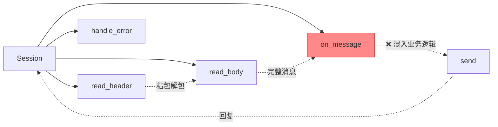
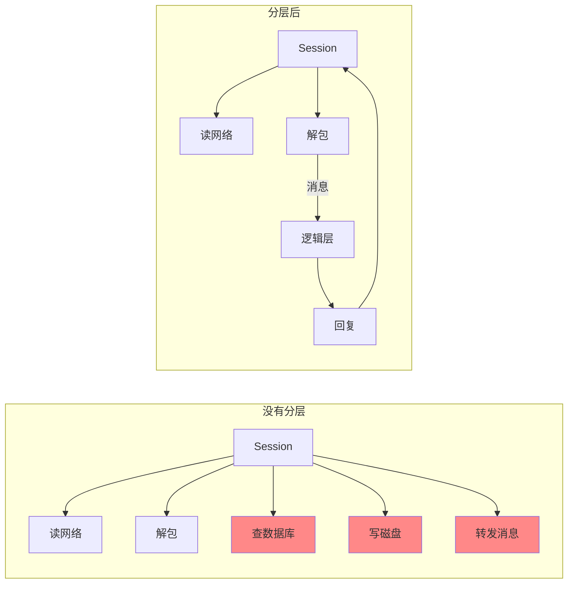
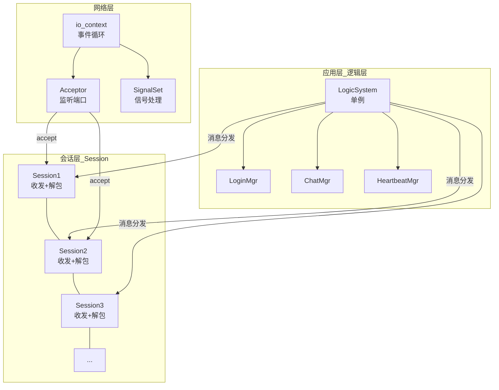
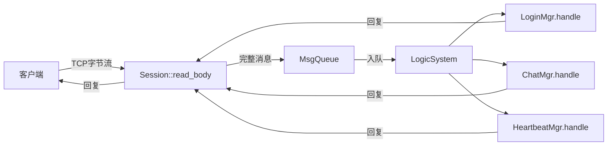
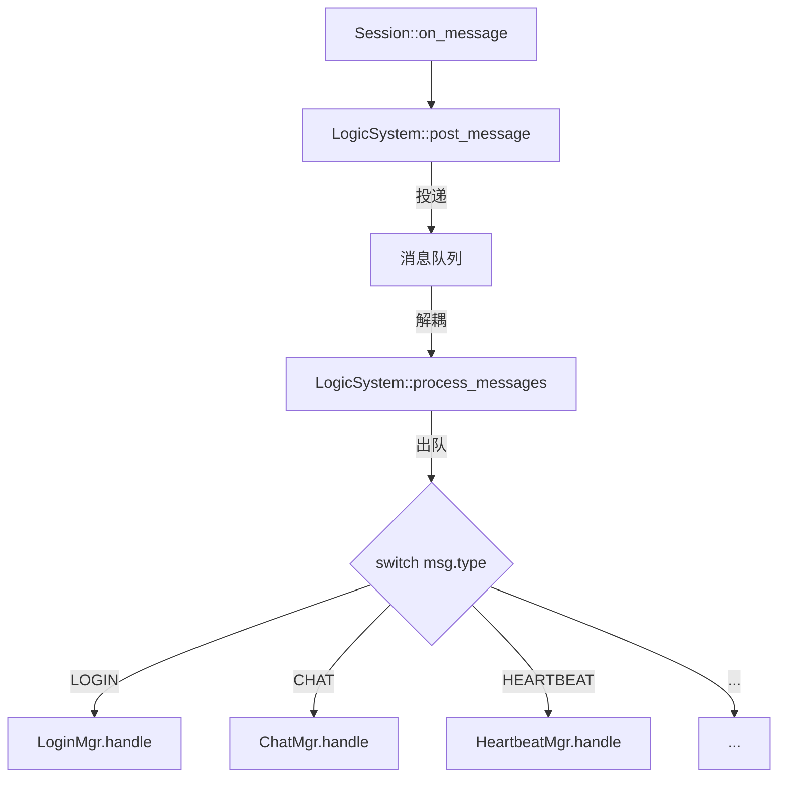
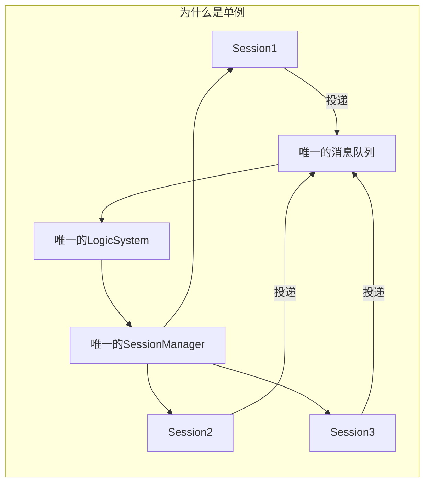
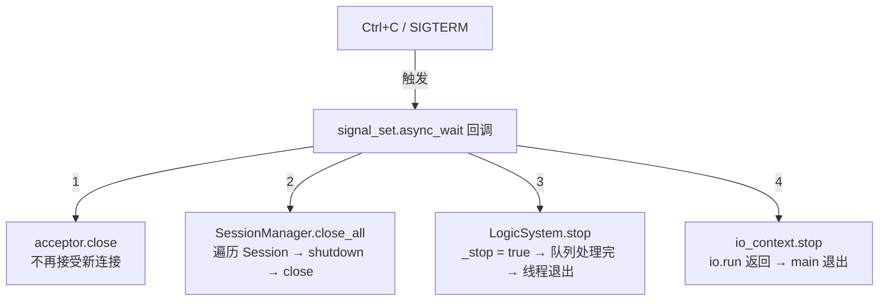
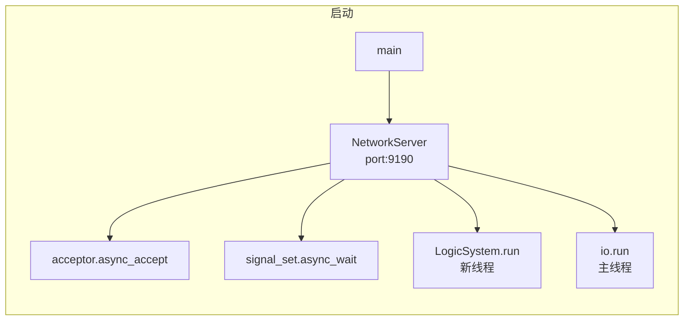
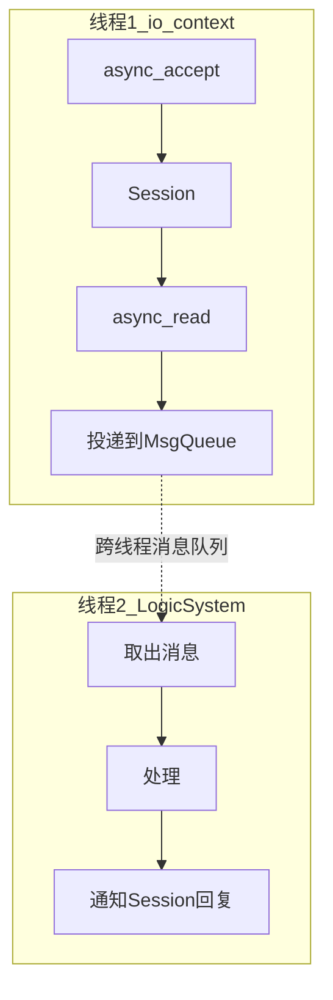
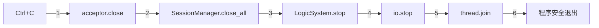

# 逻辑层设计——ASIO 服务器架构与工程实践

> **目标读者**：已经用 ASIO 写出了能跑的 echo server，但代码全写在 Session 类里，一加功能就乱成一团；听说过"架构设计"但不清楚网络层、逻辑层、业务层怎么分；想了解优雅退出、单例模式在实际服务器项目里怎么用。

---

## 目录

1. [为什么需要逻辑层](#1-为什么需要逻辑层)
2. [三层架构总览](#2-三层架构总览)
3. [网络层——ASIO 会话管理](#3-网络层asio-会话管理)
4. [逻辑层——消息分发与处理](#4-逻辑层消息分发与处理)
5. [单例模式——逻辑系统的基石](#5-单例模式逻辑系统的基石)
6. [优雅退出——信号处理与资源清理](#6-优雅退出信号处理与资源清理)
7. [完整架构代码](#7-完整架构代码)
8. [总结](#8-总结)

---

## 1. 为什么需要逻辑层

### 1.1 没有逻辑层的后果

你现在的 echo server 可能是这样写的——所有代码都塞在 `Session` 类里：



当服务器只做 echo（收到什么发回什么）时，这样写没问题。但当开始加功能时：

```
Session 类里开始出现：
  ├── if (msg.type == LOGIN)      { 查数据库... }
  ├── if (msg.type == CHAT)       { 转发给其他人... }
  ├── if (msg.type == FILE_UPLOAD) { 写磁盘... }
  └── if (msg.type == HEARTBEAT)  { 更新状态... }
```

Session 越来越胖，职责不清。网络收发的代码和业务逻辑混在一起，改一个业务逻辑要动网络代码，风险大。

#### 堆代码 vs 分层的真实对比

假设你要实现一个功能：**收到聊天消息 → 检查用户是否在线 → 记录日志 → 转发给接收方**。

**堆代码（不分层）：**

```cpp
void Session::on_message(const Message& msg) {
    // 第 1 步：检查粘包完整性（网络层的事）
    if (msg.body.size() < 4) return;

    // 第 2 步：解析消息类型（网络层的事）
    uint16_t type;
    memcpy(&type, msg.body.data(), 2);
    type = ntohs(type);

    // 第 3 步：查数据库看用户是否在线（逻辑层的事）
    // ← Session 类里出现了数据库操作！
    db.query("SELECT status FROM users WHERE id = ?");

    // 第 4 步：写日志（逻辑层的事）
    logger.write("user said: " + content);

    // 第 5 步：转发给接收方（逻辑层的事）
    auto target = SessionManager::get(id);
    target->send(msg);

    // 第 6 步：继续读下一个消息（网络层的事）
    read_header();
}
```

**一个问题：这个 Session 能测试吗？**

```
测试代码：
  auto sess = make_shared<Session>(fake_socket, 1);
  sess->on_message(test_msg);

  但 on_message 里调了 db.query() → 需要连数据库！
  还调了 logger.write() → 需要配日志！
  还调了 SessionManager → 需要启动整个服务器！

  你只是想测试"消息转发逻辑"而已。
  一个单元测试要启动整个服务器 → 没法测
```

**分层后：**

```cpp
// Session 只做网络的事
void Session::on_message(const Message& msg) {
    // 粘包解包 → 投递到逻辑层
    LogicSystem::get_instance().post_message(_id, msg);
    // 这行跑完，Session 的工作就结束了
    // 后续是逻辑线程的事

    read_header();
}

// 逻辑层单独处理业务
void LogicSystem::process(const Task& task) {
    LoginMgr::handle(task);    // 查在线状态
    Logger::write(task);       // 写日志
    ChatMgr::forward(task);    // 转发消息
}
```

**分层后测试：**

```cpp
// 单独测试 ChatMgr::forward，不需要网络、不需要数据库
ChatMgr::get_instance().forward(test_msg);
// 只需要断言"转发后的输出是否正确"
```

#### 从这段代码能看出分层的三个核心收益

```
① 改动范围小
   改数据库查询从 MySQL 切到 Redis → 只改 LoginMgr，不动 Session
   改粘包协议从长度前缀换到分隔符 → 只改 Session，不动 LoginMgr

② 可测试性
   网络层：mock 一个 socket 就能测 Session
   逻辑层：构造一个 Message 就能测 LoginMgr
   互相不依赖，各自能测

③ 可替换性
   不喜欢的 ASIO 想换 libuv？→ 只重写网络层，逻辑层一行不动
   想换 protobuf 为 JSON？→ 只改序列化层，逻辑层一行不动
```

#### 不加分层的后果会随着项目增长指数级放大

```
代码量    不分层的问题
─────────────────────────────────────────────────
1000 行   还能忍受，一个 Session 管所有事
5000 行   Session 里 10 个 if-else，改一个怕崩三个
20000 行  新功能加不动，改一行影响 5 个模块
          新同事来了看一个月看不懂 Session 里的逻辑
          老板问"这个 bug 修了多久" → "两天"
          "加这个功能呢" → "两周"
          "下周能上线吗" → "不确定，怕改崩"
```

**这就是企业项目为什么必须分层。跟技术无关，跟人能承受的复杂度有关。**

### 1.2 分层的目的



每层只做一件事，改一层不影响另一层。

---

## 2. 三层架构总览

### 2.1 架构图



### 2.2 三层职责

| 层 | 职责 | 包含 | 不做什么 |
|---|------|------|---------|
| **网络层** | 事件循环、accept 连接、统一关闭 | `io_context`、`acceptor`、`signals` | 不处理业务消息 |
| **会话层** | 单个连接的收发、粘包解包 | `Session` 类数组 | 不处理业务逻辑 |
| **逻辑层** | 消息分发、业务处理、模块管理 | `LogicSystem`（单例）、各 Manager | 不碰网络 |

### 2.3 数据流



---

## 3. 网络层——ASIO 会话管理

### 3.1 网络层的核心职责

```cpp
// 网络层只管三件事：
// 1. 启动 io_context
// 2. accept 新连接 → 创建 Session
// 3. 响应关闭信号 → 优雅退出

class NetworkServer {
public:
    NetworkServer(uint16_t port)
        : _acceptor(_io, tcp::endpoint(tcp::v4(), port))
    {
        // 注册信号处理（优雅退出）
        setup_signals();
        do_accept();
    }

    void run() {
        _io.run();  // 启动事件循环
    }

    void stop() {
        _io.stop();  // 停止事件循环
    }

private:
    void do_accept() { /* ... 创建 Session ... */ }
    void setup_signals() { /* ... 见第 6 节 ... */ }

    boost::asio::io_context _io;
    tcp::acceptor _acceptor;
    boost::asio::signal_set _signals{_io};
};
```

### 3.2 Session 类的设计

Session 的责任边界：

```
Session 做：
  ✓ 收发字节流
  ✓ 粘包解包（TLV）
  ✓ 把完整消息交给逻辑层
  ✓ 断开时清理资源

Session 不做：
  ✗ 查数据库
  ✗ 写文件
  ✗ 广播消息给其他 Session
  ✗ 任何"业务决策"
```

---

## 4. 逻辑层——消息分发与处理

### 4.1 消息分发流程

当 Session 解包出一个完整消息后，它的职责到此结束。接下来消息交给逻辑层：



### 4.2 逻辑层接口定义

```cpp
// 所有业务处理器的基类
class LogicHandler {
public:
    virtual ~LogicHandler() = default;
    // 处理消息，session_id 用于回复
    virtual void handle(uint64_t session_id,
                        const Message& msg) = 0;
};
```

---

## 5. 单例模式——逻辑系统的基石

### 5.1 为什么逻辑系统需要单例

用**反证法**——先看"如果逻辑系统不是单例会怎样"。

#### 场景：100 个客户端同时发消息

```
100 个客户端 → 100 个 Session → 每个 Session 投递消息
                                    │
                    如果 LogicSystem 不是单例：
                                    │
                    ┌───────────────┼───────────────┐
                    ▼               ▼               ▼
               LogicSystem①    LogicSystem②    LogicSystem③
               消息队列①        消息队列②        消息队列③
                    │               │               │
                    ▼               ▼               ▼
               LoginMgr①       LoginMgr②       LoginMgr③
               ChatMgr①        ChatMgr②        ChatMgr③
                    │               │               │
                    ▼               ▼               ▼
               处理登录A         处理登录B         处理聊天C
```

**问题 1：消息被分散了**

```
Session1 投递了"登录请求"，Session2 投递了"聊天消息"
路由到 LogicSystem① → 队列① → LoginMgr 收到"登录请求"
路由到 LogicSystem② → 队列② → ChatMgr 收到"聊天消息"
       ↑ 消息路由到哪个实例是随机的！

最后：LoginMgr 只知道用户 A 登录了，ChatMgr 不知道用户 A 在线
      因为"在线用户列表"在 LogicSystem① 手里，LogicSystem② 看不到
```

**问题 2：全局状态不一致**

```
LogicSystem① 的在线用户列表： { Alice: 在线, Bob: 在线 }
LogicSystem② 的在线用户列表： { Alice: 离线, Bob: 在线 }
                               ↑ 不一样！哪个是真的？

如果 Alice 从 Session1 登录 → LogicSystem① 标记她在线
Alice 发聊天消息 → 路由到 LogicSystem② → LogicSystem② 认为她离线，拒绝发送
                         ↑ 用户明明在线，却发不了消息！
```

**问题 3：Session 查找混乱**

```
业务处理完要回复客户端时，需要找到对应的 Session：
  SessionManager 里存了所有 Session 的映射表

如果 SessionManager 不是单例：
  SessionManager① 知道 Session1~50
  SessionManager② 知道 Session51~100

  LoginMgr 处理完登录后想回复 Session1 → 从 SessionManager② 里找 → 找不到！
  → 回复丢了，客户端一直等
```

#### 单例解决的是什么

```
多个实例 → 数据分散 → 状态不一致 → 逻辑错误
                          ↓
单例     → 数据集中 → 状态唯一   → 逻辑正确
```

回到架构图看单例的位置：



```
           ┌──────────────────────────────┐
           │        逻辑系统（单例）          │
           │                                │
           │  消息队列 × 1 → 所有消息集中    │
           │  Session映射 × 1 → 所有连接可见 │
           │  在线用户 × 1 → 状态全局一致    │
           │  业务处理器 × 1 → 路由不乱      │
           └──────────────────────────────┘
```

**一句话**：LogicSystem 不是单例，消息队列会被拆散，Session 找不到彼此，在线状态对不齐——服务器逻辑直接乱掉。

#### 哪些适合单例

| 组件 | 为什么必须单例 | 
|------|---------------|
| `LogicSystem`（消息分发） | 消息队列只有一个，路由只能走一条线 |
| `SessionManager`（连接管理） | 全局唯一的 Session → id 映射 |
| `LoginMgr`（登录管理） | 在线用户列表必须是全局统一的 |
| `ConfigManager`（配置管理） | 配置只读一次，全局共享 |

#### 哪些不适合单例

| 组件 | 为什么不要单例 |
|------|---------------|
| `DbConnectionPool` | 分库分表时需要多个连接池，每个连不同的库 |
| `FileUploadHandler` | 每个上传任务独立，互不依赖 |
| `MessageFilter` | 不同模块可能需要不同的过滤规则 |

### 5.2 为什么业务处理器（LoginMgr / ChatMgr）也要单例

LogicSystem 单例的理由很直观——消息队列只能有一个。但你可能会问：**LoginMgr 和 ChatMgr 为什么也是单例？把它们作为 LogicSystem 的成员变量不行吗？**

答案是：**行。但不推荐。** 下面说明为什么。

#### 方案对比

```
方案 A：成员变量（不单例）                   方案 B：单例
                                       
LogicSystem {                           LoginMgr — 单例
    LoginMgr _login_mgr;     ← 成员      ChatMgr  — 单例
    ChatMgr  _chat_mgr;      ← 成员      LogicSystem — 单例
};                                      
```

两种方案技术上都能跑。但实际项目经验表明：**业务处理器用单例比成员变量好。**

#### 原因 1：跨模块调用——不经过 LogicSystem

有些业务触发不来自网络消息，而是来自**定时器、外部通知**：

```cpp
// 场景：心跳超时，要踢掉一个用户
// 触发者不是 Session，而是一个定时器回调
void on_heartbeat_timeout(uint64_t session_id) {
    // 方案 A（成员变量）：你得先拿到 LogicSystem，再拿到 LoginMgr
    auto& logic = LogicSystem::get_instance();
    // 但 _login_mgr 是 private 成员，不能直接访问！
    // 那就得在 LogicSystem 上开一个 public 接口：
    logic.handle_timeout(session_id);
    // LogicSystem 又多了一个"转发"函数

    // 方案 B（单例）：直接调
    LoginMgr::get_instance().handle_timeout(session_id);
    // 不需要经过 LogicSystem 转发
}
```

随着功能增加，LogicSystem 上的转发函数会越来越多：

```cpp
class LogicSystem {
    // 这些函数都只是转发给对应的 Manager，没有自己的逻辑
    void handle_login(Message msg)    { _login_mgr.handle(msg); }
    void handle_chat(Message msg)     { _chat_mgr.handle(msg); }
    void handle_file_upload(Message)  { _file_mgr.handle(msg); }
    void handle_timeout(uint64_t id)  { _login_mgr.handle_timeout(id); }
    void handle_kick(uint64_t id)     { _login_mgr.kick(id); }
    // ... 每加一个业务，就要加一个转发函数
};
```

**业务越多，LogicSystem 越胖，又回到了"所有代码塞在一个类里"的问题。**

单例方案直接绕开 LogicSystem，各业务模块各自独立：

```
LogicSystem 只做一件事：消息路由
  └── 收到消息 → switch(msg.type) → 调对应的 Manager

LoginMgr 自己做登录管理
ChatMgr 自己做聊天管理
HeartbeatMgr 自己做心跳管理
FileMgr 自己做文件管理

互不干扰，各自单例。
```

#### 原因 2：业务模块之间也需要互相调用

```cpp
// 场景：用户登录成功后，通知聊天模块"这个用户上线了"
// LoginMgr 需要调 ChatMgr

class LoginMgr {
    void on_login_success(uint64_t user_id) {
        // 方案 A（成员变量）：LoginMgr 拿不到 ChatMgr
        // 只能通过 LogicSystem 转发：
        LogicSystem::get_instance().notify_chat_online(user_id);

        // 方案 B（单例）：直接调
        ChatMgr::get_instance().on_user_online(user_id);
    }
};
```

#### 原因 3：生命周期解耦

```
方案 A（成员变量）：
  LoginMgr 的生命周期 = LogicSystem 的生命周期
  LogicSystem 销毁 → LoginMgr 也销毁

方案 B（单例）：
  LoginMgr 的生命周期独立
  LogicSystem 可以重启，LoginMgr 的在线用户列表不受影响
```

#### 但注意：不是所有业务类都要单例

```
登录管理 LoginMgr         → ✅ 单例（管理全局在线用户）
聊天管理 ChatMgr          → ✅ 单例（管理全局聊天记录）
心跳管理 HeartbeatMgr     → ✅ 单例（管理全局定时器）
文件上传管理 FileMgr      → ✅ 单例（管理全局上传任务）

单次请求处理（非持久状态）  → ❌ 没必要单例
  eg. 每次收到聊天消息后的"内容过滤"逻辑
  → 写成普通函数或临时对象，不是单例
```

#### 总结

```
成员变量方案：
  所有业务都挂在 LogicSystem 下
  LogicSystem 越写越胖
  跨模块调用需要转发
  测试时不能单独测试 LoginMgr

单例方案：
  每个业务模块独立
  跨模块调用直接调
  可以单独测试
  LogicSystem 只做路由，保持精简
```

### 5.3 博客的单例模板——分析它的问题

博客里给出的代码是这样的：

```cpp
template <typename T>
class Singleton {
protected:
    Singleton() = default;
    Singleton(const Singleton<T>&) = delete;
    Singleton& operator=(const Singleton<T>&) = delete;

    static std::shared_ptr<T> _instance;   // ← 用 shared_ptr 存实例

public:
    static std::shared_ptr<T> GetInstance() {
        static std::once_flag s_flag;
        std::call_once(s_flag, [&]() {
            _instance = shared_ptr<T>(new T);
        });
        return _instance;
    }

    void PrintAddress() {                   // ← 调试用，生产不该有
        std::cout << _instance.get() << endl;
    }

    ~Singleton() {                          // ← public 析构，不应该
        std::cout << "this is singleton destruct" << endl;
    }
};

template <typename T>
std::shared_ptr<T> Singleton<T>::_instance = nullptr;
```

**几个问题：**

| 问题 | 说明 |
|------|------|
| 返回 `shared_ptr<T>` | 调用者可以 `auto sp = Singleton<X>::GetInstance()` 并到处复制，破坏了"只有一个实例"的语义。而且有 `shared_ptr` 的原子引用计数开销 |
| 用 `call_once` | C++11 局部 `static` 变量已经是线程安全的，`call_once` 是多余的 |
| public 析构函数 + 打印 | `~Singleton()` 不应该被外部调用，而且打印"this is singleton destruct"是调试遗留，生产代码不该有 |
| 需要外部定义 | `template<typename T> shared_ptr<T> Singleton<T>::_instance = nullptr;` 很容易忘写 |

### 5.3 改进后的单例模板——为什么这样更好

我的版本——也是企业更常见的写法：

```cpp
template<typename T>
class Singleton {
public:
    Singleton(const Singleton&) = delete;
    Singleton& operator=(const Singleton&) = delete;

    static T& get_instance() {
        // C++11 起，局部 static 变量初始化是线程安全的
        // 第一次调用时构造，后续返回同一个对象
        static T instance;
        return instance;
    }

protected:
    Singleton() = default;
    // 析构不设 virtual——没人应该通过基类指针 delete 单例
    // 单例在程序结束时自动销毁，不需要手动管理
    ~Singleton() = default;

private:
    // 防止外部意外继承——如果允许继承，析构要设 virtual
    // 实际使用只有继承，所以写成 protected
};
```

**对比博客的改进点：**

| 维度 | 博客版本 | 改进版本 |
|------|---------|---------|
| 返回类型 | `shared_ptr<T>`（可复制） | `T&`（不可复制） |
| 线程安全 | `call_once` + 外部 static | 局部 `static`（一行搞定） |
| 析构函数 | public + 打印"destruct" | protected，静默 |
| 外部声明 | 需要 | 不需要 |
| 性能 | shared_ptr 引用计数开销 | 零额外开销 |

```cpp
// 使用方式：返回引用（T&），不是指针
// 如果写成 auto x = LogicSystem::get_instance(); 是拷贝，会触发编译错误
// （因为拷贝构造被 delete 了）

// 正确写法：
auto& logic = LogicSystem::get_instance();
logic.PostMessage(sid, msg);

// 或者直接调用：
LogicSystem::get_instance().PostMessage(sid, msg);
```

> **如果你坚持博客的 shared_ptr 风格**：在 5.6 节单独给出了兼容方案，供参考。但建议用上边的 `T&` 版本。

### 5.4 使用方式

```cpp
// LogicSystem 继承 Singleton
class LogicSystem : public Singleton<LogicSystem> {
    // Singleton<LogicSystem> 是基类
    // 基类的 get_instance() 返回一个 LogicSystem 的静态实例
    // 构造函数是 protected 的，外部不能直接 new
public:
    void post_message(uint64_t session_id, Message msg);
    void process_messages();

private:
    // 构造函数是 private 的？不需要——基类 Singleton 的构造函数是 protected
    // 派生类可以调用 protected 构造函数
    friend class Singleton<LogicSystem>;  // 可选，让基类能访问派生类构造函数
    LogicSystem() = default;

    MsgQueue _queue;
};
```

```cpp
// 使用：
// 不用创建对象，直接调用 get_instance()
LogicSystem::get_instance().post_message(sid, msg);
LogicSystem::get_instance().process_messages();

// 其他模块同理
LoginMgr::get_instance().handle(sid, msg);
ChatMgr::get_instance().handle(sid, msg);
```

### 5.3 这个设计有道理吗？

**有，但有几个注意点：**

| 博客的单例方案 | 评估 |
|--------------|------|
| 模板基类 + 继承 | ✅ 经典做法，C++ 中广泛使用 |
| 用局部 static 实现线程安全 | ✅ C++11 保证线程安全初始化 |
| 删除拷贝构造 | ✅ 防止误拷贝 |
| 构造函数 protected | ✅ 防止外部 new |

**补充：如果你确实想要博客的 `shared_ptr` 版本——**

博客选择 `shared_ptr` 可能有一个考虑：控制析构时机。用 `static T instance` 时，T 的析构发生在 `main()` 返回后的静态析构阶段，此时其他静态对象可能已经销毁了。如果 T 的析构函数依赖其他全局资源，可能会出问题。

如果你遇到这个场景，可以用这个折中版本（既保留 `T&` 的简洁，又用 `shared_ptr` 控制生命周期）：

```cpp
template<typename T>
class Singleton {
public:
    Singleton(const Singleton&) = delete;
    Singleton& operator=(const Singleton&) = delete;

    static T& get_instance() {
        // 用 shared_ptr 延迟析构——程序退出时先析构其他全局对象，
        // 最后才析构这个 singleton
        static auto instance = std::make_shared<T>();
        return *instance;
    }

protected:
    Singleton() = default;
    ~Singleton() = default;
};
```

**一般情况下用局部 `static T` 就够了**。只有 T 的析构依赖其他全局对象时才需要上面的 `shared_ptr` 版本。绝大多数场景用不到。

### 5.4 逻辑系统单例的完整实现

```cpp
// ============================================
// LogicSystem — 基于单例模板的逻辑系统
// ============================================

// 先定义单例基类
template<typename T>
class Singleton {
public:
    Singleton(const Singleton&) = delete;
    Singleton& operator=(const Singleton&) = delete;

    static T& get_instance() {
        static T instance;
        return instance;
    }

protected:
    Singleton() = default;
    virtual ~Singleton() = default;
};

// 消息体
struct LogicMessage {
    uint64_t session_id;    // 来源 Session
    uint16_t msg_type;      // 消息类型
    std::vector<char> body; // 消息体
};

// 逻辑系统单例
class LogicSystem : public Singleton<LogicSystem> {
    friend class Singleton<LogicSystem>;

public:
    // 投递消息（由 Session 调用）
    void post_message(uint64_t session_id, uint16_t msg_type,
                      const std::vector<char>& body) {
        std::lock_guard<std::mutex> lock(_mutex);
        _queue.push({session_id, msg_type, body});
        _cond.notify_one();
    }

    // 处理消息循环（由逻辑线程调用）
    void process_messages() {
        while (!_stop) {
            std::unique_lock<std::mutex> lock(_mutex);
            _cond.wait(lock, [this] {
                return !_queue.empty() || _stop;
            });

            if (_stop) break;

            auto msg = std::move(_queue.front());
            _queue.pop();
            lock.unlock();

            // 分发到对应的处理器
            dispatch(msg);
        }
    }

    void stop() { _stop = true; _cond.notify_all(); }

private:
    LogicSystem() = default;

    void dispatch(const LogicMessage& msg) {
        switch (msg.msg_type) {
        case LOGIN:
            LoginMgr::get_instance().handle(
                msg.session_id, msg.body);
            break;
        case CHAT:
            ChatMgr::get_instance().handle(
                msg.session_id, msg.body);
            break;
        // ...
        }
    }

    std::queue<LogicMessage> _queue;
    std::mutex _mutex;
    std::condition_variable _cond;
    std::atomic<bool> _stop{false};
};
```

### 5.5 什么时候不该用单例

| 场景 | 不用单例 | 用实例 |
|------|---------|-------|
| 一个模块的多个实例有不同配置 | ❌ | 比如：两个数据库连接池 |
| 测试时需要 mock | ❌ | 单例隔离替换困难 |
| 模块生命周期需要精确控制 | ❌ | 单例在程序结束时才销毁 |
| 全局只有一个的东西 | ✅ 单例 | — |

**经验**：消息队列、逻辑分发、配置管理、日志系统——这些天生全局唯一的，**适合单例**。数据库连接池、用户会话映射——这些可能有多份的，**不适合单例**。

---

## 6. 优雅退出——信号处理与资源清理

### 6.1 为什么需要优雅退出

没有信号处理时，`Ctrl+C` 会这样：

```text
Ctrl+C → kill -SIGINT → 进程被直接杀死
                          │
                          ├── 发送缓冲区里还有没发完的数据？丢了
                          ├── 数据库连接没关闭？脏数据
                          ├── 文件写了一半？损坏
                          └── 日志没刷盘？丢了
```

**优雅退出** = 收到退出信号后，先把事情做完再关门。

### 6.2 ASIO 的信号处理机制

ASIO 提供了 `signal_set`，可以监听 POSIX 信号并绑定回调：

```cpp
void setup_signals() {
    // 监听 SIGINT（Ctrl+C）和 SIGTERM（kill 命令）
    _signals.add(SIGINT);
    _signals.add(SIGTERM);

    _signals.async_wait([this](boost::system::error_code ec, int sig) {
        if (ec) return;

        std::cout << "[server] received signal: "
                  << (sig == SIGINT ? "SIGINT" : "SIGTERM")
                  << ", shutting down...\n";

        // 第一步：停止接受新连接
        _acceptor.close();

        // 第二步：通知所有 Session 开始关闭
        // （通过 SessionManager 遍历所有 Active Session）
        SessionManager::get_instance().close_all();

        // 第三步：停止逻辑系统（等待队列中的消息处理完）
        LogicSystem::get_instance().stop();

        // 第四步：停止 io_context（io.run() 会返回）
        _io.stop();
    });
}
```

### 6.3 完整关闭流程



### 6.4 Session 被关闭时的处理——先 shutdown 再 close

#### 如果直接 close 会发生什么

先看一个实验——直接 `close()` 不调 `shutdown`：

```cpp
void bad_close() {
    // 假设发送缓冲区里还有 1000 字节没发完
    _sock.close();          // ← 直接 close！
    // 1000 字节 → 内核直接释放缓冲区 → 数据丢了
    // 对端还在等 → 连接断开 → 对端 recv 返回 error
    // 没有 FIN 握手 → 对端不知道是正常关闭还是异常断开
}
```

TCP 关闭的底层细节：

```
close() 做的事：
  1. 把 socket 标记为"已关闭"
  2. 释放发送缓冲区（没发完的数据直接丢掉）
  3. 发送 RST（复位）包给对端，而不是 FIN
  4. socket fd 号被回收

结果：
  对端 recv → error: connection reset
  发送缓冲区的数据 → 丢了
```

```
shutdown() 做的事：
  1. 不关闭 socket fd，只关闭数据通道
  2. 发送 FIN 包 → TCP 四次挥手开始
  3. 发送缓冲区的数据还能继续发送
  4. 对端 recv → 读到 EOF（正常结束）

shutdown(shutdown_send):   只关发送方向
shutdown(shutdown_receive):只关接收方向
shutdown(shutdown_both):   两个都关
```

#### 为什么先 shutdown 再 close

```
正确的关闭顺序：

第一步：shutdown(shutdown_send)
  │
  ├── 告诉内核"我不再发数据了"
  ├── 内核发送 FIN 给对端（TCP 四次挥手开始）
  └── 发送缓冲区里还有数据？→ 内核会继续发完，不会丢
        │
        ▼
第二步：对端 recv → 读到所有剩余数据 → 读到 EOF
  │
  ├── 对端知道"发送方正常关闭了"
  └── 对端如果还有数据要回复，可以继续发
        │
        ▼
第三步：对端调用 close()
  │
  ├── 对端发 FIN 回来
  └── 本端收到 FIN → 连接完全关闭
        │
        ▼
第四步：close()
  │
  └── 真正释放 socket fd
```

一句话：**shutdown 告诉对端"我不发了"，但允许内核把剩下的数据发完。close 是直接拔网线，没发完的数据也拔了。**

#### 完整代码

```cpp
class Session : public std::enable_shared_from_this<Session> {
public:
    void close() {
        boost::system::error_code ec;

        // 第一步：shutdown
        // 告诉对端"我不再发了"，但内核会继续把发送缓冲区发完
        _sock.shutdown(tcp::socket::shutdown_send, ec);
        if (ec) {
            // shutdown 失败（比如 socket 已经关了）直接 close
            _sock.close(ec);
            return;
        }

        // 第二步：等待对端关闭（或超时）
        // 这里不阻塞——用定时器或下一轮读回调检测 EOF
        // 简化起见，直接 close 也是可以的
        // 因为 shutdown 已经确保数据发完了

        // 第三步：close
        // 只有 shutdown 成功后 close，才能保证不丢数据
        _sock.close(ec);
    }
};
```

#### TCP 四次挥手与 close 的关系

```
正常关闭的 TCP 四次挥手：

本端                         对端
  │                            │
  ├── shutdown(shutdown_send)  │
  │────── FIN ──────────────→  │
  │                            ├── 对端 recv 返回 EOF
  │                            │
  │←────────── ACK ───────────┤
  │                            │
  │                            ├── 对端 close()
  │←────────── FIN ────────────┤
  │                            │
  ├── ACK                      │
  │                            │
  ├── close()                  │
  │                            │
  连接安全关闭，不丢数据

直接 close() 不做 shutdown：

本端                         对端
  │                            │
  ├── close()                  │
  │────── RST ──────────────→  │
  │                            ├── 对端 recv → error: connection reset
  │                            │
  发送缓冲区还有数据？→ 丢了
```

**关键区别**：`shutdown` 发 `FIN`（正常关闭），`close` 发 `RST`（异常复位）。FIN 让对端知道"发完了"，RST 让对端以为"出错了"。

### 6.5 2026 年企业实际做法

企业里优雅退出比博客多考虑几件事：

| 博客提到的 | 企业会额外做的 |
|-----------|-------------|
| `signal_set` 监听信号 | ✅ 基础，照做 |
| 关闭 acceptor | ✅ |
| 关闭所有 Session | ✅ |
| 等逻辑队列处理完 | ✅ 加上超时：最多等 5 秒，超时强制退出 |
| 等待日志刷盘 | 有些企业会加 `google::FlushLogFiles()` |
| 关闭数据库连接 | 如果有的话 |
| 监控告警 | 发一条"服务正在关闭"的消息到监控系统 |

**超时保护**——防止某个模块卡住不退出：

```cpp
void shutdown_with_timeout() {
    // 先正常关闭
    LogicSystem::get_instance().stop();
    SessionManager::get_instance().close_all();

    // 开一个线程等 io.run() 退出
    auto t = std::thread([] {
        std::this_thread::sleep_for(std::chrono::seconds(5));
        // 5 秒了还没退完？强制退出
        std::cerr << "[server] shutdown timeout, force exit\n";
        std::_Exit(1);  // 紧急退出，不走析构
    });
    t.detach();

    // 正常等退出
    _io.run();
    // 如果 5 秒内退出了，走到这里
    // 超时线程调了 _Exit(1) 不会走到这里
}
```

---

## 7. 完整架构代码

### 7.1 单例模板 + SessionManager + LogicSystem

```cpp
// ============================================
// 1. 单例模板基类（改进版）
//    对比博客版本：
//      - 返回 T& 而非 shared_ptr<T>，防止误拷贝
//      - 局部 static 一行搞定线程安全
//      - 不需要外部定义 _instance
//      - 析构函数 protected，不暴露
// ============================================
template<typename T>
class Singleton {
public:
    Singleton(const Singleton&) = delete;
    Singleton& operator=(const Singleton&) = delete;

    static T& get_instance() {
        static T instance;   // C++11 起线程安全
        return instance;
    }

protected:
    Singleton() = default;
    ~Singleton() = default;  // 不需要 virtual——没人应该 delete 单例
};

// ============================================
// 2. 消息定义（TLV 协议）
// ============================================
struct Message {
    uint8_t  type;
    std::vector<char> body;
};

// ============================================
// 3. SessionManager（单例）
//    管理所有活跃的连接
// ============================================
class SessionManager : public Singleton<SessionManager> {
    friend class Singleton<SessionManager>;
public:
    void add_session(uint64_t id,
                     std::shared_ptr<Session> sess) {
        std::lock_guard<std::mutex> lock(_mutex);
        _sessions[id] = std::move(sess);
    }

    void remove_session(uint64_t id) {
        std::lock_guard<std::mutex> lock(_mutex);
        _sessions.erase(id);
    }

    void close_all() {
        std::lock_guard<std::mutex> lock(_mutex);
        for (auto& [id, sess] : _sessions) {
            sess->close();
        }
        _sessions.clear();
    }

    // 获取某个 Session 用于回复消息
    std::shared_ptr<Session> get_session(uint64_t id) {
        std::lock_guard<std::mutex> lock(_mutex);
        auto it = _sessions.find(id);
        return it != _sessions.end() ? it->second : nullptr;
    }

private:
    SessionManager() = default;
    std::mutex _mutex;
    std::unordered_map<uint64_t, std::shared_ptr<Session>> _sessions;
    uint64_t _next_id = 1;
};

// ============================================
// 4. Session（会话层）
//    收网络数据 → 解包 → 交给逻辑层
// ============================================
class Session : public std::enable_shared_from_this<Session> {
public:
    Session(tcp::socket socket, uint64_t id)
        : _sock(std::move(socket)), _id(id) {}

    uint64_t id() const { return _id; }

    void start() {
        // 注册到 SessionManager
        SessionManager::get_instance().add_session(_id,
            shared_from_this());
        read_header();
    }

    void close() {
        boost::system::error_code ec;
        _sock.shutdown(tcp::socket::shutdown_both, ec);
        _sock.close(ec);
        SessionManager::get_instance().remove_session(_id);
    }

    void send(const std::vector<char>& data) {
        // 序列化 + async_write（略，参考之前章节）
    }

private:
    void read_header() {
        auto self = shared_from_this();
        boost::asio::async_read(
            _sock, boost::asio::buffer(_header_buf),
            [self](boost::system::error_code ec, size_t) {
                if (ec) { self->close(); return; }

                uint32_t len;
                memcpy(&len, self->_header_buf.data(), 4);
                len = ntohl(len);

                self->read_body(len);
            });
    }

    void read_body(uint32_t len) {
        auto self = shared_from_this();
        auto body = std::make_shared<std::vector<char>>(len);

        boost::asio::async_read(
            _sock, boost::asio::buffer(*body),
            [self, body](boost::system::error_code ec, size_t) {
                if (ec) { self->close(); return; }

                // 关键：交给逻辑层，不自己处理
                // Session 到此为止，消息处理由 LogicSystem 负责
                self->on_message(*body);
            });
    }

    void on_message(const std::vector<char>& body) {
        // 投递到逻辑系统
        LogicSystem::get_instance().post_message(
            _id, 0, body);

        // 继续读下一个消息
        read_header();
    }

    tcp::socket _sock;
    uint64_t _id;
    std::array<char, 4> _header_buf;
};

// ============================================
// 5. LogicSystem（逻辑层单例）
//    消息队列 + 消息分发 + 业务处理
// ============================================
class LogicSystem : public Singleton<LogicSystem> {
    friend class Singleton<LogicSystem>;
public:
    struct Task {
        uint64_t session_id;
        std::vector<char> data;
    };

    void post_message(uint64_t session_id,
                      uint16_t /*type*/,
                      const std::vector<char>& data) {
        std::lock_guard<std::mutex> lock(_mutex);
        _queue.push({session_id, data});
        _cond.notify_one();
    }

    void run() {
        while (!_stop) {
            std::unique_lock<std::mutex> lock(_mutex);
            _cond.wait(lock, [this] {
                return !_queue.empty() || _stop;
            });
            if (_stop) break;

            auto task = std::move(_queue.front());
            _queue.pop();
            lock.unlock();

            // 处理消息
            process(task);
        }
    }

    void stop() { _stop = true; _cond.notify_all(); }

private:
    LogicSystem() = default;

    void process(const Task& task) {
        // 示例：echo - 把数据发回给对应的 Session
        auto sess = SessionManager::get_instance()
                        .get_session(task.session_id);
        if (sess) {
            sess->send(task.data);
        }
    }

    std::queue<Task> _queue;
    std::mutex _mutex;
    std::condition_variable _cond;
    std::atomic<bool> _stop{false};
};

// ============================================
// 6. NetworkServer（网络层）
//    顶层组装：acceptor + signal + 启动
// ============================================
class NetworkServer {
public:
    NetworkServer(uint16_t port)
        : _acceptor(_io, tcp::endpoint(tcp::v4(), port))
    {
        setup_signals();
        do_accept();
        start_logic_thread();
    }

    void run() {
        std::cout << "[server] running on port "
                  << _acceptor.local_endpoint().port() << "\n";
        _io.run();
        // io.run() 返回后 → 等待逻辑线程结束
        if (_logic_thread.joinable())
            _logic_thread.join();
        std::cout << "[server] exited cleanly\n";
    }

private:
    void setup_signals() {
        _signals.add(SIGINT);
        _signals.add(SIGTERM);
        _signals.async_wait(
            [this](boost::system::error_code ec, int sig) {
                if (ec) return;
                std::cout << "\n[server] signal "
                          << sig << ", shutting down...\n";

                _acceptor.close();
                SessionManager::get_instance().close_all();
                LogicSystem::get_instance().stop();
                _io.stop();
            });
    }

    void do_accept() {
        auto sock = std::make_shared<tcp::socket>(_io);
        _acceptor.async_accept(*sock,
            [this, sock](boost::system::error_code ec) {
                if (!ec) {
                    auto id = _next_id++;
                    std::make_shared<Session>(
                        std::move(*sock), id)->start();
                }
                if (!_acceptor.is_open()) return;
                do_accept();
            });
    }

    void start_logic_thread() {
        _logic_thread = std::thread([] {
            LogicSystem::get_instance().run();
        });
    }

    boost::asio::io_context _io;
    tcp::acceptor _acceptor;
    boost::asio::signal_set _signals{_io};
    std::thread _logic_thread;
    std::atomic<uint64_t> _next_id{1};
};

// ============================================
// main — 启动
// ============================================
int main() {
    NetworkServer server(9190);
    server.run();
    return 0;
}
```

### 7.2 启动与退出流程



**正常运行时**：



**优雅退出**：



---

## 8. 总结

### 8.1 三层架构速查

| 层 | 类 | 单例？ | 线程数 | 职责 |
|---|-----|:-----:|:-----:|------|
| 网络层 | `NetworkServer` | ❌ 一个实例 | 主线程 | io_context、acceptor、signal |
| 会话层 | `Session` | ❌ 每连接一个 | io_context 线程池 | 收发、解包 |
| 逻辑层 | `LogicSystem` | ✅ 单例 | 独立线程 | 消息队列、分发、业务处理 |

### 8.2 单例模板的使用

```cpp
// 适合用单例的：
LogicSystem         → 唯一消息分发
SessionManager      → 全局 Session 映射
LoginMgr, ChatMgr   → 业务处理器（也可不单例）

// 不适合用单例的：
DbConnectionPool    → 可能有多个（分库分表）
FileUploadHandler   → 每次上传创建新实例
```

### 8.3 优雅退出的步骤

```
1. 信号到来            → signal_set::async_wait
2. 关闭 acceptor       → 不再接受新连接
3. 关闭所有 Session    → shutdown + close
4. 停止逻辑系统        → 处理完队列中剩余消息
5. 停止 io_context     → io.run() 返回
6. 等待线程结束        → thread::join()
7. main() 返回         → 进程安全退出
```

### 8.4 博客内容与企业实践的差异

| 博客提到的 | 企业实际做法 |
|-----------|-------------|
| 信号机制 | ✅ 基础方案，2026 年仍然照用 |
| 单例模板 | ✅ 经典方案，很多项目在用 |
| 逻辑层消息分发 | ✅ 核心思想一致 |
| 优雅退出只关闭 acceptor + session | 企业还会加超时保护（5 秒强制退出） |
| Session 直接处理回调 | 企业会通过消息队列解耦网络线程和逻辑线程 |
| 单例构造不设保护 | 企业会删拷贝构造 + protected 构造防止误用 |
