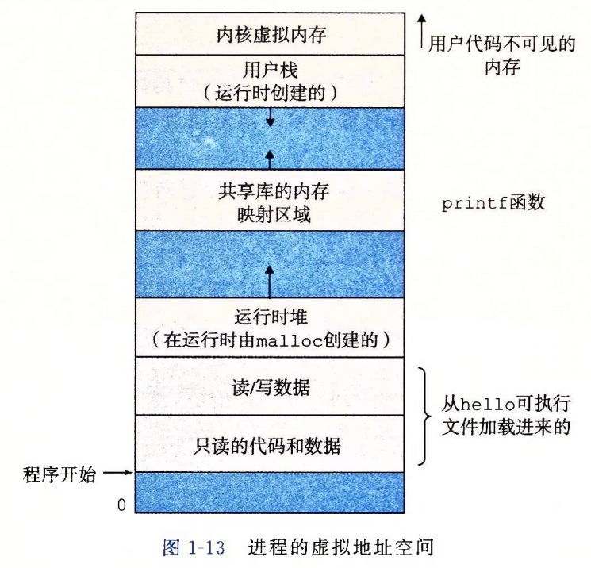

# Chapter1

## 四个阶段

静态构建过程：预处理、编译、汇编、链接

- 预处理。把.c文件搞成.i文件，处理所有以`#`开头的指令如`#include #define #ifdef条件编译`
- 编译。把.i文件搞成.s文件，将预处理的文本进行分析和优化，翻译成特定架构的汇编代码
- 汇编。把.s变成.o文件（binary file），将汇编指令翻译成机器码，产生可重定位文件。
  - 但此时不能运行，因为函数调用的地址还没确定
- 链接。把多个.o文件和用到的库合并，解决符号引用问题，确定全局变量和函数最终内存地址。

```bash
gcc -o h h.c

gcc -E h.c -o h.i
gcc -S h.i -o h.s
gcc -c h.s -o h.o
gcc h.o -o h
```

软件生命周期：编译、链接、装载、运行

- 编译。预处理+编译+汇编，核心是把源码变成机器码
- 链接。静态/动态链接
- 装载。OS将可执行文件从外存拷贝到内存中，建立虚拟地址空间到物理内存映射，初始化堆栈跳转到程序执行入口点。
- 运行。CPU开始取指、译码、执行。涉及到进程上下文切换、系统调用等动态行为。

## VM基本构成


从下向上：

- 程序代码和数据，在开始运行时就被指定了大小
- 堆：动态可变，通过如`malloc`或`free`等函数可操作堆
- 共享库
- 栈：实现函数调用和一些变量存储
- 内核VM：顶部是给内核保留的
