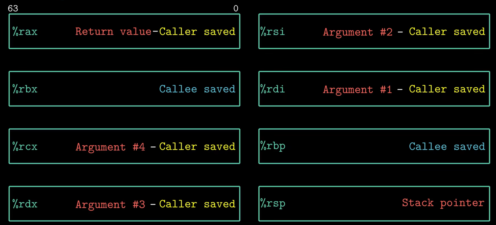

# Chapter3

## 基本汇编

```bash
pushq %rbx # 把%rbx内容压栈
```

## 常用寄存器

IA32有8个32位通用寄存器，这8个是由8086相应16位通用寄存器扩展得来

```text
EAX：一般用作累加器
EBX：一般用作基址寄存器（Base）
ECX：一般用来计数（Count）
EDX：一般用来存放数据（Data）
ESP：一般用作堆栈指针（Stack Pointer）
EBP：一般用作基址指针（Base Pointer）
ESI：一般用作源变址（Source Index）
EDI：一般用作目标变址（Destinatin Index）
```

%rbp，提供一个固定的基准点

- 因为%rsp会变（逐渐向低地址移动），意味着声明的局部变量相对于%rsp的偏移量不是固定的。
- 所以%rbp就去建立基准，最开始就被设置为栈顶%rsp的地址，然后就固定了。同时这是实现栈回溯的关键。
- 通过pushq %rbp每个函数都将调用者的%rbp地址存储在自己的栈中，不断从当前%rbp读上个%rbp，直到程序入口。

在此期间，调用者栈帧要寄存器暂存数据，被调用者也需要

- caller-save: eax edx ecx
- callee-save: ebx esi edi
- esp栈顶，edp栈帧

对于x86_64架构多了8个，扩展到64位

| 寄存器名 | 64位名称 | 32位 | 16位 | 8位 | 主要用途与“潜规则” |
| :--- | :--- | :--- | :--- | :--- | :--- |
| 累加器 | RAX | EAX | AX | AL | 返回值寄存器。函数执行完的结果通常放在这里；系统调用号也放在这。 |
| 基址寄存器 | RBX | EBX | BX | BL | 被调用者保存。通常用来存放长期使用的变量，函数调用期间它的值不能变。 |
| 计数器 | RCX | ECX | CX | CL | 第一个参数（Windows）；循环计数；移位操作。 |
| 数据寄存器 | RDX | EDX | DX | DL | 第二个参数（Windows/Linux系统调用）；大数运算的高位。 |
| 栈基址指针 | RBP | EBP | BP | - | 栈帧指针。指向当前函数栈帧的底部，用来定位局部变量。 |
| 栈顶指针 | RSP | ESP | SP | - | 栈顶指针。永远指向栈顶，压栈/出栈时会自动变化。 |
| 源变址寄存器 | RSI | ESI | SI | SIL | 第二个参数（Linux标准调用）；字符串操作的源地址。 |
| 目的变址寄存器 | RDI | EDI | DI | DIL | 第一个参数（Linux标准调用）；字符串操作的目标地址。 |

多的8个：

| 寄存器名 | 主要用途 |
| :--- | :--- |
| R8 - R9 | 传递参数。在 Linux 下，它们分别传递第 3、第 4 个整数/指针参数。 |
| R10 | 临时寄存器。在系统调用中，它替代 RCX 传递第 4 个参数（因为 RCX 被 `syscall` 指令占用了）。 |
| R11 | 临时寄存器。`syscall` 指令用来保存标志寄存器。 |
| R12 - R15 | 被调用者保存。和 RBX 一样，它们通常用来存“贵重”的数据，函数调用期间必须保持原值。 |

> 【注】在 Linux 的 System V ABI 调用约定中，函数的前 6 个参数依次通过 RDI, RSI, RDX, RCX, R8, R9 传递。而在 Windows x64 中，则是 RCX, RDX, R8, R9

过程/函数最多可以传递6个参数，第七个就要放到栈上了。（局部变量出现地址操作时要用栈保存而不是寄存器，而且这时候传递的参数需8Byte对齐）



### 特殊寄存器

- RIP (Instruction Pointer) —— 指令指针
  - 作用：永远指向下一条将要执行的指令的内存地址。
- RFLAGS (Flags Register) —— 标志寄存器
  - 作用：记录 CPU 运算后的状态。
  - 常见标志：
    - ZF (Zero Flag)：结果为 0 时置 1（用于判断相等）。
    - CF (Carry Flag)：进位/借位标志（用于无符号数比较）。
    - SF (Sign Flag)：结果为负数时置 1。
- 用途：cmp 指令其实就是做减法，然后根据 RFLAGS 的状态来决定 je (jump if equal) 是否跳转。

### 浮点与向量寄存器

处理浮点数、多媒体数据或进行 AI 计算，会用到这些

- XMM0 - XMM15 (128 位)
  - 用于 SSE 指令集。前 8 个（XMM0-XMM7）常用于传递浮点参数（Linux 下前 8 个浮点参数通过 XMM0-XMM7 传递）。
- YMM0 - YMM255 (256 位) / ZMM (512 位)
  - 用于 AVX/AVX-512 指令集，用于高性能并行计算。

### 总结

| 类别 | 寄存器列表 | 核心记忆点 |
| :--- | :--- | :--- |
| 通用 (参数/返回值) | RAX, RDI, RSI, RDX, RCX, R8, R9 | 传参、返回值、临时计算 |
| 通用 (持久化) | RBX, RBP, R12, R13, R14, R15 | 跨函数调用时需保存原值 |
| 栈管理 | RSP | 栈顶指针 |
| 控制流 | RIP, RFLAGS | 下一条指令在哪、跳转条件判断 |

## 条件码

- CF：进位标志，检查无符号数溢出（unsigned）
- ZF：最近结果是0
- SF：最近结果是负数
- OF：最近操作导致补码溢出（signed）

leaq指令不改变任何操作码，用于地址计算。逻辑操作如XOR，CF和OF设置为0。

## objdump反汇编器

对可重定位文件反汇编：

```bash
jason@Jason:~/gdb/src$ objdump -d hello_test.o

hello_test.o:     file format elf64-x86-64


Disassembly of section .text:

0000000000000000 <main>:
   0:   f3 0f 1e fa             endbr64
   4:   55                      push   %rbp
   5:   48 89 e5                mov    %rsp,%rbp
   8:   8b 05 00 00 00 00       mov    0x0(%rip),%eax        # e <main+0xe>
   e:   83 c0 01                add    $0x1,%eax
  11:   89 05 00 00 00 00       mov    %eax,0x0(%rip)        # 17 <main+0x17>
  17:   8b 05 00 00 00 00       mov    0x0(%rip),%eax        # 1d <main+0x1d>
  1d:   89 c6                   mov    %eax,%esi
  1f:   48 8d 05 00 00 00 00    lea    0x0(%rip),%rax        # 26 <main+0x26>
  26:   48 89 c7                mov    %rax,%rdi
  29:   b8 00 00 00 00          mov    $0x0,%eax
  2e:   e8 00 00 00 00          call   33 <main+0x33>
  33:   b8 00 00 00 00          mov    $0x0,%eax
  38:   5d                      pop    %rbp
  39:   c3                      ret
```

看法：

- 左侧0,4,5,8,3,...表示指令在`.text`节中相对于main函数开头的偏移地址
- 中间f3 0f 1e fa, 55, ..是指令机器码
- 右侧是汇编指令，助记符

### 函数序言

- `endbr64`安全特性，标记合法的简洁跳转目标
- `push %rbp`函数都这么干，保存调用者的栈帧，压入内存中栈的位置
- `mov %rsp %rbp`将当前栈顶作为新的栈底

### 数据操作

- `mov 0x0(%rip), %eax`读取某个变量到eax中
- `add $0x1, %eax` eax内容+1
- `mov %eax, 0x0(%rip)` 写回变量

为什么是0x0(%rip)，因为此时是.o文件 编译器还不知全局变量确切位置，用0先占位，到链接的时候就知道了。

%rip相对寻址，访问数据用“当前指令地址+偏移量”定位

### 函数调用准备

- `mov 0x0(%rip), %eax`读变量
- `mov %eax, %esi`第二个参数放入esi中（第一个在rdi中）
- `lea 0x0(%rip), %rax`准备字符串地址，通常用lea计算字符串常量地址
- `mov rax, rdi`第一个参数rdi中，rax是函数返回值
- `mov $0x0, %eax`printf是变参函数，eax=0表示没有浮点参数

### 调用与退出

- `call 33 <main+0x33>`调用printf，目前依然0占位
- `mov $0x0,%eax`设置main返回0
- `pop %rbp`恢复
- `ret`返回

```bash
jason@Jason:~/gdb/src$ objdump -r hello_test.o

hello_test.o:     file format elf64-x86-64

RELOCATION RECORDS FOR [.text]:
OFFSET           TYPE              VALUE
000000000000000a R_X86_64_PC32     i-0x0000000000000004
0000000000000013 R_X86_64_PC32     i-0x0000000000000004
0000000000000019 R_X86_64_PC32     i-0x0000000000000004
0000000000000022 R_X86_64_PC32     .rodata-0x0000000000000004
000000000000002f R_X86_64_PLT32    printf-0x0000000000000004


RELOCATION RECORDS FOR [.eh_frame]:
OFFSET           TYPE              VALUE
0000000000000020 R_X86_64_PC32     .text
```

- OFFSET，修改被修改的机器码在`.text`节中的起始位置
- TYPE，修改方法：
  - `R_X86_64_PC32`使用32位PC相对地址重定位（当前位置+偏移量）
  - `R_X86_64_PLT32`用动态链接库调用（如printf），通过过程链接表PLT跳转
- VALUE，符号名字

与上文关联：

`000000000000000a R_X86_64_PC32     i-0x0000000000000004`
位置是在main函数偏移0x0a的位置，对应之前的

`8:   8b 05 00 00 00 00       mov    0x0(%rip),%eax        # e <main+0xe>`，该指令会从偏于0x08位置开始，占用e-8-2=6B，其中`00 00 00 00`部分正好是从偏移`0x0a`开始的，链接器会把变量i真实运行的地址算出来，减去当前pc，填进这个0x0a位置。

```bash
jason@Jason:~/gdb/src$ objdump -d hello_test

hello_test:     file format elf64-x86-64


Disassembly of section .init:

0000000000001000 <_init>:
    1000:       f3 0f 1e fa             endbr64
    1004:       48 83 ec 08             sub    $0x8,%rsp
    1008:       48 8b 05 d9 2f 00 00    mov    0x2fd9(%rip),%rax        # 3fe8 <__gmon_start__@Base>
    100f:       48 85 c0                test   %rax,%rax
    1012:       74 02                   je     1016 <_init+0x16>
    1014:       ff d0                   call   *%rax
    1016:       48 83 c4 08             add    $0x8,%rsp
    101a:       c3                      ret

Disassembly of section .plt:

0000000000001020 <.plt>:
    1020:       ff 35 9a 2f 00 00       push   0x2f9a(%rip)        # 3fc0 <_GLOBAL_OFFSET_TABLE_+0x8>
    1026:       ff 25 9c 2f 00 00       jmp    *0x2f9c(%rip)        # 3fc8 <_GLOBAL_OFFSET_TABLE_+0x10>
    102c:       0f 1f 40 00             nopl   0x0(%rax)
    1030:       f3 0f 1e fa             endbr64
    1034:       68 00 00 00 00          push   $0x0
    1039:       e9 e2 ff ff ff          jmp    1020 <_init+0x20>
    103e:       66 90                   xchg   %ax,%ax

Disassembly of section .plt.got:

0000000000001040 <__cxa_finalize@plt>:
    1040:       f3 0f 1e fa             endbr64
    1044:       ff 25 ae 2f 00 00       jmp    *0x2fae(%rip)        # 3ff8 <__cxa_finalize@GLIBC_2.2.5>
    104a:       66 0f 1f 44 00 00       nopw   0x0(%rax,%rax,1)

Disassembly of section .plt.sec:

0000000000001050 <printf@plt>:
    1050:       f3 0f 1e fa             endbr64
    1054:       ff 25 76 2f 00 00       jmp    *0x2f76(%rip)        # 3fd0 <printf@GLIBC_2.2.5>
    105a:       66 0f 1f 44 00 00       nopw   0x0(%rax,%rax,1)

Disassembly of section .text:

0000000000001060 <_start>:
    1060:       f3 0f 1e fa             endbr64
    1064:       31 ed                   xor    %ebp,%ebp
    1066:       49 89 d1                mov    %rdx,%r9
    1069:       5e                      pop    %rsi
    106a:       48 89 e2                mov    %rsp,%rdx
    106d:       48 83 e4 f0             and    $0xfffffffffffffff0,%rsp
    1071:       50                      push   %rax
    1072:       54                      push   %rsp
    1073:       45 31 c0                xor    %r8d,%r8d
    1076:       31 c9                   xor    %ecx,%ecx
    1078:       48 8d 3d ca 00 00 00    lea    0xca(%rip),%rdi        # 1149 <main>
    107f:       ff 15 53 2f 00 00       call   *0x2f53(%rip)        # 3fd8 <__libc_start_main@GLIBC_2.34>
    1085:       f4                      hlt
    1086:       66 2e 0f 1f 84 00 00    cs nopw 0x0(%rax,%rax,1)
    108d:       00 00 00 

0000000000001090 <deregister_tm_clones>:
    1090:       48 8d 3d 81 2f 00 00    lea    0x2f81(%rip),%rdi        # 4018 <__TMC_END__>
    1097:       48 8d 05 7a 2f 00 00    lea    0x2f7a(%rip),%rax        # 4018 <__TMC_END__>
    109e:       48 39 f8                cmp    %rdi,%rax
    10a1:       74 15                   je     10b8 <deregister_tm_clones+0x28>
    10a3:       48 8b 05 36 2f 00 00    mov    0x2f36(%rip),%rax        # 3fe0 <_ITM_deregisterTMCloneTable@Base>
    10aa:       48 85 c0                test   %rax,%rax
    10ad:       74 09                   je     10b8 <deregister_tm_clones+0x28>
    10af:       ff e0                   jmp    *%rax
    10b1:       0f 1f 80 00 00 00 00    nopl   0x0(%rax)
    10b8:       c3                      ret
    10b9:       0f 1f 80 00 00 00 00    nopl   0x0(%rax)

00000000000010c0 <register_tm_clones>:
    10c0:       48 8d 3d 51 2f 00 00    lea    0x2f51(%rip),%rdi        # 4018 <__TMC_END__>
    10c7:       48 8d 35 4a 2f 00 00    lea    0x2f4a(%rip),%rsi        # 4018 <__TMC_END__>
    10ce:       48 29 fe                sub    %rdi,%rsi
    10d1:       48 89 f0                mov    %rsi,%rax
    10d4:       48 c1 ee 3f             shr    $0x3f,%rsi
    10d8:       48 c1 f8 03             sar    $0x3,%rax
    10dc:       48 01 c6                add    %rax,%rsi
    10df:       48 d1 fe                sar    $1,%rsi
    10e2:       74 14                   je     10f8 <register_tm_clones+0x38>
    10e4:       48 8b 05 05 2f 00 00    mov    0x2f05(%rip),%rax        # 3ff0 <_ITM_registerTMCloneTable@Base>
    10eb:       48 85 c0                test   %rax,%rax
    10ee:       74 08                   je     10f8 <register_tm_clones+0x38>
    10f0:       ff e0                   jmp    *%rax
    10f2:       66 0f 1f 44 00 00       nopw   0x0(%rax,%rax,1)
    10f8:       c3                      ret
    10f9:       0f 1f 80 00 00 00 00    nopl   0x0(%rax)

0000000000001100 <__do_global_dtors_aux>:
    1100:       f3 0f 1e fa             endbr64
    1104:       80 3d 09 2f 00 00 00    cmpb   $0x0,0x2f09(%rip)        # 4014 <completed.0>
    110b:       75 2b                   jne    1138 <__do_global_dtors_aux+0x38>
    110d:       55                      push   %rbp
    110e:       48 83 3d e2 2e 00 00    cmpq   $0x0,0x2ee2(%rip)        # 3ff8 <__cxa_finalize@GLIBC_2.2.5>
    1115:       00 
    1116:       48 89 e5                mov    %rsp,%rbp
    1119:       74 0c                   je     1127 <__do_global_dtors_aux+0x27>
    111b:       48 8b 3d e6 2e 00 00    mov    0x2ee6(%rip),%rdi        # 4008 <__dso_handle>
    1122:       e8 19 ff ff ff          call   1040 <__cxa_finalize@plt>
    1127:       e8 64 ff ff ff          call   1090 <deregister_tm_clones>
    112c:       c6 05 e1 2e 00 00 01    movb   $0x1,0x2ee1(%rip)        # 4014 <completed.0>
    1133:       5d                      pop    %rbp
    1134:       c3                      ret
    1135:       0f 1f 00                nopl   (%rax)
    1138:       c3                      ret
    1139:       0f 1f 80 00 00 00 00    nopl   0x0(%rax)

0000000000001140 <frame_dummy>:
    1140:       f3 0f 1e fa             endbr64
    1144:       e9 77 ff ff ff          jmp    10c0 <register_tm_clones>

0000000000001149 <main>:
    1149:       f3 0f 1e fa             endbr64
    114d:       55                      push   %rbp
    114e:       48 89 e5                mov    %rsp,%rbp
    1151:       8b 05 b9 2e 00 00       mov    0x2eb9(%rip),%eax        # 4010 <i>
    1157:       83 c0 01                add    $0x1,%eax
    115a:       89 05 b0 2e 00 00       mov    %eax,0x2eb0(%rip)        # 4010 <i>
    1160:       8b 05 aa 2e 00 00       mov    0x2eaa(%rip),%eax        # 4010 <i>
    1166:       89 c6                   mov    %eax,%esi
    1168:       48 8d 05 95 0e 00 00    lea    0xe95(%rip),%rax        # 2004 <_IO_stdin_used+0x4>
    116f:       48 89 c7                mov    %rax,%rdi
    1172:       b8 00 00 00 00          mov    $0x0,%eax
    1177:       e8 d4 fe ff ff          call   1050 <printf@plt>
    117c:       b8 00 00 00 00          mov    $0x0,%eax
    1181:       5d                      pop    %rbp
    1182:       c3                      ret

Disassembly of section .fini:

0000000000001184 <_fini>:
    1184:       f3 0f 1e fa             endbr64
    1188:       48 83 ec 08             sub    $0x8,%rsp
    118c:       48 83 c4 08             add    $0x8,%rsp
    1190:       c3                      ret
```

### main

```bash
0000000000001149 <main>:
    1149:       f3 0f 1e fa             endbr64
    114d:       55                      push   %rbp
    114e:       48 89 e5                mov    %rsp,%rbp
    1151:       8b 05 b9 2e 00 00       mov    0x2eb9(%rip),%eax        # 4010 <i>
    1157:       83 c0 01                add    $0x1,%eax
    115a:       89 05 b0 2e 00 00       mov    %eax,0x2eb0(%rip)        # 4010 <i>
    1160:       8b 05 aa 2e 00 00       mov    0x2eaa(%rip),%eax        # 4010 <i>
    1166:       89 c6                   mov    %eax,%esi
    1168:       48 8d 05 95 0e 00 00    lea    0xe95(%rip),%rax        # 2004 <_IO_stdin_used+0x4>
    116f:       48 89 c7                mov    %rax,%rdi
    1172:       b8 00 00 00 00          mov    $0x0,%eax
    1177:       e8 d4 fe ff ff          call   1050 <printf@plt>
    117c:       b8 00 00 00 00          mov    $0x0,%eax
    1181:       5d                      pop    %rbp
    1182:       c3                      ret
```

- 发现现在地址不再是0x0了，而是具体值如0x2eb9
- 之前是`call   33 <main+0x33>`，现在是`call   1050 <printf@plt>`，给出了具体的跳转目标地址1050，向上找该段：

```bash
0000000000001050 <printf@plt>:
    1050:       f3 0f 1e fa             endbr64
    1054:       ff 25 76 2f 00 00       jmp    *0x2f76(%rip)        # 3fd0 <printf@GLIBC_2.2.5>
    105a:       66 0f 1f 44 00 00       nopw   0x0(%rax,%rax,1)
```

- `jmp    *0x2f76(%rip)`，告诉CPU去GOT表中找printf真正地址。

### start程序真正执行起点

```bash
0000000000001060 <_start>:
    1060:       f3 0f 1e fa             endbr64
    1064:       31 ed                   xor    %ebp,%ebp
    1066:       49 89 d1                mov    %rdx,%r9
    1069:       5e                      pop    %rsi
    106a:       48 89 e2                mov    %rsp,%rdx
    106d:       48 83 e4 f0             and    $0xfffffffffffffff0,%rsp
    1071:       50                      push   %rax
    1072:       54                      push   %rsp
    1073:       45 31 c0                xor    %r8d,%r8d
    1076:       31 c9                   xor    %ecx,%ecx
    1078:       48 8d 3d ca 00 00 00    lea    0xca(%rip),%rdi        # 1149 <main>
    107f:       ff 15 53 2f 00 00       call   *0x2f53(%rip)        # 3fd8 <__libc_start_main@GLIBC_2.34>
    1085:       f4                      hlt
    1086:       66 2e 0f 1f 84 00 00    cs nopw 0x0(%rax,%rax,1)
    108d:       00 00 00 
```

关注两部分：

```bash
1078:       48 8d 3d ca 00 00 00    lea    0xca(%rip),%rdi        # 1149 <main>
107f:       ff 15 53 2f 00 00       call   *0x2f53(%rip)        # 3fd8 <__libc_start_main@GLIBC_2.34>
```

一个是加载main函数地址到rdi，然后调用__lib_start_main。

在系统层面，_start 才是入口。它负责准备好环境（比如清理寄存器、设置栈指针），然后把 main 的地址传给 C 库的初始化函数。

### rip相对寻址

```bash
1151:       8b 05 b9 2e 00 00       mov    0x2eb9(%rip),%eax        # 4010 <i>
1157:       83 c0 01                add    $0x1,%eax
```

比如这里注释写的是`4010 <i>`，当前偏移量是0x2eb9，而rip（PC）目前是1157，1157 + 2eb9 = 4010

## 函数指针

```c
int (*f)(int *)
```

*f表示f是一个指针， (*f)(int *)表示f是一个指向函数的指针，函数以int *作为参数，返回值类型是int。